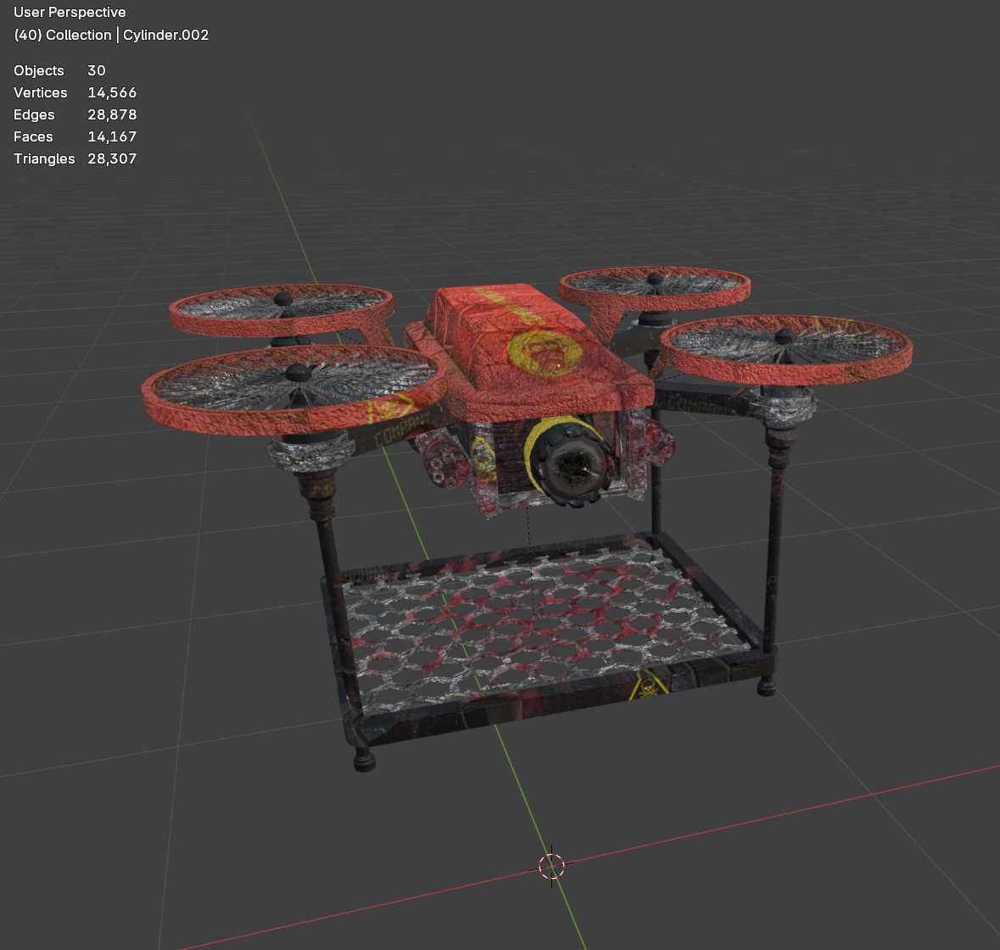

# Lab A

## Q1. Copilot tutorial

Complete the short Copilot tutorial on the Microsoft Learn website, to gain an understanding of how to use Copilot for more than just writing code.

<https://learn.microsoft.com/en-us/visualstudio/debugger/debug-with-copilot?view=vs-2022>

Note:

- This tutorial uses C#, but it does not require any previous knowledge of C#
- The answers provided by Copilot can vary each time you use Copilot.

## A1

I had a read through the Copilot tutorial, although I did have some prior experience with Copilot.

## Q2. Hello World

Locate the Solution Explorer within Visual Studio and select the HelloWorld project. Right click on this project and select Build. This should compile and link the project. Now run the HelloWorld program.

Change between Debug and Release mode. Compile again and rerun the program.

Note: It is good practice when transferring projects between different PCs to "retarget" the project to the latest version of the compiler. This is done by right clicking on the project (or solution) in the Solution Explorer and selecting "Retarget". Remember to "Rebuild" the project after a change of target.

## A2

I opened the solution file in Visual Studio and toggled between debug and release mode, building and running both versions.

## Q3. Console window

A command window is automatically opened when you run a console application. This window is also automatically closed when the program terminates. Delay the termination of the program by adding the following two lines to the end of your code:

```c++
int keypress;
std::cin >> keypress;
```

This now requests an integer value before termination of the program

## A3

I added the two lines to my code, making my main function be:

```cpp
int main(int, char**) {

	std::cout << "Hello World" << std::endl;

	int keypress;
	std::cin >> keypress;

	return 0;
}
```

Now the program hangs until I enter a character and press enter.

## Q4. Includes

Remove the statement:

```c++
#include <iostream>
```

Compile the program. What is the effect? Replace the statement and continue.

Notice that we do not add the .h extension to the header file name. Extensions are only added for your own header files or for legacy system header files.

## A4

The program fails to compile because `cin` and `cout` are referencing an `iostream` that no longer exists.

## Q5. Namespace

Add the statement

```c++
using namespace std;
```

Compile the program. What is the effect?
Now remove all instances of the code

```c++
std::
```

Compile the program. What is the effect?
Now remove

```c++
using namespace std;
```

The statement informs the C++ compiler to look in the std namespace for any names/labels that it cannot find in the programs default namespace.

## A5

adding `using namespace std;` to the top of the file still allows us to compile and run the program. Removing all instances of `std::` while still having `using namespace std;` still allows us to compile and run the proram because now the `std::` is inferred. However, if we remove `using namespace std;` and all instances of `std::` it causes the program to not build and therefore not run.

## Q6. Create a new project

Create a new Visual C++ Empty project called “Temperature” by using the New Project dialog `File->New->Project`.
You should now have a new project which contains no files.

## A6

I created a new empty project.

## Q7. Temperature

Create a new cpp file within the temperature project and write a program to input a Fahrenheit measurement, convert it and output a Celsius value. The conversion formula is

```c++
c = 5/9 (f - 32)
```

Confirm that your conversion programme gives the correct outputs

- `32 F gives 0 C`
- `33 F gives 0.555 C`

## A7

I ended up with this code:

```cpp
int main(int, char**) {
	std::cout << "Enter Fareinheit: " << std::endl;
	double f;
	std::cin >> f;
	double c = 5.0 / 9.0 * (f - 32.0);
	std::cout << f << " F gives " << c << "C" << std::endl;
	return 0;
}
```

To test it, I got these values, which was correct when i double checked them on Google.

```
48 F gives 8.88889C
54334 F gives 30167.8C
2 F gives -16.6667C
```

## Q8. Auto, const and casting

Now rewrite your temperature example using the auto keyword, constants and explicit casting

Does this make the code easier or more difficult to understand?

## A8

adding auto, consts, and explicit casting, we end up with this:

```cpp
int main(int, char**) {
	const double FREEZING_POINT = 32.0;
	const double CONVERSION_FACTOR = 5.0 / 9.0;

	std::cout << "Enter Fahrenheit: " << std::endl;
	auto f = 0.0;
	std::cin >> f;

	auto c = CONVERSION_FACTOR * (f - FREEZING_POINT);

	std::cout << f << " F gives " << static_cast<int>(c) << " C" << std::endl;

	return 0;
}
```

I prefer the constants at the top of `main` and explicit casting is good in some contexts (not this one because we lose a lot of precision here as decimals get rounded), but I basically never use the auto keyword. If done right, I think it can make the code much easier to follow.

## Q9. Static Assert

Create a new project call `sizeOf` that includes the following lines of code:

```c++
const int sizeOfInt = sizeof(int);
const int sizeOfPointer = sizeof(int*);
static_assert (sizeOfInt == sizeOfPointer, "Pointers and int are different sizes");
```

Select a different architecture (e.g. x86 or x64) to see if you can make the assert fail.

Experiment by adding further asserts to your program

Remember these static asserts are completely free. The check is done at compile time, so no code is added to your solution.

## A9

I created a new project and added those lines of code. When running on 64 bit, the assert flags and there is a build error. When running on 32 bit, everything runs smoothly because they are actually the same memory size. This is because the int datatype is always 4 bytes, regardless of architecture but the pointer goes from 4 to 8 bytes during the change to 64 bit because it needs a higher address range.

## Lab A Reflection

This lab was a great introduction back to C++. I already had some good prior experience because of Advanced Programming in year 2 and Parallel & Concurrent Programming in year 3, so a lot of this lab I breezed through. I reckon it will get much more difficult in the upcoming few weeks once everyone else more unfamiliar with C++ has caught up a little. Very excited to learn more about the language.

# Lab B

## Q1. Timing

Locate the Solution Explorer within Visual Studio and select the Timing project. Right click on this project and select Build. This should compile and link the project. Now run the Timing program.
This application attempts to time a very small piece of code to CPU clock precision.

The solution consists of an assembly file (masm.asm) and a cpp file (source.cpp). Ignore the assembly file for now. Source.cpp first requests that the OS run the application with maximum priority, then it measures the overhead in calling the timing functions, and finally it runs a test on a small piece of code, "the payload".

Timing accurately on a modern CPU running Windows OS is very difficult, but it is possible to get accurate figures if you run an extremely large number of experiments and look for a pattern in the results. By default this application runs 250,000 iterations per experiment.

The experiment is currently set to measure the duration of the following piece of code:

```c++
for (auto j=0; j<20; j++) {
   dummyX = dummyX * 1.00001;
}
```

This will take approximate 70 CPU cycles on an Intel i7.

Run the application on your PC and take a look at the output.

- Overhead - time taken to call the timing functions
- Median - The middle time, when the list of times are sorted
- Mean - The mean of the times, discounting the lower and upper 10% of measurements

Try increasing the limit of the loop from 20 to 40. Can you explain the result?

Now run the application both in Release x86 and Release x64 modes

Remember that it is generally pointless to time code in Debug mode.

## A1

On x64, these are the results:

```
Number of iterations: 250000

Overhead duration: 80

Median duration: 56

Mean (80%) duration: 55.9246

Sample data [100]
........................
50 52 52 54 54 54 54 54 54 54 54 54 54 54 54 54 54 54 54 54 54 54 54 54 54 54 54 54 54 54 54 54 54 54 54 54 54 54 54 54 54 54 54 54 54 54 54 54 54 54 54 54 54 54 54 54 54 54 54 54 54 54 54 54 54 54 54 54 54 54 54 54 54 54 54 54 54 54 54 54 54 54 54 54 54 54 54 54 54 54 54 54 54 54 54 54 54 54 54 54
........................
78 78 78 78 80 80 80 80 80 80 80 82 82 82 82 82 82 82 82 82 82 84 84 84 84 84 86 86 86 86 86 86 90 90 90 92 92 92 92 94 94 96 96 98 98 98 100 102 102 102 104 106 108 108 110 110 112 112 116 116 118 124 130 132 134 136 166 184 184 186 190 190 192 192 202 208 210 220 222 226 226 228 230 254 284 286 290 290 292 302 340 344 344 350 352 354 354 17436 25016 25392
........................

x= 5.18341e+21 (dummy value - ignore)
```

On x86, these are the results:

```
Number of iterations: 250000

Overhead duration: 76

Median duration: 66

Mean (80%) duration: 66.9164

Sample data [100]
........................
62 62 62 62 62 62 62 62 62 62 62 62 62 62 62 62 62 62 62 62 62 62 62 62 62 62 62 62 62 62 62 62 62 62 62 62 64 64 64 64 64 64 64 64 64 64 64 64 64 64 64 64 64 64 64 64 64 64 64 64 64 64 64 64 64 64 64 64 64 64 64 64 64 64 64 64 64 64 64 64 64 64 64 64 64 64 64 64 64 64 64 64 64 64 64 64 64 64 64 64
........................
136 138 140 140 140 140 144 146 148 148 152 170 182 184 186 186 190 192 192 192 194 194 194 194 194 194 194 196 196 196 196 196 196 196 198 198 198 198 198 198 200 200 200 200 200 200 200 200 200 200 200 202 202 202 202 202 204 204 206 218 222 224 224 226 228 230 234 234 246 250 250 250 278 284 298 302 310 310 312 334 346 350 350 352 352 354 356 358 358 362 362 384 434 500 736 23416 26084 28102 33780 35846
........................

x= 5.18341e+21 (dummy value - ignore)
```

As we can see, x64 outperforms x86. This is expected.

If we go back to x64 and increase the loops from 20 to 40, we get this data:

```
Number of iterations: 250000

Overhead duration: 76

Median duration: 126

Mean (80%) duration: 126.685

Sample data [100]
........................
122 122 122 122 122 122 122 122 122 122 122 122 122 122 122 122 122 122 122 122 122 122 122 122 122 122 122 122 122 122 122 122 122 122 122 122 122 122 122 122 122 122 122 122 122 122 122 122 122 122 122 122 122 122 122 122 122 122 122 122 122 122 122 122 122 122 122 122 122 122 122 122 122 122 122 122 122 122 122 122 122 122 122 122 122 124 124 124 124 124 124 124 124 124 124 124 124 124 124 124
........................
176 178 178 178 178 178 180 182 184 184 184 186 186 188 188 188 188 188 190 190 190 192 192 194 194 196 196 216 220 220 224 224 238 238 244 246 248 248 250 252 252 254 254 254 254 256 258 258 258 258 258 258 260 260 260 260 264 266 266 272 276 278 278 280 280 280 280 282 286 298 310 372 402 408 410 412 412 414 414 414 414 416 416 416 418 420 420 420 420 424 462 490 602 782 1454 20196 20280 21484 26204 28420
........................

x= 2.68677e+43 (dummy value - ignore)
```

This decrease in performance is expected because we are now doing twice the operations to `dummyX` per iteration than we were before.

## Q2. Timing own code

Replace the payload with some of your own code.

When adding code to the payload, try and write code that the compiler will not optimise away.
A trick is to calculate a dummy value that is later printed. See dummyX in the example payload

If you are comparing the execution times between two sections of code, ensure that they are doing exactly the same work, otherwise the results will be meaningless.

## A2

I added some simple payload code of my own, using bitwise, if `dummyX` is odd it multiplies itself the same as it did before, but if it is even, it divides.

```cpp

	// Run the actual experiment
	std::vector<DWORD> experimentTimes;
	for (auto i = 0; i < numOfIterations; i++) {
		const auto startTime = c_ext_getCPUClock();
		for (auto j = 0; j < 40; j++) {
			if (static_cast<int>(dummyX) & 1) {
				dummyX = dummyX * 1.00001;
			}
			else {
				dummyX = dummyX / 1.00001;
			}
		}
		const auto stopTime = c_ext_getCPUClock();
		const auto duration = static_cast<int>(stopTime - startTime - overhead);
		experimentTimes.push_back(duration > 0 ? duration : 1);
	}
```

Because we want to cast it to check if it is even or odd, the number does not move too often, sometimes only increases or decreasing by 1 at a time.

Running 40 times, here are the results in x64:

```
Number of iterations: 250000

Overhead duration: 78

Median duration: 304

Mean (80%) duration: 303.71

Sample data [100]
........................
134 136 136 136 136 136 136 136 136 136 136 136 136 136 136 136 138 138 138 138 138 138 138 138 138 138 138 138 138 138 138 138 138 138 138 138 138 138 138 138 138 138 138 138 138 138 138 138 138 138 138 138 138 138 138 138 138 138 138 138 138 138 138 138 138 138 138 138 138 138 138 138 138 138 138 138 138 138 138 138 138 138 138 138 138 138 138 138 138 138 138 138 138 138 138 138 140 140 140 140
........................
342 344 344 344 344 344 346 346 346 348 348 350 350 350 352 354 356 356 358 360 362 362 364 364 368 368 368 370 370 372 374 396 414 414 424 430 432 432 434 436 438 438 440 440 440 442 442 448 450 454 456 456 456 458 458 460 460 460 460 464 464 464 464 468 474 478 478 492 492 530 532 538 590 592 592 592 594 596 598 598 600 604 616 678 738 764 11840 13348 14816 15002 15580 17956 18128 18318 18914 19178 20212 22544 25198 43240
........................

x= 2.00002 (dummy value - ignore)
```

This dramatic increase in time is expected because not only is division computationally expensive, but we are also casting it to an int to check if it is odd or even. Furthermore, even though doing a bitwise operation is relatively cheap (especially compared to modulus), it still adds a little.

## Q3. Conditionals

In the lectures you will have covered the if, switch and ?: conditional statements
Add each in turn to the payload to try and identify any performance differences.

Are the results as you expected?

Is there anything you need to write in your log book for future reference?

## A3

Because I got a little ahead of myself and already adding an if statement in the previous question, I decided to add a switch statement too. The switch statement mods the iteration counter `j` and depending on what number it is on, adds another operation to `dummyX`:

```cpp
// Run the actual experiment
std::vector<DWORD> experimentTimes;
for (auto i = 0; i < numOfIterations; i++) {
	const auto startTime = c_ext_getCPUClock();
	for (auto j = 0; j < 40; j++) {
		if (static_cast<int>(dummyX) & 1) {
			dummyX = dummyX * 1.00001;
		}
		else {
			dummyX = dummyX / 1.00001;
		}

		switch (j % 4) {
		case 0:
			dummyX = dummyX + 2;
			break;
		case 1:
			dummyX = dummyX - 1;
			break;
		case 2:
			dummyX = dummyX * 1.00002;
			break;
		case 3:
			dummyX = dummyX / 1.00002;
			break;
		}
	}
	const auto stopTime = c_ext_getCPUClock();
	const auto duration = static_cast<int>(stopTime - startTime - overhead);
	experimentTimes.push_back(duration > 0 ? duration : 1);
}
```

Running on x64, here are the results:

```
Number of iterations: 250000

Overhead duration: 76

Median duration: 516

Mean (80%) duration: 515.956

Sample data [100]
........................
352 354 356 356 356 360 372 376 378 378 382 382 388 394 398 398 402 418 424 426 426 428 428 432 438 438 438 438 440 440 440 440 440 440 440 440 440 440 440 440 440 440 440 440 440 440 440 442 442 442 442 442 442 442 442 442 442 442 442 442 442 442 442 442 442 442 442 442 442 442 442 442 444 444 444 444 444 444 444 444 444 444 444 444 444 444 444 444 444 444 444 444 444 444 444 444 444 444 444 446
........................
716 716 718 720 722 722 724 724 728 730 732 734 734 734 736 738 740 740 742 744 746 750 752 754 756 756 758 760 764 768 776 776 786 788 788 792 800 800 808 808 814 818 830 830 848 848 848 850 850 850 852 860 868 870 872 876 880 880 890 890 912 924 946 958 980 1260 1948 2904 2924 2936 3338 3428 3758 4088 4270 4602 4840 5056 7492 9332 10624 11480 11970 12018 12118 12266 12324 12988 14062 16830 19208 19440 19802 19972 21372 21690 24056 24924 27612 33468
........................

x= 2.54895e+06 (dummy value - ignore)
```

This is much slower than previously, however I still think this is an issue of the modulo and adding extra operations rather than adding a switch statement in. To confirm this,

## Q4. Branch prediction

Add a piece of code to the payload that demonstrates when branch prediction is working well and when branch prediction is failing.

Discuss the problems in creating this code with another student.

## A4

For this one, I made two different if statements, one that is very predictable, and one that is very random:

```cpp
// Run the actual experiment
std::vector<DWORD> experimentTimes;
for (auto i = 0; i < numOfIterations; i++) {
	const auto startTime = c_ext_getCPUClock();
	for (auto j = 0; j < 40; j++) {
		if (static_cast<int>(dummyX) & 1) {
			dummyX = dummyX * 1.00001;
		}
		else {
			dummyX = dummyX / 1.00001;
		}

		switch (j % 4) {
		case 0:
			dummyX = dummyX + 0.00001;
			break;
		case 1:
			dummyX = dummyX - 0.00001;
			break;
		case 2:
			dummyX = dummyX * 1.00002;
			break;
		case 3:
			dummyX = dummyX / 1.00002;
			break;
		}

		if (i % 2 == 0) {
			if (j < 20) {
				dummyX = dummyX + 0.0001;
			}
			else {
				dummyX = dummyX - 0.0001;
			}
		}
		else {
			if ((j * 7 + i * 13) & 1) {
				dummyX = dummyX + 0.0001;
			}
			else {
				dummyX = dummyX - 0.0001;
			}
		}
	}
	const auto stopTime = c_ext_getCPUClock();
	const auto duration = static_cast<int>(stopTime - startTime - overhead);
	experimentTimes.push_back(duration > 0 ? duration : 1);
}
```

Because of the predictability of the first if loop `if (i % 2 == 0) {`, with the firt 20 iterations taking the first branch and the last 20 taking the last branch, the CPU's branch predictor can learn this pattern easily. However, the second condition `if ((j * 7 + i * 13) & 1) {` creates a very archaic pattern that is much harder for the branch predictor to anticipate. The issue here lies in how to measure the actual performance difference between the two, as CPU caching effects and compiler optimisation will probably interfere with timing measurements. Furthermore, the `if ((j * 7 + i * 13) & 1) {` conditional is not random at all. Although very archaic, it still follows a predictable pattern that (in theory) a branch predictor could still learn.

## Q5. Exiting a nested loop

During the lectures we discussed a number of methods for exiting a nested for loop.

1. Two conditions in each conditional section of the loops. One for the loop control and the other as the exit condition
2. An additional if statement immediately following the inner loop to catch and propagate a break statement
3. A goto statement in the inner loop
4. A lambda function

Add each option to the payload section of the timing code and determine if there is any performance differences between each approach.

You have 4 methods to solve a common problem. Do you have a preference, now that you’ve tested them?
If so make a note in your log book as to the pros and cons of each.

## A5

I changed up some of the code to time the four different methods to exit a nested loop:

```cpp
std::cout << "\nRunning Method 1: Two conditions..." << std::endl;
for (auto i = 0; i < numOfIterations; i++) {
	const auto startTime = c_ext_getCPUClock();
	bool exitCondition = false;
	for (auto j = 0; j < 40 && !exitCondition; j++) {
		for (auto k = 0; k < 40 && !exitCondition; k++) {
			dummyX = dummyX * 1.00001;
			if (j == 20 && k == 20) {
				exitCondition = true;
			}
		}
	}
	const auto stopTime = c_ext_getCPUClock();
	const auto duration = static_cast<int>(stopTime - startTime - overhead);
	method1Times.push_back(duration > 0 ? duration : 1);
}

std::cout << "Running Method 2: Break with if propagation..." << std::endl;
for (auto i = 0; i < numOfIterations; i++) {
	const auto startTime = c_ext_getCPUClock();
	bool exitCondition = false;
	for (auto j = 0; j < 40; j++) {
		for (auto k = 0; k < 40; k++) {
			dummyX = dummyX * 1.00001;
			if (j == 20 && k == 20) {
				exitCondition = true;
				break;
			}
		}
		if (exitCondition) break;
	}
	const auto stopTime = c_ext_getCPUClock();
	const auto duration = static_cast<int>(stopTime - startTime - overhead);
	method2Times.push_back(duration > 0 ? duration : 1);
}

std::cout << "Running Method 3: Goto statement..." << std::endl;
for (auto i = 0; i < numOfIterations; i++) {
	const auto startTime = c_ext_getCPUClock();
	for (auto j = 0; j < 40; j++) {
		for (auto k = 0; k < 40; k++) {
			dummyX = dummyX * 1.00001;
			if (j == 20 && k == 20) {
				goto exit_loops;
			}
		}
	}
exit_loops:
	const auto stopTime = c_ext_getCPUClock();
	const auto duration = static_cast<int>(stopTime - startTime - overhead);
	method3Times.push_back(duration > 0 ? duration : 1);
}

std::cout << "Running Method 4: Lambda function..." << std::endl;
for (auto i = 0; i < numOfIterations; i++) {
	const auto startTime = c_ext_getCPUClock();
	auto nestedLoop = [&]() {
		for (auto j = 0; j < 40; j++) {
			for (auto k = 0; k < 40; k++) {
				dummyX = dummyX * 1.00001;
				if (j == 20 && k == 20) {
					return;
				}
			}
		}
		};
	nestedLoop();
	const auto stopTime = c_ext_getCPUClock();
	const auto duration = static_cast<int>(stopTime - startTime - overhead);
	method4Times.push_back(duration > 0 ? duration : 1);
}
```

Here are the results I got, please do not mind the final integer overflowing.

```
Overhead duration: 76

Running Method 1: Two conditions...
Running Method 2: Break with if propagation...
Running Method 3: Goto statement...
Running Method 4: Lambda function...

========== RESULTS ==========

Method 1: Two conditions
Median: 2654
Mean (80%): 2653.05

Method 2: Break with if
Median: 2652
Mean (80%): 2652.21

Method 3: Goto statement
Median: 2652
Mean (80%): 2651.86

Method 4: Lambda function
Median: 2646
Mean (80%): 2626.84

x= inf (dummy value - ignore)
```

From the results, all four methods are withing around %1 of each other, showcasing that the differences in performance are negligable at best. The compiler likely optimised all four methods to similar or identical assembly code. This means that the preference can be chosen on readability. In my opinion, I find method 2 (break + if) and method 4 (lambda) most readable and therefore most maintainable. method 1 (two conditions) is okay and has some different use cases, and method 3 (goto statement) I have never used and will never use.

## Q6. Range based loops

C++ 11 introduced range based loops. How do these compare in performance to standard loops.  
You know the drill, my now. Add both types of loop to the payload and determine what if any performance difference that you find.

## A6

I tested three loops, index-based (standard), range-based, and for fun iterator loops (pointer-like object that moves through the container). Here is the code I wrote to test performance

```cpp
std::vector<DWORD> standardLoopTimes;
std::cout << "\nRunning Standard Loop..." << std::endl;
for (auto i = 0; i < numOfIterations; i++) {
	const auto startTime = c_ext_getCPUClock();
	for (auto j = 0; j < testData.size(); j++) {
		dummySum += testData[j] * 1.00001;
	}
	const auto stopTime = c_ext_getCPUClock();
	const auto duration = static_cast<int>(stopTime - startTime - overhead);
	standardLoopTimes.push_back(duration > 0 ? duration : 1);
}

std::vector<DWORD> rangeLoopTimes;
std::cout << "Running Range-Based Loop..." << std::endl;
for (auto i = 0; i < numOfIterations; i++) {
	const auto startTime = c_ext_getCPUClock();
	for (auto& value : testData) {
		dummySum += value * 1.00001;
	}
	const auto stopTime = c_ext_getCPUClock();
	const auto duration = static_cast<int>(stopTime - startTime - overhead);
	rangeLoopTimes.push_back(duration > 0 ? duration : 1);
}

std::vector<DWORD> iteratorLoopTimes;
std::cout << "Running Iterator Loop..." << std::endl;
for (auto i = 0; i < numOfIterations; i++) {
	const auto startTime = c_ext_getCPUClock();
	for (auto it = testData.begin(); it != testData.end(); ++it) {
		dummySum += (*it) * 1.00001;
	}
	const auto stopTime = c_ext_getCPUClock();
	const auto duration = static_cast<int>(stopTime - startTime - overhead);
	iteratorLoopTimes.push_back(duration > 0 ? duration : 1);
}
```

Running on x64, I get these results:

```
Number of iterations: 250000

Overhead duration: 76

Running Standard Loop...
Running Range-Based Loop...
Running Iterator Loop...

========== RESULTS ==========

Standard Loop (index)
Median: 3244
Mean (80%): 3243.72

Range-Based Loop
Median: 3244
Mean (80%): 3243.2

Iterator Loop
Median: 3242
Mean (80%): 3242.44

Sum= 5.61943e+11 (dummy value - ignore)
```

From these results, we an see performance is virtually indentical, most likely becaue the compiler optimises all three to the same, or very similar code. In my opinion, all three of these have pretty unique use cases. Although I have not used range-based loops, I like the look of the syntax so I might use them more in the future. I will probably use standard index loops when i need specific position numbers, range-based loops by default, and iterator loops for more advanced operations (I cannot even think of a use case right now but I am sure there are many).

## Q7. Architecture

Since you're programming on a 64 bit system, you have the option of producing either 32 bit (x86) or 64 bit (x64) code.
Rerun some of the previous experiments and compare between x86 and x64. Are there any noticeable differences?

You're now probably reaching the limit of what you can do with the timing code. The C++ compiler hides a lot from you. The next stage is to start to look at the assembly language, generated by the compiler, to try and understand what is really happening. We'll start this in the next lecture.

## A7

I ran the previous code on x86, getting these results:

```
Number of iterations: 250000

Overhead duration: 78

Running Standard Loop...
Running Range-Based Loop...
Running Iterator Loop...

========== RESULTS ==========

Standard Loop (index)
Median: 4252
Mean (80%): 4251.1

Range-Based Loop
Median: 7286
Mean (80%): 7286.79

Iterator Loop
Median: 7282
Mean (80%): 7267.72

Sum= 5.61943e+11 (dummy value - ignore)


C:\Users\725291\OneDrive - hull.ac.uk\cpp-labs\LabB\Release\Timing.exe (process 18728) exited with code 0 (0x0).
Press any key to close this window . . .
```

This is quite interesting, as standard loops performanced basically twice as good as the other two. However, all three performed substantially worse than its x64 counterpart. This showcases that not only do the newer C++11 functions not work as nicely on 32 bit, but also in general 64 bit reigns supreme because of its better instruction set and more registers.

## Lab B Reflection

In this lab I have because more familiar with acutely timing operations on a level I had previously not done. I strengthened my knowledge of the various ways to do conditions and loops, comparing their performance and evaluating on what I liked best. I am quite excited to use similar timing code on other projects and see different ways that the new C++12 additions can change the language in more efficient and readable ways.

# Lab C

## Q1. Debugging

Locate the Solution Explorer within Visual Studio and select the Debugging project. Right-click on this project and select Build. This should compile and link the project. Now run the Debugging program. The program does not give the correct output. By clicking in the left-hand margin of the cpp file, set a breakpoint online

```c++
auto equals1 = 0;
```

A red circle represents a breakpoint. Now execute the program within the debugger by pressing F5. Notice that the program stops on the breakpoint and is represented by a yellow arrow. By pressing F10 you can single-step through your code.

From the menu select debug, then windows, then auto, local and this. These 3 new windows show you the state of the variables within your program.

Continue stepping through your code and determine what the problem is with the program.

Suggest a solution to make the program execute correctly.

## A1

By looking at the program using the debugger, we can see that the code incorrectly cascades for digits. Meaning, if the user enters a '1', `equals1`, `equals2`, and `equals3` all increment.

```
		equals1	1	unsigned int
		equals2	1	unsigned int
		equals3	1	unsigned int
		value	1	int
```

This leads to the program incorrectly counting the number of 2s and 3s in the list:

```
Enter a list of integers, and terminating with a letter
1
l
1 inputs equals 1
1 inputs equals 2
1 inputs equals 3
```

To fix this, we can just add `break` statements after each case in the switch statement.

```cpp
while (std::cin >> value) {
	switch (value) {
		case 1: equals1++;
			break;
		case 2: equals2++;
			break;
		case 3: equals3++;
			break;
		default:;
	}
}
```

```
Enter a list of integers, and terminating with a letter
1
2
3
l
1 inputs equals 1
1 inputs equals 2
1 inputs equals 3
```

## Q2. Bitwise

Create a new **empty** c++ project in the current Visual Studio solution called Bitwise.

Write a program to read four separate 32-bit integers (red, green, blue, and alpha) and encode them into a single 32-bit value. Output this 32-bit value. Verify that the results are correct by taking the 32-bit value and extracting and outputting the separate integers.

> Hint: You'll need to use the bitwise operators. The debugger may help you understand the data format.
> You can also stream hex and binary using `std::hex` and `std::bitset` respectively

```c++
const auto x = 1234u;
std::cout << std::hex << x << " " << std::bitset<32>(x) << std::endl;
```

## A2

I ended up with this code:

```cpp
#include <iostream>
#include <bitset>

int main(int argc, char** argv) {
    int red;
    int green;
    int blue;
    int alpha;

    std::cout << "[red] [green] [blue] [alpha]" << std::endl;
    std::cin >> red >> green >> blue >> alpha;

    unsigned int encoded = (red & 0xFF) |
        ((green & 0xFF) << 8) |
        ((blue & 0xFF) << 16) |
        ((alpha & 0xFF) << 24);

    std::cout << "\nEncoded value (decimal): " << encoded << "\n";
    std::cout << "Encoded value (hex): " << std::hex << encoded << "\n";
    std::cout << "Encoded value (binary): " << std::bitset<32>(encoded) << std::dec << std::endl;

    const int extracted_red = encoded & 0xFF;
    const int extracted_green = (encoded >> 8) & 0xFF;
    const int extracted_blue = (encoded >> 16) & 0xFF;
    const int extracted_alpha = (encoded >> 24) & 0xFF;

    std::cout << "\nExtracted values:";
    std::cout << "Red: " << extracted_red << "\n";
    std::cout << "Green: " << extracted_green << "\n";
    std::cout << "Blue: " << extracted_blue << "\n";
    std::cout << "Alpha: " << extracted_alpha << std::endl;

    std::cout << "\nVerification: ";
    if (extracted_red == red && extracted_green == green &&
        extracted_blue == blue && extracted_alpha == alpha) {
        std::cout << "SUCCESS - All values match!" << std::endl;
    }
    else {
        std::cout << "FAILED - Values do not match!" << std::endl;
    }

    return 0;
}
```

When I enter reasonable values, the decoding verifies them successfully.

```
[red] [green] [blue] [alpha]
3 4 6 12

Encoded value (decimal): 201720835
Encoded value (hex): c060403
Encoded value (binary): 00001100000001100000010000000011

Extracted values:Red: 3
Green: 4
Blue: 6
Alpha: 12

Verification: SUCCESS - All values match!
```

However, when I enter larger values, the verification fails. This is expected because we are cramming larger numbers together that literally do not have the space to be there:

```
[red] [green] [blue] [alpha]
252 215 673 531

Encoded value (decimal): 329373692
Encoded value (hex): 13a1d7fc
Encoded value (binary): 00010011101000011101011111111100

Extracted values:Red: 252
Green: 215
Blue: 161
Alpha: 19

Verification: FAILED - Values do not match!
```

## Q3. Parsing

Select and build the Parser project. This application scans through a C++ file looking for a particular variable. When and if it finds the variable it returns the word and line position of that variable. Comments are ignored. Familiarize yourself with this program and then modify the program to make the loop structures more efficient and easier to maintain.

Are you sure that the changes you have made are more efficient? Use the timer code from the previous lab to test the code.

Be very careful in adding too large a payload to the timer code, as it suspends virtually all OS functionality when running the test.

> Hint: The break and continue statements can reduce the number of tests in a loop conditional.

## A3

After playing around a bit, I ended up with this:

```cpp
int main(int argc, char** argv) {
	std::string variable;
	std::cout << "Enter a search variable" << std::endl;
	std::cin >> variable;

	std::ifstream fin("sample.txt");
	auto position = -1;
	int line;

	for (line = 1; !fin.eof(); line++) {
		char lineBuffer[100];
		fin.getline(lineBuffer, sizeof(lineBuffer));
		const auto lengthOfLine = static_cast<int>(fin.gcount());
		std::istringstream sin(lineBuffer);
		std::string word;

		for (position = 1; sin >> word; position++) {
			if ((word[0] == '/') && (word.length() > 1) && (word[1] == '/')) {
				break;
			}
			if (word == variable) {
				std::cout << variable << " appears as the " << position << " word on line number " << line << std::endl;
				return 0;
			}
		}
		position = -1;
	}

	std::cout << variable << " does not appear in the file" << std::endl;

	return 0;
}
```

This version is more efficient because we completely eliminate the `found` boolean, instead opting for an early return as soon as the term is found, meaning no comparisons at the end. Furthermore, there are fewer condition checks per iteration, the original inner loop checks `(sin >> word) && !found && !((word[0] == '/') && (word[1] == '/'))` while mine only checks `sin >> word;`. There might be an even fancier solution to this though.

The issue with putting this code as the payload within the previous lab is you cannot use `return` statements or else it will exit out of the payload loop which is not desirable. This means, I opted to use a `goto` instead for this:

```cpp
// Run the actual experiment
std::vector<DWORD> experimentTimes;
for (auto i = 0; i < numOfIterations; i++) {
	const auto startTime = c_ext_getCPUClock();

	// BEGIN payload
	std::istringstream fileStream(fileContents);
	auto position = -1;
	int line;

	for (line = 1; !fileStream.eof(); line++) {
		char lineBuffer[100];
		fileStream.getline(lineBuffer, sizeof(lineBuffer));
		const auto lengthOfLine = static_cast<int>(fileStream.gcount());
		std::istringstream sin(lineBuffer);
		std::string word;

		for (position = 1; sin >> word; position++) {
			if ((word[0] == '/') && (word.length() > 1) && (word[1] == '/')) {
				break;
			}
			if (word == variable) {
				dummyX = position + line;
				goto found_label;
			}
		}
		position = -1;
	}

found_label:
	// END payload

	const auto stopTime = c_ext_getCPUClock();
	const auto duration = static_cast<int>(stopTime - startTime - overhead);
	experimentTimes.push_back(duration > 0 ? duration : 1);
}
```

The loading of the file is done at the top of the program, alongside hardcoding the string variable as 'int' so I do not have to type it 250,000 times. These are the results on x64 release mode with a Ryzen 7 7800x3d:

```
Number of iterations: 250000

Overhead duration: 126

Median duration: 924

Mean (80%) duration: 927.823

Sample data [100]
........................
798 798 798 798 798 798 840 840 840 840 840 840 840 840 840 840 840 840 840 840 840 840 840 840 840 840 840 840 840 840 840 840 840 840 840 840 840 840 840 840 840 840 840 840 840 840 840 840 840 840 840 840 840 840 840 840 840 840 840 840 840 840 840 840 840 840 840 840 840 840 840 840 840 840 840 840 840 840 840 840 840 840 840 840 840 840 840 840 840 840 840 840 840 840 840 840 840 840 840 840
........................
3318 3318 3318 3360 3360 3360 3402 3444 3486 3486 3486 3486 3486 3528 3570 3570 3612 3612 3654 3654 3654 3654 3696 3696 3738 3738 3738 3738 3780 3780 3780 3780 3780 3780 3822 3822 3822 3822 3864 3864 3906 3990 4074 4074 4116 4116 4158 4158 4158 4242 4284 4284 4326 4368 4410 4410 4494 4494 4494 4536 4536 4578 4662 4704 4746 4788 7770 7854 8190 8568 8652 11130 11130 11424 11970 12474 12642 13398 14616 14700 15120 15246 16002 16086 16590 17472 17934 18018 18228 18690 19110 19824 21168 22806 23940 23982 28518 32592 47418 49728
........................

x= 1 (dummy value - ignore)
```

## Q4. Quadratic

Select and build the Quadratic project.

Modify the quadratic program to:

1. Handle equal or imaginary roots
2. Output the roots to only 3 decimal places
3. Add an enum to store whether there is one root, two roots or imaginary roots.

Add the new code to the timing project (not the input or output code), and try to improve the program's efficiency.

Your log book should record anything you learn about the efficiency gains.

## A4

I ended up with this code:

```cpp
#include <iostream>
#include <cmath>
#include <iomanip>

int main(int argc, char** argv) {
    std::cout << "Enter the coefficients for a quadratic equation" << std::endl;
    double a, b, c;
    std::cin >> a >> b >> c;

    const auto operand = b * b - 4.0 * a * c;
    const auto inv_divisor = 0.5 / a;

    std::cout << std::fixed << std::setprecision(3);
    std::cout << "The roots of the equation "
        << a << "x^2 + " << b << "x + " << c << std::endl;

    if (operand > 0) {
        const auto root1 = (-b + sqrt(operand)) * inv_divisor;
        const auto root2 = (-b - sqrt(operand)) * inv_divisor;
        std::cout << "are " << root1 << " and " << root2 << std::endl;
    }
    else if (operand == 0) {
        const auto root1 = -b * inv_divisor;
        std::cout << "has one repeated root: " << root1 << std::endl;
    }
    else {
        const auto realPart = -b * inv_divisor;
        const auto imaginaryPart = sqrt(-operand) * inv_divisor;
        std::cout << "are " << realPart << " + " << imaginaryPart << "i and "
            << realPart << " - " << imaginaryPart << "i" << std::endl;
    }

    return 0;
}
```

I think the biggest cycle-saver in this is we have cut down the number of divisions to only 1. Since `divisor = 2.0 * a`, then `inv_divisor = 1.0 / (2.0 * a)` = `0.5 / a`, therefore we can just multiply by the inverse instead of dividing everything which is much less computationally expensive. Furthermore, we can put the most likely to happen branches first, real, then repeated, then imaginary.

These are the results I get:

```
Enter the coefficients for a quadratic equation
1 -5 6
The roots of the equation 1.000x^2 + -5.000x + 6.000
are 3.000 and 2.000
```

To add this to the timing code, a few changes have to be made. I randomised the 3 values then added the roots together to `dummyX` so the payload does not get compilerised. Here is the code I ended up with:

```cpp
// Run the actual experiment
std::vector<DWORD> experimentTimes;
for (auto i = 0; i < numOfIterations; i++) {
	double a = dis(gen);
	double b = dis(gen);
	double c = dis(gen);

	const auto startTime = c_ext_getCPUClock();
	// BEGIN payload
	const auto operand = b * b - 4.0 * a * c;
	// Precompute the inverse of the divisor to avoid repeated division
	// Since divisor = 2.0 * a, then inv_divisor = 1.0 / (2.0 * a) = 0.5 / a
	const auto inv_divisor = 0.5 / a;

	if (operand > 0) {
		const auto sqrt_operand = sqrt(operand);
		const auto root1 = (-b + sqrt_operand) * inv_divisor;
		const auto root2 = (-b - sqrt_operand) * inv_divisor;
		dummyX += root1 + root2;
	}
	else if (operand == 0) {
		const auto root1 = -b * inv_divisor;
		dummyX += root1;
	}
	else {
		const auto realPart = -b * inv_divisor;
		const auto imaginaryPart = sqrt(-operand) * inv_divisor;
		dummyX += realPart + imaginaryPart;
	}
	// END payload
	const auto stopTime = c_ext_getCPUClock();
	const auto duration = static_cast<int>(stopTime - startTime - overhead);
	experimentTimes.push_back(duration > 0 ? duration : 1);
}
```

And here are the results:

```

Overhead duration: 126

Median duration: 42

Mean (80%) duration: 32.1774

Sample data [100]
........................
1 1 1 1 1 1 1 1 1 1 1 1 1 1 1 1 1 1 1 1 1 1 1 1 1 1 1 1 1 1 1 1 1 1 1 1 1 1 1 1 1 1 1 1 1 1 1 1 1 1 1 1 1 1 1 1 1 1 1 1 1 1 1 1 1 1 1 1 1 1 1 1 1 1 1 1 1 1 1 1 1 1 1 1 1 1 1 1 1 1 1 1 1 1 1 1 1 1 1 1
........................
210 210 210 210 210 210 210 210 210 210 210 210 210 210 210 210 210 210 210 210 210 210 210 210 210 210 210 210 210 210 210 210 210 210 210 210 210 210 210 210 210 210 210 210 210 210 210 210 210 210 210 210 210 210 210 210 210 210 210 210 210 210 210 210 210 252 252 252 252 252 252 252 252 252 252 252 252 252 252 252 252 252 294 336 798 840 840 840 840 882 882 882 882 882 882 882 924 16506 17514 20580
........................

x= -23628.6 (dummy value - ignore)
```

Unfortunately the results show (from the 1s) that the payload is still being optimised away at some point, but the program is managing to run for some iterations fully.

## Q5. Assembly

Open your solution to the Parsing exercise in Visual Studio. Set a break point in the code and execute the program, so that it halts on the break point.

Open up the Disassembly View: `Debug->Windows->Disassembly`

Open up the Register View: `Debug->Windows->Registers`

You should now see lines of C++ code below which are the associated lines of assembly. Also in the bottom of the screen is a window containing all of the registers.

Whilst on the Disassembly View, single step through your code (using F10). You will notice that you are not stepping through the C++, but are instead stepping through each line of assembly language. If the execution of the assembly language results in a change of value in a register, then that register is highlighted red.

Familiarise yourself with other sections of your disassembled code.

> Hint: Use debug mode when first looking at assembly code, as it's considerably easier to relate lines of assembly code with a line of C++. In Release mode, the optimizer produces efficient code, which inevitably moves around the assembly instructions so that the disassembler is unable to associate each instruction to a line of C++

## A5

I did this and stepped through my code, seeing the corresponding C++ lines to the assembly that gets produced. Very cool.

```cpp
	for (line = 1; !fin.eof(); line++) {
00007FF69368DC89  mov         dword ptr [line],1
00007FF69368DC93  jmp         __$EncStackInitStart+0CCh (07FF69368DCA3h)
00007FF69368DC95  mov         eax,dword ptr [line]
00007FF69368DC9B  inc         eax
00007FF69368DC9D  mov         dword ptr [line],eax
00007FF69368DCA3  mov         rax,qword ptr [fin]
00007FF69368DCA7  movsxd      rax,dword ptr [rax+4]
00007FF69368DCAB  lea         rax,fin[rax]
00007FF69368DCB0  mov         rcx,rax
00007FF69368DCB3  call        qword ptr [__imp_std::ios_base::eof (07FF6936A3328h)]
00007FF69368DCB9  movzx       eax,al
00007FF69368DCBC  test        eax,eax
00007FF69368DCBE  jne         __$EncStackInitStart+305h (07FF69368DEDCh)
```

And it is interesting to see the registers changing like they do

```
RAX = 000000000000003C RBX = 0000000000000000 RCX = 00007FF6936A6058 RDX = 0000000000000000 RSI = 0000000000000000 RDI = 000000A8253FF888 R8  = 0000000000000000 R9  = 000000A825500000 R10 = 00007FF9305D0000 R11 = CDCDCDCDCDCDCDCD R12 = 0000000000000000 R13 = 0000000000000000 R14 = 0000000000000000 R15 = 0000000000000000 RIP = 00007FF69368DDF4 RSP = 000000A8253FF400 RBP = 000000A8253FF430 EFL = 00000212
```

## Q6. Optimizer

Now that you’re more familiar with assembly code, jump back to your optimized Quadratic code in the Timer project.

Disassembly your solution, this time in Release mode.

Are you able to get a rough understanding of how the optimizer has compiled your C++?

You may find it easier to look at x86 code rather than x64.

Jot down in your log book anything significant that you discover

## A6

I reopened my project, put down a breakpoint, and began stepping through in x86:

```cpp
		// BEGIN payload
		const auto operand = b * b - 4.0 * a * c;
003A92B7  movsd       xmm0,mmword ptr [ebp-148Ch]
003A92BF  mulsd       xmm0,mmword ptr [ebp-148Ch]
003A92C7  movsd       xmm1,mmword ptr [__real@4010000000000000 (03B2020h)]
003A92CF  mulsd       xmm1,mmword ptr [ebp-147Ch]
003A92D7  mulsd       xmm1,mmword ptr [ebp-149Ch]
003A92DF  subsd       xmm0,xmm1
003A92E3  movsd       mmword ptr [ebp-14B8h],xmm0
		// Precompute the inverse of the divisor to avoid repeated division
		// Since divisor = 2.0 * a, then inv_divisor = 1.0 / (2.0 * a) = 0.5 / a
		const auto inv_divisor = 0.5 / a;
003A92EB  movsd       xmm0,mmword ptr [__real@3fe0000000000000 (03B2000h)]
003A92F3  divsd       xmm0,mmword ptr [ebp-147Ch]
003A92FB  movsd       mmword ptr [ebp-14C8h],xmm0

		if (operand > 0) {
003A9303  movsd       xmm0,mmword ptr [ebp-14B8h]
003A930B  comisd      xmm0,mmword ptr [__real@0000000000000000 (03B1FE8h)]
003A9313  jbe         __$EncStackInitStart+41Ch (03A93AAh)
			const auto sqrt_operand = sqrt(operand);
003A9319  sub         esp,8
003A931C  movsd       xmm0,mmword ptr [ebp-14B8h]
003A9324  movsd       mmword ptr [esp],xmm0
003A9329  call        _sqrt (03A154Bh)
003A932E  add         esp,8
003A9331  fstp        qword ptr [ebp-14D8h]
			const auto root1 = (-b + sqrt_operand) * inv_divisor;
003A9337  movsd       xmm0,mmword ptr [ebp-148Ch]
003A933F  xorps       xmm0,xmmword ptr [__xmm@80000000000000008000000000000000 (03B2070h)]
003A9346  addsd       xmm0,mmword ptr [ebp-14D8h]
003A934E  mulsd       xmm0,mmword ptr [ebp-14C8h]
003A9356  movsd       mmword ptr [ebp-14E8h],xmm0
			const auto root2 = (-b - sqrt_operand) * inv_divisor;
003A935E  movsd       xmm0,mmword ptr [ebp-148Ch]
003A9366  xorps       xmm0,xmmword ptr [__xmm@80000000000000008000000000000000 (03B2070h)]
003A936D  subsd       xmm0,mmword ptr [ebp-14D8h]
003A9375  mulsd       xmm0,mmword ptr [ebp-14C8h]
003A937D  movsd       mmword ptr [ebp-14F8h],xmm0
			dummyX += root1 + root2;
003A9385  movsd       xmm0,mmword ptr [ebp-14E8h]
003A938D  addsd       xmm0,mmword ptr [ebp-14F8h]
003A9395  addsd       xmm0,mmword ptr [dummyX]
003A939D  movsd       mmword ptr [dummyX],xmm0
		}
003A93A5  jmp         __$EncStackInitStart+4E7h (03A9475h)
```

I see a few interesting things, although I do not know how valuable they are:

1. I think I see that `-b` is being calculated with a bit mask instead of actually multiplying by -1 which makes sense.
2. The compiler seems to have precalculated my constants (`0.5, 4.0, 0.0`) and stored them in read-only memory sections, being loaded with movsd from labeled memory addresses like `__real@3fe0000000000000`.
3. My division is still there because I can see the `divsd` instruction.

This seems a bit wizardly at the moment but I am sure I will get more of a hang of things.

## Lab C Reflection

During this lab I have furthered my knowledge of performance optimisation. I have become more adept with the tools that visual studio lets you use, like directly looking at the registers when they get modified, and being able to step through the assembly code line by line. I think it was valuable to see the assembly for my quadratic timing project, although I question its usage in this case because in release mode the assembly looks very different however it was a fun exercise nontheless. Furthermore, there is probably a lot more to the assembly that I am missing, but that will come in due time.

I am quite happy with my quadratic code optimisation regardless, I might have a go in my free time to get it even more performant if I can be bothered. This all seems a bit wizardly at the moment but I am definitely getting back into the swing of things with C++ and am excited to continue writing in it.

# Lab D

## Q1. Object Parser

Open the **Object Parser** project.

Examine the partially completed parser and walk through the code.

The program should parse an OBJ file containing a description of objects. An example of which is **sample.obj**, which is located in `Resource Files` in the `Solution Explorer`.

The obj file contains a sequence of objects, where each object is delimited by white spaces.

Each object is defined by a set of vertices, textures, and normals.

The file format is as follows:

```
# comments

o object_name

v x y z

vt u v

vn x y z

f v1/vt1/vn1 v2/vt2/vn2 v3/vt3/vn3
```

where

- o is the name of the object
- v is a vertex
- vt is a texture
- vn is a normal
- f is a face

The requirements of the completed project are:

1. Parse the file and store the vertices, textures, normals, and faces in separate arrays.
2. Ignore comments and any other lines that do not match the format.
3. Verify that the data is correctly parsed by printing the contents of the arrays.
4. The program should be able to parse multiple objects in the file.

The TODO statements show where to add the new code.

> Hint: All parsing can be accomplished with the stream `operator>>`

## A1

I initially wrote this program:

```cpp
std::vector<Vertex> vertices;
std::vector<Texture> textures;
std::vector<Normal> normals;
std::vector<int> vertexIndices;
std::vector<int> textureIndices;
std::vector<int> normalIndices;
std::string tag;

while (fin >> tag) {
	if (tag == "#") {
		std::string line;
		std::getline(fin, line);
	}

	else if (tag == "o") {
		std::string objectName;
		fin >> objectName;
		fout << "Object: " << objectName << std::endl;
	}

	else if (tag == "v") {
		Vertex v;
		fin >> v.x >> v.y >> v.z;
		vertices.push_back(v);
	}

	else if (tag == "vt") {
		Texture t;
		fin >> t.u >> t.v;
		textures.push_back(t);
	}

	else if (tag == "vn") {
		Normal n;
		fin >> n.x >> n.y >> n.z;
		normals.push_back(n);
	}

	else if (tag == "f") {
		std::string faceData;
		for (int i = 0; i < 3; i++) {
			fin >> faceData;
			int v, vt, vn;
			char slash;
			std::stringstream ss(faceData);
			ss >> v >> slash >> vt >> slash >> vn;
			vertexIndices.push_back(v);
			textureIndices.push_back(vt);
			normalIndices.push_back(vn);
		}
	}

	else {
		std::string line;
		std::getline(fin, line);
	}
}

fout << "\nVertices (" << vertices.size() << "):" << std::endl;

for (size_t i = 0; i < vertices.size(); i++) {
	fout << "v " << vertices[i].x << " " << vertices[i].y << " " << vertices[i].z << std::endl;
}

fout << "\nTextures (" << textures.size() << "):" << std::endl;

for (size_t i = 0; i < textures.size(); i++) {
	fout << "vt " << textures[i].u << " " << textures[i].v << std::endl;
}

fout << "\nNormals (" << normals.size() << "):" << std::endl;

for (size_t i = 0; i < normals.size(); i++) {
	fout << "vn " << normals[i].x << " " << normals[i].y << " " << normals[i].z << std::endl;
}

fout << "\nFaces (" << vertexIndices.size() / 3 << " triangles):" << std::endl;

for (size_t i = 0; i < vertexIndices.size(); i += 3) {
	fout << "f " << vertexIndices[i] << "/" << textureIndices[i] << "/" << normalIndices[i] << " "
		<< vertexIndices[i + 1] << "/" << textureIndices[i + 1] << "/" << normalIndices[i + 1] << " "
		<< vertexIndices[i + 2] << "/" << textureIndices[i + 2] << "/" << normalIndices[i + 2] << std::endl;
}

fin.close();
fout.close();
return 0;
```

Which was getting these results:

```
Object: Cube

Vertices (8):
v 1 1 -1
v 1 -1 -1
v 1 1 1
v 1 -1 1
v -1 1 -1
v -1 -1 -1
v -1 1 1
v -1 -1 1

Textures (14):
vt 0.625 0.5
vt 0.875 0.5
vt 0.875 0.75
vt 0.625 0.75
vt 0.375 0.75
vt 0.625 1
vt 0.375 1
vt 0.375 0
vt 0.625 0
vt 0.625 0.25
vt 0.375 0.25
vt 0.125 0.5
vt 0.375 0.5
vt 0.125 0.75

Normals (6):
vn 0 1 0
vn 0 0 1
vn -1 0 0
vn 0 -1 0
vn 1 0 0
vn 0 0 -1

Faces (6 triangles):
f 1/1/1 5/2/1 7/3/1
f 4/5/2 3/4/2 7/6/2
f 8/8/3 7/9/3 5/10/3
f 6/12/4 2/13/4 4/5/4
f 2/13/5 1/1/5 3/4/5
f 6/11/6 5/10/6 1/1/6
```

This seemed correct, being able to parse the object file, however, when comparing it to the actual file, the results differed:

```
# Blender v3.2.0 OBJ File: ''
# www.blender.org
mtllib cubes.mtl
o Cube
v 1.000000 1.000000 -1.000000
v 1.000000 -1.000000 -1.000000
v 1.000000 1.000000 1.000000
v 1.000000 -1.000000 1.000000
v -1.000000 1.000000 -1.000000
v -1.000000 -1.000000 -1.000000
v -1.000000 1.000000 1.000000
v -1.000000 -1.000000 1.000000
vt 0.625000 0.500000
vt 0.875000 0.500000
vt 0.875000 0.750000
vt 0.625000 0.750000
vt 0.375000 0.750000
vt 0.625000 1.000000
vt 0.375000 1.000000
vt 0.375000 0.000000
vt 0.625000 0.000000
vt 0.625000 0.250000
vt 0.375000 0.250000
vt 0.125000 0.500000
vt 0.375000 0.500000
vt 0.125000 0.750000
vn 0.0000 1.0000 0.0000
vn 0.0000 0.0000 1.0000
vn -1.0000 0.0000 0.0000
vn 0.0000 -1.0000 0.0000
vn 1.0000 0.0000 0.0000
vn 0.0000 0.0000 -1.0000
usemtl Material
s off
f 1/1/1 5/2/1 7/3/1 3/4/1
f 4/5/2 3/4/2 7/6/2 8/7/2
f 8/8/3 7/9/3 5/10/3 6/11/3
f 6/12/4 2/13/4 4/5/4 8/14/4
f 2/13/5 1/1/5 3/4/5 4/5/5
f 6/11/6 5/10/6 1/1/6 2/13/6
```

This is incorrect because the triangles are not being properly counted. The `.obj` file has 6 quads, meaning that the output should have 12 triangles. So I changed my program to show all the quads, aswell as break down the relavant quads into triangles:

```cpp
int main(int argc, char** argv) {
  if (argc != 3) {
    std::cerr << "Usage: " << argv[0] << " <input filename> <output filename>"
              << std::endl;
    return -1;
  }

  std::ifstream fin(argv[1]);
  if (!fin) {
    std::cerr << "Error: Failed to open file " << argv[1] << " for reading"
              << std::endl;
    return -1;
  }

  std::ofstream fout(argv[2]);
  if (!fout) {
    std::cerr << "Error: Failed to open file " << argv[2] << " for writing"
              << std::endl;
    return -1;
  }

  std::vector<Vertex> vertices;
  std::vector<Texture> textures;
  std::vector<Normal> normals;
  std::vector<int> vertexIndices;
  std::vector<int> textureIndices;
  std::vector<int> normalIndices;

  int triangleCount = 0;
  int quadCount = 0;
  std::string tag;

  while (fin >> tag) {
    if (tag == "#") {
      std::string line;
      std::getline(fin, line);

    } else if (tag == "o") {
      std::string objectName;
      fin >> objectName;
      fout << "Object: " << objectName << std::endl;
      std::cout << "Object: " << objectName << std::endl;

    } else if (tag == "v") {
      Vertex v;
      fin >> v.x >> v.y >> v.z;
      vertices.push_back(v);

    } else if (tag == "vt") {
      Texture t;
      fin >> t.u >> t.v;
      textures.push_back(t);

    } else if (tag == "vn") {
      Normal n;
      fin >> n.x >> n.y >> n.z;
      normals.push_back(n);

    } else if (tag == "f") {
      std::string line;
      std::getline(fin, line);
      std::stringstream lineStream(line);
      std::string faceData;

      std::vector<int> faceVerts;
      std::vector<int> faceTexs;
      std::vector<int> faceNorms;

      while (lineStream >> faceData) {
        int v, vt, vn;
        char slash;
        std::stringstream ss(faceData);
        ss >> v >> slash >> vt >> slash >> vn;
        faceVerts.push_back(v);
        faceTexs.push_back(vt);
        faceNorms.push_back(vn);
      }

      if (faceVerts.size() == 3) {
        triangleCount++;
      } else if (faceVerts.size() == 4) {
        quadCount++;
      }

      if (faceVerts.size() >= 3) {
        for (size_t i = 1; i < faceVerts.size() - 1; i++) {
          vertexIndices.push_back(faceVerts[0]);
          textureIndices.push_back(faceTexs[0]);
          normalIndices.push_back(faceNorms[0]);
          vertexIndices.push_back(faceVerts[i]);
          textureIndices.push_back(faceTexs[i]);
          normalIndices.push_back(faceNorms[i]);
          vertexIndices.push_back(faceVerts[i + 1]);
          textureIndices.push_back(faceTexs[i + 1]);
          normalIndices.push_back(faceNorms[i + 1]);
        }
      }

    } else if (tag == "mtllib" || tag == "usemtl" || tag == "s") {
      std::string line;
      std::getline(fin, line);

    } else {
      std::string line;
      std::getline(fin, line);
    }
  }
  int totalTriangles = vertexIndices.size() / 3;

  fout << "\nVertices (" << vertices.size() << "):" << std::endl;
  std::cout << "\nVertices (" << vertices.size() << "):" << std::endl;
  for (size_t i = 0; i < vertices.size(); i++) {
    fout << "v " << vertices[i].x << " " << vertices[i].y << " "
         << vertices[i].z << std::endl;
  }

  fout << "\nTextures (" << textures.size() << "):" << std::endl;
  std::cout << "\nTextures (" << textures.size() << "):" << std::endl;
  for (size_t i = 0; i < textures.size(); i++) {
    fout << "vt " << textures[i].u << " " << textures[i].v << std::endl;
  }

  fout << "\nNormals (" << normals.size() << "):" << std::endl;
  std::cout << "\nNormals (" << normals.size() << "):" << std::endl;
  for (size_t i = 0; i < normals.size(); i++) {
    fout << "vn " << normals[i].x << " " << normals[i].y << " " << normals[i].z
         << std::endl;
  }

  fout << "\nOriginal Faces: " << triangleCount << " triangles, " << quadCount
       << " quads" << std::endl;
  fout << "Triangulated Faces: " << totalTriangles << " triangles" << std::endl;
  std::cout << "\nOriginal Faces: " << triangleCount << " triangles, "
            << quadCount << " quads" << std::endl;
  std::cout << "Triangulated Faces: " << totalTriangles << " triangles"
            << std::endl;

  fout << "\nTriangulated Face Data:" << std::endl;
  for (size_t i = 0; i < vertexIndices.size(); i += 3) {
    fout << "f " << vertexIndices[i] << "/" << textureIndices[i] << "/"
         << normalIndices[i] << " " << vertexIndices[i + 1] << "/"
         << textureIndices[i + 1] << "/" << normalIndices[i + 1] << " "
         << vertexIndices[i + 2] << "/" << textureIndices[i + 2] << "/"
         << normalIndices[i + 2] << std::endl;
  }
  fin.close();
  fout.close();
  return 0;
}
```

And these are the new outputs I get:

```
Object: Cube

Vertices (8):

Textures (14):

Normals (6):

Original Faces: 0 triangles, 6 quads
Triangulated Faces: 12 triangles
```

`output.txt`:

```
Object: Cube

Vertices (8):
v 1 1 -1
v 1 -1 -1
v 1 1 1
v 1 -1 1
v -1 1 -1
v -1 -1 -1
v -1 1 1
v -1 -1 1

Textures (14):
vt 0.625 0.5
vt 0.875 0.5
vt 0.875 0.75
vt 0.625 0.75
vt 0.375 0.75
vt 0.625 1
vt 0.375 1
vt 0.375 0
vt 0.625 0
vt 0.625 0.25
vt 0.375 0.25
vt 0.125 0.5
vt 0.375 0.5
vt 0.125 0.75

Normals (6):
vn 0 1 0
vn 0 0 1
vn -1 0 0
vn 0 -1 0
vn 1 0 0
vn 0 0 -1

Original Faces: 0 triangles, 6 quads
Triangulated Faces: 12 triangles

Triangulated Face Data:
f 1/1/1 5/2/1 7/3/1
f 1/1/1 7/3/1 3/4/1
f 4/5/2 3/4/2 7/6/2
f 4/5/2 7/6/2 8/7/2
f 8/8/3 7/9/3 5/10/3
f 8/8/3 5/10/3 6/11/3
f 6/12/4 2/13/4 4/5/4
f 6/12/4 4/5/4 8/14/4
f 2/13/5 1/1/5 3/4/5
f 2/13/5 3/4/5 4/5/5
f 6/11/6 5/10/6 1/1/6
f 6/11/6 1/1/6 2/13/6
```

## Q2. Object Parser (multiple objects)

This exercise is a continuation of the previous parser exercise, above. Be sure that the previous exercise is completed.

Now expand the project to allow multiple objects to be parsed.

The challenge is to be able to hold the data for multiple objects at the same time.

A test file `cubes.obj` in the project folder contains two cubes.

If you're feeling adventurous try creating some primitives in Blender, export as an OBJ file and load into your program.

## A2

It is seemingly straightforward to alter the program to parse and summarise on a per-object basis:

```cpp
std::vector<Vertex> allVertices;
std::vector<Texture> allTextures;
std::vector<Normal> allNormals;
std::vector<Object> objects;
Object* currentObject = nullptr;

std::string tag;
while (fin >> tag) {
  if (tag == "#") {
    std::string line;
    std::getline(fin, line);

  } else if (tag == "o") {
    std::string objectName;
    fin >> objectName;

    Object newObject;
    newObject.name = objectName;
    newObject.triangleCount = 0;
    newObject.quadCount = 0;
    objects.push_back(newObject);
    currentObject = &objects.back();

    fout << "Object: " << objectName << std::endl;
    std::cout << "Object: " << objectName << std::endl;

  } else if (tag == "v") {
    Vertex v;
    fin >> v.x >> v.y >> v.z;
    allVertices.push_back(v);
    if (currentObject != nullptr) {
      currentObject->vertices.push_back(v);
    }

  } else if (tag == "vt") {
    Texture t;
    fin >> t.u >> t.v;
    allTextures.push_back(t);
    if (currentObject != nullptr) {
      currentObject->textures.push_back(t);
    }

  } else if (tag == "vn") {
    Normal n;
    fin >> n.x >> n.y >> n.z;
    allNormals.push_back(n);
    if (currentObject != nullptr) {
      currentObject->normals.push_back(n);
    }

  } else if (tag == "f") {
    std::string line;
    std::getline(fin, line);
    std::stringstream lineStream(line);
    std::string faceData;

    std::vector<int> faceVerts;
    std::vector<int> faceTexs;
    std::vector<int> faceNorms;

    while (lineStream >> faceData) {
      int v, vt, vn;
      char slash;
      std::stringstream ss(faceData);
      ss >> v >> slash >> vt >> slash >> vn;
      faceVerts.push_back(v);
      faceTexs.push_back(vt);
      faceNorms.push_back(vn);
    }

    if (currentObject != nullptr) {
      if (faceVerts.size() == 3) {
        currentObject->triangleCount++;
      } else if (faceVerts.size() == 4) {
        currentObject->quadCount++;
      }

      if (faceVerts.size() >= 3) {
        for (size_t i = 1; i < faceVerts.size() - 1; i++) {
          currentObject->vertexIndices.push_back(faceVerts[0]);
          currentObject->textureIndices.push_back(faceTexs[0]);
          currentObject->normalIndices.push_back(faceNorms[0]);
          currentObject->vertexIndices.push_back(faceVerts[i]);
          currentObject->textureIndices.push_back(faceTexs[i]);
          currentObject->normalIndices.push_back(faceNorms[i]);
          currentObject->vertexIndices.push_back(faceVerts[i + 1]);
          currentObject->textureIndices.push_back(faceTexs[i + 1]);
          currentObject->normalIndices.push_back(faceNorms[i + 1]);
        }
      }
    }

  } else if (tag == "mtllib" || tag == "usemtl" || tag == "s") {
    std::string line;
    std::getline(fin, line);

  } else {
    std::string line;
    std::getline(fin, line);
  }
}

fout << "\n========================================\n";
fout << "Summary\n";
fout << "========================================\n";
std::cout << "\n========================================\n";
std::cout << "Summary\n";
std::cout << "========================================\n";

for (size_t objIdx = 0; objIdx < objects.size(); objIdx++) {
  const Object& obj = objects[objIdx];
  int totalTriangles = obj.vertexIndices.size() / 3;

  fout << "\nObject: " << obj.name << std::endl;
  std::cout << "\nObject: " << obj.name << std::endl;

  fout << "Vertices (" << obj.vertices.size() << "):" << std::endl;
  std::cout << "Vertices (" << obj.vertices.size() << "):" << std::endl;
  for (size_t i = 0; i < obj.vertices.size(); i++) {
    fout << "v " << obj.vertices[i].x << " " << obj.vertices[i].y << " "
         << obj.vertices[i].z << std::endl;
  }

  fout << "\nTextures (" << obj.textures.size() << "):" << std::endl;
  std::cout << "\nTextures (" << obj.textures.size() << "):" << std::endl;
  for (size_t i = 0; i < obj.textures.size(); i++) {
    fout << "vt " << obj.textures[i].u << " " << obj.textures[i].v
         << std::endl;
  }

  fout << "\nNormals (" << obj.normals.size() << "):" << std::endl;
  std::cout << "\nNormals (" << obj.normals.size() << "):" << std::endl;
  for (size_t i = 0; i < obj.normals.size(); i++) {
    fout << "vn " << obj.normals[i].x << " " << obj.normals[i].y << " "
         << obj.normals[i].z << std::endl;
  }

  fout << "\nOriginal Faces: " << obj.triangleCount << " triangles, "
       << obj.quadCount << " quads" << std::endl;
  fout << "Triangulated Faces: " << totalTriangles << " triangles"
       << std::endl;
  std::cout << "\nOriginal Faces: " << obj.triangleCount << " triangles, "
            << obj.quadCount << " quads" << std::endl;
  std::cout << "Triangulated Faces: " << totalTriangles << " triangles"
            << std::endl;

  fout << "\nTriangulated Face Data:" << std::endl;
  for (size_t i = 0; i < obj.vertexIndices.size(); i += 3) {
    fout << "f " << obj.vertexIndices[i] << "/" << obj.textureIndices[i]
         << "/" << obj.normalIndices[i] << " " << obj.vertexIndices[i + 1]
         << "/" << obj.textureIndices[i + 1] << "/"
         << obj.normalIndices[i + 1] << " " << obj.vertexIndices[i + 2] << "/"
         << obj.textureIndices[i + 2] << "/" << obj.normalIndices[i + 2]
         << std::endl;
  }

  if (objIdx < objects.size() - 1) {
    fout << "\n----------------------------------------\n";
    std::cout << "\n----------------------------------------\n";
  }
}

fin.close();
fout.close();
return 0;
```

Console results:

```
========================================
Summary
========================================

Object: Cube
Vertices (8):

Textures (14):

Normals (6):

Original Faces: 0 triangles, 6 quads
Triangulated Faces: 12 triangles

----------------------------------------

Object: Cube.001
Vertices (8):

Textures (14):

Normals (6):

Original Faces: 0 triangles, 6 quads
Triangulated Faces: 12 triangles
```

`output.txt` results:

```
Object: Cube
Object: Cube.001

========================================
Summary
========================================

Object: Cube
Vertices (8):
v 1 1 -1
v 1 -1 -1
v 1 1 1
v 1 -1 1
v -1 1 -1
v -1 -1 -1
v -1 1 1
v -1 -1 1

Textures (14):
vt 0.625 0.5
vt 0.875 0.5
vt 0.875 0.75
vt 0.625 0.75
vt 0.375 0.75
vt 0.625 1
vt 0.375 1
vt 0.375 0
vt 0.625 0
vt 0.625 0.25
vt 0.375 0.25
vt 0.125 0.5
vt 0.375 0.5
vt 0.125 0.75

Normals (6):
vn 0 1 0
vn 0 0 1
vn -1 0 0
vn 0 -1 0
vn 1 0 0
vn 0 0 -1

Original Faces: 0 triangles, 6 quads
Triangulated Faces: 12 triangles

Triangulated Face Data:
f 1/1/1 5/2/1 7/3/1
f 1/1/1 7/3/1 3/4/1
f 4/5/2 3/4/2 7/6/2
f 4/5/2 7/6/2 8/7/2
f 8/8/3 7/9/3 5/10/3
f 8/8/3 5/10/3 6/11/3
f 6/12/4 2/13/4 4/5/4
f 6/12/4 4/5/4 8/14/4
f 2/13/5 1/1/5 3/4/5
f 2/13/5 3/4/5 4/5/5
f 6/11/6 5/10/6 1/1/6
f 6/11/6 1/1/6 2/13/6

----------------------------------------

Object: Cube.001
Vertices (8):
v 2.27227 0 4.44561
v 2.27227 0.570662 4.44561
v 2.27227 0 1.74199
v 2.27227 0.570662 1.74199
v 5.61656 0 4.44561
v 5.61656 0.570662 4.44561
v 5.61656 0 1.74199
v 5.61656 0.570662 1.74199

Textures (14):
vt 0.375 0
vt 0.625 0
vt 0.625 0.25
vt 0.375 0.25
vt 0.625 0.5
vt 0.375 0.5
vt 0.625 0.75
vt 0.375 0.75
vt 0.625 1
vt 0.375 1
vt 0.125 0.5
vt 0.125 0.75
vt 0.875 0.5
vt 0.875 0.75

Normals (6):
vn -1 0 0
vn 0 0 -1
vn 1 0 0
vn 0 0 1
vn 0 -1 0
vn 0 1 0

Original Faces: 0 triangles, 6 quads
Triangulated Faces: 12 triangles

Triangulated Face Data:
f 9/15/7 10/16/7 12/17/7
f 9/15/7 12/17/7 11/18/7
f 11/18/8 12/17/8 16/19/8
f 11/18/8 16/19/8 15/20/8
f 15/20/9 16/19/9 14/21/9
f 15/20/9 14/21/9 13/22/9
f 13/22/10 14/21/10 10/23/10
f 13/22/10 10/23/10 9/24/10
f 11/25/11 15/20/11 13/22/11
f 11/25/11 13/22/11 9/26/11
f 16/19/12 12/27/12 10/28/12
f 16/19/12 10/28/12 14/21/12
```

Because I was feeling adventurous, I decided to use a model I made some years ago for a Lethal Company mod.



This is a much more complex model than two squares, but it would be fun to see. Here are the (very long) results for this model:

```
Object: Cube
Object: Cube.002
Object: LP
Object: Cube.001
Object: Cube.003
Object: Cube.004
Object: Cube.005
Object: Cylinder
Object: Cylinder.001
Object: Cube.006
Object: HoneyComb
Object: Cylinder.002
Object: Cylinder.003
Object: Cylinder.004
Object: Cylinder.006
Object: Cylinder.007
Object: Cylinder.008
Object: Cylinder.009
Object: Cylinder.010
Object: Cylinder.011
Object: Cylinder.012
Object: Cylinder.013
Object: Cylinder.014
Object: Cylinder.005
Object: Cube.008
Object: Cube.007

========================================
Summary
========================================

Object: Cube
Vertices (98):

Textures (161):

Normals (122):

Original Faces: 16 triangles, 66 quads
Triangulated Faces: 192 triangles

----------------------------------------

Object: Cube.002
Vertices (56):

Textures (87):

Normals (24):

Original Faces: 0 triangles, 31 quads
Triangulated Faces: 82 triangles

----------------------------------------

Object: LP
Vertices (360):

Textures (845):

Normals (553):

Original Faces: 623 triangles, 0 quads
Triangulated Faces: 623 triangles

----------------------------------------

Object: Cube.001
Vertices (120):

Textures (92):

Normals (97):

Original Faces: 0 triangles, 110 quads
Triangulated Faces: 220 triangles

----------------------------------------

Object: Cube.003
Vertices (46):

Textures (112):

Normals (60):

Original Faces: 0 triangles, 34 quads
Triangulated Faces: 84 triangles

----------------------------------------

Object: Cube.004
Vertices (78):

Textures (63):

Normals (12):

Original Faces: 4 triangles, 10 quads
Triangulated Faces: 98 triangles

----------------------------------------

Object: Cube.005
Vertices (8):

Textures (21):

Normals (6):

Original Faces: 0 triangles, 6 quads
Triangulated Faces: 12 triangles

----------------------------------------

Object: Cylinder
Vertices (3072):

Textures (809):

Normals (1348):

Original Faces: 0 triangles, 3072 quads
Triangulated Faces: 6144 triangles

----------------------------------------

Object: Cylinder.001
Vertices (3968):

Textures (1855):

Normals (605):

Original Faces: 0 triangles, 3712 quads
Triangulated Faces: 7664 triangles

----------------------------------------

Object: Cube.006
Vertices (48):

Textures (104):

Normals (49):

Original Faces: 24 triangles, 20 quads
Triangulated Faces: 96 triangles

----------------------------------------

Object: HoneyComb
Vertices (1440):

Textures (3238):

Normals (14):

Original Faces: 480 triangles, 1398 quads
Triangulated Faces: 3276 triangles

----------------------------------------

Object: Cylinder.002
Vertices (268):

Textures (290):

Normals (62):

Original Faces: 0 triangles, 268 quads
Triangulated Faces: 536 triangles

----------------------------------------

Object: Cylinder.003
Vertices (268):

Textures (290):

Normals (94):

Original Faces: 0 triangles, 268 quads
Triangulated Faces: 536 triangles

----------------------------------------

Object: Cylinder.004
Vertices (1280):

Textures (852):

Normals (656):

Original Faces: 0 triangles, 1152 quads
Triangulated Faces: 2304 triangles

----------------------------------------

Object: Cylinder.006
Vertices (320):

Textures (302):

Normals (34):

Original Faces: 0 triangles, 256 quads
Triangulated Faces: 572 triangles

----------------------------------------

Object: Cylinder.007
Vertices (320):

Textures (302):

Normals (34):

Original Faces: 0 triangles, 256 quads
Triangulated Faces: 572 triangles

----------------------------------------

Object: Cylinder.008
Vertices (320):

Textures (302):

Normals (34):

Original Faces: 0 triangles, 256 quads
Triangulated Faces: 572 triangles

----------------------------------------

Object: Cylinder.009
Vertices (320):

Textures (302):

Normals (34):

Original Faces: 0 triangles, 256 quads
Triangulated Faces: 572 triangles

----------------------------------------

Object: Cylinder.010
Vertices (320):

Textures (302):

Normals (34):

Original Faces: 0 triangles, 256 quads
Triangulated Faces: 572 triangles

----------------------------------------

Object: Cylinder.011
Vertices (320):

Textures (302):

Normals (34):

Original Faces: 0 triangles, 256 quads
Triangulated Faces: 572 triangles

----------------------------------------

Object: Cylinder.012
Vertices (128):

Textures (132):

Normals (34):

Original Faces: 0 triangles, 64 quads
Triangulated Faces: 248 triangles

----------------------------------------

Object: Cylinder.013
Vertices (128):

Textures (132):

Normals (34):

Original Faces: 0 triangles, 64 quads
Triangulated Faces: 248 triangles

----------------------------------------

Object: Cylinder.014
Vertices (128):

Textures (136):

Normals (34):

Original Faces: 0 triangles, 64 quads
Triangulated Faces: 248 triangles

----------------------------------------

Object: Cylinder.005
Vertices (1088):

Textures (1118):

Normals (162):

Original Faces: 0 triangles, 1024 quads
Triangulated Faces: 2168 triangles

----------------------------------------

Object: Cube.008
Vertices (32):

Textures (38):

Normals (6):

Original Faces: 0 triangles, 24 quads
Triangulated Faces: 48 triangles

----------------------------------------

Object: Cube.007
Vertices (32):

Textures (38):

Normals (6):

Original Faces: 0 triangles, 24 quads
Triangulated Faces: 48 triangles
```

From what I can tell, it seems to have parsed the file properly!

## Q3. Tuples

Now for some C++ 17 syntax.

Select one of your object parsers and wrap the code within a new function. This new function has a single parameter, the file name, and returns a `tuple` consisting of the size of the largest object and the level of the largest object.

## A3

I created a new function `findLargestObject()` that took the file name as the only parameter and returned a tuple. It does this by just iterating through the objects and counting the verticies.

```cpp
std::tuple<size_t, size_t> findLargestObject(const std::string& filename) {
    std::ifstream fin(filename);
    if (!fin) {
        std::cerr << "Error: Failed to open file " << filename << " for reading"
            << std::endl;
        return std::make_tuple(0, 0);
    }

    std::vector<Object> objects;
    Object* currentObject = nullptr;

    std::string tag;
    while (fin >> tag) {
        if (tag == "#") {
            std::string line;
            std::getline(fin, line);

        }
        else if (tag == "o") {
            std::string objectName;
            fin >> objectName;

            Object newObject;
            newObject.name = objectName;
            newObject.triangleCount = 0;
            newObject.quadCount = 0;
            objects.push_back(newObject);
            currentObject = &objects.back();

        }
        else if (tag == "v") {
            Vertex v;
            fin >> v.x >> v.y >> v.z;
            if (currentObject != nullptr) {
                currentObject->vertices.push_back(v);
            }

        }
        else if (tag == "vt") {
            Texture t;
            fin >> t.u >> t.v;
            if (currentObject != nullptr) {
                currentObject->textures.push_back(t);
            }

        }
        else if (tag == "vn") {
            Normal n;
            fin >> n.x >> n.y >> n.z;
            if (currentObject != nullptr) {
                currentObject->normals.push_back(n);
            }

        }
        else if (tag == "f") {
            std::string line;
            std::getline(fin, line);
            std::stringstream lineStream(line);
            std::string faceData;

            std::vector<int> faceVerts;
            std::vector<int> faceTexs;
            std::vector<int> faceNorms;

            while (lineStream >> faceData) {
                int v, vt, vn;
                char slash;
                std::stringstream ss(faceData);
                ss >> v >> slash >> vt >> slash >> vn;
                faceVerts.push_back(v);
                faceTexs.push_back(vt);
                faceNorms.push_back(vn);
            }

            if (currentObject != nullptr) {
                if (faceVerts.size() == 3) {
                    currentObject->triangleCount++;
                }
                else if (faceVerts.size() == 4) {
                    currentObject->quadCount++;
                }

                if (faceVerts.size() >= 3) {
                    for (size_t i = 1; i < faceVerts.size() - 1; i++) {
                        currentObject->vertexIndices.push_back(faceVerts[0]);
                        currentObject->textureIndices.push_back(faceTexs[0]);
                        currentObject->normalIndices.push_back(faceNorms[0]);
                        currentObject->vertexIndices.push_back(faceVerts[i]);
                        currentObject->textureIndices.push_back(faceTexs[i]);
                        currentObject->normalIndices.push_back(faceNorms[i]);
                        currentObject->vertexIndices.push_back(faceVerts[i + 1]);
                        currentObject->textureIndices.push_back(faceTexs[i + 1]);
                        currentObject->normalIndices.push_back(faceNorms[i + 1]);
                    }
                }
            }

        }
        else if (tag == "mtllib" || tag == "usemtl" || tag == "s") {
            std::string line;
            std::getline(fin, line);

        }
        else {
            std::string line;
            std::getline(fin, line);
        }
    }

    fin.close();

    size_t largestSize = 0;
    size_t largestLevel = 0;

    for (size_t i = 0; i < objects.size(); i++) {
        size_t objectSize = objects[i].vertices.size();
        if (objectSize > largestSize) {
            largestSize = objectSize;
            largestLevel = i;
        }
    }

    return std::make_tuple(largestSize, largestLevel);
}
```

Then I can call it at the end of `main()` like this:

```cpp
 auto result = findLargestObject(argv[1]);
 size_t largestSize = std::get<0>(result);
 size_t largestLevel = std::get<1>(result);
 fout << "\n========================================\n";
 fout << "Largest Object Info\n";
 fout << "========================================\n";
 fout << "Size: " << largestSize << " vertices\n";
 fout << "Level: " << largestLevel << std::endl;
 std::cout << "\n========================================\n";
 std::cout << "Largest Object Info\n";
 std::cout << "========================================\n";
 std::cout << "Size: " << largestSize << " vertices\n";
 std::cout << "Level: " << largestLevel << std::endl;

 fin.close();
 fout.close();
 return 0;
```

Console results:

```
========================================
Largest Object Info
========================================
Size: 3968 vertices
Level: 8
```

This object is 'Cylinder.001` which is indeed at index 8. Meaning it is working correctly.

## Q4. Span and Arrays

Open the **Arrays** project.

The code allocates an array of 1000 values, assigns random values to this array, and then calls a function to determine the largest value in this array.

Create a second version that uses the `array` template, which wraps a vanilla C array within a C++11 template.

Create a third version of this function that uses the C++20 `span` to pass the array to the function. `span` removes the need for the second parameter.

> Note: `span` is C++20 language feature that requires a change to the project settings: C/C++ -> Language -> C++ Language Support -> ISO C++20 Standard (/std:c++20)

## A4

This is the code I end up with. V1 uses a raw C array, V2 uses `std::array<int, N>`, and V3 uses `std::span<const int>`.

```cpp
#include <iostream>
#include <limits>
#include <ctime>
#include <array>
#include <span>

int findLargestValueV1(const int* listOfValues, const unsigned int numOfValues) {
	if (numOfValues == 0)
		return std::numeric_limits<int>::min();
	auto largestValue = listOfValues[0];
	for (auto i = 1u; i < numOfValues; i++) {
		if (listOfValues[i] > largestValue)
			largestValue = listOfValues[i];
	}
	return largestValue;
}

template<std::size_t N>
int findLargestValueV2(const std::array<int, N>& listOfValues) {
	if constexpr (N == 0)
		return std::numeric_limits<int>::min();
	auto largestValue = listOfValues[0];
	for (auto i = 1u; i < N; i++) {
		if (listOfValues[i] > largestValue)
			largestValue = listOfValues[i];
	}
	return largestValue;
}

int findLargestValueV3(std::span<const int> listOfValues) {
	if (listOfValues.size() == 0)
		return std::numeric_limits<int>::min();
	auto largestValue = listOfValues[0];
	for (auto i = 1u; i < listOfValues.size(); i++) {
		if (listOfValues[i] > largestValue)
			largestValue = listOfValues[i];
	}
	return largestValue;
}

int main(int, char**) {
	const auto numOfValues = 100;

	std::srand(static_cast<unsigned int>(time(nullptr)));

	int listOfValuesV1[numOfValues];
	for (auto i = 0u; i < numOfValues; i++) {
		listOfValuesV1[i] = std::rand();
	}
	const auto largestValueV1 = findLargestValueV1(listOfValuesV1, numOfValues);
	std::cout << "V1 (Raw Array) Largest value = " << largestValueV1 << std::endl;

	std::array<int, numOfValues> listOfValuesV2;
	for (auto i = 0u; i < numOfValues; i++) {
		listOfValuesV2[i] = std::rand();
	}
	const auto largestValueV2 = findLargestValueV2(listOfValuesV2);
	std::cout << "V2 (std::array) Largest value = " << largestValueV2 << std::endl;

	std::array<int, numOfValues> listOfValuesV3;
	for (auto i = 0u; i < numOfValues; i++) {
		listOfValuesV3[i] = std::rand();
	}
	const auto largestValueV3 = findLargestValueV3(listOfValuesV3);
	std::cout << "V3 (std::span) Largest value = " << largestValueV3 << std::endl;

	return 0;
}
```

And this is the ouput:

```
V1 (Raw Array) Largest value = 32684
V2 (std::array) Largest value = 31977
V3 (std::span) Largest value = 32712
```

From my understanding, V1 takes a pointer `const int*` and a separate size parameters, meaning two arguments are passed. V2 uses a template wrapper around arrays with the array instinctivey knowing its size `N` at compile time. And V3 takes a non-owning view over contigious data, automatically detecting its size from the container and accessible with `.size()`.

In a way, it is kind of like evolving from V1 to V3. V2 is safer then raw arrays because of things like the bounds checking in debug mode, and V3 is even better than than because it is safer, has no extra overhead, and also the benefits of V2 because it also carries its size information automatically.

For fun, I wanted to add some timing code to all three versions. I understand in theory that there should be no/very minute differences but I had time. I also increased the number of values to 10,000

```cpp
#include <iostream>
#include <limits>
#include <ctime>
#include <array>
#include <span>
#include <chrono>

int findLargestValueV1(const int* listOfValues, const unsigned int numOfValues) {
	if (numOfValues == 0)
		return std::numeric_limits<int>::min();
	auto largestValue = listOfValues[0];
	for (auto i = 1u; i < numOfValues; i++) {
		if (listOfValues[i] > largestValue)
			largestValue = listOfValues[i];
	}
	return largestValue;
}

template<std::size_t N>
int findLargestValueV2(const std::array<int, N>& listOfValues) {
	if constexpr (N == 0)
		return std::numeric_limits<int>::min();
	auto largestValue = listOfValues[0];
	for (auto i = 1u; i < N; i++) {
		if (listOfValues[i] > largestValue)
			largestValue = listOfValues[i];
	}
	return largestValue;
}

int findLargestValueV3(std::span<const int> listOfValues) {
	if (listOfValues.size() == 0)
		return std::numeric_limits<int>::min();
	auto largestValue = listOfValues[0];
	for (auto i = 1u; i < listOfValues.size(); i++) {
		if (listOfValues[i] > largestValue)
			largestValue = listOfValues[i];
	}
	return largestValue;
}

int main(int, char**) {
	const auto numOfValues = 10000;

	std::srand(static_cast<unsigned int>(time(nullptr)));

	int listOfValuesV1[numOfValues];
	for (auto i = 0u; i < numOfValues; i++) {
		listOfValuesV1[i] = std::rand();
	}

	auto startV1 = std::chrono::high_resolution_clock::now();
	const auto largestValueV1 = findLargestValueV1(listOfValuesV1, numOfValues);
	auto endV1 = std::chrono::high_resolution_clock::now();
	auto durationV1 = std::chrono::duration_cast<std::chrono::nanoseconds>(endV1 - startV1);

	std::cout << "V1 (Raw Array) Largest value = " << largestValueV1 << std::endl;
	std::cout << "V1 Time: " << durationV1.count() << " nanoseconds" << std::endl << std::endl;

	std::array<int, numOfValues> listOfValuesV2;
	for (auto i = 0u; i < numOfValues; i++) {
		listOfValuesV2[i] = std::rand();
	}

	auto startV2 = std::chrono::high_resolution_clock::now();
	const auto largestValueV2 = findLargestValueV2(listOfValuesV2);
	auto endV2 = std::chrono::high_resolution_clock::now();
	auto durationV2 = std::chrono::duration_cast<std::chrono::nanoseconds>(endV2 - startV2);

	std::cout << "V2 (std::array) Largest value = " << largestValueV2 << std::endl;
	std::cout << "V2 Time: " << durationV2.count() << " nanoseconds" << std::endl << std::endl;

	std::array<int, numOfValues> listOfValuesV3;
	for (auto i = 0u; i < numOfValues; i++) {
		listOfValuesV3[i] = std::rand();
	}

	auto startV3 = std::chrono::high_resolution_clock::now();
	const auto largestValueV3 = findLargestValueV3(listOfValuesV3);
	auto endV3 = std::chrono::high_resolution_clock::now();
	auto durationV3 = std::chrono::duration_cast<std::chrono::nanoseconds>(endV3 - startV3);

	std::cout << "V3 (std::span) Largest value = " << largestValueV3 << std::endl;
	std::cout << "V3 Time: " << durationV3.count() << " nanoseconds" << std::endl;

	return 0;
}
```

These were the results:

```
V1 (Raw Array) Largest value = 32767
V1 Time: 600 nanoseconds

V2 (std::array) Largest value = 32764
V2 Time: 400 nanoseconds

V3 (std::span) Largest value = 32767
V3 Time: 4500 nanoseconds
```

Interesting, it seemed that V3 performed much worse than the other two. I asked AI about this because I was slightly confused, and it said that maybe `std::span` may have additional safety checks that are not optimised away, or maybe it is because V3 is running last so there is some cache interference.

## Lab D Reflection

Throughout this lab I have furthered my knowledge of `.obj` files, the way they store and represent data, and how we can parse this in a program. I have also become more familiar with the many ways C++ gives you for basically the exact same scenario. While I do like the language, the refusal to depreciate old and archaic approaches is a real pet-peeve but I suppose it is ingrained in the philosophy of C++. I think I do need to revisit some more modernised C++ appraoches to certain things, it makes me want to buy a book on the language.

Nevertheless, I am excited to continue on with the language, and excited to implement this knowledge, especially in the final lab.

# Lab E

## Q1 Basic vectors

Open the project **Vector Basics**. This project contains a class `Vector3d`.
Walk through the code for `Vector3d` and familiarize yourself with the names and structure of the methods.

Why are some methods in-lined and others not?

Add the following new methods:

- Vector product (i.e. cross product)
- Scalar product (i.e. dot product)

Add new methods which overload the following binary operators:

- `+` vector addition
- `-` vector subtraction
- `*` scalar product
- `^` vector product
- `+=` vector addition
- `-=` vector subtraction
- `<<` stream out
- `>>` stream in

Add new methods which overload the following unary operators:

- `-` vector inversion (reverse the vector)

Now that you have 3 methods to add two vectors, use the timing code from early labs to analyse the performance of each implementation.

## A1

Some functions are inline when they are simple and frequently called. This goes for getters, setters, and basic arithmetic. Following the code that is already there, I wanted all the overloads to be inline. The dot and cross product can be normal though.

**Vector3d.cpp**

```cpp
#include "Vector3d.h"

#include <cmath>

double Vector3d::length() const { return sqrt(lengthSqr()); }

const Vector3d &Vector3d::normalize(const Vector3d &v) {
  const auto length = v.length();
  if (fabs(length) > _epsilon) {
    const auto rep = 1.0 / length;
    return *this = {v._x * rep, v._y * rep, v._z * rep};
  }
  return *this;
}

bool Vector3d::isUnit(const double tolerance) const {
  return fabs(lengthSqr() - 1.0) <= (tolerance * tolerance);
}

Vector3d Vector3d::crossProduct(const Vector3d &v) const {
  return Vector3d(_y * v._z - _z * v._y, _z * v._x - _x * v._z,
                  _x * v._y - _y * v._x);
}

double Vector3d::dotProduct(const Vector3d &v) const {
  return _x * v._x + _y * v._y + _z * v._z;
}
```

**Vector3d.h**

```cpp
#pragma once
#include <istream>
#include <ostream>

//-------------------------------------------------------------------------
// Double precision, 3D vector class
//-------------------------------------------------------------------------

class Vector3d {
  static constexpr double _epsilon = 1.0e-8;

 public:
  double _x;
  double _y;
  double _z;

  // Default constructor
  Vector3d() = default;

  // Construct from double. Assigns double value to all elements of vector
  explicit Vector3d(const double value) : _x(value), _y(value), _z(value) {}

  // Construct from three doubles. Assigns the three parameters to the X,Y,Z
  // elements of the vector
  Vector3d(const double x, const double y, const double z)
      : _x(x), _y(y), _z(z) {}

  //-------------------------------------------------------------------------

  // Vector addition. The code A = L.Add(R) is equivalent to A=L+R
  Vector3d add(const Vector3d &v) const {
    return {_x + v._x, _y + v._y, _z + v._z};
  }

  // Vector subtraction. The code A = L.Subtract(R) is equivalent to A=L-R
  Vector3d subtract(const Vector3d &v) const {
    return {_x - v._x, _y - v._y, _z - v._z};
  }

  //-------------------------------------------------------------------------

  // Squared length of vector. When comparing length, it is generally faster to
  // compare the squared length to avoid the square root calculation
  double lengthSqr() const { return (_x * _x + _y * _y + _z * _z); }

  // Length of vector. This returns the length (magnitude) of the vector
  double length() const;

  // Squared of distance between two vectors. When comparing distances, it is
  // generally faster to compare the squared distance to avoid the square root
  // calculation
  double distanceSqr(const Vector3d &v) const {
    return subtract(v).lengthSqr();
  }

  // Distance between two vectors.
  double distance(const Vector3d &v) const { return subtract(v).length(); }

  //-------------------------------------------------------------------------

  // Normalise a vector. The operation L.Normalise(R) replaces L with the
  // normalised (unit length) version of R. It is equivalent to L=R.Normalise()
  // but with less overhead, since a temporary object	is not returned.
  const Vector3d &normalize(const Vector3d &v);

  // Normalise a vector in place. If the vector is zero magnitude, then the
  // result is a zero vector
  const Vector3d &normalize() { return normalize(*this); }

  //-------------------------------------------------------------------------

  // Vector is near zero. Returns true if a vector is very close to zero. The
  // default tolerance can be overidden.
  bool isZero(const double tolerance = _epsilon) const {
    return lengthSqr() <= (tolerance * tolerance);
  }

  // Vector is near unit-length. Returns true if vector is very close to unit
  // length. The default tolerance can be overidden.
  bool isUnit(double tolerance = _epsilon) const;

  // Vector this is near equal to V. Returns true if vector this and V are very
  // close to equal. The default tolerance can be overidden.
  bool isEqual(const Vector3d &v, const double tolerance = _epsilon) const {
    return subtract(v).isZero(tolerance);
  }

  //-------------------------------------------------------------------------

  // Exact equality. Returns true if both vectors are exactly equal
  bool operator==(const Vector3d &v) const { return isEqual(v); }

  // Inequality operator. Returns true if the vectors are not exactly equal
  bool operator!=(const Vector3d &v) const { return !isEqual(v); }

  // -------------------------------------------------------------------------
  // Jayden's stuff ( all of this is implicitly inline )

  // Dot and cross products
  Vector3d crossProduct(const Vector3d &v) const;
  double dotProduct(const Vector3d &v) const;

  // Overloads!
  // Arithmetic operators
  Vector3d operator+(const Vector3d &v) const {
    return Vector3d(_x + v._x, _y + v._y, _z + v._z);
  }
  Vector3d operator-(const Vector3d &v) const {
    return Vector3d(_x - v._x, _y - v._y, _z - v._z);
  }

  // Scalar Product
  Vector3d operator*(const double scalar) const {
    return Vector3d(_x * scalar, _y * scalar, _z * scalar);
  }

  // Vector Product
  Vector3d operator^(const Vector3d &v) const { return crossProduct(v); }

  // Vector Addition
  Vector3d &operator+=(const Vector3d &v) {
    _x += v._x;
    _y += v._y;
    _z += v._z;
    return *this;
  }

  // Vector Subtraction
  Vector3d &operator-=(const Vector3d &v) {
    _x -= v._x;
    _y -= v._y;
    _z -= v._z;
    return *this;
  }

  // Unary Vector Inversion
  Vector3d operator-() const { return Vector3d(-_x, -_y, -_z); }

  // Stream Overloads!
  friend std::ostream &operator<<(std::ostream &os, const Vector3d &v) {
    os << "(" << v._x << ", " << v._y << ", " << v._z << ")";
    return os;
  }

  friend std::istream &operator>>(std::istream &is, Vector3d &v) {
    is >> v._x >> v._y >> v._z;
    return is;
  }
};
```

**Main.cpp**

```cpp
#include <iostream>

#include "Vector3d.h"

int main(int, char**) {
  const Vector3d a(1, 2, 3);
  const Vector3d b(3, 4, 5);

  const auto c = a.add(b);
  std::cout << "x= " << c._x << std::endl;

  const auto dot = a.dotProduct(b);
  std::cout << "dot product = " << dot << std::endl;

  const auto cross = a.crossProduct(b);
  std::cout << "cross product: x=" << cross._x << " y=" << cross._y
            << " z=" << cross._z << std::endl;

  std::cout << "Vector 1 Input: ";
  Vector3d UserVector1;
  std::cin >> UserVector1;

  std::cout << "Vector 2 Input: ";
  Vector3d UserVector2;
  std::cin >> UserVector2;

  std::cout << "Addition Result: " << UserVector1 + UserVector2 << "\n";
  std::cout << "Subtraction Result: " << UserVector1 - UserVector2 << "\n";
  std::cout << "Scalar Multiplication Result (X2): " << UserVector1 * 2.0
            << "\n";
  std::cout << "Dot Product Result: " << (UserVector1 ^ UserVector2) << "\n";
  std::cout << "Vector Addition Result: " << (UserVector1 += UserVector2)
            << "\n";
  std::cout << "Vector Subtraction Result: " << (UserVector1 -= UserVector2)
            << "\n";
  std::cout << "Negation Result (Vector1): " << -UserVector1 << std::endl;

  return 0;
}
```

**Results**

```
x= 4
dot product = 26
cross product: x=-2 y=4 z=-2
Vector 1 Input: 6 5 4
Vector 2 Input: 4 5 6
Addition Result: (10, 10, 10)
Subtraction Result: (2, 0, -2)
Scalar Multiplication Result (X2): (12, 10, 8)
Dot Product Result: (10, -20, 10)
Vector Addition Result: (10, 10, 10)
Vector Subtraction Result: (6, 5, 4)
Negation Result (Vector1): (-6, -5, -4)
```

## Q2 Commutativity

Within vector mathematics it is possible to multiply a vector by a single number.

Implement both a standard method and overload the `*` operator to multiply a vector by a single double.

Also implement the multiplication of a single double by a vector.

Why is this last requirement more problematic than the preceding requirement?

## A2

We can add this friend function version of the `*` operator overload.

```cpp
  friend Vector3d operator*(const double scalar, const Vector3d &v) {
    return Vector3d(v._x * scalar, v._y * scalar, v._z * scalar);
  }
```

This allows us now to also do `Vector * 2.0` AND `2.0 * Vector`. The reason this was not allowed before is because when `2.0 * Vector` is written, C++ looks for a member function in the `2.0`, the double, because it looks from the left operand. Now with both of these functions defined, we can test it in `main()`.

```cpp
 std::cout << "Q2:\n";
 std::cout << "Scalar * Vector = " << UserVector1 * 3.0 << "\n";
 std::cout << "Vector * Scalar = " << 3.0 * UserVector1 << "\n";
```

Which gives us the correct result.

```
x= 4
dot product = 26
cross product: x=-2 y=4 z=-2
Vector 1 Input: 2 4 5
Vector 2 Input: 2 4 5
Addition Result: (4, 8, 10)
Subtraction Result: (0, 0, 0)
Scalar Multiplication Result (X2): (4, 8, 10)
Dot Product Result: (0, 0, 0)
Vector Addition Result: (4, 8, 10)
Vector Subtraction Result: (2, 4, 5)
Negation Result (Vector1): (-2, -4, -5)
Q2:
Scalar * Vector = (6, 12, 15)
Vector * Scalar = (6, 12, 15)
```

## Q3 Matrices

Open the project **Matrices**. This project contains a partial implementation of the class `Matrix33d`.

Walk through the code for `Matrix33d` and familiarise yourself with the names and structure of the methods.

Using the knowledge gained from the previous exercises on Vector mathematics, complete the `Matrxix33d` class.

Functionality to be included:

- Addition
- Subtraction
- Multiplication
- Streaming in and out
- Inverse
- Transpose

Your implementation should balance efficiency with maintainability.

## A3

The matrix could just simply be seen as multile `Vector3d` objects, so that is the route I took. I started with the stream operators. From the previous question, I just basically copy-pasted all my new functions into the newer `Vector3d.h`.

```cpp
  // Stream Overloads! ( these just use the stream overloads from Vector3d )
  friend std::ostream &operator<<(std::ostream &os, const Matrix33d &m) {
    os << "[" << m._row[0] << "\n " << m._row[1] << "\n " << m._row[2] << "]";
    return os;
  }

friend std::istream &operator>>(std::istream &is, Matrix33d &m) {
    is >> m._row[0] >> m._row[1] >> m._row[2];
    return is;
  }
```

From there, we can do addition, multiplication, and subtraction. I also have a helper function that can return the column which makes the code for multiplication and transposing easier.

```cpp
  // This makes life easier
  Vector3d getColumn(int col) const {
    if (col == 0) return Vector3d(_row[0]._x, _row[1]._x, _row[2]._x);
    if (col == 1) return Vector3d(_row[0]._y, _row[1]._y, _row[2]._y);
    return Vector3d(_row[0]._z, _row[1]._z, _row[2]._z);
  }

  // Addition, Subtraction, Multiplication (using Vector3d overloads)
  Matrix33d add(const Matrix33d &m) const {
    Matrix33d result;
    result._row[0] = _row[0] + m._row[0];
    result._row[1] = _row[1] + m._row[1];
    result._row[2] = _row[2] + m._row[2];
    return result;
  }

  Matrix33d subtract(const Matrix33d &m) const {
    Matrix33d result;
    result._row[0] = _row[0] - m._row[0];
    result._row[1] = _row[1] - m._row[1];
    result._row[2] = _row[2] - m._row[2];
    return result;
  }

  Matrix33d multiply(const Matrix33d &m) const {
    Matrix33d result;
    Vector3d col0 = m.getColumn(0);
    Vector3d col1 = m.getColumn(1);
    Vector3d col2 = m.getColumn(2);

    result._row[0]._x = _row[0].dotProduct(col0);
    result._row[0]._y = _row[0].dotProduct(col1);
    result._row[0]._z = _row[0].dotProduct(col2);

    result._row[1]._x = _row[1].dotProduct(col0);
    result._row[1]._y = _row[1].dotProduct(col1);
    result._row[1]._z = _row[1].dotProduct(col2);

    result._row[2]._x = _row[2].dotProduct(col0);
    result._row[2]._y = _row[2].dotProduct(col1);
    result._row[2]._z = _row[2].dotProduct(col2);

    return result;
  }

  // Overloads for +, -, *
  Matrix33d operator+(const Matrix33d &m) const { return add(m); }

  Matrix33d operator-(const Matrix33d &m) const { return subtract(m); }

  Matrix33d operator*(const Matrix33d &m) const { return multiply(m); }
```

From here, we can make the `transpose()` function.

```cpp
  // TRANSPOSE (I told you it made life easier)
  Matrix33d transpose() const {
    Matrix33d result;
    result._row[0] = getColumn(0);
    result._row[1] = getColumn(1);
    result._row[2] = getColumn(2);
    return result;
  }
```

And finally I implemented the `inverse()` function.

```cpp
 // Inverse (Credit to Copilot)
 double determinant() const {
   return _row[0]._x * (_row[1]._y * _row[2]._z - _row[1]._z * _row[2]._y) -
          _row[0]._y * (_row[1]._x * _row[2]._z - _row[1]._z * _row[2]._x) +
          _row[0]._z * (_row[1]._x * _row[2]._y - _row[1]._y * _row[2]._x);
 }

 Matrix33d adjugate() const {
   Matrix33d result;

   result._row[0]._x = (_row[1]._y * _row[2]._z - _row[1]._z * _row[2]._y);
   result._row[0]._y = -(_row[0]._y * _row[2]._z - _row[0]._z * _row[2]._y);
   result._row[0]._z = (_row[0]._y * _row[1]._z - _row[0]._z * _row[1]._y);

   result._row[1]._x = -(_row[1]._x * _row[2]._z - _row[1]._z * _row[2]._x);
   result._row[1]._y = (_row[0]._x * _row[2]._z - _row[0]._z * _row[2]._x);
   result._row[1]._z = -(_row[0]._x * _row[1]._z - _row[0]._z * _row[1]._x);

   result._row[2]._x = (_row[1]._x * _row[2]._y - _row[1]._y * _row[2]._x);
   result._row[2]._y = -(_row[0]._x * _row[2]._y - _row[0]._y * _row[2]._x);
   result._row[2]._z = (_row[0]._x * _row[1]._y - _row[0]._y * _row[1]._x);

   return result.transpose();
 }

 Matrix33d inverse() const {
   double det = determinant();
   if (fabs(det) < _epsilon) {
     return Matrix33d();
   }

   Matrix33d adj = adjugate();
   double invDet = 1.0 / det;

   Matrix33d result;
   result._row[0] = adj._row[0] * invDet;
   result._row[1] = adj._row[1] * invDet;
   result._row[2] = adj._row[2] * invDet;

   return result;
 }
```

Then I edited main to show off al of these fancy new methods.

```cpp
#include <iostream>

#include "Matrix33d.h"

int main(int, char**) {
  std::cout << "Matrix 1 Input (enter 9 numbers): ";
  Matrix33d a;
  std::cin >> a;

  std::cout << "Matrix 2 Input (enter 9 numbers): ";
  Matrix33d b;
  std::cin >> b;

  std::cout << "\nMatrix A:\n" << a << std::endl;
  std::cout << "Matrix B:\n" << b << std::endl;

  std::cout << "\nAddition (A + B):\n" << a + b << "\n\n";
  std::cout << "Subtraction (A - B):\n" << a - b << "\n\n";
  std::cout << "Multiplication (A * B):\n" << a * b << "\n\n";

  std::cout << "Transpose of A:\n" << a.transpose() << "\n\n";
  std::cout << "Determinant of A: " << a.determinant() << "\n\n";
  std::cout << "Inverse of A:\n" << a.inverse() << std::endl;

  return 0;
}
```

Which gives us this result

```
Matrix 1 Input (enter 9 numbers): 2 1 0 0 2 1 1 0 2
Matrix 2 Input (enter 9 numbers): 2 2 2 2 2 2 2 2 2

Matrix A:
[(2, 1, 0)
(0, 2, 1)
(1, 0, 2)]
Matrix B:
[(2, 2, 2)
(2, 2, 2)
(2, 2, 2)]

Addition (A + B):
[(4, 3, 2)
(2, 4, 3)
(3, 2, 4)]

Subtraction (A - B):
[(0, -1, -2)
(-2, 0, -1)
(-1, -2, 0)]

Multiplication (A * B):
[(6, 6, 6)
(6, 6, 6)
(6, 6, 6)]

Transpose of A:
[(2, 0, 1)
(1, 2, 0)
(0, 1, 2)]

Determinant of A: 9

Inverse of A:
[(0.444444, 0.111111, -0.222222)
(-0.222222, 0.444444, 0.111111)
(0.111111, -0.222222, 0.444444)]
```

## Q4 Vector and Matrix Multiplication

Expand your `Matrix33d` class to be able to multiple a `Vector3d` object by a `Matrix33d` object.

## A4

This is as simple as creating a new `operator*` overload that takes in a `Vector3d` object:

```cpp
// Overload for multiplying a matrix by a vector
Vector3d operator*(const Vector3d &v) const {
  return Vector3d(_row[0].dotProduct(v), _row[1].dotProduct(v),
                  _row[2].dotProduct(v));
}
```

Then we can edit `main()` to include it.

```cpp
 Vector3d v;
 std::cin >> v;
 std::cout << "Vector: " << v << "\n\n";
 std::cout << "Matrix A * Vector:\n" << a * v << "\n\n";
 std::cout << "Matrix B * Vector:\n" << b * v << std::endl;
```

Which gives us this output.

```
Matrix 1 Input (enter 9 numbers): 1 2 3 4 5 6 7 8 9
Matrix 2 Input (enter 9 numbers): 9 8 7 6 5 4 3 2 1
Vector Input (enter 3 numbers): 1 2 3
Vector: (1, 2, 3)

Matrix A * Vector:
(14, 32, 50)

Matrix B * Vector:
(46, 28, 10)
```

## Q5 Internal data structures

Now that you are familiar with the two classes, examine the internal data structures.

Is having the components of a vector stored as individual attributes a good implementation, or would it be advantageous to instead store the components in an array of rank 1 and size 3?

The current `Matrxi33d` is implemented using `Vector3d`s. Is this a good approach, or would it be better to implement as either an array of rank 2 and size 3 or an array of rank 1 and size 9?

Now implement the `Matrxi33d` using one of these different data formats and assess the performance using the timing code from earlier labs.

## A5

I implemented a new type of matrix `FlatArrayMatrix3dd`. It uses a simple 9 item array to represent the matrix. I also added methods for multiplication, addition, and subtraction.

```cpp
#pragma once
#include <istream>
#include <ostream>
#include "Vector3d.h"

class FlatArrayMatrix33d {
    static constexpr double _epsilon = 1.0e-8;

    double _data[9]{};

public:
    FlatArrayMatrix33d() = default;

    explicit FlatArrayMatrix33d(const double m[9]) {
        for (int i = 0; i < 9; ++i) {
            _data[i] = m[i];
        }
    }

    double& operator()(int row, int col) {
        return _data[row * 3 + col];
    }

    const double& operator()(int row, int col) const {
        return _data[row * 3 + col];
    }

    friend std::ostream& operator<<(std::ostream& os, const FlatArrayMatrix33d& m) {
        os << "[(" << m._data[0] << ", " << m._data[1] << ", " << m._data[2] << ")\n"
            << " (" << m._data[3] << ", " << m._data[4] << ", " << m._data[5] << ")\n"
            << " (" << m._data[6] << ", " << m._data[7] << ", " << m._data[8] << ")]";
        return os;
    }

    friend std::istream& operator>>(std::istream& is, FlatArrayMatrix33d& m) {
        for (int i = 0; i < 9; ++i) {
            is >> m._data[i];
        }
        return is;
    }

    FlatArrayMatrix33d operator+(const FlatArrayMatrix33d& m) const {
        FlatArrayMatrix33d result;
        for (int i = 0; i < 9; ++i) {
            result._data[i] = _data[i] + m._data[i];
        }
        return result;
    }

    FlatArrayMatrix33d operator-(const FlatArrayMatrix33d& m) const {
        FlatArrayMatrix33d result;
        for (int i = 0; i < 9; ++i) {
            result._data[i] = _data[i] - m._data[i];
        }
        return result;
    }

    FlatArrayMatrix33d operator*(const FlatArrayMatrix33d& m) const {
        FlatArrayMatrix33d result;
        for (int row = 0; row < 3; ++row) {
            for (int col = 0; col < 3; ++col) {
                double sum = 0.0;
                for (int k = 0; k < 3; ++k) {
                    sum += _data[row * 3 + k] * m._data[k * 3 + col];
                }
                result._data[row * 3 + col] = sum;
            }
        }
        return result;
    }
};
```

With this, we can modify the timing code to create a comparison with two payloads.

```cpp
#include <iostream>
#include <vector>
#include <algorithm>
#include <functional>
#include <Windows.h>

#include "Matrix33d.h"
#include "FlatArrayMatrix33d.h"

extern "C"
{
#ifdef _WIN64
	INT64 c_ext_getCPUClock();
#else
	INT32 c_ext_getCPUClock();
#endif
}

struct BenchmarkResult {
	DWORD overhead;
	DWORD median;
	double mean80;
	std::vector<DWORD> times;
};

BenchmarkResult runBenchmark(const char* name, std::function<void()> payload, int numOfIterations) {
	std::cout << "\n=== Benchmarking: " << name << " ===" << std::endl;
	std::cout << "Number of iterations: " << numOfIterations << std::endl;

	const auto processorInfinity = 2;
	auto* const thread = GetCurrentThread();
	auto* const process = GetCurrentProcess();

	if (!SetThreadPriority(thread, THREAD_PRIORITY_TIME_CRITICAL)) {
		SetThreadPriority(thread, THREAD_PRIORITY_HIGHEST);
	}
	if (!SetPriorityClass(process, REALTIME_PRIORITY_CLASS)) {
		SetPriorityClass(process, HIGH_PRIORITY_CLASS);
	}
	SetProcessAffinityMask(process, processorInfinity);
	SetThreadAffinityMask(thread, processorInfinity);

	std::vector<DWORD> overheadTimes;
	for (auto i = 0; i < numOfIterations; i++) {
		const auto startTime = c_ext_getCPUClock();
		const auto stopTime = c_ext_getCPUClock();
		overheadTimes.push_back(static_cast<int>(stopTime - startTime));
	}

	if (numOfIterations != overheadTimes.size()) {
		std::cout << "\nERROR: Optimizer removed the code" << std::endl;
		exit(-1);
	}

	sort(overheadTimes.begin(), overheadTimes.end());
	const auto overhead = overheadTimes[overheadTimes.size() / 2];
	std::cout << "Overhead duration: " << overhead << std::endl;

	std::vector<DWORD> experimentTimes;
	for (auto i = 0; i < numOfIterations; i++) {
		const auto startTime = c_ext_getCPUClock();
		payload();
		const auto stopTime = c_ext_getCPUClock();
		const auto duration = static_cast<int>(stopTime - startTime - overhead);
		experimentTimes.push_back(duration > 0 ? duration : 1);
	}

	SetThreadPriority(thread, THREAD_PRIORITY_IDLE);
	SetPriorityClass(process, IDLE_PRIORITY_CLASS);

	if (numOfIterations != experimentTimes.size()) {
		std::cout << "\nERROR: Optimizer removed the code" << std::endl;
		exit(-1);
	}

	sort(experimentTimes.begin(), experimentTimes.end());
	const auto median = experimentTimes[experimentTimes.size() / 2];
	std::cout << "Median duration: " << median << std::endl;

	auto sum = 0.0;
	const auto lo = static_cast<unsigned int>(experimentTimes.size() * 0.1f);
	const auto hi = static_cast<unsigned int>(experimentTimes.size() * 0.9f);
	for (auto i = lo; i < hi; i++)
		sum += experimentTimes[i];
	const auto mean80 = sum / (hi - lo);
	std::cout << "Mean (80%) duration: " << mean80 << std::endl;

	const auto sampleSize = 100u;
	std::cout << "\nSample data [" << sampleSize << "]" << std::endl;
	std::cout << "........................" << std::endl;
	for (auto i = 0u; (i < sampleSize) && (i < experimentTimes.size()); i++)
		std::cout << experimentTimes[i] << " ";
	std::cout << "\n........................" << std::endl;
	for (auto i = experimentTimes.size() - sampleSize; i < experimentTimes.size(); i++)
		std::cout << experimentTimes[i] << " ";
	std::cout << "\n........................" << std::endl;

	return { overhead, median, mean80, experimentTimes };
}

int main(int, char**) {
	const auto numOfIterations = 250000;

	double m1[9] = { 1, 2, 3, 4, 5, 6, 7, 8, 9 };
	double m2[9] = { 9, 8, 7, 6, 5, 4, 3, 2, 1 };

	Matrix33d vector3dA(m1);
	Matrix33d vector3dB(m2);

	FlatArrayMatrix33d flatArrayA(m1);
	FlatArrayMatrix33d flatArrayB(m2);

	volatile double dummy = 0.0;

	auto vector3dPayload = [&]() {
		auto add = vector3dA + vector3dB;
		auto sub = vector3dA - vector3dB;
		auto mul = vector3dA * vector3dB;
		dummy += mul.getRow(0)._x;
		};

	auto flatArrayPayload = [&]() {
		auto add = flatArrayA + flatArrayB;
		auto sub = flatArrayA - flatArrayB;
		auto mul = flatArrayA * flatArrayB;
		dummy += mul(0, 0);
		};

	auto result1 = runBenchmark("Vector3d Matrix Operations", vector3dPayload, numOfIterations);
	auto result2 = runBenchmark("Flat Array Matrix Operations", flatArrayPayload, numOfIterations);

	std::cout << "\n\n=== COMPARISON ===" << std::endl;
	std::cout << "Vector3d Median: " << result1.median << " cycles" << std::endl;
	std::cout << "Flat Array Median: " << result2.median << " cycles" << std::endl;
	std::cout << "Difference: " << static_cast<int>(result2.median) - static_cast<int>(result1.median) << " cycles" << std::endl;
	std::cout << "\nVector3d Mean (80%): " << result1.mean80 << " cycles" << std::endl;
	std::cout << "Flat Array Mean (80%): " << result2.mean80 << " cycles" << std::endl;
	std::cout << "Difference: " << result2.mean80 - result1.mean80 << " cycles" << std::endl;

	if (result1.median < result2.median) {
		std::cout << "\nVector3d implementation is FASTER by " << ((result2.median - result1.median) * 100.0 / result1.median) << "%" << std::endl;
	}
	else {
		std::cout << "\nFlat Array implementation is FASTER by " << ((result1.median - result2.median) * 100.0 / result2.median) << "%" << std::endl;
	}

	std::cout << "\ndummy= " << dummy << " (dummy value - ignore) \n" << std::endl;

	return 0;
}
```

This gives us this result:

```
=== Benchmarking: Vector3d Matrix Operations ===
Number of iterations: 250000
Overhead duration: 76
Median duration: 22
Mean (80%) duration: 22.4701

Sample data [100]
........................
18 18 18 18 18 18 18 18 18 18 18 18 18 18 18 18 18 18 18 18 18 18 18 18 18 18 18 18 18 18 18 18 18 18 18 18 18 18 18 18 18 18 18 18 18 18 18 18 18 18 18 18 18 18 18 18 18 18 18 18 18 18 18 18 18 18 18 18 18 18 18 18 18 18 18 18 18 18 18 18 18 18 18 18 18 18 18 18 18 18 18 18 18 18 18 18 18 18 18 18
........................
54 56 56 56 56 56 56 56 56 56 56 56 58 58 58 58 58 60 60 60 60 62 62 62 62 64 66 66 66 66 66 66 70 72 74 74 74 74 74 76 76 76 76 78 78 78 80 80 82 84 84 86 88 88 90 92 92 94 98 98 98 100 102 104 106 110 130 154 158 162 176 180 180 182 190 194 204 222 222 256 258 262 270 294 300 304 304 308 310 312 318 320 324 326 366 474 13516 17424 20450 111662
........................

=== Benchmarking: Flat Array Matrix Operations ===
Number of iterations: 250000
Overhead duration: 76
Median duration: 48
Mean (80%) duration: 48.0207

Sample data [100]
........................
42 42 42 44 44 44 44 44 44 44 44 44 44 44 44 44 44 44 44 44 44 44 44 44 44 44 44 44 44 44 44 44 44 44 44 44 44 44 44 44 44 44 44 44 44 44 44 44 44 44 44 44 44 44 44 44 44 44 44 44 44 44 44 44 44 44 44 44 44 44 44 44 44 44 44 44 44 44 44 44 44 44 44 44 44 44 44 44 44 44 44 44 44 44 44 44 44 44 44 44
........................
222 222 222 224 224 226 226 230 236 236 236 236 238 240 242 242 244 246 246 248 250 250 252 252 256 256 256 258 262 262 264 266 272 272 274 274 276 278 278 278 278 280 280 286 286 290 290 290 294 294 296 296 298 306 320 320 324 332 332 334 336 340 342 344 346 352 352 358 358 360 362 364 368 368 372 376 386 386 388 392 392 464 466 504 538 542 542 580 634 712 722 752 968 1216 1430 1466 17304 20172 22704 34742
........................


=== COMPARISON ===
Vector3d Median: 22 cycles
Flat Array Median: 48 cycles
Difference: 26 cycles

Vector3d Mean (80%): 22.4701 cycles
Flat Array Mean (80%): 48.0207 cycles
Difference: 25.5506 cycles

Vector3d implementation is FASTER by 118.182%

dummy= 1.5e+07 (dummy value - ignore)
```

These results are surprising because I would have thouht the opposite.

## Lab E Reflection

In this lab I have gotten much more familiar with OOP in C++, and how classes can interact with eachother. Despite doing a decent amount of this in the past, it has still been very beneificial to come up to speed with things and generally refine my skill in the language. I have also become much more familiar with how vectors and matrixes can be represented in C++, aswell as falling back in love with operator overloading.

I liked my approach to the timing code, though I am unsure if this was accurate. Honestly, I would have thought the flat array to be more efficient because surely there would be less calls to other objects and such.

# Lab F

## Q1 Big strings

Open the project **Big String**. This project contains a partially implemented class `BigString` to efficiently handle large strings.

Expand this class to contain at least the following functionality:

- Constructors
- Destructor
- Assignment operator
- Stream in and out
- Index operator

Now instrument your code, by placing debug statements within each method which stream out the name of the method. e.g.

```c++
fout << "BigString( const& )" << std::endl;
```

> Hint: Intlist, introduced in the last lecture, should give you ideas on how to create the new class

## A1

**BigString.h**

```cpp
#pragma once
#include <iostream>

class BigString {
  char* _arrayOfChars;
  int _size;

 public:
  BigString() : _size(0), _arrayOfChars(nullptr) {}
  BigString(const char* str);
  BigString(const BigString& other);
  ~BigString();
  BigString& operator=(const BigString& other);

  char& operator[](int index);
  const char& operator[](int index) const;

  int size() const { return _size; }

  friend std::ostream& operator<<(std::ostream& out, const BigString& str);
  friend std::istream& operator>>(std::istream& in, BigString& str);
};
```

**BigString.cpp**

```cpp
#include "BigString.h"

#include <cstring>
#include <iostream>
#include <ostream>
#include <istream>

// I based a lot of this code from the IntList on the slides
// size +1 to account for null terminator btw

// C string constructor (default constructor is in the header)
BigString::BigString(const char* str) {
  std::cout << "DEBUG: BigString(const char*)" << std::endl;

  _size = static_cast<int>(std::strlen(str));
  _arrayOfChars = new char[_size + 1];
  strcpy_s(_arrayOfChars, _size + 1, str);
}

// Copy constructor
BigString::BigString(const BigString& other) {
  std::cout << "DEBUG: BigString(const BigString&)" << std::endl;

  _size = other._size;
  _arrayOfChars = new char[_size + 1];
  strcpy_s(_arrayOfChars, _size + 1, other._arrayOfChars);
}

// Destructor
BigString::~BigString() {
  std::cout << "DEBUG: ~BigString()" << std::endl;
  delete[] _arrayOfChars;
}

// Assignment operator
BigString& BigString::operator=(const BigString& other) {
  std::cout << "DEBUG: operator=(const BigString&)" << std::endl;

  // Self-assignment check (from da lectures)
  if (this != &other) {
    delete[] _arrayOfChars;

    _size = other._size;
    _arrayOfChars = new char[_size + 1];
    strcpy_s(_arrayOfChars, _size + 1, other._arrayOfChars);
  }

  return *this;
}

// Index operators (non-const and const)
char& BigString::operator[](int index) {
  std::cout << "DEBUG: operator[](non-const)" << std::endl;
  return _arrayOfChars[index];
}

const char& BigString::operator[](int index) const {
  std::cout << "DEBUG: operator[](const)" << std::endl;
  return _arrayOfChars[index];
}


std::ostream& operator<<(std::ostream& out, const BigString& str) {
  std::cout << "DEBUG: operator<<" << std::endl;
  // This is so the debug output does not get interleaved with the actual output
  std::string temp;
  for (int i = 0; i < str.size(); ++i) {
    temp += str[i];
  }
  out << temp;

  return out;
}

std::istream& operator>>(std::istream& in, BigString& str) {
  std::cout << "DEBUG: operator>>" << std::endl;
  char buffer[255];
  in >> buffer;

  BigString temp(buffer);
  str = temp;

  return in;
}
```

There is no output yet (that is in the next bit).

## Q2 Test harness

Now that your BigString is complete, create code to test all the functionality within BigString. Include at least the following tests:

1. Pass BigString to a function, by value
2. Pass BigString to a function, by reference
3. Return BigString from a function, by value
4. Return BigString from a function, by reference
5. Assign one BigString object to another

Also check for possible memory leaks, using the mechanism discussed during the last lecture.

## A2

Here is my `main()`:

```cpp
#include <crtdbg.h>
#include <iostream>

#include "BigString.h"

#ifdef _DEBUG
#define new new (_NORMAL_BLOCK, __FILE__, __LINE__)
#endif

void passByValue(BigString str) {
  std::cout << "\nPass by value: " << str << std::endl;
}

void passByReference(BigString& str) {
  std::cout << "\nPass by reference: " << str << std::endl;
}

BigString returnByValue() {
  BigString temp("Returned");
  return temp;
}

BigString& returnByReference() {
  static BigString temp("RefReturned");
  return temp;
}

int main(int, char**) {
  int flag = _CrtSetDbgFlag(_CRTDBG_REPORT_FLAG);
  flag |= _CRTDBG_LEAK_CHECK_DF;
  _CrtSetDbgFlag(flag);

  BigString s1("Hello");
  BigString s2("World");

  passByValue(s1);
  passByReference(s2);

  BigString s3 = returnByValue();
  BigString& s4 = returnByReference();

  s2 = s1;
  std::cout << "\nAfter assignment: " << s2 << std::endl;

  return 0;
}
```

And here is the output:

```
DEBUG: BigString(const char*)
DEBUG: BigString(const char*)
DEBUG: BigString(const BigString&)

Pass by value: DEBUG: operator<<
DEBUG: operator[](const)
DEBUG: operator[](const)
DEBUG: operator[](const)
DEBUG: operator[](const)
DEBUG: operator[](const)
Hello
DEBUG: ~BigString()

Pass by reference: DEBUG: operator<<
DEBUG: operator[](const)
DEBUG: operator[](const)
DEBUG: operator[](const)
DEBUG: operator[](const)
DEBUG: operator[](const)
World
DEBUG: BigString(const char*)
DEBUG: BigString(const char*)
DEBUG: operator=(const BigString&)

After assignment: DEBUG: operator<<
DEBUG: operator[](const)
DEBUG: operator[](const)
DEBUG: operator[](const)
DEBUG: operator[](const)
DEBUG: operator[](const)
Hello
DEBUG: ~BigString()
DEBUG: ~BigString()
DEBUG: ~BigString()
DEBUG: ~BigString()
```

If we intentionally cause a memory leak with something like this, with no `delete` keyword.

```cpp
 // INTENTIONAL MEMORY LEAK FOR TESTING
 BigString* leaked = new BigString("LeakedString");
```

Then we get a nioce message in the VS output window.

```
Detected memory leaks!
Dumping objects ->
{175} normal block at 0x000001DC22877740, 13 bytes long.
 Data: <LeakedString > 4C 65 61 6B 65 64 53 74 72 69 6E 67 00
D:\Files\Documents\AProjects\CPP\cpp-labs\LabF\Big Strings\Source.cpp(47) : {174} normal block at 0x000001DC228773D0, 16 bytes long.
 Data: <@w "            > 40 77 87 22 DC 01 00 00 0C 00 00 00 CD CD CD CD
Object dump complete.
The program '[23756] Big Strings.exe' has exited with code 0 (0x0).
```

## Q3 Optimisation

Now that you have a clear picture of which BigString functions are being called; are there any situations where you think you can improve the performance of your code?

## A3

The obvious bottleneck currently is all of the debug statements so I removed them. I think what this is hinting at is adding a move constructor so that you no longer need to create a temp object that gets copied.

```cpp
// Move semantics!
BigString::BigString(BigString&& other) noexcept
    : _size(other._size), _arrayOfChars(other._arrayOfChars) {
  other._size = 0;
  other._arrayOfChars = nullptr;
}

BigString& BigString::operator=(BigString&& other) noexcept {
  if (this != &other) {
    delete[] _arrayOfChars;

    _size = other._size;
    _arrayOfChars = other._arrayOfChars;

    other._size = 0;
    other._arrayOfChars = nullptr;
  }
  return *this;
}
```

This finally rounds out the gang of five. although it might have been getting compilerised before we even created an explicit move constructor. This steals the pointer isntead of allocating new memory and copying all the characters.

## Lab F Reflection

During this lab I have become a lot more familiar with object oriented programming in the typical C++(TM) fashion. I implemented a class with the gang of five. I really like that bit of code that flags for memory leaks and will definitely be using it in the future. It was very interesting to make our own string implementation too. I think I am maybe a lab or two away from recreating STD.

# Lab G

## Q1 Benchmarks

Having created your `vector3d` and `matrix33d` classes in a previous lab, it is now time to optimise them by making use of the SIMD instructions on your CPU.

Before we start, we need to produce a set of reliable, reproducible and effective benchmarks.

You can use the project **Benchmarking** as the basis of your code.

> Hint: Select a few of the matrix and vector operations, and combine them together to perform some simple matrix/vector arithmetic. Use the timing code from an earlier lab to provide an accurate measure of the duration.

## A1

I set up the benchmarking project using the same assembly file we got given in lab 2. It benchmarks some matrix caclulations, then moves onto the vector. To fight against compiler optimisation, the matricies and the vectors use different values each time. These values are deterministic based on the iteration number and not random so the results are the same between runs. It does 10 operations per iteration because the timing code has the RDTSC measure TSC, but TSC does not tick every CPU cycle on my CPU, it ticks at a fixed rate of around 100 MHz. This means the smallest measurable unit is about 42 cycles, and therefore the timing code will only increment in 42. If we do 10 operations per iteration we get a bit more resolution. At least, this is how I interpret it.

```cpp
#include <Windows.h>

#include <algorithm>
#include <functional>
#include <iostream>
#include <vector>

#include "Matrix33d.h"

extern "C" {
#ifdef _WIN64
INT64 c_ext_getCPUClock();
#else
INT32 c_ext_getCPUClock();
#endif
}

struct BenchmarkResult {
  DWORD overhead;
  DWORD median;
  double mean80;
  std::vector<DWORD> times;
};

BenchmarkResult runBenchmark(const char* name, std::function<void()> payload,
                             int numOfIterations) {
  std::cout << "\n=== Benchmarking: " << name << " ===" << std::endl;
  std::cout << "Number of iterations: " << numOfIterations << std::endl;

  const auto processorInfinity = 2;
  auto* const thread = GetCurrentThread();
  auto* const process = GetCurrentProcess();

  if (!SetThreadPriority(thread, THREAD_PRIORITY_TIME_CRITICAL)) {
    SetThreadPriority(thread, THREAD_PRIORITY_HIGHEST);
  }
  if (!SetPriorityClass(process, REALTIME_PRIORITY_CLASS)) {
    SetPriorityClass(process, HIGH_PRIORITY_CLASS);
  }
  SetProcessAffinityMask(process, processorInfinity);
  SetThreadAffinityMask(thread, processorInfinity);

  std::vector<DWORD> overheadTimes;
  for (auto i = 0; i < numOfIterations; i++) {
    const auto startTime = c_ext_getCPUClock();
    const auto stopTime = c_ext_getCPUClock();
    overheadTimes.push_back(static_cast<int>(stopTime - startTime));
  }

  if (numOfIterations != overheadTimes.size()) {
    std::cout << "\nERROR: Optimizer removed the code" << std::endl;
    exit(-1);
  }

  sort(overheadTimes.begin(), overheadTimes.end());
  const auto overhead = overheadTimes[overheadTimes.size() / 2];
  std::cout << "Overhead duration: " << overhead << std::endl;

  std::vector<DWORD> experimentTimes;
  for (auto i = 0; i < numOfIterations; i++) {
    const auto startTime = c_ext_getCPUClock();
    payload();
    const auto stopTime = c_ext_getCPUClock();
    const auto duration = static_cast<int>(stopTime - startTime - overhead);
    experimentTimes.push_back(duration > 0 ? duration : 1);
  }

  SetThreadPriority(thread, THREAD_PRIORITY_IDLE);
  SetPriorityClass(process, IDLE_PRIORITY_CLASS);

  if (numOfIterations != experimentTimes.size()) {
    std::cout << "\nERROR: Optimizer removed the code" << std::endl;
    exit(-1);
  }

  sort(experimentTimes.begin(), experimentTimes.end());
  const auto median = experimentTimes[experimentTimes.size() / 2];
  std::cout << "Median duration: " << median << std::endl;

  auto sum = 0.0;
  const auto lo = static_cast<unsigned int>(experimentTimes.size() * 0.1f);
  const auto hi = static_cast<unsigned int>(experimentTimes.size() * 0.9f);
  for (auto i = lo; i < hi; i++) sum += experimentTimes[i];
  const auto mean80 = sum / (hi - lo);
  std::cout << "Mean (80%) duration: " << mean80 << std::endl;

  const auto sampleSize = 100u;
  std::cout << "\nSample data [" << sampleSize << "]" << std::endl;
  std::cout << "........................" << std::endl;
  for (auto i = 0u; (i < sampleSize) && (i < experimentTimes.size()); i++)
    std::cout << experimentTimes[i] << " ";
  std::cout << "\n........................" << std::endl;
  for (auto i = experimentTimes.size() - sampleSize; i < experimentTimes.size();
       i++)
    std::cout << experimentTimes[i] << " ";
  std::cout << "\n........................" << std::endl;

  return {overhead, median, mean80, experimentTimes};
}

int main(int, char**) {
  const auto numOfIterations = 250000;
  const auto opsPerIteration = 10;

  std::vector<Matrix33d> matrices;
  std::vector<Vector3d> vectors;

  for (int i = 0; i < numOfIterations; i++) {
    double base = static_cast<double>(i + 1);
    double m[9] = {base,     base + 1, base + 2, base + 3, base + 4,
                   base + 5, base + 6, base + 7, base + 8};
    matrices.push_back(Matrix33d(m));
    vectors.push_back(Vector3d(base, base + 1, base + 2));
  }

  Matrix33d matrixSink;
  Vector3d vectorSink;
  double scalarSink = 0.0;

  int idx = 0;

  auto matrixPayload = [&]() {
    for (int i = 0; i < opsPerIteration; i++) {
      auto& matrixA = matrices[(idx + i) % numOfIterations];
      auto& matrixB = matrices[(idx + i + 1) % numOfIterations];

      matrixSink = matrixA + matrixB;
      matrixSink = matrixSink + (matrixA - matrixB);
      matrixSink = matrixSink * (matrixA * matrixB);
    }
    idx += opsPerIteration;
  };

  idx = 0;
  auto vectorPayload = [&]() {
    for (int i = 0; i < opsPerIteration; i++) {
      auto& vectorA = vectors[(idx + i) % numOfIterations];
      auto& vectorB = vectors[(idx + i + 1) % numOfIterations];

      vectorSink = vectorA + vectorB;
      vectorSink = vectorSink + (vectorA - vectorB);
      scalarSink = vectorA.dotProduct(vectorB);
      vectorSink = vectorSink + vectorA.crossProduct(vectorB);
      vectorSink = vectorSink * scalarSink;
    }
    idx += opsPerIteration;
  };

  auto result1 =
      runBenchmark("Matrix33d Operations", matrixPayload, numOfIterations);
  idx = 0;
  auto result2 =
      runBenchmark("Vector3d Operations", vectorPayload, numOfIterations);

  std::cout << "\n=== Per-Operation Results ===" << std::endl;
  std::cout << "Operations per iteration: " << opsPerIteration << std::endl;
  std::cout << "\nMatrix33d:" << std::endl;
  std::cout << "  Median: " << result1.median / opsPerIteration << " cycles"
            << std::endl;
  std::cout << "  Mean (80%): " << result1.mean80 / opsPerIteration << " cycles"
            << std::endl;
  std::cout << "  Fastest: " << result1.times[0] / opsPerIteration << " cycles"
            << std::endl;

  std::cout << "\nVector3d:" << std::endl;
  std::cout << "  Median: " << result2.median / opsPerIteration << " cycles"
            << std::endl;
  std::cout << "  Mean (80%): " << result2.mean80 / opsPerIteration << " cycles"
            << std::endl;
  std::cout << "  Fastest: " << result2.times[0] / opsPerIteration << " cycles"
            << std::endl;

  std::cout << "\n=== Comparison ===" << std::endl;
  std::cout << "Matrix/Vector ratio (median): "
            << static_cast<double>(result1.median) / result2.median << "x"
            << std::endl;
  std::cout << "Matrix/Vector ratio (fastest): "
            << static_cast<double>(result1.times[0]) / result2.times[0] << "x"
            << std::endl;

  std::cout << "\n"
            << matrixSink.getRow(0)._x << " " << vectorSink._x << " "
            << scalarSink << std::endl;

  return 0;
}
```

This is the results I get on a Ryzen 7 7800x3D:

```
=== Benchmarking: Matrix33d Operations ===
Number of iterations: 250000
Overhead duration: 126
Median duration: 840
Mean (80%) duration: 871.948

Sample data [100]
........................
756 756 756 756 756 756 756 756 756 756 756 756 756 756 756 756 798 798 798 798 798 798 798 798 798 798 798 798 798 798 798 798 798 798 798 798 798 798 798 798 798 798 798 798 798 798 798 798 798 798 798 798 798 798 798 798 798 798 798 798 798 798 798 798 798 798 798 798 798 798 798 798 798 798 798 798 798 798 798 798 798 798 798 798 798 798 798 798 798 798 798 798 798 798 798 798 798 798 798 798
........................
2688 2688 2688 2688 2688 2688 2688 2688 2688 2730 2730 2730 2730 2730 2772 2772 2772 2814 2814 2814 2814 2814 2814 2856 2856 2856 2856 2856 2856 2856 2898 2898 2898 2940 2940 2982 2982 2982 2982 3024 3024 3024 3024 3066 3108 3192 3234 3234 3276 3276 3318 3402 3444 3444 3696 3864 4368 5922 8526 8820 8946 8946 9156 9828 10080 10122 10668 11424 11676 11928 12054 12180 12222 12474 12558 12726 12768 13020 13314 13314 13356 13482 13608 13692 14070 14238 14658 15330 15414 16044 16044 16044 16296 16506 16506 17430 17556 19236 20118 22722
........................

=== Benchmarking: Vector3d Operations ===
Number of iterations: 250000
Overhead duration: 126
Median duration: 336
Mean (80%) duration: 325.639

Sample data [100]
........................
294 294 294 294 294 294 294 294 294 294 294 294 294 294 294 294 294 294 294 294 294 294 294 294 294 294 294 294 294 294 294 294 294 294 294 294 294 294 294 294 294 294 294 294 294 294 294 294 294 294 294 294 294 294 294 294 294 294 294 294 294 294 294 294 294 294 294 294 294 294 294 294 294 294 294 294 294 294 294 294 294 294 294 294 294 294 294 294 294 294 294 294 294 294 294 294 294 294 294 294
........................
1722 1722 1722 1722 1722 1722 1722 1722 1722 1722 1722 1722 1722 1722 1722 1722 1722 1764 1764 1764 1764 1764 1764 1764 1764 1764 1764 1764 1764 1764 1764 1764 1764 1764 1764 1764 1764 1764 1764 1764 1806 1806 1806 1806 1806 1806 1806 1806 1848 1848 1848 1848 1848 1848 1848 1848 1848 1890 1890 1890 1890 1890 1890 1932 1932 1974 1974 1974 2016 2016 2058 2100 2100 2142 2142 2226 2268 2268 2310 2352 2352 2352 8148 8400 8526 10038 11172 11256 11256 11298 12222 12306 12810 12936 13020 13188 13356 15708 18942 44730
........................

=== Per-Operation Results ===
Operations per iteration: 10

Matrix33d:
  Median: 84 cycles
  Mean (80%): 87.1948 cycles
  Fastest: 75 cycles

Vector3d:
  Median: 33 cycles
  Mean (80%): 32.5639 cycles
  Fastest: 29 cycles

=== Comparison ===
Matrix/Vector ratio (median): 2.5x
Matrix/Vector ratio (fastest): 2.57143x

4.5001e+12 1.125e+12 1.50001e+06
```

## Q2 DirectXMath or GLM

Now we're going to look at DirectXMath (or GLM) and use it to replicate the benchmark you created in question 1.

Make a copy of your vector/matrix benchmark within the **DirectXMathsBenchmark** (or **GLMBenchmark**) project. Replace your vector and matrix classes with the equivalent DirectXMath (or GLM) classes.

Time your results. How did they compare to your original implementation?

## A2

I chose to use GLM. A lot of the code is very similar except the `main()` function.

```cpp
int main(int, char**) {
  const auto numOfIterations = 250000;
  const auto opsPerIteration = 10;

  std::vector<glm::dmat3> matrices;
  std::vector<glm::dvec3> vectors;

  for (int i = 0; i < numOfIterations; i++) {
    double base = static_cast<double>(i + 1);
    matrices.push_back(glm::dmat3(base, base + 1, base + 2, base + 3, base + 4,
                                  base + 5, base + 6, base + 7, base + 8));
    vectors.push_back(glm::dvec3(base, base + 1, base + 2));
  }

  glm::dmat3 matrixSink;
  glm::dvec3 vectorSink;
  double scalarSink = 0.0;

  int idx = 0;

  auto matrixPayload = [&]() {
    for (int i = 0; i < opsPerIteration; i++) {
      auto& matrixA = matrices[(idx + i) % numOfIterations];
      auto& matrixB = matrices[(idx + i + 1) % numOfIterations];

      matrixSink = matrixA + matrixB;
      matrixSink = matrixSink + (matrixA - matrixB);
      matrixSink = matrixSink * (matrixA * matrixB);
    }
    idx += opsPerIteration;
  };

  idx = 0;
  auto vectorPayload = [&]() {
    for (int i = 0; i < opsPerIteration; i++) {
      auto& vectorA = vectors[(idx + i) % numOfIterations];
      auto& vectorB = vectors[(idx + i + 1) % numOfIterations];

      vectorSink = vectorA + vectorB;
      vectorSink = vectorSink + (vectorA - vectorB);
      scalarSink = glm::dot(vectorA, vectorB);
      vectorSink = vectorSink + glm::cross(vectorA, vectorB);
      vectorSink = vectorSink * scalarSink;
    }
    idx += opsPerIteration;
  };

  auto result1 =
      runBenchmark("GLM Matrix Operations", matrixPayload, numOfIterations);
  idx = 0;
  auto result2 =
      runBenchmark("GLM Vector Operations", vectorPayload, numOfIterations);

  std::cout << "\n=== Per-Operation Results ===" << std::endl;
  std::cout << "Operations per iteration: " << opsPerIteration << std::endl;

  std::cout << "\nGLM dmat3:" << std::endl;
  std::cout << "  Median: " << result1.median / opsPerIteration << " cycles"
            << std::endl;
  std::cout << "  Mean (80%): " << result1.mean80 / opsPerIteration << " cycles"
            << std::endl;
  std::cout << "  Fastest: " << result1.times[0] / opsPerIteration << " cycles"
            << std::endl;

  std::cout << "\nGLM dvec3:" << std::endl;
  std::cout << "  Median: " << result2.median / opsPerIteration << " cycles"
            << std::endl;
  std::cout << "  Mean (80%): " << result2.mean80 / opsPerIteration << " cycles"
            << std::endl;
  std::cout << "  Fastest: " << result2.times[0] / opsPerIteration << " cycles"
            << std::endl;

  std::cout << "\n=== Comparison ===" << std::endl;
  std::cout << "Matrix/Vector ratio (median): "
            << static_cast<double>(result1.median) / result2.median << "x"
            << std::endl;
  std::cout << "Matrix/Vector ratio (fastest): "
            << static_cast<double>(result1.times[0]) / result2.times[0] << "x"
            << std::endl;

  std::cout << "\n"
            << matrixSink[0][0] << " " << vectorSink.x << " " << scalarSink
            << std::endl;

  return 0;
}
```

These are the results I get:

```
=== Benchmarking: GLM Matrix Operations ===
Number of iterations: 250000
Overhead duration: 126
Median duration: 1848
Mean (80%) duration: 1753.25

Sample data [100]
........................
1092 1092 1092 1092 1092 1092 1092 1092 1092 1092 1092 1092 1092 1092 1092 1092 1092 1092 1092 1092 1092 1092 1092 1092 1092 1092 1092 1092 1092 1092 1092 1092 1092 1092 1092 1092 1092 1092 1092 1092 1092 1092 1092 1092 1092 1092 1092 1092 1092 1092 1092 1092 1092 1092 1092 1092 1092 1092 1092 1092 1092 1092 1092 1092 1092 1092 1092 1092 1092 1092 1092 1092 1092 1092 1092 1092 1092 1092 1092 1092 1092 1092 1092 1092 1092 1092 1092 1092 1092 1092 1092 1092 1092 1092 1092 1092 1092 1092 1092 1092
........................
4578 4620 4620 4620 4620 4662 4662 4662 4662 4662 4704 4704 4746 4746 4788 4830 4830 4830 4872 4914 4914 4914 4956 4998 5040 5040 5124 5124 5250 5418 5502 8904 10668 12474 13020 13104 13272 13566 14028 14070 14322 14658 14868 15246 15624 15876 16548 16548 17178 17430 17598 17808 17850 18270 18606 18690 18816 18816 18858 18984 19026 19110 19110 19152 19152 19404 19404 19488 19908 19908 19950 20454 20580 20622 20916 21294 21378 21378 21420 21672 21714 22470 22680 22806 23058 23100 23394 23436 23688 23856 24108 24150 24612 25914 26628 26628 29022 29904 93198 141498
........................

=== Benchmarking: GLM Vector Operations ===
Number of iterations: 250000
Overhead duration: 126
Median duration: 714
Mean (80%) duration: 703.495

Sample data [100]
........................
672 672 672 672 672 672 672 672 672 672 672 672 672 672 672 672 672 672 672 672 672 672 672 672 672 672 672 672 672 672 672 672 672 672 672 672 672 672 672 672 672 672 672 672 672 672 672 672 672 672 672 672 672 672 672 672 672 672 672 672 672 672 672 672 672 672 672 672 672 672 672 672 672 672 672 672 672 672 672 672 672 672 672 672 672 672 672 672 672 672 672 672 672 672 672 672 672 672 672 672
........................
1932 1932 1932 1932 1932 1932 1932 1932 1932 1932 1932 1932 1932 1932 1932 1932 1932 1932 1932 1932 1974 1974 1974 1974 1974 1974 1974 1974 1974 1974 1974 1974 1974 1974 2016 2016 2016 2016 2016 2016 2016 2016 2058 2058 2058 2058 2058 2058 2142 2142 2142 2142 2142 2184 2184 2184 2226 2268 2268 2394 2394 2436 2604 2646 3066 3150 8316 8652 8736 8862 9072 9534 9618 9954 11256 11298 11298 11424 12390 12726 12726 13104 13146 13314 13482 13524 13902 13902 13986 14154 14196 14322 14406 14910 15120 16002 20328 21000 45696 109326
........................

=== Per-Operation Results ===
Operations per iteration: 10

GLM dmat3:
  Median: 184 cycles
  Mean (80%): 175.325 cycles
  Fastest: 109 cycles

GLM dvec3:
  Median: 71 cycles
  Mean (80%): 70.3495 cycles
  Fastest: 67 cycles

=== Comparison ===
Matrix/Vector ratio (median): 2.58824x
Matrix/Vector ratio (fastest): 1.625x

2.25007e+12 1.125e+12 1.50001e+06
```

This is interesting because I wouldve thought the GLM wizards would be faster but I guess not. I asked AI about this discrepency and it said that because GLM is made to be more generic, it is not unreasonable that they will have more overhead than my custom built classes.

## Q3 SIMD (optional)

Now that you have your benchmarks, you can convert your vector and matrix classes to use the SIMD instructions.

Select one of the 3 methods discussed in the lecture (i.e. intrinsics, C++ classes or ISPC) and change the data members and functionality within the vector and matrix classes to use the selected approach.

Time your results. How did they compare to your original implementation?

## A3

I thought using intrinsics would be much easier to quickly implement. I created two new header files for both matricies and vectors.

**AsmMatrix33d.h**

```cpp
#pragma once
#include "AsmVector3d.h"

class AsmMatrix33d {
 public:
  __m256d _row0;
  __m256d _row1;
  __m256d _row2;

  AsmMatrix33d()
      : _row0(_mm256_setzero_pd()),
        _row1(_mm256_setzero_pd()),
        _row2(_mm256_setzero_pd()) {}

  explicit AsmMatrix33d(const double m[9])
      : _row0(_mm256_set_pd(0.0, m[2], m[1], m[0])),
        _row1(_mm256_set_pd(0.0, m[5], m[4], m[3])),
        _row2(_mm256_set_pd(0.0, m[8], m[7], m[6])) {}

  AsmVector3d getRow(int row) const {
    if (row == 0) return AsmVector3d(_row0);
    if (row == 1) return AsmVector3d(_row1);
    return AsmVector3d(_row2);
  }

  AsmMatrix33d operator+(const AsmMatrix33d& m) const {
    AsmMatrix33d result;
    result._row0 = _mm256_add_pd(_row0, m._row0);
    result._row1 = _mm256_add_pd(_row1, m._row1);
    result._row2 = _mm256_add_pd(_row2, m._row2);
    return result;
  }

  AsmMatrix33d operator-(const AsmMatrix33d& m) const {
    AsmMatrix33d result;
    result._row0 = _mm256_sub_pd(_row0, m._row0);
    result._row1 = _mm256_sub_pd(_row1, m._row1);
    result._row2 = _mm256_sub_pd(_row2, m._row2);
    return result;
  }

  AsmMatrix33d operator*(const AsmMatrix33d& m) const {
    AsmMatrix33d result;

    __m256d col0 = _mm256_set_pd(0.0,
                                 _mm256_cvtsd_f64(_mm256_permute4x64_pd(
                                     m._row2, _MM_SHUFFLE(0, 0, 0, 0))),
                                 _mm256_cvtsd_f64(_mm256_permute4x64_pd(
                                     m._row1, _MM_SHUFFLE(0, 0, 0, 0))),
                                 _mm256_cvtsd_f64(m._row0));

    __m256d col1 = _mm256_set_pd(0.0,
                                 _mm256_cvtsd_f64(_mm256_permute4x64_pd(
                                     m._row2, _MM_SHUFFLE(0, 0, 0, 1))),
                                 _mm256_cvtsd_f64(_mm256_permute4x64_pd(
                                     m._row1, _MM_SHUFFLE(0, 0, 0, 1))),
                                 _mm256_cvtsd_f64(_mm256_permute4x64_pd(
                                     m._row0, _MM_SHUFFLE(0, 0, 0, 1))));

    __m256d col2 = _mm256_set_pd(0.0,
                                 _mm256_cvtsd_f64(_mm256_permute4x64_pd(
                                     m._row2, _MM_SHUFFLE(0, 0, 0, 2))),
                                 _mm256_cvtsd_f64(_mm256_permute4x64_pd(
                                     m._row1, _MM_SHUFFLE(0, 0, 0, 2))),
                                 _mm256_cvtsd_f64(_mm256_permute4x64_pd(
                                     m._row0, _MM_SHUFFLE(0, 0, 0, 2))));

    AsmVector3d r0(_row0), r1(_row1), r2(_row2);
    AsmVector3d c0(col0), c1(col1), c2(col2);

    result._row0 = _mm256_set_pd(0.0, r0.dotProduct(c2), r0.dotProduct(c1),
                                 r0.dotProduct(c0));
    result._row1 = _mm256_set_pd(0.0, r1.dotProduct(c2), r1.dotProduct(c1),
                                 r1.dotProduct(c0));
    result._row2 = _mm256_set_pd(0.0, r2.dotProduct(c2), r2.dotProduct(c1),
                                 r2.dotProduct(c0));

    return result;
  }

  friend std::ostream& operator<<(std::ostream& os, const AsmMatrix33d& m) {
    os << "[" << m.getRow(0) << "\n " << m.getRow(1) << "\n " << m.getRow(2)
       << "]";
    return os;
  }
};
```

**AsmVector3d.h**

```cpp
#pragma once
#include <immintrin.h>

#include <istream>
#include <ostream>

class AsmVector3d {
 public:
  __m256d _data;

  AsmVector3d() : _data(_mm256_setzero_pd()) {}

  explicit AsmVector3d(double value)
      : _data(_mm256_set_pd(0.0, value, value, value)) {}

  AsmVector3d(double x, double y, double z)
      : _data(_mm256_set_pd(0.0, z, y, x)) {}

  AsmVector3d(__m256d data) : _data(data) {}

  double x() const { return _mm256_cvtsd_f64(_data); }
  double y() const {
    return _mm256_cvtsd_f64(_mm256_shuffle_pd(_data, _data, 1));
  }
  double z() const {
    return _mm256_cvtsd_f64(
        _mm256_permute4x64_pd(_data, _MM_SHUFFLE(0, 0, 0, 2)));
  }

  AsmVector3d operator+(const AsmVector3d& v) const {
    return AsmVector3d(_mm256_add_pd(_data, v._data));
  }

  AsmVector3d operator-(const AsmVector3d& v) const {
    return AsmVector3d(_mm256_sub_pd(_data, v._data));
  }

  AsmVector3d operator*(double scalar) const {
    return AsmVector3d(_mm256_mul_pd(_data, _mm256_set1_pd(scalar)));
  }

  double dotProduct(const AsmVector3d& v) const {
    __m256d mul = _mm256_mul_pd(_data, v._data);
    __m128d low = _mm256_castpd256_pd128(mul);
    __m128d high = _mm256_extractf128_pd(mul, 1);
    __m128d sum = _mm_add_pd(low, _mm_shuffle_pd(low, low, 1));
    sum = _mm_add_sd(sum, high);
    return _mm_cvtsd_f64(sum);
  }

  AsmVector3d crossProduct(const AsmVector3d& v) const {
    __m256d a_yzx = _mm256_permute4x64_pd(_data, _MM_SHUFFLE(3, 0, 2, 1));
    __m256d b_yzx = _mm256_permute4x64_pd(v._data, _MM_SHUFFLE(3, 0, 2, 1));
    __m256d a_zxy = _mm256_permute4x64_pd(_data, _MM_SHUFFLE(3, 1, 0, 2));
    __m256d b_zxy = _mm256_permute4x64_pd(v._data, _MM_SHUFFLE(3, 1, 0, 2));
    return AsmVector3d(_mm256_sub_pd(_mm256_mul_pd(a_yzx, b_zxy),
                                     _mm256_mul_pd(a_zxy, b_yzx)));
  }

  friend std::ostream& operator<<(std::ostream& os, const AsmVector3d& v) {
    os << "(" << v.x() << ", " << v.y() << ", " << v.z() << ")";
    return os;
  }
};
```

**Source.cpp**

```cpp
#include <Windows.h>

#include <algorithm>
#include <functional>
#include <glm/glm.hpp>
#include <iostream>
#include <vector>

#include "AsmMatrix33d.h"
#include "Matrix33d.h"

extern "C" {
#ifdef _WIN64
INT64 c_ext_getCPUClock();
#else
INT32 c_ext_getCPUClock();
#endif
}

struct BenchmarkResult {
  DWORD overhead;
  DWORD median;
  double mean80;
  std::vector<DWORD> times;
};

BenchmarkResult runBenchmark(const char* name, std::function<void()> payload,
                             int numOfIterations) {
  std::cout << "\n=== Benchmarking: " << name << " ===" << std::endl;
  std::cout << "Number of iterations: " << numOfIterations << std::endl;

  const auto processorInfinity = 2;
  auto* const thread = GetCurrentThread();
  auto* const process = GetCurrentProcess();

  if (!SetThreadPriority(thread, THREAD_PRIORITY_TIME_CRITICAL)) {
    SetThreadPriority(thread, THREAD_PRIORITY_HIGHEST);
  }
  if (!SetPriorityClass(process, REALTIME_PRIORITY_CLASS)) {
    SetPriorityClass(process, HIGH_PRIORITY_CLASS);
  }
  SetProcessAffinityMask(process, processorInfinity);
  SetThreadAffinityMask(thread, processorInfinity);

  std::vector<DWORD> overheadTimes;
  for (auto i = 0; i < numOfIterations; i++) {
    const auto startTime = c_ext_getCPUClock();
    const auto stopTime = c_ext_getCPUClock();
    overheadTimes.push_back(static_cast<int>(stopTime - startTime));
  }

  if (numOfIterations != overheadTimes.size()) {
    std::cout << "\nERROR: Optimizer removed the code" << std::endl;
    exit(-1);
  }

  sort(overheadTimes.begin(), overheadTimes.end());
  const auto overhead = overheadTimes[overheadTimes.size() / 2];
  std::cout << "Overhead duration: " << overhead << std::endl;

  std::vector<DWORD> experimentTimes;
  for (auto i = 0; i < numOfIterations; i++) {
    const auto startTime = c_ext_getCPUClock();
    payload();
    const auto stopTime = c_ext_getCPUClock();
    const auto duration = static_cast<int>(stopTime - startTime - overhead);
    experimentTimes.push_back(duration > 0 ? duration : 1);
  }

  SetThreadPriority(thread, THREAD_PRIORITY_IDLE);
  SetPriorityClass(process, IDLE_PRIORITY_CLASS);

  if (numOfIterations != experimentTimes.size()) {
    std::cout << "\nERROR: Optimizer removed the code" << std::endl;
    exit(-1);
  }

  sort(experimentTimes.begin(), experimentTimes.end());
  const auto median = experimentTimes[experimentTimes.size() / 2];
  std::cout << "Median duration: " << median << std::endl;

  auto sum = 0.0;
  const auto lo = static_cast<unsigned int>(experimentTimes.size() * 0.1f);
  const auto hi = static_cast<unsigned int>(experimentTimes.size() * 0.9f);
  for (auto i = lo; i < hi; i++) sum += experimentTimes[i];
  const auto mean80 = sum / (hi - lo);
  std::cout << "Mean (80%) duration: " << mean80 << std::endl;

  const auto sampleSize = 100u;
  std::cout << "\nSample data [" << sampleSize << "]" << std::endl;
  std::cout << "........................" << std::endl;
  for (auto i = 0u; (i < sampleSize) && (i < experimentTimes.size()); i++)
    std::cout << experimentTimes[i] << " ";
  std::cout << "\n........................" << std::endl;
  for (auto i = experimentTimes.size() - sampleSize; i < experimentTimes.size();
       i++)
    std::cout << experimentTimes[i] << " ";
  std::cout << "\n........................" << std::endl;

  return {overhead, median, mean80, experimentTimes};
}

int main(int, char**) {
  const auto numOfIterations = 250000;
  const auto opsPerIteration = 10;

  std::vector<Matrix33d> matrices;
  std::vector<Vector3d> vectors;
  std::vector<glm::dmat3> glmMatrices;
  std::vector<glm::dvec3> glmVectors;
  std::vector<AsmMatrix33d> asmMatrices;
  std::vector<AsmVector3d> asmVectors;

  for (int i = 0; i < numOfIterations; i++) {
    double base = static_cast<double>(i + 1);
    double m[9] = {base,     base + 1, base + 2, base + 3, base + 4,
                   base + 5, base + 6, base + 7, base + 8};

    matrices.push_back(Matrix33d(m));
    vectors.push_back(Vector3d(base, base + 1, base + 2));

    glmMatrices.push_back(glm::dmat3(base, base + 1, base + 2, base + 3,
                                     base + 4, base + 5, base + 6, base + 7,
                                     base + 8));
    glmVectors.push_back(glm::dvec3(base, base + 1, base + 2));

    asmMatrices.push_back(AsmMatrix33d(m));
    asmVectors.push_back(AsmVector3d(base, base + 1, base + 2));
  }

  Matrix33d matrixSink;
  Vector3d vectorSink;
  double scalarSink = 0.0;

  glm::dmat3 glmMatrixSink;
  glm::dvec3 glmVectorSink;
  double glmScalarSink = 0.0;

  AsmMatrix33d asmMatrixSink;
  AsmVector3d asmVectorSink;
  double asmScalarSink = 0.0;

  int idx = 0;

  auto customMatrixPayload = [&]() {
    for (int i = 0; i < opsPerIteration; i++) {
      auto& matrixA = matrices[(idx + i) % numOfIterations];
      auto& matrixB = matrices[(idx + i + 1) % numOfIterations];
      matrixSink = matrixA + matrixB;
      matrixSink = matrixSink + (matrixA - matrixB);
      matrixSink = matrixSink * (matrixA * matrixB);
    }
    idx += opsPerIteration;
  };

  idx = 0;
  auto customVectorPayload = [&]() {
    for (int i = 0; i < opsPerIteration; i++) {
      auto& vectorA = vectors[(idx + i) % numOfIterations];
      auto& vectorB = vectors[(idx + i + 1) % numOfIterations];
      vectorSink = vectorA + vectorB;
      vectorSink = vectorSink + (vectorA - vectorB);
      scalarSink = vectorA.dotProduct(vectorB);
      vectorSink = vectorSink + vectorA.crossProduct(vectorB);
      vectorSink = vectorSink * scalarSink;
    }
    idx += opsPerIteration;
  };

  idx = 0;
  auto glmMatrixPayload = [&]() {
    for (int i = 0; i < opsPerIteration; i++) {
      auto& matrixA = glmMatrices[(idx + i) % numOfIterations];
      auto& matrixB = glmMatrices[(idx + i + 1) % numOfIterations];
      glmMatrixSink = matrixA + matrixB;
      glmMatrixSink = glmMatrixSink + (matrixA - matrixB);
      glmMatrixSink = glmMatrixSink * (matrixA * matrixB);
    }
    idx += opsPerIteration;
  };

  idx = 0;
  auto glmVectorPayload = [&]() {
    for (int i = 0; i < opsPerIteration; i++) {
      auto& vectorA = glmVectors[(idx + i) % numOfIterations];
      auto& vectorB = glmVectors[(idx + i + 1) % numOfIterations];
      glmVectorSink = vectorA + vectorB;
      glmVectorSink = glmVectorSink + (vectorA - vectorB);
      glmScalarSink = glm::dot(vectorA, vectorB);
      glmVectorSink = glmVectorSink + glm::cross(vectorA, vectorB);
      glmVectorSink = glmVectorSink * glmScalarSink;
    }
    idx += opsPerIteration;
  };

  idx = 0;
  auto asmMatrixPayload = [&]() {
    for (int i = 0; i < opsPerIteration; i++) {
      auto& matrixA = asmMatrices[(idx + i) % numOfIterations];
      auto& matrixB = asmMatrices[(idx + i + 1) % numOfIterations];
      asmMatrixSink = matrixA + matrixB;
      asmMatrixSink = asmMatrixSink + (matrixA - matrixB);
      asmMatrixSink = asmMatrixSink * (matrixA * matrixB);
    }
    idx += opsPerIteration;
  };

  idx = 0;
  auto asmVectorPayload = [&]() {
    for (int i = 0; i < opsPerIteration; i++) {
      auto& vectorA = asmVectors[(idx + i) % numOfIterations];
      auto& vectorB = asmVectors[(idx + i + 1) % numOfIterations];
      asmVectorSink = vectorA + vectorB;
      asmVectorSink = asmVectorSink + (vectorA - vectorB);
      asmScalarSink = vectorA.dotProduct(vectorB);
      asmVectorSink = asmVectorSink + vectorA.crossProduct(vectorB);
      asmVectorSink = asmVectorSink * asmScalarSink;
    }
    idx += opsPerIteration;
  };

  auto customMatrix =
      runBenchmark("Custom Matrix33d", customMatrixPayload, numOfIterations);
  idx = 0;
  auto customVector =
      runBenchmark("Custom Vector3d", customVectorPayload, numOfIterations);
  idx = 0;
  auto glmMatrix = runBenchmark("GLM dmat3", glmMatrixPayload, numOfIterations);
  idx = 0;
  auto glmVector = runBenchmark("GLM dvec3", glmVectorPayload, numOfIterations);
  idx = 0;
  auto asmMatrix =
      runBenchmark("SIMD AsmMatrix33d", asmMatrixPayload, numOfIterations);
  idx = 0;
  auto asmVector =
      runBenchmark("SIMD AsmVector3d", asmVectorPayload, numOfIterations);

  std::cout << "\n========================================" << std::endl;
  std::cout << "=== Per-Operation Results (cycles) ===" << std::endl;
  std::cout << "========================================\n" << std::endl;

  std::cout << "MATRIX OPERATIONS:" << std::endl;
  std::cout << "  Custom Matrix33d:  Median="
            << customMatrix.median / opsPerIteration
            << "  Mean80=" << customMatrix.mean80 / opsPerIteration
            << "  Fastest=" << customMatrix.times[0] / opsPerIteration
            << std::endl;
  std::cout << "  GLM dmat3:         Median="
            << glmMatrix.median / opsPerIteration
            << "  Mean80=" << glmMatrix.mean80 / opsPerIteration
            << "  Fastest=" << glmMatrix.times[0] / opsPerIteration
            << std::endl;
  std::cout << "  SIMD AsmMatrix33d: Median="
            << asmMatrix.median / opsPerIteration
            << "  Mean80=" << asmMatrix.mean80 / opsPerIteration
            << "  Fastest=" << asmMatrix.times[0] / opsPerIteration
            << std::endl;

  std::cout << "\nVECTOR OPERATIONS:" << std::endl;
  std::cout << "  Custom Vector3d:  Median="
            << customVector.median / opsPerIteration
            << "  Mean80=" << customVector.mean80 / opsPerIteration
            << "  Fastest=" << customVector.times[0] / opsPerIteration
            << std::endl;
  std::cout << "  GLM dvec3:        Median="
            << glmVector.median / opsPerIteration
            << "  Mean80=" << glmVector.mean80 / opsPerIteration
            << "  Fastest=" << glmVector.times[0] / opsPerIteration
            << std::endl;
  std::cout << "  SIMD AsmVector3d: Median="
            << asmVector.median / opsPerIteration
            << "  Mean80=" << asmVector.mean80 / opsPerIteration
            << "  Fastest=" << asmVector.times[0] / opsPerIteration
            << std::endl;

  std::cout << "\n=== Speedup vs Custom ===" << std::endl;
  std::cout << "Matrix SIMD speedup: "
            << static_cast<double>(customMatrix.median) / asmMatrix.median
            << "x" << std::endl;
  std::cout << "Vector SIMD speedup: "
            << static_cast<double>(customVector.median) / asmVector.median
            << "x" << std::endl;

  std::cout << "\n=== Speedup vs GLM ===" << std::endl;
  std::cout << "Matrix SIMD speedup: "
            << static_cast<double>(glmMatrix.median) / asmMatrix.median << "x"
            << std::endl;
  std::cout << "Vector SIMD speedup: "
            << static_cast<double>(glmVector.median) / asmVector.median << "x"
            << std::endl;

  std::cout << "\n"
            << matrixSink.getRow(0)._x << " " << vectorSink._x << " "
            << scalarSink << std::endl;
  std::cout << glmMatrixSink[0][0] << " " << glmVectorSink.x << " "
            << glmScalarSink << std::endl;
  std::cout << asmMatrixSink.getRow(0).x() << " " << asmVectorSink.x() << " "
            << asmScalarSink << std::endl;

  return 0;
}
```

This is the output I get:

```
=== Benchmarking: Custom Matrix33d ===
Number of iterations: 250000
Overhead duration: 126
Median duration: 1008
Mean (80%) duration: 1043.35

Sample data [100]
........................
798 798 798 798 798 798 798 798 798 798 798 798 798 798 798 798 798 798 798 798 798 798 798 798 798 798 798 798 798 798 798 798 798 798 798 798 798 798 798 798 798 798 798 798 798 798 798 798 798 798 798 798 798 798 798 798 798 798 798 798 798 798 798 798 798 798 798 798 798 798 798 798 798 798 798 798 798 798 798 798 798 798 798 798 798 798 798 798 798 798 798 798 798 798 798 798 798 798 798 798
........................
4032 4032 4074 4074 4074 4074 4116 4158 4200 4242 4284 4410 4452 4452 4452 4536 4536 4662 4704 4746 4830 4872 5040 5082 5082 5082 5124 5250 5754 5838 5838 6216 6468 6594 7056 7056 8148 8400 8484 8904 9198 9660 9744 9744 11172 11886 11928 12222 12222 12306 12474 12558 12600 13020 13146 13314 13398 13524 13566 13776 13818 13944 13986 13986 14238 14406 14826 14868 14910 15036 15204 15372 16128 16212 16548 17220 17220 17262 17430 18018 18228 18942 19236 19740 19782 21168 21462 21840 22470 22596 22638 22848 23100 23520 23982 25326 25578 26124 28182 40950
........................

=== Benchmarking: Custom Vector3d ===
Number of iterations: 250000
Overhead duration: 126
Median duration: 336
Mean (80%) duration: 385.274

Sample data [100]
........................
294 294 294 294 294 294 294 294 294 294 294 294 294 294 294 294 294 294 294 294 294 294 294 294 294 294 294 294 294 294 294 294 294 294 294 294 294 294 294 294 294 294 294 294 294 294 294 294 294 294 294 294 294 294 294 294 294 294 294 294 294 294 294 294 294 294 294 294 294 294 294 294 294 294 294 294 294 294 294 294 294 294 294 294 294 294 294 294 294 294 294 294 294 294 294 294 294 294 294 294
........................
1848 1848 1848 1848 1848 1848 1848 1848 1848 1848 1848 1848 1848 1848 1848 1848 1848 1848 1848 1848 1848 1848 1848 1890 1890 1890 1890 1890 1890 1890 1890 1890 1890 1890 1890 1890 1890 1932 1932 1932 1932 1932 1932 1932 1932 1932 1932 1974 1974 1974 1974 1974 1974 1974 1974 1974 2016 2016 2016 2016 2016 2016 2100 2100 2100 2100 2100 2142 2142 2142 2184 2184 2226 2226 2352 2646 7896 8232 8652 9156 10500 11928 12390 12558 12600 12642 12978 13146 13146 13482 13650 14028 14322 14322 14784 14868 17220 18438 19110 20286
........................

=== Benchmarking: GLM dmat3 ===
Number of iterations: 250000
Overhead duration: 126
Median duration: 1176
Mean (80%) duration: 1211.41

Sample data [100]
........................
1092 1092 1092 1092 1092 1092 1092 1092 1092 1092 1092 1092 1092 1092 1092 1092 1092 1092 1092 1092 1092 1092 1092 1092 1092 1092 1092 1092 1092 1092 1092 1092 1092 1092 1092 1092 1092 1092 1092 1092 1092 1092 1092 1092 1092 1092 1092 1092 1092 1092 1092 1092 1092 1092 1092 1092 1092 1092 1092 1092 1092 1092 1092 1092 1092 1092 1092 1092 1092 1092 1092 1092 1092 1092 1092 1092 1092 1092 1092 1092 1092 1092 1092 1092 1092 1092 1092 1092 1092 1092 1092 1092 1092 1092 1092 1092 1092 1092 1092 1092
........................
3402 3402 3402 3444 3444 3444 3486 3528 3528 3528 3528 3528 3528 3528 3570 3570 3570 3570 3612 3612 3654 3654 3654 3654 3696 3696 3696 3696 3738 3738 3738 3738 3738 3738 3738 3780 3822 3822 3822 3864 3906 4032 4032 4074 4074 4452 4914 5124 9744 10164 11592 11718 11886 11928 11970 11970 12180 12222 12222 12222 12390 12390 12474 12600 12726 12726 12768 12852 12852 12978 13104 13146 13230 13566 13566 14112 14112 14154 14322 14406 14448 14616 14700 14952 15078 15330 15330 15498 15624 16674 18438 18480 18480 18564 18816 20916 21336 21882 27594 41538
........................

=== Benchmarking: GLM dvec3 ===
Number of iterations: 250000
Overhead duration: 126
Median duration: 756
Mean (80%) duration: 753.574

Sample data [100]
........................
714 714 714 714 714 714 714 714 714 714 714 714 714 714 714 714 714 714 714 714 714 714 714 714 714 714 714 714 714 714 714 714 714 714 714 714 714 714 714 714 714 714 714 714 714 714 714 714 714 714 714 714 714 714 714 714 714 714 714 714 714 714 714 714 714 714 714 714 714 714 714 714 714 714 714 714 714 714 714 714 714 714 714 714 714 714 714 714 714 714 714 714 714 714 714 714 714 714 714 714
........................
1974 1974 1974 1974 2016 2016 2016 2016 2016 2016 2016 2016 2016 2016 2016 2016 2016 2016 2058 2058 2058 2058 2058 2058 2058 2058 2058 2058 2058 2058 2058 2100 2100 2100 2100 2100 2100 2100 2100 2100 2142 2142 2142 2142 2184 2184 2184 2226 2226 2226 2226 2268 2310 2310 2352 2352 2436 2520 2562 2562 2562 2688 2772 3234 3276 4074 10416 11046 11382 11844 12306 12306 12726 12894 13062 13146 13398 13440 13608 13608 13734 13776 13902 13944 13986 14196 14700 14826 15246 15750 15876 16548 16800 16842 16926 17682 17892 19446 20202 51492
........................

=== Benchmarking: SIMD AsmMatrix33d ===
Number of iterations: 250000
Overhead duration: 126
Median duration: 882
Mean (80%) duration: 889.286

Sample data [100]
........................
714 714 714 714 714 714 714 714 714 714 714 714 714 714 714 714 714 714 714 714 714 714 714 714 714 714 714 714 714 714 714 714 714 714 714 714 714 714 714 714 714 714 714 714 714 714 714 714 714 714 714 714 714 714 714 714 714 714 714 714 714 714 714 714 714 714 714 714 714 714 714 714 714 714 714 714 714 714 714 714 714 714 714 714 714 714 714 714 714 714 714 714 714 714 714 714 714 714 714 714
........................
2814 2814 2814 2814 2856 2856 2856 2898 2898 2898 2898 2898 2898 2898 2940 2940 2940 2940 2940 2940 2982 2982 2982 3024 3024 3066 3066 3066 3108 3108 3108 3108 3108 3150 3150 3192 3192 3192 3276 3318 3444 3528 3528 3612 3612 3696 3696 3696 3780 3822 3822 3822 3822 3906 3948 4032 4536 5208 5586 5838 6174 6762 9870 10206 11508 11592 11634 12096 12306 12600 12852 13020 13398 13566 13734 13734 13986 14532 14700 15036 15120 15372 15834 15876 16296 16842 16926 17010 17136 17178 18102 18396 18606 19572 19656 21420 21588 23730 24948 27216
........................

=== Benchmarking: SIMD AsmVector3d ===
Number of iterations: 250000
Overhead duration: 126
Median duration: 462
Mean (80%) duration: 481.278

Sample data [100]
........................
462 462 462 462 462 462 462 462 462 462 462 462 462 462 462 462 462 462 462 462 462 462 462 462 462 462 462 462 462 462 462 462 462 462 462 462 462 462 462 462 462 462 462 462 462 462 462 462 462 462 462 462 462 462 462 462 462 462 462 462 462 462 462 462 462 462 462 462 462 462 462 462 462 462 462 462 462 462 462 462 462 462 462 462 462 462 462 462 462 462 462 462 462 462 462 462 462 462 462 462
........................
1806 1806 1806 1806 1806 1806 1806 1806 1806 1806 1848 1848 1848 1848 1848 1848 1848 1848 1848 1848 1848 1848 1848 1848 1848 1848 1890 1890 1890 1890 1890 1890 1890 1890 1890 1890 1890 1932 1974 1974 1974 1974 1974 2016 2016 2058 2058 2100 2100 2100 2100 2142 2142 2142 2142 2142 2184 2184 2226 2226 2226 2226 2268 2268 2310 2310 2352 2478 2478 2604 2814 3108 8358 9030 9744 10164 11340 11676 12306 12642 12810 13062 13188 13356 13482 13482 13524 13776 13944 14490 14532 14532 14784 15036 16590 16884 17430 19656 20286 21084
........................

========================================
=== Per-Operation Results (cycles) ===
========================================

MATRIX OPERATIONS:
  Custom Matrix33d:  Median=100  Mean80=104.335  Fastest=79
  GLM dmat3:         Median=117  Mean80=121.141  Fastest=109
  SIMD AsmMatrix33d: Median=88  Mean80=88.9286  Fastest=71

VECTOR OPERATIONS:
  Custom Vector3d:  Median=33  Mean80=38.5274  Fastest=29
  GLM dvec3:        Median=75  Mean80=75.3574  Fastest=71
  SIMD AsmVector3d: Median=46  Mean80=48.1278  Fastest=46

=== Speedup vs Custom ===
Matrix SIMD speedup: 1.14286x
Vector SIMD speedup: 0.727273x

=== Speedup vs GLM ===
Matrix SIMD speedup: 1.33333x
Vector SIMD speedup: 1.63636x

4.5001e+12 1.125e+12 1.50001e+06
2.25007e+12 1.125e+12 1.50001e+06
4.5001e+12 1.125e+12 1.50001e+06
```

Using SIMD actually did help increase matricies by around 1.14x, however it slowed down vectors by around 0.72x, both were still faster than GLM. I think this is expected because the additional overhead in using SIMD does not out weigh the efficiency when using it with vectors. I think this is because even with 3 slot vectors `__m256d` still will have 4 slots, which is 25% more work for NOTHING.

## Q4 Profilers

Download the RayTracer.zip file from Canvas.
We're now going to profile the Raytracer, using both a sampling and an instrumented profiler.

## Lab F Reflection
