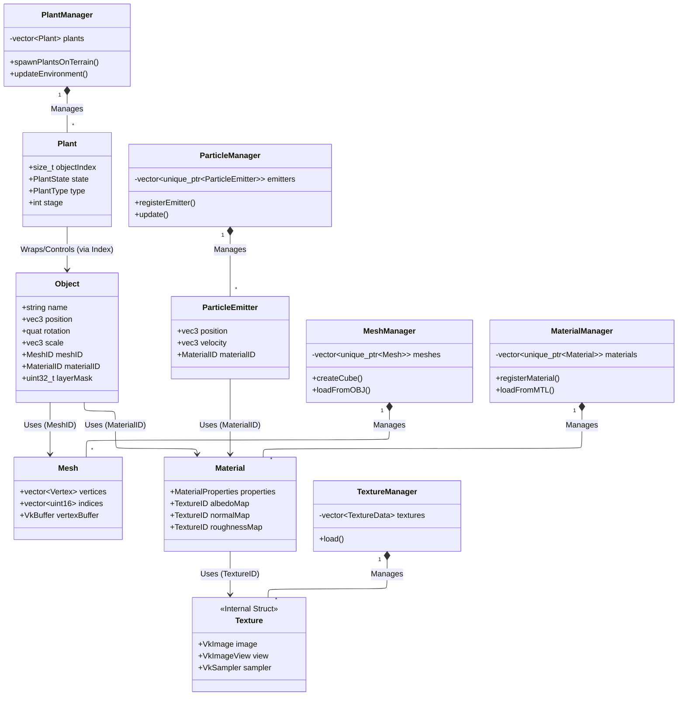
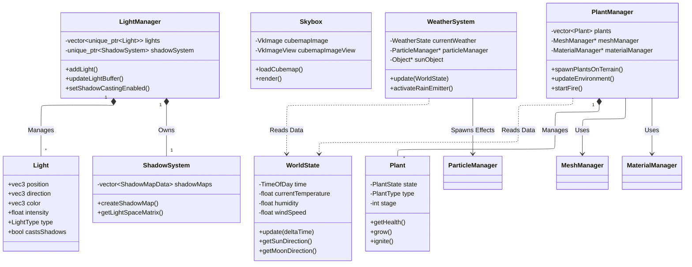
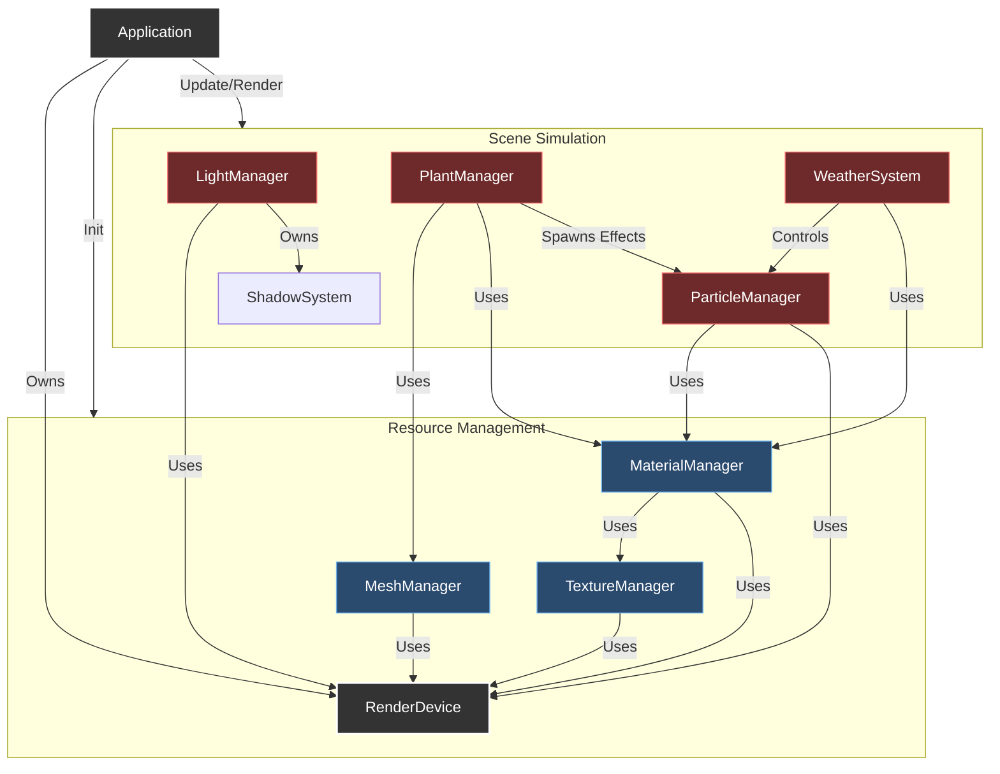

# Lab I - Final Lab

## C++ Programming & Design

### Overview of Classes
| Category | Class Name | Role | Responsibilities |
| :--- | :--- | :--- | :--- |
| **System** | **Application** | Main Engine Class | Ties subsystems together (Window, Renderer, Scene); manages the main game loop, time scaling, and cleanup. |
| | **Window** | OS Interface | Wraps GLFW to handle window creation, input polling, and Vulkan surface creation. |
| **Vulkan & Rendering** | **RenderDevice** | Vulkan Wrapper | Manages the logical Vulkan device, physical device selection, memory allocation, and command pools. |
| | **MainPipeline** | Graphics Pipeline | Configures and manages the primary render pipeline states, shaders, and shading modes (Phong/Gouraud). |
| | **PostProcessing** | Render Pass | Handles offscreen rendering to textures and applies full-screen effects like toon shading. |
| | **ShadowSystem** | Rendering Tech | Manages shadow map resources, framebuffers, and the calculation of light-space matrices. |
| | **ShadowMapData** | Render Resource | Manages the specific Vulkan images, views, and samplers required for a single shadow map. |
| **Resources** | **MeshManager** | Resource Manager | Handles the loading of OBJ models and generation of procedural geometry (cubes, spheres, terrain). |
| | **Mesh** | Data Structure | Holds vertex and index data for 3D geometry, managing its own GPU vertex/index buffers. |
| | **Vertex** | Data Structure | Defines the memory layout for a single point in 3D space (position, color, normal, UV). |
| | **MaterialManager** | Resource Manager | Manages the creation and storage of PBR materials and their associated descriptor sets. |
| | **Material** | Data Structure | Stores PBR surface properties (albedo, roughness, metallic) and texture references for rendering. |
| | **MaterialBuilder** | Factory Pattern | A fluent interface to easily configure `Material` properties and texture paths before registration. |
| | **TextureManager** | Resource Manager | Loads images via stb_image, creates Vulkan image views/samplers, and manages default textures. |
| | **Object** | Scene Entity | Stores transform data (position, rotation, scale) and references to mesh and material resources. |
| | **ObjectBuilder** | Factory Pattern | Provides a fluent API to construct and configure `Object` instances easily. |
| **Scene & Lighting** | **LightManager** | Lighting System | Maintains the list of scene lights, updates the GPU light buffer, and coordinates shadow casting. |
| | **Light** | Data Structure | Represents a single light source (Sun or Point) with properties like color, intensity, and direction. |
| | **LightBuilder** | Factory Pattern | A fluent interface for configuring and creating `Light` instances with specific parameters. |
| | **Skybox** | Environment Renderer | Loads cubemap textures and renders the background sky dome using a dedicated pipeline. |
| | **WorldState** | Simulation Logic | Simulates time of day, temperature, humidity, wind, and weather cycles over time. |
| | **WorldConfig** | Configuration | A struct that holds initial simulation settings (day length, min/max temps) loaded from the `.ini` file. |
| | **TimeOfDay** | Data Container | Helper struct to track and convert total simulation seconds into readable hours, minutes, and day/night flags. |
| | **WeatherSystem** | Visual FX Controller | Monitors the `WorldState` to activate or deactivate particle effects like rain, snow, or dust. |
| | **PlantManager** | Gameplay System | Manages plant lifecycle logic including spawning, growth stages, fire spreading, and death. |
| | **Plant** | Game Entity | Represents a specific instance of a plant, tracking its growth stage, health, water, and fire state. |
| | **PlantState** | Data Container | A struct holding the raw simulation data (health, burn timer) for a single plant instance. |
| **Particles** | **ParticleManager** | FX Renderer | Updates particle simulation state and handles the instanced rendering of all active emitters. |
| | **ParticleEmitter** | Effect Instance | Defines the specific parameters and behavior (lifetime, velocity, color) for a particle effect. |
| | **ParticleEmitterBuilder** | Factory Pattern | A fluent interface for configuring complex particle emitters (fire, rain) before handing them to the manager. |
| | **EmitterPresets** | Utility | Provides static helper methods to instantly configure builders for common effects like Fire or Rain. |
| **Utilities** | **Camera** | View Controller | Calculates view matrices, handles user input for Orbit and FPS camera movement modes. |
| | **Input** | Input Handler | Tracks and buffers keyboard and mouse state for query by other systems during the frame. |
| | **ConfigParser** | Utility | Reads and parses `.ini` configuration files to initialize engine settings. |
| | **Debug** | Utility | Provides a centralized, categorized logging interface for console output. |
| | **PerlinNoise** | Math Utility | Generates coherent noise values used for procedural terrain height generation. |
### Mermaid Diagrams

#### Resources Class Diagram


#### Scene Class Diagram


#### Per-Frame Sequence Diagram

```mermaid
sequenceDiagram
    participant MainLoop as Application::mainLoop
    participant App as Application
    participant World as WorldState
    participant PM as PlantManager
    participant PartM as ParticleManager
    participant LM as LightManager
    participant VK as Vulkan (GPU/Driver)
    participant Shadow as ShadowSystem
    participant PP as PostProcessing
    participant Sky as Skybox

    Note over MainLoop: Start of Frame

    MainLoop->>App: input.update()
    MainLoop->>App: camera.update()
    MainLoop->>App: drawFrame()

    rect rgb(30, 30, 30)
        Note right of App: Synchronization
        App->>VK: vkWaitForFences()
        App->>VK: vkAcquireNextImageKHR()
        App->>VK: vkResetFences()
    end

    rect rgb(40, 40, 50)
        Note right of App: Update Game State
        App->>App: updateUniformBuffer()
        App->>World: update(deltaTime)
        App->>PM: updateEnvironment()
        App->>PartM: update()
        App->>LM: updateAllShadowMatrices()
        App->>LM: updateLightBuffer()
    end

    rect rgb(50, 40, 40)
        Note right of App: Command Recording
        App->>App: recordCommandBuffer()
        App->>VK: vkBeginCommandBuffer()

        %% Shadow Pass
        Note right of App: 1. Shadow Pass
        App->>LM: getShadowSystem()->getShadowMaps()
        loop For Each Shadow Map
            App->>VK: Pipeline Barrier (Image Layout -> Depth Write)
            App->>VK: vkCmdBeginRendering (Shadow Map)
            App->>VK: vkCmdBindPipeline (Shadow Pipeline)
            App->>VK: vkCmdDrawIndexed (Scene Objects)
            App->>VK: vkCmdEndRendering
            App->>VK: Pipeline Barrier (Image Layout -> Shader Read)
        end

        %% Main Offscreen Pass
        Note right of App: 2. Offscreen/Main Pass
        App->>PP: beginOffscreenPass()
        PP->>VK: Pipeline Barrier (Offscreen Image -> Color Attachment)
        PP->>VK: vkCmdBeginRendering (Offscreen Image)
        
        App->>VK: vkCmdBindPipeline (Main Pipeline)
        App->>VK: vkCmdDrawIndexed (Standard Objects)
        
        App->>App: renderPlants()
        App->>VK: vkCmdBindPipeline (Plant Pipeline)
        App->>VK: vkCmdDrawIndexed (Plants)

        App->>Sky: render()
        Sky->>VK: vkCmdDrawIndexed (Skybox Cube)

        App->>PartM: render()
        PartM->>VK: vkCmdDrawIndexed (Particles)

        App->>PP: endOffscreenPass()
        PP->>VK: vkCmdEndRendering
        PP->>VK: Pipeline Barrier (Offscreen Image -> Shader Read)

        %% Post Processing Pass
        Note right of App: 3. Post-Processing Pass
        App->>VK: Pipeline Barrier (Swapchain Image -> Color Attachment)
        App->>PP: render(Target: Swapchain)
        PP->>VK: vkCmdBeginRendering (Swapchain Image)
        PP->>VK: vkCmdBindPipeline (PostProcess Pipeline)
        PP->>VK: vkCmdDraw (Full Screen Triangle)
        PP->>VK: vkCmdEndRendering
        
        App->>VK: Pipeline Barrier (Swapchain Image -> Present Src)
        App->>VK: vkEndCommandBuffer()
    end

    rect rgb(30, 50, 30)
        Note right of App: Submission
        App->>VK: vkQueueSubmit(Graphics Queue)
        App->>VK: vkQueuePresentKHR(Present Queue)
    end
```



#### System Architecture Diagram 


#### Plant Life-Cycle Flowchart


### Design Evaluation

#### Pros

Through using the builder pattern, I believe it enhanced clarity and abstraction within my API. By wrapping complex initialisation logic and optional parameters into interfaces like `ObjectBuilder` and `ParticleEmitterBuilder`, the client code became readable and self-documenting, hiding the verbose nature of the underlying C++ and Vulkan structures. I am quite proud of this architectural choice as it simplified scene construction significantly. Reusability is also well-supported, especially regarding resources. Classes like `MeshManager` and `TextureManager` focus strictly on the lifecycle and memory management of their assets (using RAII principles), returning handles like `MeshID` or `MaterialID`. This abstracts the underlying pointers and prevents the system from being exposed in nefarious ways. 

Furthermore, I am very proud of my particle system. By centralising the rendering logic in `ParticleManager` while keeping configuration in `ParticleEmitter`, I achieved a high degree of flexibility. Emitters for fire, rain, and snow share the same underlying shader parameters but behave completely differently, all without the individual emitter objects needing to know how they are drawn. I also successfully implemented a data-driven approach for the engine's configuration via the `ConfigParser`.

#### Cons
I think the biggest flaw architecturally speaking is my coupling. Classes like `PlantManager`, `WeatherSystem` and `WorldState` share tight dependencies and are generally less isolated than they ideally should be. I believe that my implementation of `Application` needs quite a bit more work as it acts as a monolithic 'God Class', orchestrating too much of the specific gameplay logic. This lack of separation makes the main loop suffer and can lead to bugs that are annoying to catch. Another critical weakness is the violation of the open/closed principle in my rendering path. Currently, adding a new render pass requires modifying the `Application::recordCommandBuffer` method directly to inject new draw calls, rather than having a dynamic render list that the renderer simply iterates over. This makes the renderer rigid and prone to breakage when adding features. I also relied too heavily on hard-coded asset paths within my managers; specifically in `PlantManager`, where model paths are string literals buried in the implementation file rather than being loaded from an external manifest.

I also recognise that the synchronization between my logical and visual representations is somewhat fragile. In `PlantManager.h`, I currently maintain a `plantObjectIndices` vector to map my `Plant` logic entities to their corresponding `Object` visual counterparts in the main scene list. This indirect referencing via the `objectIndex_` member variable is error-prone; if the main object list in `Application` were ever reordered or filtered, my plant logic would completely break. Merging these into a single entity or using stable handles instead of raw indices would be a much more robust solution for the future.

#### Future Improvements
If I had more time, the first thing I would change is the rendering architecture. I would implement a Render Graph or a dynamic pass system. This would allow me to define render passes (like Shadows, Main, Post-Process) as data or independent modules, solving the Open/Closed violation in `Application.cpp`. Furthermore, I would move away from the current monolithic `Object` class toward a component-based architecture. Currently, every object is forced to carry specific attributes like mesh and material IDs. Breaking these into `TransformComponent`, `RenderComponent`, and `LogicComponent` would decouple the logic, allow for more diverse entity types (like invisible logic triggers), and improve cache locality for better performance.

I would also implement an **Event System** to further decouple the gameplay logic. Currently, `Application.cpp` acts as a massive switchboard, manually routing input in `keyCallback` to specific subsystems like `app->postProcessing->toggleToonMode()` or `app->triggerFireEffect()`. An event bus would allow the `WeatherSystem` or `PlantManager` to subscribe to relevant input events without the main application explicitly managing those relationships, significantly cleaning up that function and reducing the hard dependencies between the core loop and the game systems.

A small nitpick I have with my code is the under-use of having separate files for different things. For example, my mesh class definition is located in `MeshManager.cpp` and my material class definition is located in `MaterialManager.cpp`. While not a substantial issue, it would be more satisfying to separate them. 

### Parasoft Warnings


I only get one severity 5.
## Real-Time Graphics

### Evaluation

#### Geometry Representation and Processing

The engine uses a unified `Vertex` structure defined in `MeshManager`, containing position, colour, texture coordinates, and normal data. This layout simplifies the input but potentially wastes memory bandwidth for passes that only require position data, such as the shadow map generation passes in `ShadowSystem::createShadowPipeline`.

Terrain geometry is generated procedurally on the CPU using `PerlinNoise::octaveNoise` within `MeshManager::createProceduralTerrain`. While this allows for deterministic terrain generation via seeding and does not reduce performance once the mesh has been create, a more scalable and potentially more interesting approach would be to implement GPU-based tessellation or a compute shader to generate the heightmap. Having this would reduce the current CPU bottleneck and also allow for dynamic terrain modification during runtime.

#### Shading and Lighting

Lighting calculations primarily occur in `MainPipeline`, which utilises Vulkan constants to toggle between Phong and Gouraud shading without recompiling the pipeline. The lighting model supports both directional (Sun) and positional (Point) lights, managed by `LightManager`. Data is passed to the GPU with the `LightBufferObject` struct. 

However, the current shading implementation is limited. The lighting loop in the fragment shader scales linearly with the number of lights, constrained by the hardcoded `MAX_LIGHTS` constant (currently set to 8) in `LightManager`. This limits the scene complexity.

#### Shadow Generation

Shadows are generated using a standard depth-only pass managed by `ShadowSystem`. The system calculates an orthographic projection matrix for directional lights (Sun) to capture the scene within a defined radius. The implementation in `ShadowSystem::calculateLightSpaceMatrix` centers the projection on the scene center rather than the camera frustum. This is a disadvantage as it results in artifacts and somewhat insufficient shadow resolution near the camera, regardless of the 16k resolution set. A cascaded shadow map approach would significantly improve the environment.

#### Application-Graphics Connection

Application objects are decoupled from their graphics resources via a handle-based system. The `Application` class acts as the bridge, iterating through logical objects and retrieving the corresponding Vulkan resources from `MeshManager` and `MaterialManager` during the render loop. I believe this pattern allows thousands of objects, like the 1,100 plants in my test scene, to share a single geometry and texture in memory, drastically reducing VRAM. However, the connection is maintained through manual iteration in `Application::recordCommandBuffer`. The CPU must traverse the scene graph every frame, check visibility, and issue draw calls. I think this architecture differs from a more modern architecture where visible sets are culled and sorted into indirect draw buffers, reducing driver overhead.

#### Behaviour Updates and Propagation

Behavioural updates are computed on the CPU and propagated to the GPU with Push Constants and Uniform Buffers. `World State` updates environmental parameters like wind and sun position each frame, which is then aggregated into the `UniformBufferObject` and copied to a mapped GPU buffer in `Application::updateUniformBuffer`. For dynamic entities like plants, `PlantManager` calculates sway and growth parameters, which are then passed individually via `PlantPushConstants` immediately before the draw call in `Application::renderPlants`

#### Extensions and Scalability

The `Material` struct includes a `heightMap` ID and `heightScale`, but due to time constraints, the shader pipeline does not currently implement vertex displacement or parallax occlusion mapping. Implementing this would add significant depth to the sand terrain material. 

#### Future Feature Wishlist!

Ideally I would implement a hybrid raytracer for lighting calculations. Replacing the current shadow map implementation with ray-traced shadows would solve the resolution issues inherent in the orthographic projected used for the sun. Additionally, ray-traced ambient occlusion would ground the plants on the terrain far better. I however understand the feasibility of this.

I would also like to expand the post-processing pipeline. While the current edge-detection toon shader works well, the architecture in `PostProcessing` allows for easy chaining of effects. I love to experiment with screen-space effects like bloom for the fire particles, although even now I do have some colour-grading with hue shift to match the season. 

### Core Features

**Vulkan Framework**

A `RenderDevice` class abstracts physical device selection, logical device creation, and queue management. The `Application` class manages the primary render loop.

**Ground Plane**

Procedural terrain is generated using `PerlinNoise`. The `MeshManager` constructs a grid mesh where vertex height is determined by sampling noise at coordinates.


**Globe**

A sphere mesh is procedurally generated by `MeshManager` to serve as the base for planets and the skybox. There is no 'glass' effect on it however. 


**Plants**

The `PlantManager` utilises instanced rendering to draw thousands of plant models efficiently. Each plant instance tracks its own growth stage and health, updating its transformation matrix in a storage buffer. There are two types of plants, cacti and joshua trees.


**Model Loader**

A custom OBJ parser `MeshManager::loadFromOBJ` reads vertex positions, normals, and texture coordinates. It supports multi-mesh files and standard Wavefront formatting.

**Particle System**

A GPU-accelerated particle system handles effects like fire, rain, snow, and smoke. The `ParticleManager` uses a vertex buffer to stream particle data (position, colour, scale) each frame, rendering them as billboarded quads.


**Day/Night/Season Cycle**

The `WorldState` class advances simulation time, rotating the sun and moon directional lights. Ambient light colour and intensity interpolate based on the time of day (orange at sunset, blue at night).

**Per-Vertex & Per-Pixel Shading**

The pipeline supports toggling between shading modes. Per-vertex lighting calculations (Gouraud) are performed in the vertex shader. Per-pixel lighting calculations are performed in the fragment shader.

**Texture Mapping**

The `TextureManager` loads images using `stb_image` and creates Vulkan image views and samplers. The engine supports UV mapping for Albedo, Normal, and Roughness maps.


**Shadows**

Directional lights (Sun) cast shadows using a depth-only render pass. The engine calculates an orthographic projection matrix relative to the light's direction to populate a shadow map. Although this does not cover the entire scene.


**Lighting**

The scene supports multiple light sources and types. Sun type lights have a direction, infinite distance, and no position. Point type lights have no direction, attenuation, and a position.

**Camera**

A `Camera` class provides view projection matrices. It supports both perspective and orthographic projections.

**Controls**

The `Input` class polls standard GLFW events, enabling WASD movement and mouse look (FPS style) or orbital movement around a target.

**Config File**

An .ini parser reads startup settings from `config.ini`, allowing users to configure resolution, weather settings, plant settings, terrain generation settings, and day/night cycle settings.

```
; Dome Diorama Configuration File
; Lines starting with ; or # are comments

[World]
; Time settings (in seconds)
day_length = 30.0
starting_hour = 12
starting_minute = 0

; Environmental parameters
starting_temperature = -15.0
min_temperature = -15.0
max_temperature = 60.0
starting_humidity = 0.9
min_humidity = 0.1
max_humidity = 0.9
starting_wind_speed = 2.0
min_wind_speed = 0.5
max_wind_speed = 10.0

; Weather transition settings
parameter_update_interval = 30.0
day_night_temp_variation = 8.0

[Camera]
; Camera settings
mode = orbit          ; orbit or free
initial_distance = 35.0
initial_pitch = 0.5
initial_yaw = 0.0
movement_speed = 10.0
rotation_speed = 0.003
zoom_speed = 2.0

[Plants]
; Plant spawning configuration
num_cacti = 1000
num_trees = 100
min_spawn_radius = 8.0
max_spawn_radius = 300.0
spawn_seed = 67
random_growth_stages = true
scale_variance = 0.4
rotation_variance = 0.2

[Terrain]
; Terrain generation
terrain_size = 300.0 ; CAUTION
terrain_resolution = 100
terrain_height = 30.0
terrain_frequency = 2.0
terrain_octaves = 2
terrain_persistence = 0.6
terrain_seed = 67

[Rendering]
; Rendering settings
initial_shading_mode = phong    ; phong or gouraud
initial_polygon_mode = fill     ; fill, line, or point
initial_filter_mode = linear    ; linear or nearest
window_width = 800
window_height = 600
max_frames_in_flight = 2

[Debug]
; Debug output toggles
debug_main = true
debug_camera = false
debug_input = false
debug_rendering = false
debug_vulkan = true
debug_skybox = false
debug_plantmanager = true
debug_world = true
debug_particles = true
debug_mesh = false
debug_lights = true
debug_scene = true
debug_objects = false
debug_texture = false
debug_materials = false
debug_postprocessing = false
debug_shadows = false
```

### Advanced Features

**Bump Mapping & Displacement Mapping**

Although some architecture exists for this, the engine lacks it.

**Environment Mapping**

A cubemap texture is used to render the sky. The `Skybox` class renders a sphere that allows the skybox to only be seen from inside the globe.

**Visualisation of Sun & Moon**

Both the sun and the moon are rendered in the sky and their positions are accurate to the light direction. Objects can have a layer mask, in this case it is used so that they can only be seen when inside of the globe. 


**Shadows Cont.**

Shadow mapping is used, but again, this only applies to a selection of the scene and is not any fancier than that unfortunately.

**Illuminating Sparks**

While all the pieces are there, I did not have time to implement it fully.

**Deferred Rendering**

The final stage of rendering is given to `PostProcessing`. This allows shader effects to be added. For example, currently the entire scene shifts hue and saturation based on the world effects like temperature and humidity.

**Stats for Graphics**

There is no on-screen overlay for stats, only console outputs.


**Novel Features**

**Dynamic Weather System**

Instead of having an `enum` that dictates the weather, temperature and humidity are two core values that fluctuate randomly between a minimum and maximum point which are then used to determine what the weather will be. For example, low humidity + high temperature = clear skies, high humidity + low temperature = snow, high humidity + high temperature = rain. Furthermore, the amount of rain or snow particles is dynamic based on these values, and the skybox, and light intensity changing depending on the weather. Also, all particles, including the weather particles, are affected by the speed and direction of the wind. 

**Interactive Vegetation**

Plants have a lot of gameplay logic (health, fire, growth), multiple model variations, and different models for growth stages. Depending on the weather and conditions, fire can spread between plants or plants can dynamically have offspring. Furthermore, plants have a shader that allows them to gently sway in the direction and speed of the wind. 

**Toon Shader**

An edge-detection toon shader can be activated with the keybind `K`.


