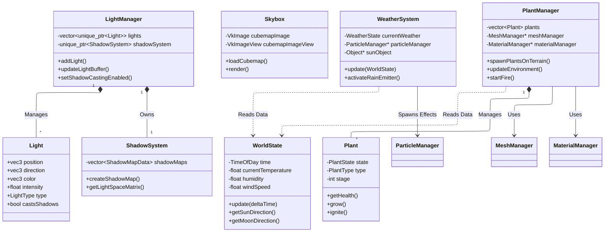

# Lab I - Final Lab

I will split this up by module, in C++ I will talk about implementation, in Real-Time Graphics I will talk about features.I will also include the controls:

## Controls

### General Controls
- **ESC** - Exit the application
- **R** - Reset application to initial state (C1 camera, default time/world)
- **K** - Toggle Toon Shader

### Camera Presets
- **F1** - Camera C1: Overview (Globe view)
- **F2** - Camera C2: Navigation (Element view)
- **F3** - Camera C3: Close-up (Cactus view)
- **F4** - Center the Camera on and Burn a Random Plant

### Camera Movement
- **Arrow Keys** - Rotate Camera (Left/Right/Up/Down)
- **CTRL + Arrows** - Pan Camera (Left/Right/Forward/Backward)
- **CTRL + PgUp** - Pan Up
- **CTRL + PgDn** - Pan Down
- **Enter** - Switch between Orbit and FPS modes
- **Right Mouse** - Rotate (Orbit mode only)
- **Scroll** - Zoom (Orbit) / Adjust Speed (FPS)

### Effects & Time
- **F4** - Trigger Particle Effect (Random Cactus Fire) & Follow Camera
- **]** - Increase Time Scale (Speed up effects)
- **[** - Decrease Time Scale (Slow down effects)
- **P** - Pause/Resume time progression

### Rendering Controls
- **1** - Fill mode
- **2** - Wireframe mode
- **3** - Point mode
- **4** - Nearest texture filtering
- **5** - Linear texture filtering
- **L** - Toggle Phong/Gouraud shading

### Weather Controls
- **T** - Increase Temperature (+5°C)
- **G** - Decrease Temperature (-5°C)
- **H** - Increase Humidity (+10%)
- **N** - Decrease Humidity (-10%)
- **U** - Increase Wind Speed (+1 m/s)
- **J** - Decrease Wind Speed (-1 m/s)
- **Y** - Cycle Weather State

## C++ Programming & Design


### Objects

You can create a new entity using the `ObjectBuilder`. 

**Basic Syntax:**
```cpp
const Object myObject = ObjectBuilder()
    .name("Object Name")
    .mesh(myMeshID)
    .material(myMaterialID)
    .position(0.0f, 0.0f, 0.0f)
    .scale(1.0f)
    .build();
```

**API Reference**

| Method | Parameters | Description |
| - | - | - |
| .name() | std::string | Sets a descriptive name for debugging and logging. |
| .mesh() | MeshID | **Required.** Assigns the geometry ID (created via MeshManager). |
| .material() | MaterialID | **Required.** Assigns the look/shader ID (created via MaterialManager). |
| .position() | float x, y, z OR glm::vec3 | Sets the object's location in world space. |
| .scale() | float OR glm::vec3 | Sets the size. Passing a single float scales uniformly on all axes. |
| .rotation() | glm::quat | Sets rotation using a quaternion. |
| .rotationEuler() | float p, y, r OR glm::vec3 | Sets rotation using degrees (converted to quaternions internally). |
| .visible() | bool | Toggles rendering visibility (defaults to true). |
| .layerMask() | uint32_t | Sets rendering layer bits (e.g., 0x1 for specific passes). |
| .build() | Object& | Finalizes the configuration and populates the passed Object. |

#### Post-Creation Manipulation
Once an `Object` is created, you can modify it directly using standard setters. This is useful for game logic or animation updates.

```cpp
 // Example: Moving an object after creation
 myObject.setPosition(10.0f, 5.0f, 0.0f);
 myObject.setScale(2.0f);

// Rotating using Euler angles (Degrees)
 myObject.setRotationEuler(0.0f, 90.0f, 0.0f);
```
#### Complete Example
Here is a practical example of loading a custom mesh and creating an object from it:

```cpp
    // 1. Load the resources
    const MeshID pokeballMesh = meshManager->loadFromOBJ("./Models/PokeWhite.obj");
    const MaterialID pokeballMat = materialManager->loadFromMTL("./Models/PokeWhite.mtl");

    // 2. Build the object
    Object pokeball;
    ObjectBuilder()
        .name("Pokeball White")
        .position(-10.0f, -130.0f, 0.0f) // Place deep in the scene
        .mesh(pokeballMesh)
        .material(pokeballMat)
        .scale(3.05f)                    // Uniform scale
        .build(pokeball);

    // 3. Add to scene
    sceneObjects.push_back(pokeball);
```

### Materials
Materials determine how light interacts with the surfaces of your objects. The engine uses a PBR (Physically Based Rendering) workflow, supporting standard maps for Albedo, Normals, Roughness, Metallic, and Ambient Occlusion.

Materials are created using the `MaterialBuilder` and must be registered with the `MaterialManager` to obtain a `MaterialID`.

**Basic Syntax:**
```cpp
const MaterialID myMaterial = materialManager->registerMaterial(
    MaterialBuilder()
        .name("Gold Material")
        .albedoColor(1.0f, 0.8f, 0.0f) // Yellow-ish
        .metallic(1.0f)                // Fully metallic
        .roughness(0.2f)               // Shiny
);
```

**API Reference**

| Method | Parameters | Description |
| - | - | - |
| .name() | std::string | Debug name for the material. |
| .albedoColor() | float r, g, b OR vec3 | Sets the base color tint (default is White). |
| .albedoMap() | TextureID OR string | Sets the base color texture. |
| .normalMap() | TextureID OR string | Sets the normal map for surface detail. |
| .roughness() | float (0.0 - 1.0) | Sets surface microsurface (0 = smooth/mirror, 1 = matte). |
| .roughnessMap()| TextureID OR string | Sets the roughness texture map. |
| .metallic() | float (0.0 - 1.0) | Sets conductivity (0 = dielectric/plastic, 1 = metal). |
| .metallicMap() | TextureID OR string | Sets the metallic texture map. |
| .emissiveIntensity()| float | Multiplier for emissive light output. |
| .emissiveMap() | TextureID OR string | Sets the texture for self-illumination. |
| .aoMap() | TextureID OR string | Sets the Ambient Occlusion map. |
| .heightMap() | TextureID OR string | Sets the displacement/height map. |
| .heightScale() | float | Multiplier for height map displacement strength. |
| .transparent() | bool | Enables alpha blending (default `false`). |
| .opacity() | float (0.0 - 1.0) | Sets alpha level. `< 1.0` triggers transparency. |
| .textureScale()| float | UV tiling scale. |
| .doubleSided() | bool | Disables backface culling for this material. |

**Loading from .MTL**

The engine supports loading standard Wavefront Material (.mtl) files. This parses the file and automatically loads referenced textures relative to the .mtl file location.

```cpp
// Returns the ID of the first material found in the file
const MaterialID externalMat = materialManager->loadFromMTL("./Models/Castle.mtl");
```

**Complete Example**

Here is a complex material setup using a full set of PBR texture maps:
```cpp
const MaterialID sandMaterialID = materialManager->registerMaterial(
    MaterialBuilder()
        .name("Sand Material")
        // You can pass filepaths directly to the builder
        .albedoMap("./Models/textures/sand_diff_4k.jpg")
        .normalMap("./Models/textures/sand_norm_4k.jpg")
        .roughnessMap("./Models/textures/sand_arm_4k.jpg")
        .heightMap("./Models/textures/sand_disp_4k.jpg")
        // Tweak properties
        .heightScale(0.1f)     // Slight displacement
        .textureScale(50.0f)   // Repeat texture 50 times
        .roughness(1.0f)       // Base roughness multiplier
```

### Lights

The engine supports two primary light types: **Sun** (Directional) and **Point** lights. Lights can also cast dynamic shadows.

Similar to Objects and Materials, lights are constructed using a fluent `LightBuilder` interface. Once built, add them to the `LightManager` to register them in the scene.

**Basic Syntax:**
```cpp
const Light sun = LightBuilder()
    .type(LightType::Sun)
    .name("Main Sun")
    .direction(0.0f, -1.0f, 0.0f) // Pointing straight down
    .intensity(2.0f)
    .castsShadows(true)
    .build(sun);

lightManager->addLight(sun);
```

**API Reference**
| Method | Parameters | Description |
| - | - | - |
| .type() | LightType | LightType::Sun (infinite distance) or LightType::Point (local bulb). |
| .name() | std::string | Debug name for the light. |
| .color() | float r, g, b OR vec3 | Sets the light color (RGB). |
| .intensity() | float | Brightness multiplier. |
| .position() | float x, y, z OR vec3 | World position (Only affects Point lights). |
| .direction() | float x, y, z OR vec3 | Light direction vector (Only affects Sun lights). |
| .attenuation() | float c, l, q | Sets falloff: Constant, Linear, Quadratic (Only affects Point lights). |
| .castsShadows() | bool | If true, allocates a shadow map for this light. |
| .build() | Light& | Finalizes the configuration and populates the passed Light. |

**Light Types Explained**

1. Sun (Directional) Simulates a light source infinitely far away (like the sun). The position is ignored; only direction matters. Rays are parallel.

2. Point Light Simulates a light bulb at a specific location. It emits light in all directions and fades out over distance based on the attenuation settings.

**Complete Example**

Here is how to set up a scene with a main sun and a flickering fire light:

```cpp
// 1. Create the Sun
const Light sunLight = LightBuilder()
    .type(LightType::Sun)
    .name("Sun Light")
    .direction(-0.5f, -1.0f, -0.5f)
    .color(1.0f, 0.95f, 0.8f)      // Warm sunlight
    .intensity(5.0f)
    .castsShadows(true)            // Enable shadows
    .build();

lightManager->addLight(sunLight);

// 2. Create a local fire light
const Light fireLight = LightBuilder()
    .type(LightType::Point)
    .name("Campfire")
    .position(10.0f, 0.5f, 10.0f)
    .color(1.0f, 0.4f, 0.0f)       // Orange fire
    .intensity(3.0f)
    .attenuation(1.0f, 0.09f, 0.032f) // Standard falloff
    .build();

lightManager->addLight(fireLight);
```

### Particle Simulation

The engine features a GPU-accelerated particle system. Particles are managed by emitters, which can be configured to simulate fire, smoke, rain, snow, or dust.

Emitters are created using ParticleEmitterBuilder. Unlike Objects and Lights, the builder **returns a pointer** to a new heap-allocated emitter, which you then pass to ParticleManager.

**Basic Syntax:**
```cpp
    ParticleEmitter* const fireEmitter = ParticleEmitterBuilder()
        .name("Campfire Emitter")
        .position(0.0f, 1.0f, 0.0f)
        .maxParticles(500)
        .baseColor(glm::vec3(1.0f, 0.5f, 0.0f))
        .tipColor(glm::vec3(1.0f, 0.0f, 0.0f))
        .build(); // Returns a new ParticleEmitter*

    // Registering transfers ownership to ParticleManager
    EmitterID id = particleManager->registerEmitter(fireEmitter);
```
**API Reference**

| Method | Parameters | Description |
| - | - | - |
| .name() | std::string | Debug name. |
| .position() | vec3 | World position of the emitter source. |
| .maxParticles() | size_t | Maximum number of active particles. |
| .particleLifetime() | float | How long (seconds) a particle lives. |
| .material() | MaterialID | Material used for the particle quad (usually transparent). |
| .baseColor() | vec3 | Color at the start of the particle's life. |
| .tipColor() | vec3 | Color at the end of the particle's life. |
| .gravity() | vec3 | Constant force applied (e.g., 0, -9.8, 0 for physics). |
| .initialVelocity() | vec3 | Starting velocity vector. |
| .velocityRandomness() | float | Multiplier for randomizing initial velocity. |
| .spawnRadius() | float | Radius around the position where particles spawn. |
| .particleScale() | float | Base size of the particles. |
| .scaleOverLifetime() | float | Multiplier for size change (e.g., 2.0 grows double). |
| .rotationSpeed() | float | Speed of particle rotation. |
| .windInfluence() | float | How strongly global wind affects these particles (0.0 - 1.0). |
| .fadeTimings() | float in, float out | Duration of fade-in and fade-out effects. |
| .billboardMode() | enum | Spherical (faces cam), Cylindrical (upright), or None. |
| .colorMode() | enum | Gradient (lerp base->tip), BaseOnly, or TipOnly. |

**Presets**

The EmitterPresets class provides helpers to quickly configure common effects:
```cpp
    ParticleEmitterBuilder builder;
    // Configures builder for fire, smoke, dust, rain, or snow
    EmitterPresets::createFire(builder); 

    ParticleEmitter* fire = builder
        .position(10.0f, 0.0f, 10.0f) // Override preset position
        .build();

    particleManager->registerEmitter(fire);
```

### Overview of Classes
| Category | Class Name | Role | Responsibilities |
| :--- | :--- | :--- | :--- |
| **System** | **Application** | Main Engine Class | Ties subsystems together (Window, Renderer, Scene); manages the main game loop, time scaling, and cleanup. |
| | **Window** | OS Interface | Wraps GLFW to handle window creation, input polling, and Vulkan surface creation. |
| **Vulkan & Rendering** | **RenderDevice** | Vulkan Wrapper | Manages the logical Vulkan device, physical device selection, memory allocation, and command pools. |
| | **MainPipeline** | Graphics Pipeline | Configures and manages the primary render pipeline states, shaders, and shading modes (Phong/Gouraud). |
| | **PostProcessing** | Render Pass | Handles offscreen rendering to textures and applies full-screen effects like toon shading. |
| | **ShadowSystem** | Rendering Tech | Manages shadow map resources, framebuffers, and the calculation of light-space matrices. |
| | **ShadowMapData** | Render Resource | Manages the specific Vulkan images, views, and samplers required for a single shadow map. |
| **Resources** | **MeshManager** | Resource Manager | Handles the loading of OBJ models and generation of procedural geometry (cubes, spheres, terrain). |
| | **Mesh** | Data Structure | Holds vertex and index data for 3D geometry, managing its own GPU vertex/index buffers. |
| | **Vertex** | Data Structure | Defines the memory layout for a single point in 3D space (position, color, normal, UV). |
| | **MaterialManager** | Resource Manager | Manages the creation and storage of PBR materials and their associated descriptor sets. |
| | **Material** | Data Structure | Stores PBR surface properties (albedo, roughness, metallic) and texture references for rendering. |
| | **MaterialBuilder** | Factory Pattern | A fluent interface to easily configure `Material` properties and texture paths before registration. |
| | **TextureManager** | Resource Manager | Loads images via stb_image, creates Vulkan image views/samplers, and manages default textures. |
| | **Object** | Scene Entity | Stores transform data (position, rotation, scale) and references to mesh and material resources. |
| | **ObjectBuilder** | Factory Pattern | Provides a fluent API to construct and configure `Object` instances easily. |
| **Scene & Lighting** | **LightManager** | Lighting System | Maintains the list of scene lights, updates the GPU light buffer, and coordinates shadow casting. |
| | **Light** | Data Structure | Represents a single light source (Sun or Point) with properties like color, intensity, and direction. |
| | **LightBuilder** | Factory Pattern | A fluent interface for configuring and creating `Light` instances with specific parameters. |
| | **Skybox** | Environment Renderer | Loads cubemap textures and renders the background sky dome using a dedicated pipeline. |
| | **WorldState** | Simulation Logic | Simulates time of day, temperature, humidity, wind, and weather cycles over time. |
| | **WorldConfig** | Configuration | A struct that holds initial simulation settings (day length, min/max temps) loaded from the `.ini` file. |
| | **TimeOfDay** | Data Container | Helper struct to track and convert total simulation seconds into readable hours, minutes, and day/night flags. |
| | **WeatherSystem** | Visual FX Controller | Monitors the `WorldState` to activate or deactivate particle effects like rain, snow, or dust. |
| | **PlantManager** | Gameplay System | Manages plant lifecycle logic including spawning, growth stages, fire spreading, and death. |
| | **Plant** | Game Entity | Represents a specific instance of a plant, tracking its growth stage, health, water, and fire state. |
| | **PlantState** | Data Container | A struct holding the raw simulation data (health, burn timer) for a single plant instance. |
| **Particles** | **ParticleManager** | FX Renderer | Updates particle simulation state and handles the instanced rendering of all active emitters. |
| | **ParticleEmitter** | Effect Instance | Defines the specific parameters and behavior (lifetime, velocity, color) for a particle effect. |
| | **ParticleEmitterBuilder** | Factory Pattern | A fluent interface for configuring complex particle emitters (fire, rain) before handing them to the manager. |
| | **EmitterPresets** | Utility | Provides static helper methods to instantly configure builders for common effects like Fire or Rain. |
| **Utilities** | **Camera** | View Controller | Calculates view matrices, handles user input for Orbit and FPS camera movement modes. |
| | **Input** | Input Handler | Tracks and buffers keyboard and mouse state for query by other systems during the frame. |
| | **ConfigParser** | Utility | Reads and parses `.ini` configuration files to initialize engine settings. |
| | **Debug** | Utility | Provides a centralized, categorized logging interface for console output. |
| | **PerlinNoise** | Math Utility | Generates coherent noise values used for procedural terrain height generation. |
### Mermaid Diagrams

#### Resources Class Diagram


#### Scene Class Diagram


#### Per-Frame Sequence Diagram


#### System Architecture Diagram 


#### Plant Life-Cycle Flowchart


### Design Evaluation
#### Pros
Through using the builder pattern, I believe it enhanced clarity and abstraction. By wrapping complex initialisation logic and optional parameters into these interfaces, the API can hide the verbose nature of the underlying C++ and Vulkan structures, ultimately making the client code readable and self-documenting. I am quite proud of the API I have built. Reusability is also well-supported especially when it comes to my resources. Classes like `MeshManager` and `TextureManager` can focus strictly on the lifecycle and memory management of their assets and by returning handles like `MeshID` or `MaterialID` it abstracts the underlying data structures and does not expose the system in nefarious ways. Furthermore, I am very proud of my particle system, with all particles sharing a long set of parameters that the shader can handle and render. This allows for a centralised area where all particles live, but still allows flexibility within emitters that fire particles and rain particles can be rendered with the same shader, all without the actual objects needing to know how they are drawn. I am also quite pleased with how I have made my plant system, it is all encapsulated and uses the existing structure to create the objects. 

#### Cons
I think the biggest flaw architecturally speaking is my coupling. Classes like `PlantManager`, `WeatherSystem` and `WorldState` share tight dependencies and are generally less isolated than they ideally should be. I believe that my implementation of `Application` needs quite a bit more work as it acts as a monolithic god class, orchestrating too much. This lack of separation makes the main loop suffer and can lead to annoying to catch bugs. Furthermore, the specific gameplay logic like `PlantManager` and `WeatherSystem` is hard-codeed into the core engine sequence. Ideally, the main generic engine should not be aware of plants, yet it has to be. If I had more time, this is where I would begin rewriting, separating the engine into specific 'passes' with `Application` itself not being in control of so much at once. Additionally, if I had more time I would have preferred creating a component-based approach so that every entity is not forced to carry specific attributes like mesh and material data. As it serves, it is fine but could have some improvement as that would also improve performance.


### Parasoft Warnings


I only get one severity 5.
## Real-Time Graphics

### Core Features

**Vulkan Framework**

A `RenderDevice` class abstracts physical device selection, logical device creation, and queue management. The `Application` class manages the primary render loop.

**Ground Plane**

Procedural terrain is generated using `PerlinNoise`. The `MeshManager` constructs a grid mesh where vertex height is determined by sampling noise at coordinates.


**Globe**

A sphere mesh is proceurally generated by `MeshManager` to serve as the base for planets and the skybox. There is no 'glass' effect on it however. 


**Plants**

The `PlantManager` utilises instanced rendering to draw thousands of plant models efficiently. Each plant instance tracks its own growth stage and health, updating its transformation matrix in a storage buffer. There are two types of plants, cacti and joshua trees.


**Model Loader**

A custom OBJ parser `MeshManager::loadFromOBJ` reads vertex positions, normals, and texture coordinates. It supports multi-mesh files and standard Wavefront formatting.

**Particle System**

A GPU-accelerated particle system handles effects like fire, rain, snow, and smoke. The `ParticleManager` uses a vertex buffer to stream particle data (position, colour, scale) each frame, rendering them as billboarded quads.


**Day/Night/Season Cycle**

The `WorldState` class advances simulation time, rotating the sun and moon directional lights. Ambient light colour and intensity interpolate based on the time of day (orange at sunset, blue at night).

**Per-Vertex & Per-Pixel Shading**

The pipeline supports toggling between shading modes. Per-vertex lighting calculations (Gouraud) are performed in the vertex shader. Per-pixel lighting calculations are performed in the fragment shader.

**Texture Mapping**

The `TextureManager` loads images using `stb_image` and creates Vulkan image views and samplers. The engine supports UV mapping for Albedo, Normal, and Roughness maps.


**Shadows**

Directional lights (Sun) cast shadows using a depth-only render pass. The engine calculates an orthographic projection matrix relative to the light's direction to populate a shadow map. Although this does not cover the entire scene.


**Lighting**

The scene supports multiple light sources and types. Sun type lights have a direction, infinite distance, and no position. Point type lights have no direction, attenuation, and a position.

**Camera**

A `Camera` class provides view projection matricies. It supports both perspective and orthographic projections.

**Controls**

The `Input` class polls standard GLFW events, enabling WASD movement and mouse look (FPS style) or orbital movement around a target.

**Config File**

An .ini parser reads startup settings from `config.ini`, allowing users to configure resolution, weather settings, plant settings, terrain generation settings, and day/night cycle settings.

```
; Dome Diorama Configuration File
; Lines starting with ; or # are comments

[World]
; Time settings (in seconds)
day_length = 30.0
starting_hour = 12
starting_minute = 0

; Environmental parameters
starting_temperature = -15.0
min_temperature = -15.0
max_temperature = 60.0
starting_humidity = 0.9
min_humidity = 0.1
max_humidity = 0.9
starting_wind_speed = 2.0
min_wind_speed = 0.5
max_wind_speed = 10.0

; Weather transition settings
parameter_update_interval = 30.0
day_night_temp_variation = 8.0

[Camera]
; Camera settings
mode = orbit          ; orbit or free
initial_distance = 35.0
initial_pitch = 0.5
initial_yaw = 0.0
movement_speed = 10.0
rotation_speed = 0.003
zoom_speed = 2.0

[Plants]
; Plant spawning configuration
num_cacti = 1000
num_trees = 100
min_spawn_radius = 8.0
max_spawn_radius = 300.0
spawn_seed = 67
random_growth_stages = true
scale_variance = 0.4
rotation_variance = 0.2

[Terrain]
; Terrain generation
terrain_size = 300.0 ; CAUTION
terrain_resolution = 100
terrain_height = 30.0
terrain_frequency = 2.0
terrain_octaves = 2
terrain_persistence = 0.6
terrain_seed = 67

[Rendering]
; Rendering settings
initial_shading_mode = phong    ; phong or gouraud
initial_polygon_mode = fill     ; fill, line, or point
initial_filter_mode = linear    ; linear or nearest
window_width = 800
window_height = 600
max_frames_in_flight = 2

[Debug]
; Debug output toggles
debug_main = true
debug_camera = false
debug_input = false
debug_rendering = false
debug_vulkan = true
debug_skybox = false
debug_plantmanager = true
debug_world = true
debug_particles = true
debug_mesh = false
debug_lights = true
debug_scene = true
debug_objects = false
debug_texture = false
debug_materials = false
debug_postprocessing = false
debug_shadows = false
```

### Advanced Features

**Bump Mapping & Displacement Mapping**

Although some architecture exists for this, the engine lacks it.

**Environment Mapping**

A cubemap texture is used to render the sky. The `Skybox` class renders a sphere that allows the skybox to only be seen from inside the globe.

**Visualisation of Sun & Moon**

Both the sun and the moon are rendered in the sky and their positions are accurate to the light direction. Objects can have a layer mask, in this case it is used so that they can only be seen when inside of the globe. 


**Shadows Cont.**

Shadow mapping is used, but again, this only applies to a selection of the scene and is not any fancier than that unfortunately.

**Illuminating Sparks**

While all the pieces are there, I did not have time to implement it fully.

**Deferred Rendering**

The final stage of rendering is given to `PostProcessing`. This allows shader effects to be added.

**Stats for Graphics**

There is no on-screen overlay for stats, only console outputs.


**Novel Features**

**Dynamic Weather System**

Instead of having an `enum` that dictates the weather, temperature and humidity are two core values that fluctuate randomly between a minimum and maximum point which are then used to determine what the weather will be. For example, low humidity + high temperature = clear skies, high humidity + low temperature = snow, high humidity + high temperature = rain. Furthermore, the amount of rain or snow particles is dynamic based on these values, and the skybox, and light intensity changing depending on the weather. Also, all particles, including the weather particles, are affected by the speed and direction of the wind. 

**Interactive Vegetation**

Plants have a lot of gameplay logic (health, fire, growth), multiple model variations, and different models for growth stages. Depending on the weather and conditions, fire can spread between plants or plants can dynamically have offspring. Furthermore, plants have a shader that allows them to gently sway in the direction and speed of the wind. 

**Toon Shader**

An edge-detection toon shader can be activated with the keybind `K`.


