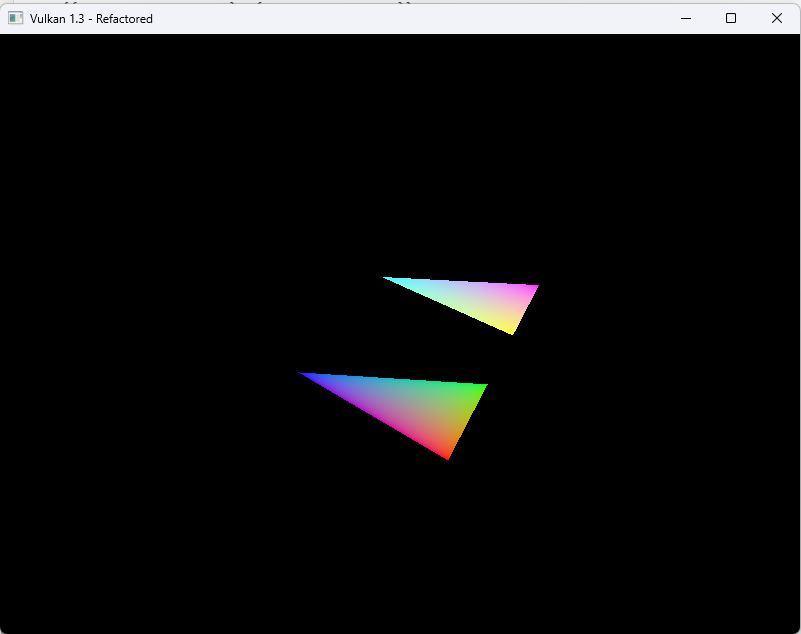
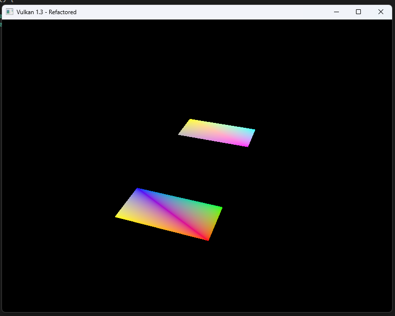
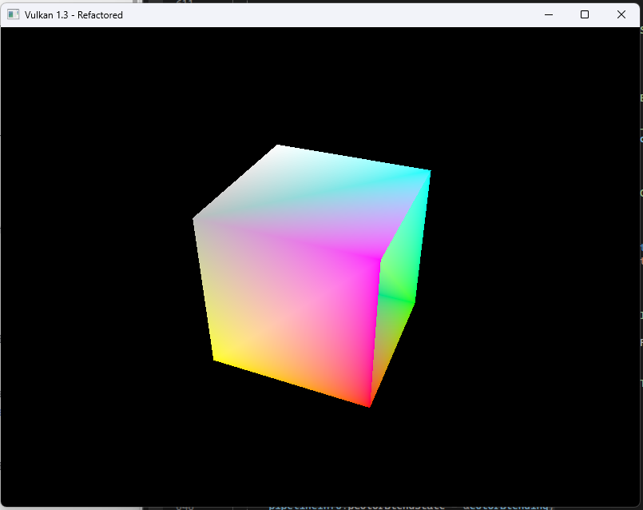
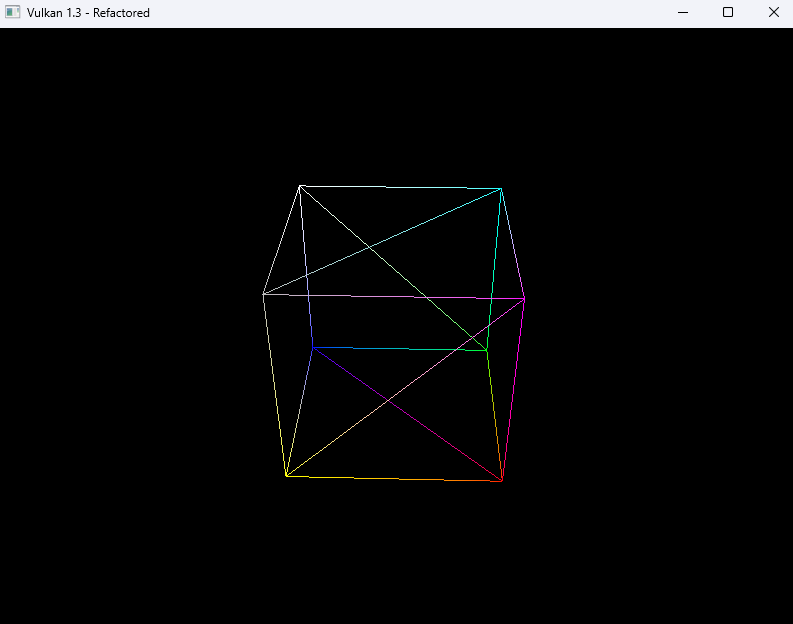
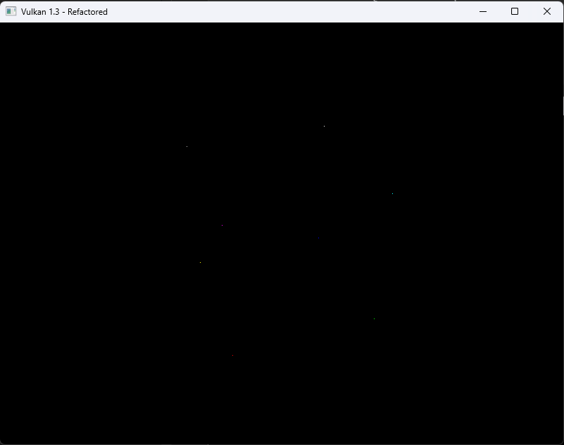
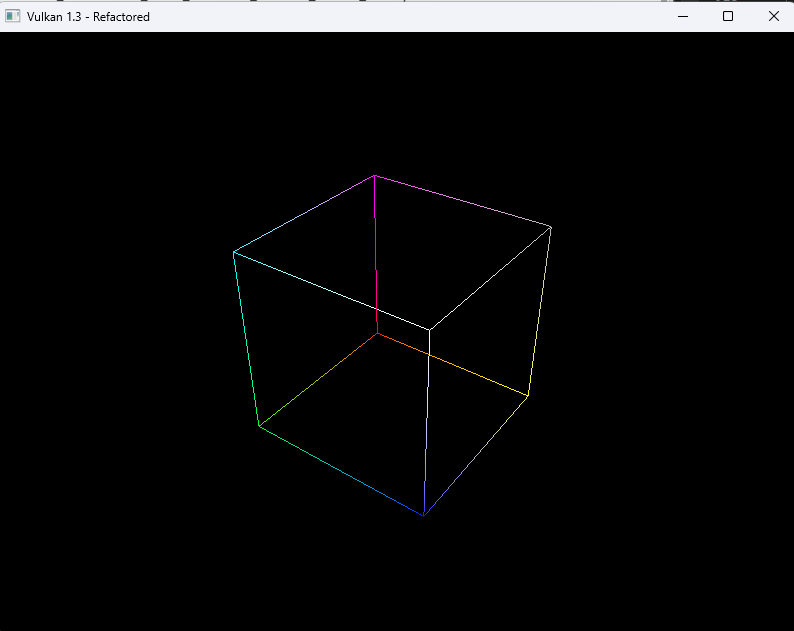
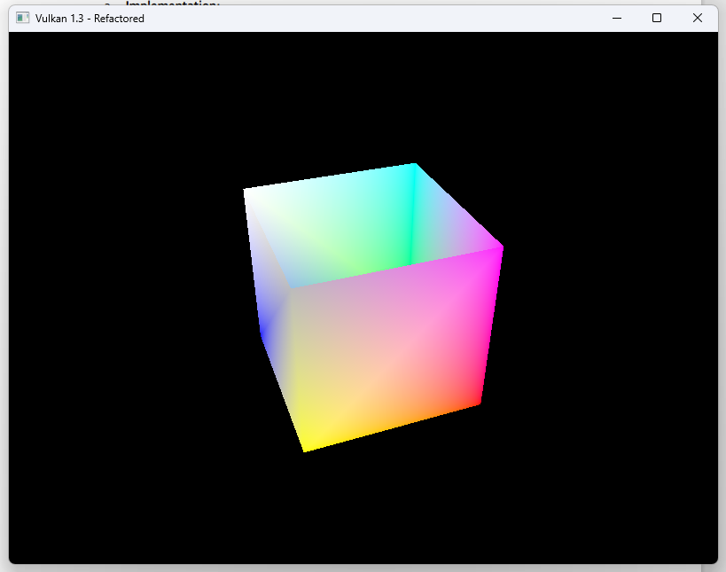
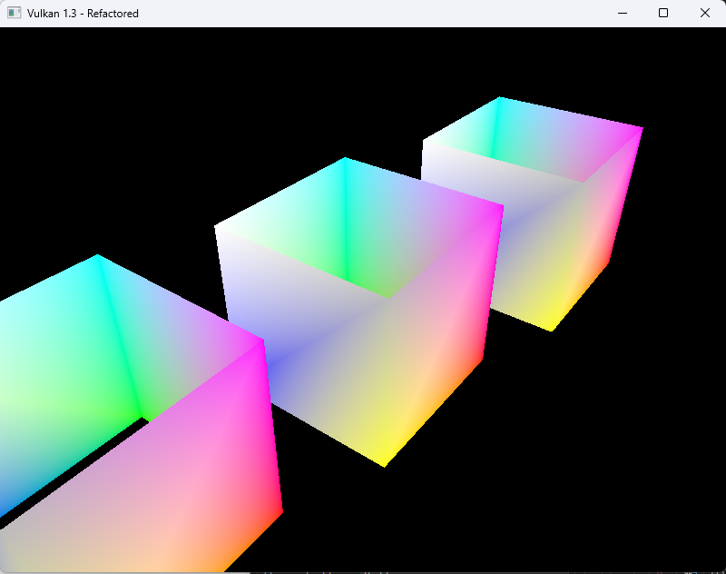
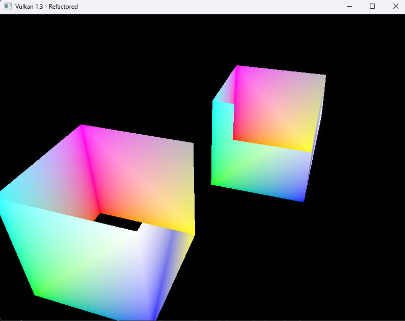

# Real-Time Graphics Labs

# Lab 1

## EXERCISE 1:DRAW TWO TRIANGLES WITHOUT USING VERTEX INDICES

We first add 2 more points to the `Quad_verticies` array, creating two triangles. We then remove the line `vkCmdBindIndexBuffer(commandBuffer, indexBuffer, 0, VK_INDEX_TYPE_UINT16);` because we are no longer using indicies, finally we change the draw call `vkCmdDrawIndexed(commandBuffer, static_cast<uint16_t>(indices.size()), 1, 0, 0, 0);` to `vkCmdDraw(commandBuffer, 6, 1, 0, 0);` to accept 6 vertices.



## EXERCISE 2:DRAW TWO SQUARES USING AN INDEX BUFFER

Because we can reuse vertices that are shared between triangles, this makes drawing a square more efficient. We first can alter `Quad_verticies` to add 8 vertices total, 4 for each sqaure. Then we create an index buffer with 12 indices, each square is composed of 2 triangles that share vertices.

```cpp
const std::vector<Vertex> Quad_vertices = {
    {{-0.9f, -0.4f, 0.0f}, {1.0f, 0.0f, 0.0f}},
    {{-0.5f, -0.4f, 0.0f}, {0.0f, 1.0f, 0.0f}},
    {{-0.5f, 0.4f, 0.0f}, {0.0f, 0.0f, 1.0f}},
    {{-0.9f, 0.4f, 0.0f}, {1.0f, 1.0f, 0.0f}},

    {{0.5f, -0.4f, 0.0f}, {1.0f, 0.0f, 1.0f}},
    {{0.9f, -0.4f, 0.0f}, {0.0f, 1.0f, 1.0f}},
    {{0.9f, 0.4f, 0.0f}, {1.0f, 1.0f, 0.0f}},
    {{0.5f, 0.4f, 0.0f}, {0.5f, 0.5f, 0.5f}}
};

const std::vector<uint16_t> Quad_indices = {
    0, 1, 2, 2, 3, 0,
    4, 5, 6, 6, 7, 4
};
```



## EXERCISE 3:DRAW THE FOUR WALLS OF A CUBE

By changing the verticies and updating the index buffer, alongside changing some functions in `CreateGraphicsPipeline()` like `VK_CULL_MODE_NONE`, we can render a cube-like shape.

```cpp
const std::vector<Vertex> Quad_vertices = {
    {{-0.5f, -0.5f, -0.5f}, {1.0f, 0.0f, 0.0f}},
    {{0.5f, -0.5f, -0.5f}, {0.0f, 1.0f, 0.0f}},
    {{0.5f, 0.5f, -0.5f}, {0.0f, 0.0f, 1.0f}},
    {{-0.5f, 0.5f, -0.5f}, {1.0f, 1.0f, 0.0f}},
    {{-0.5f, -0.5f, 0.5f}, {1.0f, 0.0f, 1.0f}},
    {{0.5f, -0.5f, 0.5f}, {0.0f, 1.0f, 1.0f}},
    {{0.5f, 0.5f, 0.5f}, {1.0f, 1.0f, 1.0f}},
    {{-0.5f, 0.5f, 0.5f}, {0.5f, 0.5f, 0.5f}}
};

const std::vector<uint16_t> Quad_indices = {
    0, 1, 2, 2, 3, 0,
    1, 5, 6, 6, 2, 1,
    5, 4, 7, 7, 6, 5,
    4, 0, 3, 3, 7, 4
};
```



## EXERCISE 4: WIREFRAME RENDERING
By changing more settings in the `CreateGraphicsPipeline()` function like `VK_POLYGON_MODE_FILL to VK_POLYGON_MODE_LINE`, we can render the cube as a wireframe.



## EXERCISE 5:RENDER THE CUBE'S VERTICES AS POINTS

In the `CreateGraphicsPipeline()` function we can change `inputAssembly.topology` from `VK_PRIMITIVE_TOPOLOGY_TRIANGLE_LIST` to `VK_PRIMITIVE_TOPOLOGY_POINT_LIST` and Changed `rasterizer.polygonMod` back to `VK_POLYGON_MODE_FILL`.

Then in the `recordCommandBuffer()` function we can bind it, getting just the points on the verticies.



## EXERCISE 6:RENDER THE CUBE'S EDGES AS LINES

We can update the index buffer to contain 24 indices representing 12 edges.

```cpp
const std::vector<Vertex> Quad_vertices = {
    {{-0.5f, -0.5f, -0.5f}, {1.0f, 0.0f, 0.0f}},
    {{0.5f, -0.5f, -0.5f}, {0.0f, 1.0f, 0.0f}},
    {{0.5f, 0.5f, -0.5f}, {0.0f, 0.0f, 1.0f}},
    {{-0.5f, 0.5f, -0.5f}, {1.0f, 1.0f, 0.0f}},
    {{-0.5f, -0.5f, 0.5f}, {1.0f, 0.0f, 1.0f}},
    {{0.5f, -0.5f, 0.5f}, {0.0f, 1.0f, 1.0f}},
    {{0.5f, 0.5f, 0.5f}, {1.0f, 1.0f, 1.0f}},
    {{-0.5f, 0.5f, 0.5f}, {0.5f, 0.5f, 0.5f}}
};

const std::vector<uint16_t> Quad_indices = {
    0, 1, 1, 2, 2, 3, 3, 0,
    4, 5, 5, 6, 6, 7, 7, 4,
    0, 4, 1, 5, 2, 6, 3, 7
};

```

Then in `createGraphicsPipeline()` we can change topology to `VK_PRIMITIVE_TOPOLOGY_LINE_LIST`

Then we can change `vkCmdDrawIndexed(commandBuffer, 24, 1, 0, 0, 0);` to draw 24 indices.



## EXERCISE 7: TRIANGLE STRIPS

We can change `Quad_vertices` to contain 24 indices forming a continous triangle strip. Then in graphics pipeline we turn the wireframe off, and change the `vkCmdDrawIndexed` function in `recordCommandBuffer` to draw all 24 indices.

```cpp
const std::vector<Vertex> Quad_vertices = {
    {{-0.5f, -0.5f, -0.5f}, {1.0f, 0.0f, 0.0f}},
    {{0.5f, -0.5f, -0.5f}, {0.0f, 1.0f, 0.0f}},
    {{0.5f, 0.5f, -0.5f}, {0.0f, 0.0f, 1.0f}},
    {{-0.5f, 0.5f, -0.5f}, {1.0f, 1.0f, 0.0f}},
    {{-0.5f, -0.5f, 0.5f}, {1.0f, 0.0f, 1.0f}},
    {{0.5f, -0.5f, 0.5f}, {0.0f, 1.0f, 1.0f}},
    {{0.5f, 0.5f, 0.5f}, {1.0f, 1.0f, 1.0f}},
    {{-0.5f, 0.5f, 0.5f}, {0.5f, 0.5f, 0.5f}}
};

const std::vector<uint16_t> Quad_indices = {
    4, 0, 5, 1, 6, 2, 7, 3, 4, 0, 0, 5, 5, 1, 1, 6, 6, 2, 2, 7, 7, 3, 3, 4
};
```



## EXERCISE 8:DRAWING MULTIPLE CUBES USING INSTANCED DRAWING

By editing the shader directly instead of adding new points, we can instanciate the cube, making multiple copies with it being much less computationally expensive. We make an instance on either side of the middle cube.

```cpp
#version 450

layout(binding = 0) uniform UniformBufferObject {
    mat4 model;
    mat4 view;
    mat4 proj;
} ubo;

layout(location = 0) in vec3 inPosition;
layout(location = 1) in vec3 inColor;

layout(location = 0) out vec3 fragColor;

void main() {
    vec3 offset = vec3(gl_InstanceIndex * 1.5 - 1.5, 0.0, 0.0);
    mat4 instanceModel = ubo.model;
    instanceModel[3][0] += offset.x;
    instanceModel[3][1] += offset.y;
    instanceModel[3][2] += offset.z;
    
    gl_Position = ubo.proj * ubo.view * instanceModel * vec4(inPosition, 1.0);
    fragColor = inColor;
}
```



## EXERCISE 9: DRAWING TWO CUBES USING PUSH CONSTANTS

!todo: writeup

