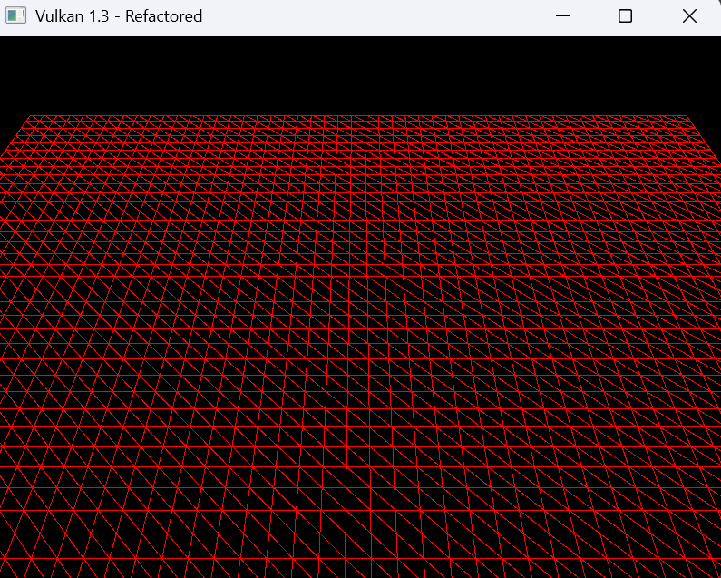
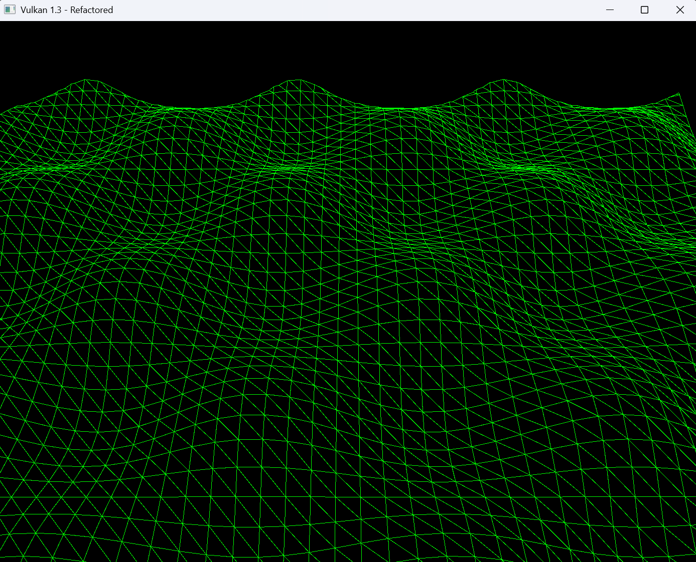
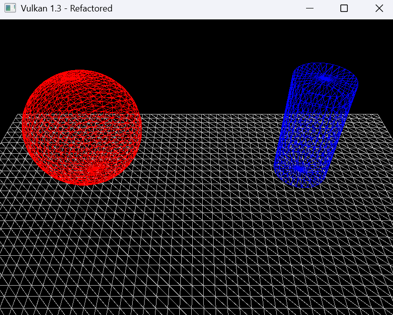
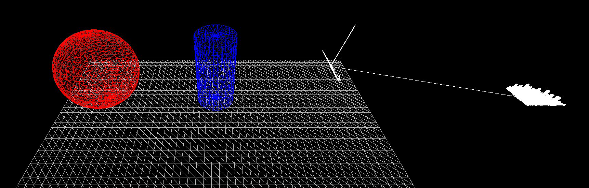

# Lab 2

## EXERCISE 1: CREATE A FLAT GRID
Because I read on, I was able to see that exercise 4 involves having multiple shapes accessible using a centralised and reusable strccuture, so from the start I did it like that. I started with creating two new files, `GeometryGenerator.cpp` and `GeometryGenerator.h`. This will be the class tht geometry gets created from. I then defined my Grid.

```cpp
namespace GeometryGenerator {

    MeshData createGrid(float width, float depth, uint32_t m, uint32_t n, const glm::vec3& color) {
        MeshData meshData;

        uint32_t vertexCount = m * n;
        uint32_t faceCount = (m - 1) * (n - 1) * 2;

        float halfWidth = 0.5f * width;
        float halfDepth = 0.5f * depth;

        float dx = width / (n - 1);
        float dz = depth / (m - 1);

        meshData.vertices.resize(vertexCount);
        for (uint32_t i = 0; i < m; ++i) {
            float z = halfDepth - i * dz;
            for (uint32_t j = 0; j < n; ++j) {
                float x = -halfWidth + j * dx;

                meshData.vertices[i * n + j].pos = glm::vec3(x, 0.0f, z);
                meshData.vertices[i * n + j].color = color;
            }
        }

        meshData.indices.resize(faceCount * 3);

        uint32_t k = 0;
        for (uint32_t i = 0; i < m - 1; ++i) {
            for (uint32_t j = 0; j < n - 1; ++j) {
                meshData.indices[k] = i * n + j;
                meshData.indices[k + 1] = i * n + j + 1;
                meshData.indices[k + 2] = (i + 1) * n + j;

                meshData.indices[k + 3] = (i + 1) * n + j;
                meshData.indices[k + 4] = i * n + j + 1;
                meshData.indices[k + 5] = (i + 1) * n + j + 1;

                k += 6;
            }
        }

        return meshData;
    }
}
```

I also created the header file, and moved the definition for vertex into there:

```cpp
#pragma once

#define GLFW_INCLUDE_VULKAN
#include <GLFW/glfw3.h>
#include <glm/glm.hpp>
#include <vector>
#include <cstdint>
#include <array>

struct Vertex {
    glm::vec3 pos;
    glm::vec3 color;

    static VkVertexInputBindingDescription getBindingDescription() {
        VkVertexInputBindingDescription bindingDescription{};
        bindingDescription.binding = 0;
        bindingDescription.stride = sizeof(Vertex);
        bindingDescription.inputRate = VK_VERTEX_INPUT_RATE_VERTEX;
        return bindingDescription;
    }

    static std::array<VkVertexInputAttributeDescription, 2> getAttributeDescriptions() {
        std::array<VkVertexInputAttributeDescription, 2> attributeDescriptions{};
        attributeDescriptions[0] = { 0, 0, VK_FORMAT_R32G32B32_SFLOAT, offsetof(Vertex, pos) };
        attributeDescriptions[1] = { 1, 0, VK_FORMAT_R32G32B32_SFLOAT, offsetof(Vertex, color) };
        return attributeDescriptions;
    }
};

namespace GeometryGenerator {
    struct MeshData {
        std::vector<Vertex> vertices;
        std::vector<uint32_t> indices;
    };

    MeshData createGrid(float width, float depth, uint32_t m, uint32_t n, const glm::vec3& color = glm::vec3(1.0f));
}
```

From here, I can edit the `loadModel()` function in main, aswell as change a few parts of the pre-existing code to work with my new GeometryGenerator:

```cpp
void loadModel() {
    GeometryGenerator::MeshData gridMesh = GeometryGenerator::createGrid(10.0f, 10.0f, 50, 50, glm::vec3(1.0f, 0.0f, 0.0f));

    // GeometryGenerator::MeshData terrainMesh = GeometryGenerator::createTerrain(10.0f, 10.0f, 50, 50, glm::vec3(0.0f, 1.0f, 0.0f));

    // GeometryGenerator::MeshData cylinderMesh = GeometryGenerator::createCylinder(0.5f, 0.5f, 2.0f, 30, 10, glm::vec3(0.0f, 0.0f, 1.0f));

    // GeometryGenerator::MeshData sphereMesh = GeometryGenerator::createSphere(1.0f, 30, 30, glm::vec3(1.0f, 1.0f, 0.0f));

    vertices = gridMesh.vertices;
    indices = gridMesh.indices;
}
```




## EXERCISE 2: CREATE A WAVY TERRAIN

Because of the new class, the only things that need changing to include a new shape is its new definition in GeometryGenerator, and a change to the `loadModel()` function:

```cpp
 MeshData createTerrain(float width, float depth, uint32_t m, uint32_t n, const glm::vec3& color) {
     MeshData meshData;

     uint32_t vertexCount = m * n;
     uint32_t faceCount = (m - 1) * (n - 1) * 2;

     float halfWidth = 0.5f * width;
     float halfDepth = 0.5f * depth;

     float dx = width / (n - 1);
     float dz = depth / (m - 1);

     meshData.vertices.resize(vertexCount);
     for (uint32_t i = 0; i < m; ++i) {
         float z = halfDepth - i * dz;
         for (uint32_t j = 0; j < n; ++j) {
             float x = -halfWidth + j * dx;

             float y = 0.3f * (sinf(x * 2.0f) * cosf(z * 2.0f));

             meshData.vertices[i * n + j].pos = glm::vec3(x, y, z);
             meshData.vertices[i * n + j].color = color;
         }
     }

     meshData.indices.resize(faceCount * 3);

     uint32_t k = 0;
     for (uint32_t i = 0; i < m - 1; ++i) {
         for (uint32_t j = 0; j < n - 1; ++j) {
             meshData.indices[k] = i * n + j;
             meshData.indices[k + 1] = i * n + j + 1;
             meshData.indices[k + 2] = (i + 1) * n + j;

             meshData.indices[k + 3] = (i + 1) * n + j;
             meshData.indices[k + 4] = i * n + j + 1;
             meshData.indices[k + 5] = (i + 1) * n + j + 1;

             k += 6;
         }
     }

     return meshData;
 }
 ```
```cpp
void loadModel() {
    // GeometryGenerator::MeshData gridMesh = GeometryGenerator::createGrid(10.0f, 10.0f, 50, 50, glm::vec3(1.0f, 0.0f, 0.0f));

    GeometryGenerator::MeshData terrainMesh = GeometryGenerator::createTerrain(10.0f, 10.0f, 50, 50, glm::vec3(0.0f, 1.0f, 0.0f));

    // GeometryGenerator::MeshData cylinderMesh = GeometryGenerator::createCylinder(0.5f, 0.5f, 2.0f, 30, 10, glm::vec3(0.0f, 0.0f, 1.0f));

    // GeometryGenerator::MeshData sphereMesh = GeometryGenerator::createSphere(1.0f, 30, 30, glm::vec3(1.0f, 1.0f, 0.0f));

    vertices = terrainMesh.vertices;
    indices = terrainMesh.indices;
}
```


 


## EXERCISE 3: PROCEDURAL CYLINDER

Again, this requires a new function in GeometryGenerator and a change to `loadModel()`:

```cpp
MeshData createCylinder(float bottomRadius, float topRadius, float height, uint32_t sliceCount, uint32_t stackCount, const glm::vec3& color) {
    MeshData meshData;

    float stackHeight = height / stackCount;
    float radiusStep = (topRadius - bottomRadius) / stackCount;
    uint32_t ringCount = stackCount + 1;

    for (uint32_t i = 0; i < ringCount; ++i) {
        float y = -0.5f * height + i * stackHeight;
        float r = bottomRadius + i * radiusStep;

        float dTheta = 2.0f * M_PI / sliceCount;
        for (uint32_t j = 0; j <= sliceCount; ++j) {
            Vertex vertex;

            float c = cosf(j * dTheta);
            float s = sinf(j * dTheta);

            vertex.pos = glm::vec3(r * c, y, r * s);
            vertex.color = color;

            meshData.vertices.push_back(vertex);
        }
    }

    uint32_t ringVertexCount = sliceCount + 1;
    for (uint32_t i = 0; i < stackCount; ++i) {
        for (uint32_t j = 0; j < sliceCount; ++j) {
            meshData.indices.push_back(i * ringVertexCount + j);
            meshData.indices.push_back((i + 1) * ringVertexCount + j);
            meshData.indices.push_back((i + 1) * ringVertexCount + j + 1);

            meshData.indices.push_back(i * ringVertexCount + j);
            meshData.indices.push_back((i + 1) * ringVertexCount + j + 1);
            meshData.indices.push_back(i * ringVertexCount + j + 1);
        }
    }

    uint32_t baseIndex = (uint32_t)meshData.vertices.size();
    float dTheta = 2.0f * M_PI / sliceCount;

    for (uint32_t i = 0; i <= sliceCount; ++i) {
        float x = bottomRadius * cosf(i * dTheta);
        float z = bottomRadius * sinf(i * dTheta);
        float y = -0.5f * height;

        Vertex vertex;
        vertex.pos = glm::vec3(x, y, z);
        vertex.color = color;
        meshData.vertices.push_back(vertex);
    }

    Vertex centerVertex;
    centerVertex.pos = glm::vec3(0.0f, -0.5f * height, 0.0f);
    centerVertex.color = color;
    meshData.vertices.push_back(centerVertex);

    uint32_t centerIndex = (uint32_t)meshData.vertices.size() - 1;

    for (uint32_t i = 0; i < sliceCount; ++i) {
        meshData.indices.push_back(centerIndex);
        meshData.indices.push_back(baseIndex + i + 1);
        meshData.indices.push_back(baseIndex + i);
    }

    baseIndex = (uint32_t)meshData.vertices.size();

    for (uint32_t i = 0; i <= sliceCount; ++i) {
        float x = topRadius * cosf(i * dTheta);
        float z = topRadius * sinf(i * dTheta);
        float y = 0.5f * height;

        Vertex vertex;
        vertex.pos = glm::vec3(x, y, z);
        vertex.color = color;
        meshData.vertices.push_back(vertex);
    }

    centerVertex.pos = glm::vec3(0.0f, 0.5f * height, 0.0f);
    centerVertex.color = color;
    meshData.vertices.push_back(centerVertex);

    centerIndex = (uint32_t)meshData.vertices.size() - 1;

    for (uint32_t i = 0; i < sliceCount; ++i) {
        meshData.indices.push_back(centerIndex);
        meshData.indices.push_back(baseIndex + i);
        meshData.indices.push_back(baseIndex + i + 1);
    }

    return meshData;
}
```

## EXERCISE 4: CREATING A REUSABLE GEOMETRY UTILITY

Because I already started doing this from the first exercise, the hardest part of this exercise was to get multiple shapes rendered at once. To accomplish this, we need to add a `RenderObject` struct and vector at the top of the file, a new `loadModel()` function to create multiple objects, and an update to `recordCommonadBuffer()` to draw each object with its own transform using index offsets.

```cpp
// --- Render Multiple Objects ---
struct RenderObject {
    std::vector<Vertex> vertices;
    std::vector<uint32_t> indices;
    glm::mat4 transform;
};

std::vector<RenderObject> renderObjects;
```
```cpp
void loadModel() {
    GeometryGenerator::MeshData gridMesh = GeometryGenerator::createGrid(10.0f, 10.0f, 50, 50, glm::vec3(0.5f, 0.5f, 0.5f));
    GeometryGenerator::MeshData sphereMesh = GeometryGenerator::createSphere(1.0f, 30, 30, glm::vec3(1.0f, 0.0f, 0.0f));
    GeometryGenerator::MeshData cylinderMesh = GeometryGenerator::createCylinder(0.5f, 0.5f, 2.0f, 30, 10, glm::vec3(0.0f, 0.0f, 1.0f));

    RenderObject grid;
    grid.vertices = gridMesh.vertices;
    grid.indices = gridMesh.indices;
    grid.transform = glm::translate(glm::mat4(1.0f), glm::vec3(0.0f, -1.0f, 0.0f));
    renderObjects.push_back(grid);

    RenderObject sphere;
    sphere.vertices = sphereMesh.vertices;
    sphere.indices = sphereMesh.indices;
    sphere.transform = glm::translate(glm::mat4(1.0f), glm::vec3(-2.0f, 1.0f, 0.0f));
    renderObjects.push_back(sphere);

    RenderObject cylinder;
    cylinder.vertices = cylinderMesh.vertices;
    cylinder.indices = cylinderMesh.indices;
    cylinder.transform = glm::translate(glm::mat4(1.0f), glm::vec3(2.0f, 1.0f, 0.0f));
    renderObjects.push_back(cylinder);

    std::vector<Vertex> allVertices;
    std::vector<uint32_t> allIndices;

    for (auto& obj : renderObjects) {
        uint32_t vertexOffset = static_cast<uint32_t>(allVertices.size());
        allVertices.insert(allVertices.end(), obj.vertices.begin(), obj.vertices.end());

        for (auto index : obj.indices) {
            allIndices.push_back(index + vertexOffset);
        }
    }

    vertices = allVertices;
    indices = allIndices;
}
```
```cpp
    VkBuffer vertexBuffers[] = { vertexBuffer };
    VkDeviceSize offsets[] = { 0 };
    vkCmdBindVertexBuffers(commandBuffer, 0, 1, vertexBuffers, offsets);
    vkCmdBindIndexBuffer(commandBuffer, indexBuffer, 0, VK_INDEX_TYPE_UINT32);
    vkCmdBindDescriptorSets(commandBuffer, VK_PIPELINE_BIND_POINT_GRAPHICS, pipelineLayout, 0, 1, &descriptorSets[currentFrame], 0, nullptr);

    uint32_t indexOffset = 0;
    for (const auto& obj : renderObjects) {
        ModelPushConstant pushConstant;
        pushConstant.model = obj.transform;
        vkCmdPushConstants(commandBuffer, pipelineLayout, VK_SHADER_STAGE_VERTEX_BIT, 0, sizeof(ModelPushConstant), &pushConstant);
        
        vkCmdDrawIndexed(commandBuffer, static_cast<uint32_t>(obj.indices.size()), 1, indexOffset, 0, 0);
        indexOffset += static_cast<uint32_t>(obj.indices.size());
    }
```


## EXERCISE 5: LOADING EXTERNAL MODELS WITH ASSIMP

I installed the Assimp package, addded a new function to my GeometryGenerator, and altered my `loadModel()` function:

```cpp
 GeometryGenerator::MeshData loadModelFromFile(const std::string& filepath) {
     GeometryGenerator::MeshData meshData;

     Assimp::Importer importer;
     const aiScene* scene = importer.ReadFile(filepath,
         aiProcess_Triangulate |
         aiProcess_FlipUVs |
         aiProcess_GenNormals);

     if (!scene || scene->mFlags & AI_SCENE_FLAGS_INCOMPLETE || !scene->mRootNode) {
         std::cerr << "ERROR::ASSIMP::" << importer.GetErrorString() << std::endl;
         return meshData;
     }

     if (scene->mNumMeshes > 0) {
         aiMesh* mesh = scene->mMeshes[0];

         for (unsigned int i = 0; i < mesh->mNumVertices; i++) {
             Vertex vertex;
             vertex.pos = {
                 mesh->mVertices[i].x,
                 mesh->mVertices[i].y,
                 mesh->mVertices[i].z
             };

             if (mesh->mColors[0]) {
                 vertex.color = {
                     mesh->mColors[0][i].r,
                     mesh->mColors[0][i].g,
                     mesh->mColors[0][i].b
                 };
             }
             else {
                 vertex.color = { 1.0f, 1.0f, 1.0f };
             }

             meshData.vertices.push_back(vertex);
         }

         for (unsigned int i = 0; i < mesh->mNumFaces; i++) {
             aiFace face = mesh->mFaces[i];
             for (unsigned int j = 0; j < face.mNumIndices; j++) {
                 meshData.indices.push_back(face.mIndices[j]);
             }
         }
     }

     return meshData;
 }
 ```

 ```cpp
 void loadModel() {
    GeometryGenerator::MeshData gridMesh = GeometryGenerator::createGrid(10.0f, 10.0f, 50, 50, glm::vec3(0.5f, 0.5f, 0.5f));
    GeometryGenerator::MeshData sphereMesh = GeometryGenerator::createSphere(1.0f, 30, 30, glm::vec3(1.0f, 0.0f, 0.0f));
    GeometryGenerator::MeshData cylinderMesh = GeometryGenerator::createCylinder(0.5f, 0.5f, 2.0f, 30, 10, glm::vec3(0.0f, 0.0f, 1.0f));

    GeometryGenerator::MeshData loadedModel = GeometryGenerator::loadModelFromFile("NewYork-City-Manhattan.obj");

    RenderObject grid;
    grid.vertices = gridMesh.vertices;
    grid.indices = gridMesh.indices;
    grid.transform = glm::translate(glm::mat4(1.0f), glm::vec3(0.0f, -1.0f, 0.0f));
    renderObjects.push_back(grid);

    RenderObject sphere;
    sphere.vertices = sphereMesh.vertices;
    sphere.indices = sphereMesh.indices;
    sphere.transform = glm::translate(glm::mat4(1.0f), glm::vec3(-3.0f, 1.0f, 0.0f));
    renderObjects.push_back(sphere);

    RenderObject cylinder;
    cylinder.vertices = cylinderMesh.vertices;
    cylinder.indices = cylinderMesh.indices;
    cylinder.transform = glm::translate(glm::mat4(1.0f), glm::vec3(0.0f, 1.0f, 0.0f));
    renderObjects.push_back(cylinder);

    if (!loadedModel.vertices.empty()) {
        RenderObject model;
        model.vertices = loadedModel.vertices;
        model.indices = loadedModel.indices;
        model.transform = glm::translate(glm::mat4(1.0f), glm::vec3(3.0f, 1.0f, 0.0f));
        renderObjects.push_back(model);
    }

    std::vector<Vertex> allVertices;
    std::vector<uint32_t> allIndices;

    for (auto& obj : renderObjects) {
        uint32_t vertexOffset = static_cast<uint32_t>(allVertices.size());
        allVertices.insert(allVertices.end(), obj.vertices.begin(), obj.vertices.end());

        for (auto index : obj.indices) {
            allIndices.push_back(index + vertexOffset);
        }
    }

    vertices = allVertices;
    indices = allIndices;
}
```

For the 3D model, I found a model of the Manhatten skyline on TurboSquid that I thought might be interesting to add due to the complexity. I downloaded the .obj file and added it to my scene. It did not work too well but atleast it is showing that custom models are actually working.




## Lab 2 Reflection

Throughout this lab I have increasingly become familiar with how to further manipulate and create shapes in a 3D vulkan environment with C++. Through my created GeometryGenerator, I was able to store and render multiple shapes in a scene. I have become much better at understanding the structure of the LabTutorialTemplate and the graphics pipeline used. Furthermore, I have strengthened my technical knowledge of C++, 

I am excited to use this knowledge in the future labs. Ideally, this code would be refactored so that shapes can have any set of parameters, with IDs, colours, sizes, all built into the shape. I think a system like this with also instancing built in would prove invaluable for the final lab.