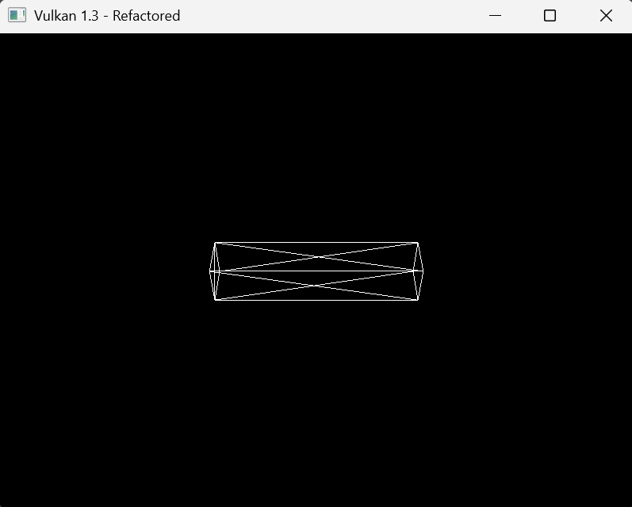
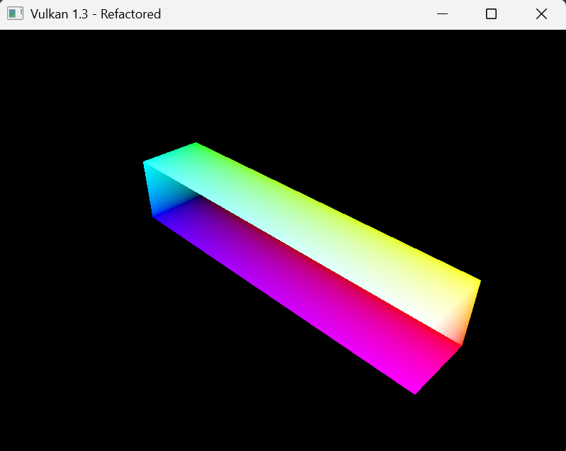
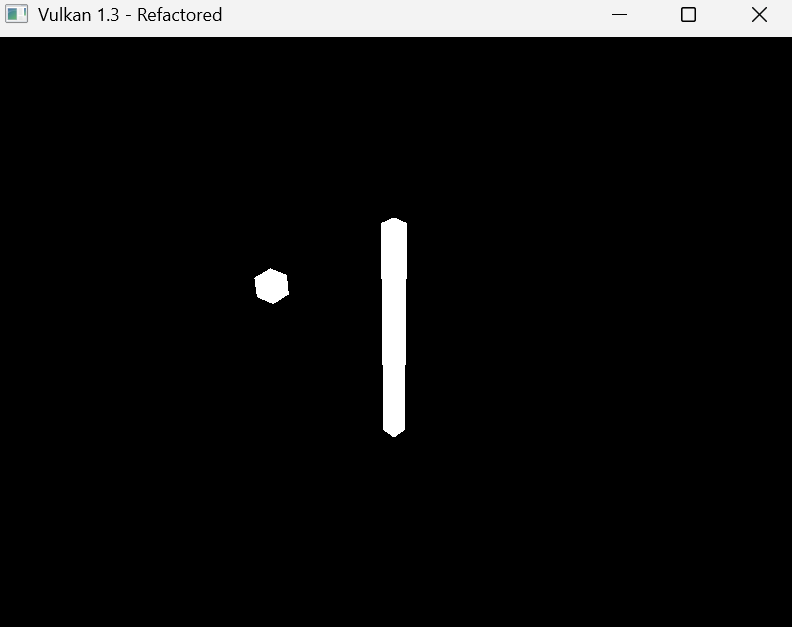
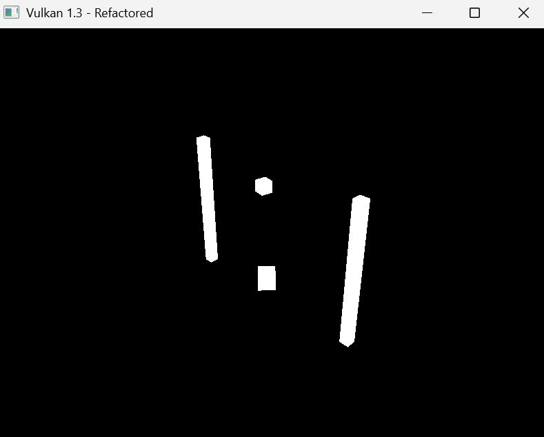
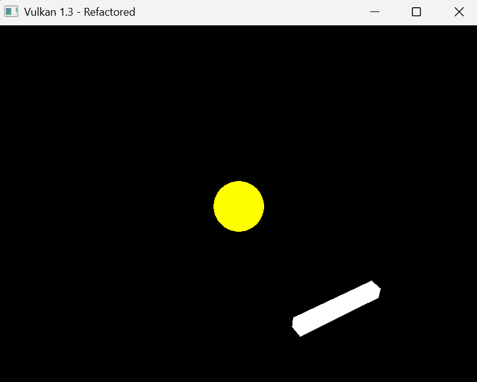
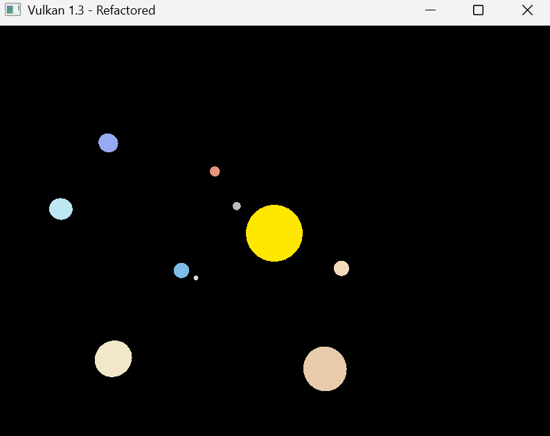
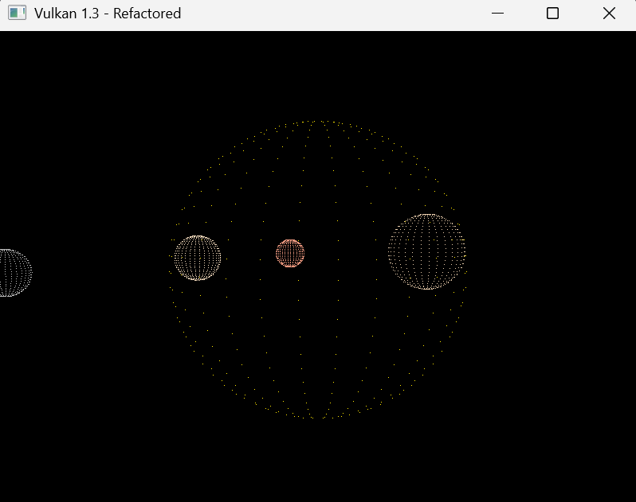

# Lab 3

## EXERCISE 1: BASIC SCALING TRANSFORMATION

Following on from last weeks lab, I dont actually have a `CreateCube()` method in my `GeometryGenerator` namespace so I first need to add that.

```cpp
MeshData createCube(float size, const glm::vec3& color) {
    MeshData meshData;

    float halfSize = size * 0.5f;

    meshData.vertices = {
        {{-halfSize, -halfSize, -halfSize}, color},
        {{ halfSize, -halfSize, -halfSize}, color},
        {{ halfSize,  halfSize, -halfSize}, color},
        {{-halfSize,  halfSize, -halfSize}, color},
        {{-halfSize, -halfSize,  halfSize}, color},
        {{ halfSize, -halfSize,  halfSize}, color},
        {{ halfSize,  halfSize,  halfSize}, color},
        {{-halfSize,  halfSize,  halfSize}, color}
    };

    meshData.indices = {
        0, 1, 2, 2, 3, 0,
        1, 5, 6, 6, 2, 1,
        5, 4, 7, 7, 6, 5,
        4, 0, 3, 3, 7, 4,
        3, 2, 6, 6, 7, 3,
        4, 5, 1, 1, 0, 4
    };

    return meshData;
}
```

Then we can just change the `LoadModel()` function to render this new cube transformed.

```cpp
void loadModel() {
    GeometryGenerator::MeshData cubeMesh = GeometryGenerator::createCube(1.0f, glm::vec3(1.0f, 1.0f, 1.0f));

    RenderObject cube;
    cube.vertices = cubeMesh.vertices;
    cube.indices = cubeMesh.indices;
    cube.transform = glm::scale(glm::mat4(1.0f), glm::vec3(2.5f, 0.5f, 0.5f));
    renderObjects.push_back(cube);

    std::vector<Vertex> allVertices;
    std::vector<uint32_t> allIndices;
    for (auto& obj : renderObjects) {
        uint32_t vertexOffset = static_cast<uint32_t>(allVertices.size());
        allVertices.insert(allVertices.end(), obj.vertices.begin(), obj.vertices.end());
        for (auto index : obj.indices) {
            allIndices.push_back(index + vertexOffset);
        }
    }
    vertices = allVertices;
    indices = allIndices;
}
```

This gives us this result:



However, this does not exactly match the brief because we are viewing the wireframe, so I added keybinds that let me switch between wirefram (1), fill (2), or point (3) mode. It does this by re-rendering the graphics pipeline on keypress. To implement this, I first needed to add a member variable to track the current polygon mode `VkPolygonMode currentPolygonMode = VK_POLYGON_MODE_FILL;`. Then I needed to enable `fillModeNonSolid` devie and update the device suitability check to ensure the GPU supports it `return indices.isComplete() && extensionsSupported && swapChainAdequate && supportedFeatures.fillModeNonSolid;`. Then, in the `createGraphicsPipeline()` function you change change the rasterizer to use the variable instead of a hardcoded value with `rasterizer.polygonMode = currentPolygonMode;`.

To make it work with keybinds, I registered a keyboard callback in `initWindow()` with `glfwSetKeyCallback(window, keyCallback);` which handles the key presses and triggers pipeline recreation:

```cpp
void HelloTriangleApplication::keyCallback(GLFWwindow* window, int key, int scancode, int action, int mods) {
    auto app = reinterpret_cast<HelloTriangleApplication*>(glfwGetWindowUserPointer(window));

    if (action == GLFW_PRESS) {
        if (key == GLFW_KEY_1) {
            app->currentPolygonMode = VK_POLYGON_MODE_FILL;
            app->recreateGraphicsPipeline();
            std::cout << "Switched to FILL mode" << std::endl;
        }
        else if (key == GLFW_KEY_2) {
            app->currentPolygonMode = VK_POLYGON_MODE_LINE;
            app->recreateGraphicsPipeline();
            std::cout << "Switched to WIREFRAME mode" << std::endl;
        }
        else if (key == GLFW_KEY_3) {
            app->currentPolygonMode = VK_POLYGON_MODE_POINT;
            app->recreateGraphicsPipeline();
            std::cout << "Switched to POINT mode" << std::endl;
        }
    }
}
```

Then of course you need the actual `recreateGraphicsPipeline()` function:

```cpp
void HelloTriangleApplication::recreateGraphicsPipeline() {
    vkDeviceWaitIdle(device);
    vkDestroyPipeline(device, graphicsPipeline, nullptr);
    createGraphicsPipeline();
    updateCommandBuffers();
}

void HelloTriangleApplication::updateCommandBuffers() {
    for (size_t i = 0; i < commandBuffers.size(); i++) {
        vkResetCommandBuffer(commandBuffers[i], 0);
        recordCommandBuffer(commandBuffers[i], i);
    }
}
```

Finally, to add some joyous depth perception we can assign colours based on the x, y, and z, values in `LoadModel()`:

```cpp
void loadModel() {
    GeometryGenerator::MeshData cubeMesh = GeometryGenerator::createCube(1.0f, glm::vec3(1.0f, 1.0f, 1.0f));

    for (auto& vertex : cubeMesh.vertices) {
        vertex.color = glm::vec3(
            (vertex.pos.x + 0.5f),
            (vertex.pos.y + 0.5f),
            (vertex.pos.z + 0.5f)
        );
    }

    RenderObject cube;
    cube.vertices = cubeMesh.vertices;
    cube.indices = cubeMesh.indices;
    cube.transform = glm::scale(glm::mat4(1.0f), glm::vec3(2.5f, 0.5f, 0.5f));
    renderObjects.push_back(cube);

    std::vector<Vertex> allVertices;
    std::vector<uint32_t> allIndices;
    for (auto& obj : renderObjects) {
        uint32_t vertexOffset = static_cast<uint32_t>(allVertices.size());
        allVertices.insert(allVertices.end(), obj.vertices.begin(), obj.vertices.end());
        for (auto index : obj.indices) {
            allIndices.push_back(index + vertexOffset);
        }
    }
    vertices = allVertices;
    indices = allIndices;
}
```

This is the results I got:



## EXERCISE 2: HIERARCHICAL TRANSFORMATIONS

For the single cube rotation, I modified `loadModel()` to create the pillar and the little cube:

```cpp
void loadModel() {
    GeometryGenerator::MeshData cubeMesh = GeometryGenerator::createCube(1.0f, glm::vec3(1.0f, 1.0f, 1.0f));

    RenderObject pillar;
    pillar.vertices = cubeMesh.vertices;
    pillar.indices = cubeMesh.indices;
    pillar.transform = glm::scale(glm::mat4(1.0f), glm::vec3(0.2f, 3.0f, 0.2f));
    renderObjects.push_back(pillar);

    RenderObject orbitingCube;
    orbitingCube.vertices = cubeMesh.vertices;
    orbitingCube.indices = cubeMesh.indices;
    orbitingCube.transform = glm::mat4(1.0f);
    renderObjects.push_back(orbitingCube);

    std::vector<Vertex> allVertices;
    std::vector<uint32_t> allIndices;
    for (auto& obj : renderObjects) {
        uint32_t vertexOffset = static_cast<uint32_t>(allVertices.size());
        allVertices.insert(allVertices.end(), obj.vertices.begin(), obj.vertices.end());
        for (auto index : obj.indices) {
            allIndices.push_back(index + vertexOffset);
        }
    }
    vertices = allVertices;
    indices = allIndices;
}
```

Then we are able to update the transformation of the little cube to orbit the pillar in `updateUniformBuffer()`.

```cpp
void HelloTriangleApplication::updateUniformBuffer(uint32_t currentImage) {
    static auto startTime = std::chrono::high_resolution_clock::now();
    auto currentTime = std::chrono::high_resolution_clock::now();
    float time = std::chrono::duration<float, std::chrono::seconds::period>(currentTime - startTime).count();

    renderObjects[1].transform = glm::rotate(glm::mat4(1.0f), time * glm::radians(90.0f), glm::vec3(0.0f, 1.0f, 0.0f))
        * glm::translate(glm::mat4(1.0f), glm::vec3(2.0f, 0.0f, 0.0f))
        * glm::scale(glm::mat4(1.0f), glm::vec3(0.3f, 0.3f, 0.3f));

    UniformBufferObject ubo{};
    ubo.view = glm::lookAt(glm::vec3(5.0f, 5.0f, 5.0f), glm::vec3(0.0f, 0.0f, 0.0f), glm::vec3(0.0f, 1.0f, 0.0f));
    ubo.proj = glm::perspective(glm::radians(45.0f), swapChainExtent.width / (float)swapChainExtent.height, 0.1f, 100.0f);
    ubo.proj[1][1] *= -1;

    memcpy(uniformBuffersMapped[currentImage], &ubo, sizeof(ubo));
}
```



It is a similar process to get two little cubes orbiting around two pillars, we just need to initialise more shapes in `loadModel()` and alter the cubes to no longer rotate at the origin, but instead to rotate at the pillars origins.

```cpp
void loadModel() {
    GeometryGenerator::MeshData cubeMesh = GeometryGenerator::createCube(1.0f, glm::vec3(1.0f, 1.0f, 1.0f));

    RenderObject pillar1;
    pillar1.vertices = cubeMesh.vertices;
    pillar1.indices = cubeMesh.indices;
    pillar1.transform = glm::translate(glm::mat4(1.0f), glm::vec3(-2.0f, 0.0f, 0.0f))
        * glm::scale(glm::mat4(1.0f), glm::vec3(0.2f, 3.0f, 0.2f));
    renderObjects.push_back(pillar1);

    RenderObject pillar2;
    pillar2.vertices = cubeMesh.vertices;
    pillar2.indices = cubeMesh.indices;
    pillar2.transform = glm::translate(glm::mat4(1.0f), glm::vec3(2.0f, 0.0f, 0.0f))
        * glm::scale(glm::mat4(1.0f), glm::vec3(0.2f, 3.0f, 0.2f));
    renderObjects.push_back(pillar2);

    RenderObject orbitingCube1;
    orbitingCube1.vertices = cubeMesh.vertices;
    orbitingCube1.indices = cubeMesh.indices;
    orbitingCube1.transform = glm::mat4(1.0f);
    renderObjects.push_back(orbitingCube1);

    RenderObject orbitingCube2;
    orbitingCube2.vertices = cubeMesh.vertices;
    orbitingCube2.indices = cubeMesh.indices;
    orbitingCube2.transform = glm::mat4(1.0f);
    renderObjects.push_back(orbitingCube2);

    std::vector<Vertex> allVertices;
    std::vector<uint32_t> allIndices;
    for (auto& obj : renderObjects) {
        uint32_t vertexOffset = static_cast<uint32_t>(allVertices.size());
        allVertices.insert(allVertices.end(), obj.vertices.begin(), obj.vertices.end());
        for (auto index : obj.indices) {
            allIndices.push_back(index + vertexOffset);
        }
    }
    vertices = allVertices;
    indices = allIndices;
}
```

The first cube rotates at 90 degrees/second whilst the second cube rotates at 120 degrees/second.

```cpp
void HelloTriangleApplication::updateUniformBuffer(uint32_t currentImage) {
    static auto startTime = std::chrono::high_resolution_clock::now();
    auto currentTime = std::chrono::high_resolution_clock::now();
    float time = std::chrono::duration<float, std::chrono::seconds::period>(currentTime - startTime).count();

    renderObjects[2].transform = glm::translate(glm::mat4(1.0f), glm::vec3(-2.0f, 0.0f, 0.0f))
        * glm::rotate(glm::mat4(1.0f), time * glm::radians(90.0f), glm::vec3(0.0f, 1.0f, 0.0f))
        * glm::translate(glm::mat4(1.0f), glm::vec3(1.5f, 0.0f, 0.0f))
        * glm::scale(glm::mat4(1.0f), glm::vec3(0.3f, 0.3f, 0.3f));

    renderObjects[3].transform = glm::translate(glm::mat4(1.0f), glm::vec3(2.0f, 0.0f, 0.0f))
        * glm::rotate(glm::mat4(1.0f), time * glm::radians(120.0f), glm::vec3(0.0f, 1.0f, 0.0f))
        * glm::translate(glm::mat4(1.0f), glm::vec3(1.5f, 0.0f, 0.0f))
        * glm::scale(glm::mat4(1.0f), glm::vec3(0.3f, 0.3f, 0.3f));

    UniformBufferObject ubo{};
    ubo.view = glm::lookAt(glm::vec3(6.0f, 5.0f, 6.0f), glm::vec3(0.0f, 0.0f, 0.0f), glm::vec3(0.0f, 1.0f, 0.0f));
    ubo.proj = glm::perspective(glm::radians(45.0f), swapChainExtent.width / (float)swapChainExtent.height, 0.1f, 100.0f);
    ubo.proj[1][1] *= -1;

    memcpy(uniformBuffersMapped[currentImage], &ubo, sizeof(ubo));
}
```

Each cubes transformation order goes: Translate to pillar -> rotate around pillar -> translate outward -> scale. Here are the results I get:



## Exercise 3: Advanced Rotation - Tangent to Path

The key difference with this exercise is we need to add an additional rotation that aligns the stick with the direction of travel. Since it is orbiting in a circle around the Y-axis, the tangent direction is perpendicular to the radius vector. All of this to say we just need to edit `loadModel()` and `updateUniformBuffer()` again.

We make two objects in `loadModel()` a yellow sphere at the origin, and a horizontally stretched cube.

```cpp
void loadModel() {
    GeometryGenerator::MeshData cubeMesh = GeometryGenerator::createCube(1.0f, glm::vec3(1.0f, 1.0f, 1.0f));
    GeometryGenerator::MeshData sphereMesh = GeometryGenerator::createSphere(0.5f, 30, 30, glm::vec3(1.0f, 1.0f, 0.0f));

    RenderObject centerSphere;
    centerSphere.vertices = sphereMesh.vertices;
    centerSphere.indices = sphereMesh.indices;
    centerSphere.transform = glm::mat4(1.0f);
    renderObjects.push_back(centerSphere);

    RenderObject orbitingStick;
    orbitingStick.vertices = cubeMesh.vertices;
    orbitingStick.indices = cubeMesh.indices;
    orbitingStick.transform = glm::mat4(1.0f);
    renderObjects.push_back(orbitingStick);

    std::vector<Vertex> allVertices;
    std::vector<uint32_t> allIndices;
    for (auto& obj : renderObjects) {
        uint32_t vertexOffset = static_cast<uint32_t>(allVertices.size());
        allVertices.insert(allVertices.end(), obj.vertices.begin(), obj.vertices.end());
        for (auto index : obj.indices) {
            allIndices.push_back(index + vertexOffset);
        }
    }
    vertices = allVertices;
    indices = allIndices;
}
```

For the `updateUniformBuffer()` the stick rotates 90 degrees/second around the orbit, with every frame there is a tranformation to 'face' the sphere.

```cpp
void HelloTriangleApplication::updateUniformBuffer(uint32_t currentImage) {
    static auto startTime = std::chrono::high_resolution_clock::now();
    auto currentTime = std::chrono::high_resolution_clock::now();
    float time = std::chrono::duration<float, std::chrono::seconds::period>(currentTime - startTime).count();

    float orbitAngle = time * glm::radians(90.0f);

    renderObjects[1].transform = glm::rotate(glm::mat4(1.0f), orbitAngle, glm::vec3(0.0f, 1.0f, 0.0f))
        * glm::translate(glm::mat4(1.0f), glm::vec3(3.0f, 0.0f, 0.0f))
        * glm::rotate(glm::mat4(1.0f), glm::radians(90.0f), glm::vec3(0.0f, 1.0f, 0.0f))
        * glm::scale(glm::mat4(1.0f), glm::vec3(1.5f, 0.2f, 0.2f));

    UniformBufferObject ubo{};
    ubo.view = glm::lookAt(glm::vec3(5.0f, 5.0f, 5.0f), glm::vec3(0.0f, 0.0f, 0.0f), glm::vec3(0.0f, 1.0f, 0.0f));
    ubo.proj = glm::perspective(glm::radians(45.0f), swapChainExtent.width / (float)swapChainExtent.height, 0.1f, 100.0f);
    ubo.proj[1][1] *= -1;

    memcpy(uniformBuffersMapped[currentImage], &ubo, sizeof(ubo));
}
```

These are the results:



## EXERCISE 4: ANIMATING A SOLAR SYSTEM

Because I was feeling confident (perhaps unjustly) I wanted to try and recreate the full solar system with all the planets and Earth's moon. Again, this just consisted of changing `loadModel()` to set up the models, then changing `updateUniformBuffer()` to animate them.

```cpp
void loadModel() {
    RenderObject sun;
    GeometryGenerator::MeshData sunMesh = GeometryGenerator::createSphere(1.0f, 30, 30, glm::vec3(1.0f, 0.8f, 0.0f));
    sun.vertices = sunMesh.vertices;
    sun.indices = sunMesh.indices;
    sun.transform = glm::mat4(1.0f);
    renderObjects.push_back(sun);

    RenderObject mercury;
    GeometryGenerator::MeshData mercuryMesh = GeometryGenerator::createSphere(1.0f, 30, 30, glm::vec3(0.5f, 0.5f, 0.5f));
    mercury.vertices = mercuryMesh.vertices;
    mercury.indices = mercuryMesh.indices;
    mercury.transform = glm::mat4(1.0f);
    renderObjects.push_back(mercury);

    RenderObject venus;
    GeometryGenerator::MeshData venusMesh = GeometryGenerator::createSphere(1.0f, 30, 30, glm::vec3(0.9f, 0.7f, 0.5f));
    venus.vertices = venusMesh.vertices;
    venus.indices = venusMesh.indices;
    venus.transform = glm::mat4(1.0f);
    renderObjects.push_back(venus);

    RenderObject earth;
    GeometryGenerator::MeshData earthMesh = GeometryGenerator::createSphere(1.0f, 30, 30, glm::vec3(0.2f, 0.5f, 0.8f));
    earth.vertices = earthMesh.vertices;
    earth.indices = earthMesh.indices;
    earth.transform = glm::mat4(1.0f);
    renderObjects.push_back(earth);

    RenderObject moon;
    GeometryGenerator::MeshData moonMesh = GeometryGenerator::createSphere(1.0f, 30, 30, glm::vec3(0.7f, 0.7f, 0.7f));
    moon.vertices = moonMesh.vertices;
    moon.indices = moonMesh.indices;
    moon.transform = glm::mat4(1.0f);
    renderObjects.push_back(moon);

    RenderObject mars;
    GeometryGenerator::MeshData marsMesh = GeometryGenerator::createSphere(1.0f, 30, 30, glm::vec3(0.8f, 0.3f, 0.2f));
    mars.vertices = marsMesh.vertices;
    mars.indices = marsMesh.indices;
    mars.transform = glm::mat4(1.0f);
    renderObjects.push_back(mars);

    RenderObject jupiter;
    GeometryGenerator::MeshData jupiterMesh = GeometryGenerator::createSphere(1.0f, 30, 30, glm::vec3(0.8f, 0.6f, 0.4f));
    jupiter.vertices = jupiterMesh.vertices;
    jupiter.indices = jupiterMesh.indices;
    jupiter.transform = glm::mat4(1.0f);
    renderObjects.push_back(jupiter);

    RenderObject saturn;
    GeometryGenerator::MeshData saturnMesh = GeometryGenerator::createSphere(1.0f, 30, 30, glm::vec3(0.9f, 0.8f, 0.6f));
    saturn.vertices = saturnMesh.vertices;
    saturn.indices = saturnMesh.indices;
    saturn.transform = glm::mat4(1.0f);
    renderObjects.push_back(saturn);

    RenderObject uranus;
    GeometryGenerator::MeshData uranusMesh = GeometryGenerator::createSphere(1.0f, 30, 30, glm::vec3(0.5f, 0.8f, 0.9f));
    uranus.vertices = uranusMesh.vertices;
    uranus.indices = uranusMesh.indices;
    uranus.transform = glm::mat4(1.0f);
    renderObjects.push_back(uranus);

    RenderObject neptune;
    GeometryGenerator::MeshData neptuneMesh = GeometryGenerator::createSphere(1.0f, 30, 30, glm::vec3(0.3f, 0.4f, 0.9f));
    neptune.vertices = neptuneMesh.vertices;
    neptune.indices = neptuneMesh.indices;
    neptune.transform = glm::mat4(1.0f);
    renderObjects.push_back(neptune);

    std::vector<Vertex> allVertices;
    std::vector<uint32_t> allIndices;
    for (auto& obj : renderObjects) {
        uint32_t vertexOffset = static_cast<uint32_t>(allVertices.size());
        allVertices.insert(allVertices.end(), obj.vertices.begin(), obj.vertices.end());
        for (auto index : obj.indices) {
            allIndices.push_back(index + vertexOffset);
        }
    }
    vertices = allVertices;
    indices = allIndices;
}
```

Most of the planets just orbit around the origin (where the Sun is) but the moon orbits around Earth.

```cpp
void HelloTriangleApplication::updateUniformBuffer(uint32_t currentImage) {
    static auto startTime = std::chrono::high_resolution_clock::now();
    auto currentTime = std::chrono::high_resolution_clock::now();
    float time = std::chrono::duration<float, std::chrono::seconds::period>(currentTime - startTime).count();

    renderObjects[0].transform = glm::scale(glm::mat4(1.0f), glm::vec3(2.0f, 2.0f, 2.0f));

    renderObjects[1].transform = glm::rotate(glm::mat4(1.0f), time * glm::radians(150.0f), glm::vec3(0.0f, 1.0f, 0.0f))
        * glm::translate(glm::mat4(1.0f), glm::vec3(4.0f, 0.0f, 0.0f))
        * glm::scale(glm::mat4(1.0f), glm::vec3(0.3f, 0.3f, 0.3f));

    renderObjects[2].transform = glm::rotate(glm::mat4(1.0f), time * glm::radians(120.0f), glm::vec3(0.0f, 1.0f, 0.0f))
        * glm::translate(glm::mat4(1.0f), glm::vec3(5.5f, 0.0f, 0.0f))
        * glm::scale(glm::mat4(1.0f), glm::vec3(0.5f, 0.5f, 0.5f));

    float earthOrbitAngle = time * glm::radians(100.0f);
    glm::mat4 earthTransform = glm::rotate(glm::mat4(1.0f), earthOrbitAngle, glm::vec3(0.0f, 1.0f, 0.0f))
        * glm::translate(glm::mat4(1.0f), glm::vec3(7.0f, 0.0f, 0.0f));

    renderObjects[3].transform = earthTransform * glm::scale(glm::mat4(1.0f), glm::vec3(0.5f, 0.5f, 0.5f));

    renderObjects[4].transform = earthTransform
        * glm::rotate(glm::mat4(1.0f), time * glm::radians(400.0f), glm::vec3(0.0f, 1.0f, 0.0f))
        * glm::translate(glm::mat4(1.0f), glm::vec3(1.2f, 0.0f, 0.0f))
        * glm::scale(glm::mat4(1.0f), glm::vec3(0.15f, 0.15f, 0.15f));

    renderObjects[5].transform = glm::rotate(glm::mat4(1.0f), time * glm::radians(85.0f), glm::vec3(0.0f, 1.0f, 0.0f))
        * glm::translate(glm::mat4(1.0f), glm::vec3(8.5f, 0.0f, 0.0f))
        * glm::scale(glm::mat4(1.0f), glm::vec3(0.4f, 0.4f, 0.4f));

    renderObjects[6].transform = glm::rotate(glm::mat4(1.0f), time * glm::radians(50.0f), glm::vec3(0.0f, 1.0f, 0.0f))
        * glm::translate(glm::mat4(1.0f), glm::vec3(11.0f, 0.0f, 0.0f))
        * glm::scale(glm::mat4(1.0f), glm::vec3(1.2f, 1.2f, 1.2f));

    renderObjects[7].transform = glm::rotate(glm::mat4(1.0f), time * glm::radians(40.0f), glm::vec3(0.0f, 1.0f, 0.0f))
        * glm::translate(glm::mat4(1.0f), glm::vec3(13.5f, 0.0f, 0.0f))
        * glm::scale(glm::mat4(1.0f), glm::vec3(1.0f, 1.0f, 1.0f));

    renderObjects[8].transform = glm::rotate(glm::mat4(1.0f), time * glm::radians(30.0f), glm::vec3(0.0f, 1.0f, 0.0f))
        * glm::translate(glm::mat4(1.0f), glm::vec3(16.0f, 0.0f, 0.0f))
        * glm::scale(glm::mat4(1.0f), glm::vec3(0.8f, 0.8f, 0.8f));

    renderObjects[9].transform = glm::rotate(glm::mat4(1.0f), time * glm::radians(25.0f), glm::vec3(0.0f, 1.0f, 0.0f))
        * glm::translate(glm::mat4(1.0f), glm::vec3(18.0f, 0.0f, 0.0f))
        * glm::scale(glm::mat4(1.0f), glm::vec3(0.8f, 0.8f, 0.8f));

    UniformBufferObject ubo{};
    ubo.view = glm::lookAt(glm::vec3(0.0f, 25.0f, 25.0f), glm::vec3(0.0f, 0.0f, 0.0f), glm::vec3(0.0f, 1.0f, 0.0f));
    ubo.proj = glm::perspective(glm::radians(45.0f), swapChainExtent.width / (float)swapChainExtent.height, 0.1f, 100.0f);
    ubo.proj[1][1] *= -1;

    memcpy(uniformBuffersMapped[currentImage], &ubo, sizeof(ubo));
}
```

This is the result I get:



## EXERCISE 5: FURTHER EXPLORATION

I wanted to add the ability to zoom in and out and rotate the camera by holding down right click. The main changes to make this happen is adding new member variables `cameraDistance`, `cameraAngleH`, `cameraAngleV` to control camera position, and `rightMousePressed`, `lastMouseX`, `lastMouseY` to track mouse state. Then we can create new callbacks, `mouseButtonCallback` to detect right-click press/release, `cursorPosCallback` to handle mouse movement for rotation, and `scrollCallback` to handle scroll wheel for zoom.

```cpp
void HelloTriangleApplication::mouseButtonCallback(GLFWwindow* window, int button, int action, int mods) {
    auto app = reinterpret_cast<HelloTriangleApplication*>(glfwGetWindowUserPointer(window));

    if (button == GLFW_MOUSE_BUTTON_RIGHT) {
        if (action == GLFW_PRESS) {
            app->rightMousePressed = true;
            glfwGetCursorPos(window, &app->lastMouseX, &app->lastMouseY);
        }
        else if (action == GLFW_RELEASE) {
            app->rightMousePressed = false;
        }
    }
}

void HelloTriangleApplication::cursorPosCallback(GLFWwindow* window, double xpos, double ypos) {
    auto app = reinterpret_cast<HelloTriangleApplication*>(glfwGetWindowUserPointer(window));

    if (app->rightMousePressed) {
        double deltaX = xpos - app->lastMouseX;
        double deltaY = ypos - app->lastMouseY;

        app->cameraAngleH += static_cast<float>(deltaX) * 0.005f;
        app->cameraAngleV += static_cast<float>(deltaY) * 0.005f;

        app->cameraAngleV = glm::clamp(app->cameraAngleV, -1.5f, 1.5f);

        app->lastMouseX = xpos;
        app->lastMouseY = ypos;
    }
}

void HelloTriangleApplication::scrollCallback(GLFWwindow* window, double xoffset, double yoffset) {
    auto app = reinterpret_cast<HelloTriangleApplication*>(glfwGetWindowUserPointer(window));

    app->cameraDistance -= static_cast<float>(yoffset) * 2.0f;
    app->cameraDistance = glm::clamp(app->cameraDistance, 5.0f, 100.0f);
}
```

Then in the `updateUniformBuffer()` we can update the camera calculation to use spherical coordinates to calculate camera position around the center, always looking at origin.

```cpp
void HelloTriangleApplication::updateUniformBuffer(uint32_t currentImage) {
    static auto startTime = std::chrono::high_resolution_clock::now();
    auto currentTime = std::chrono::high_resolution_clock::now();
    float time = std::chrono::duration<float, std::chrono::seconds::period>(currentTime - startTime).count();

    renderObjects[0].transform = glm::scale(glm::mat4(1.0f), glm::vec3(2.0f, 2.0f, 2.0f));

    renderObjects[1].transform = glm::rotate(glm::mat4(1.0f), time * glm::radians(150.0f), glm::vec3(0.0f, 1.0f, 0.0f))
        * glm::translate(glm::mat4(1.0f), glm::vec3(4.0f, 0.0f, 0.0f))
        * glm::scale(glm::mat4(1.0f), glm::vec3(0.3f, 0.3f, 0.3f));

    renderObjects[2].transform = glm::rotate(glm::mat4(1.0f), time * glm::radians(120.0f), glm::vec3(0.0f, 1.0f, 0.0f))
        * glm::translate(glm::mat4(1.0f), glm::vec3(5.5f, 0.0f, 0.0f))
        * glm::scale(glm::mat4(1.0f), glm::vec3(0.5f, 0.5f, 0.5f));

    float earthOrbitAngle = time * glm::radians(100.0f);
    glm::mat4 earthTransform = glm::rotate(glm::mat4(1.0f), earthOrbitAngle, glm::vec3(0.0f, 1.0f, 0.0f))
        * glm::translate(glm::mat4(1.0f), glm::vec3(7.0f, 0.0f, 0.0f));

    renderObjects[3].transform = earthTransform * glm::scale(glm::mat4(1.0f), glm::vec3(0.5f, 0.5f, 0.5f));

    renderObjects[4].transform = earthTransform
        * glm::rotate(glm::mat4(1.0f), time * glm::radians(400.0f), glm::vec3(0.0f, 1.0f, 0.0f))
        * glm::translate(glm::mat4(1.0f), glm::vec3(1.2f, 0.0f, 0.0f))
        * glm::scale(glm::mat4(1.0f), glm::vec3(0.15f, 0.15f, 0.15f));

    renderObjects[5].transform = glm::rotate(glm::mat4(1.0f), time * glm::radians(85.0f), glm::vec3(0.0f, 1.0f, 0.0f))
        * glm::translate(glm::mat4(1.0f), glm::vec3(8.5f, 0.0f, 0.0f))
        * glm::scale(glm::mat4(1.0f), glm::vec3(0.4f, 0.4f, 0.4f));

    renderObjects[6].transform = glm::rotate(glm::mat4(1.0f), time * glm::radians(50.0f), glm::vec3(0.0f, 1.0f, 0.0f))
        * glm::translate(glm::mat4(1.0f), glm::vec3(11.0f, 0.0f, 0.0f))
        * glm::scale(glm::mat4(1.0f), glm::vec3(1.2f, 1.2f, 1.2f));

    renderObjects[7].transform = glm::rotate(glm::mat4(1.0f), time * glm::radians(40.0f), glm::vec3(0.0f, 1.0f, 0.0f))
        * glm::translate(glm::mat4(1.0f), glm::vec3(13.5f, 0.0f, 0.0f))
        * glm::scale(glm::mat4(1.0f), glm::vec3(1.0f, 1.0f, 1.0f));

    renderObjects[8].transform = glm::rotate(glm::mat4(1.0f), time * glm::radians(30.0f), glm::vec3(0.0f, 1.0f, 0.0f))
        * glm::translate(glm::mat4(1.0f), glm::vec3(16.0f, 0.0f, 0.0f))
        * glm::scale(glm::mat4(1.0f), glm::vec3(0.8f, 0.8f, 0.8f));

    renderObjects[9].transform = glm::rotate(glm::mat4(1.0f), time * glm::radians(25.0f), glm::vec3(0.0f, 1.0f, 0.0f))
        * glm::translate(glm::mat4(1.0f), glm::vec3(18.0f, 0.0f, 0.0f))
        * glm::scale(glm::mat4(1.0f), glm::vec3(0.8f, 0.8f, 0.8f));

    float camX = cameraDistance * cos(cameraAngleV) * sin(cameraAngleH);
    float camY = cameraDistance * sin(cameraAngleV);
    float camZ = cameraDistance * cos(cameraAngleV) * cos(cameraAngleH);

    UniformBufferObject ubo{};
    ubo.view = glm::lookAt(glm::vec3(camX, camY, camZ), glm::vec3(0.0f, 0.0f, 0.0f), glm::vec3(0.0f, 1.0f, 0.0f));
    ubo.proj = glm::perspective(glm::radians(45.0f), swapChainExtent.width / (float)swapChainExtent.height, 0.1f, 100.0f);
    ubo.proj[1][1] *= -1;

    memcpy(uniformBuffersMapped[currentImage], &ubo, sizeof(ubo));
}
```

Here is an example of me zoomed in on the sun, with the camera positioned so you can see planets behind it.



## Lab 3 Reflection

I am very pleased with my results in this lab. Throughout it I have definitely furthered my knowledge with Vulkan programming and increased familiarity with graphics pipelines massively. I am very proud of my solar system and it is fun to watch it go around. I am happy with my keypresses to change the rendering mode, aswell as the camera controls. There is probably a much easier/more efficient way to do these things but nonetheless I am happy with the outcome and I do not doubt I will discover those better ways the more I progress through the course. I cant wait to further explore the different ways I can render objects and I am excited to jump into looking at moving the camera more like a player character with WASD movement. I know I still have a fair bit to go but I feel I am making good progress with things.
