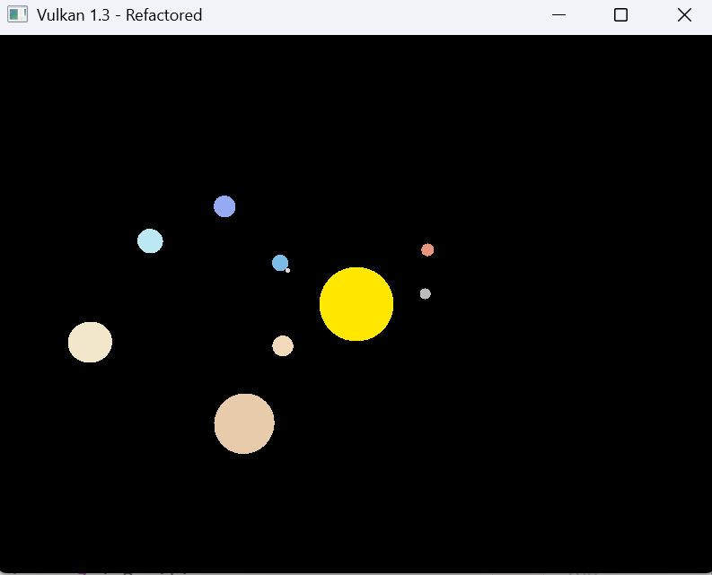
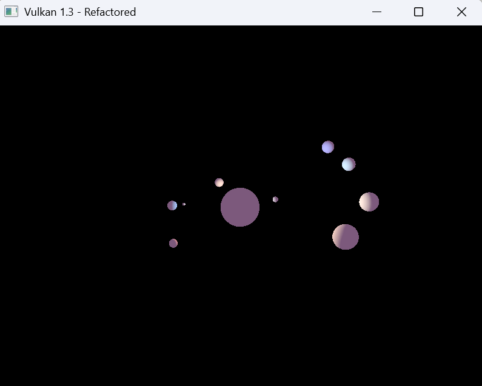
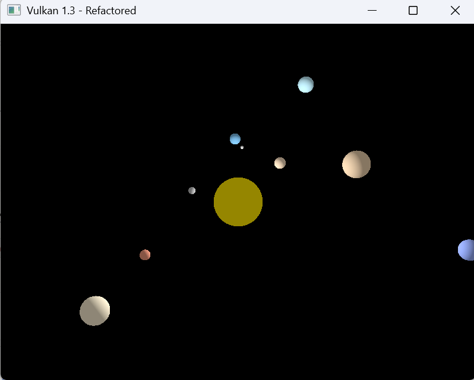
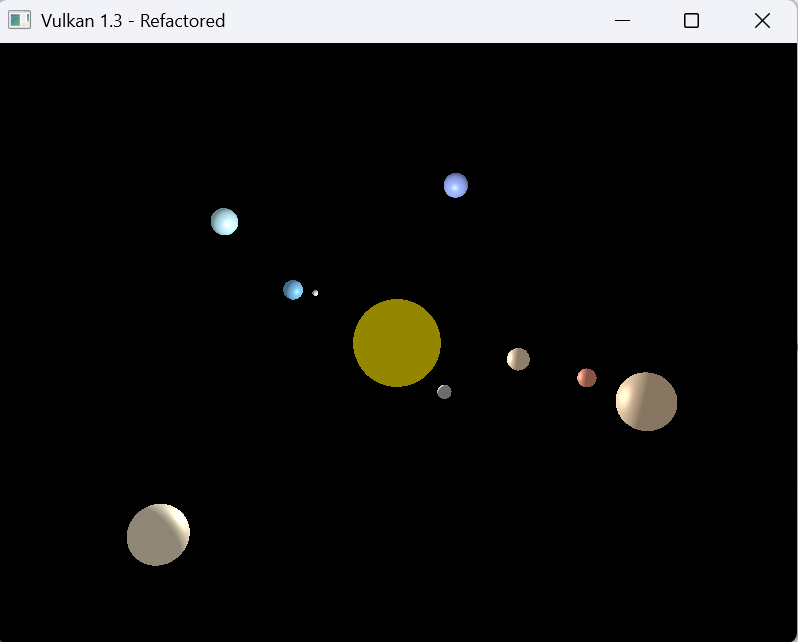
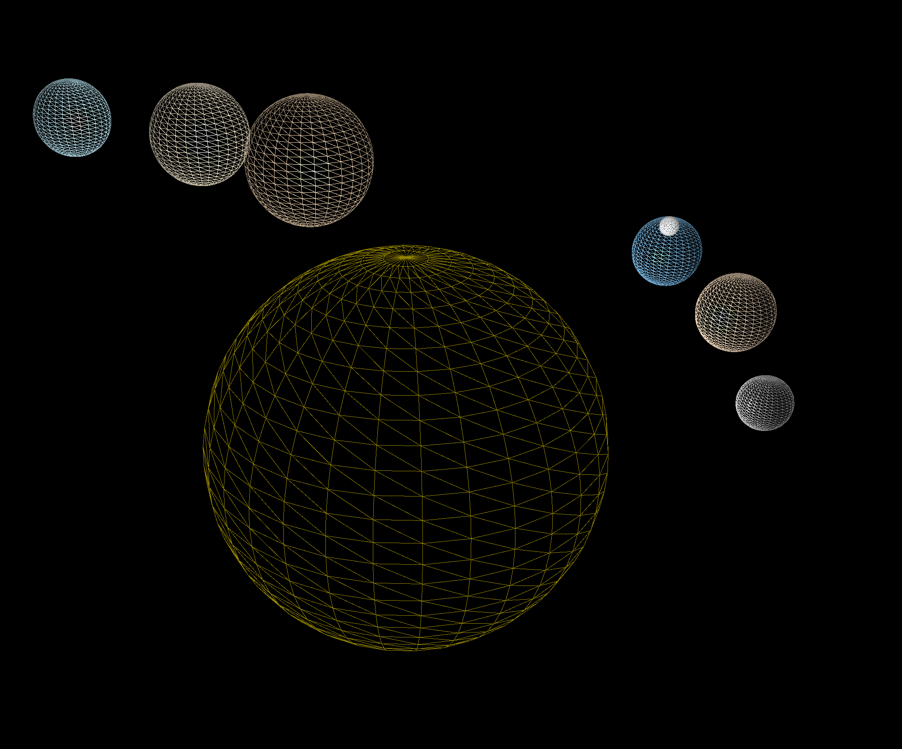
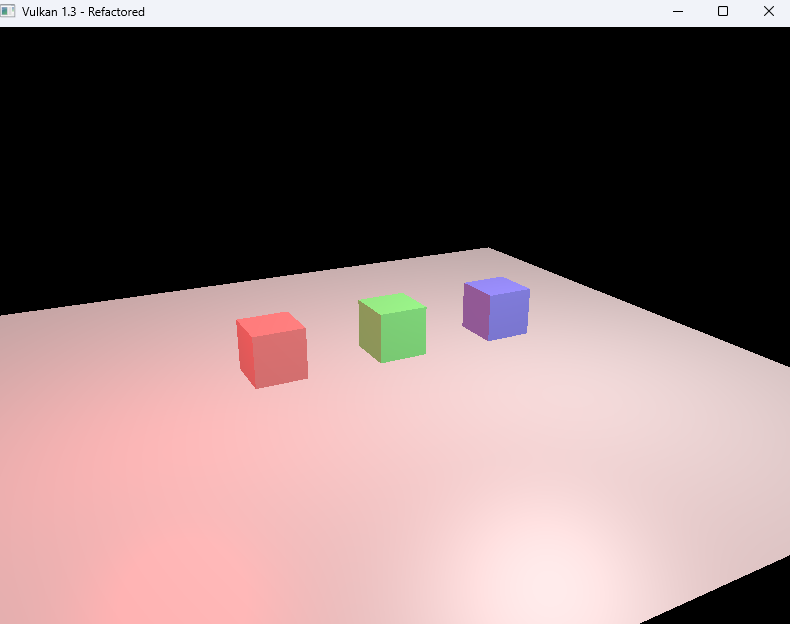

# Lab 4

## EXERCISE 1: PREPARING FOR LIGHTING

I want to work from the previous lab's solar system because I have gotten fairly attached to my little program. To prepare the scene for lighting properly, we need to define normals for our shapes that dictate the light. We can start by updating `UniformBufferObject` to add `lightPos` and `eyePos`:

```cpp
struct UniformBufferObject {
    alignas(16) glm::mat4 view;
    alignas(16) glm::mat4 proj;
    alignas(16) glm::vec3 lightPos;
    alignas(16) glm::vec3 eyePos;
};
```

Then we have to change the functios in the `GeometryGenerator` to calculate and assign proper normals. For grids/terrain the normals point upward (0,1,0). For cylinders, normals on sides point radially outward, and the top/bottom point up/down. For cubes, we can simply make normals the face normals. For spheres (which is what I will demonstrate with in the next exercise), normals point outward from the center. 

```cpp
MeshData createSphere(float radius, uint32_t sliceCount, uint32_t stackCount, const glm::vec3& color) {
    MeshData meshData;

    Vertex topVertex;
    topVertex.pos = glm::vec3(0.0f, radius, 0.0f);
    topVertex.color = color;
    topVertex.normal = glm::vec3(0.0f, 1.0f, 0.0f);
    meshData.vertices.push_back(topVertex);

    float phiStep = static_cast<float>(M_PI) / stackCount;
    float thetaStep = 2.0f * static_cast<float>(M_PI) / sliceCount;

    for (uint32_t i = 1; i <= stackCount - 1; ++i) {
        float phi = i * phiStep;
        for (uint32_t j = 0; j <= sliceCount; ++j) {
            float theta = j * thetaStep;

            Vertex v;
            v.pos.x = radius * sinf(phi) * cosf(theta);
            v.pos.y = radius * cosf(phi);
            v.pos.z = radius * sinf(phi) * sinf(theta);
            v.color = color;
            v.normal = glm::normalize(v.pos);

            meshData.vertices.push_back(v);
        }
    }

    Vertex bottomVertex;
    bottomVertex.pos = glm::vec3(0.0f, -radius, 0.0f);
    bottomVertex.color = color;
    bottomVertex.normal = glm::vec3(0.0f, -1.0f, 0.0f);
    meshData.vertices.push_back(bottomVertex);

    for (uint32_t i = 1; i <= sliceCount; ++i) {
        meshData.indices.push_back(0);
        meshData.indices.push_back(i + 1);
        meshData.indices.push_back(i);
    }

    uint32_t baseIndex = 1;
    uint32_t ringVertexCount = sliceCount + 1;
    for (uint32_t i = 0; i < stackCount - 2; ++i) {
        for (uint32_t j = 0; j < sliceCount; ++j) {
            meshData.indices.push_back(baseIndex + i * ringVertexCount + j);
            meshData.indices.push_back(baseIndex + i * ringVertexCount + j + 1);
            meshData.indices.push_back(baseIndex + (i + 1) * ringVertexCount + j);

            meshData.indices.push_back(baseIndex + (i + 1) * ringVertexCount + j);
            meshData.indices.push_back(baseIndex + i * ringVertexCount + j + 1);
            meshData.indices.push_back(baseIndex + (i + 1) * ringVertexCount + j + 1);
        }
    }

    uint32_t southPoleIndex = (uint32_t)meshData.vertices.size() - 1;
    baseIndex = southPoleIndex - ringVertexCount;
    for (uint32_t i = 0; i < sliceCount; ++i) {
        meshData.indices.push_back(southPoleIndex);
        meshData.indices.push_back(baseIndex + i);
        meshData.indices.push_back(baseIndex + i + 1);
    }

    return meshData;
}
```

Then we can simply update `updateUniformBuffer()` to set `lightPos` at sun's center (0,0,0) and `eyePos` to camera position:

```cpp
oid HelloTriangleApplication::updateUniformBuffer(uint32_t currentImage) {
    static auto startTime = std::chrono::high_resolution_clock::now();
    auto currentTime = std::chrono::high_resolution_clock::now();
    float time = std::chrono::duration<float, std::chrono::seconds::period>(currentTime - startTime).count();

    renderObjects[0].transform = glm::scale(glm::mat4(1.0f), glm::vec3(2.0f, 2.0f, 2.0f));

    renderObjects[1].transform = glm::rotate(glm::mat4(1.0f), time * glm::radians(150.0f), glm::vec3(0.0f, 1.0f, 0.0f))
        * glm::translate(glm::mat4(1.0f), glm::vec3(4.0f, 0.0f, 0.0f))
        * glm::scale(glm::mat4(1.0f), glm::vec3(0.3f, 0.3f, 0.3f));

    renderObjects[2].transform = glm::rotate(glm::mat4(1.0f), time * glm::radians(120.0f), glm::vec3(0.0f, 1.0f, 0.0f))
        * glm::translate(glm::mat4(1.0f), glm::vec3(5.5f, 0.0f, 0.0f))
        * glm::scale(glm::mat4(1.0f), glm::vec3(0.5f, 0.5f, 0.5f));

    float earthOrbitAngle = time * glm::radians(100.0f);
    glm::mat4 earthTransform = glm::rotate(glm::mat4(1.0f), earthOrbitAngle, glm::vec3(0.0f, 1.0f, 0.0f))
        * glm::translate(glm::mat4(1.0f), glm::vec3(7.0f, 0.0f, 0.0f));

    renderObjects[3].transform = earthTransform * glm::scale(glm::mat4(1.0f), glm::vec3(0.5f, 0.5f, 0.5f));

    renderObjects[4].transform = earthTransform
        * glm::rotate(glm::mat4(1.0f), time * glm::radians(400.0f), glm::vec3(0.0f, 1.0f, 0.0f))
        * glm::translate(glm::mat4(1.0f), glm::vec3(1.2f, 0.0f, 0.0f))
        * glm::scale(glm::mat4(1.0f), glm::vec3(0.15f, 0.15f, 0.15f));

    renderObjects[5].transform = glm::rotate(glm::mat4(1.0f), time * glm::radians(85.0f), glm::vec3(0.0f, 1.0f, 0.0f))
        * glm::translate(glm::mat4(1.0f), glm::vec3(8.5f, 0.0f, 0.0f))
        * glm::scale(glm::mat4(1.0f), glm::vec3(0.4f, 0.4f, 0.4f));

    renderObjects[6].transform = glm::rotate(glm::mat4(1.0f), time * glm::radians(50.0f), glm::vec3(0.0f, 1.0f, 0.0f))
        * glm::translate(glm::mat4(1.0f), glm::vec3(11.0f, 0.0f, 0.0f))
        * glm::scale(glm::mat4(1.0f), glm::vec3(1.2f, 1.2f, 1.2f));

    renderObjects[7].transform = glm::rotate(glm::mat4(1.0f), time * glm::radians(40.0f), glm::vec3(0.0f, 1.0f, 0.0f))
        * glm::translate(glm::mat4(1.0f), glm::vec3(13.5f, 0.0f, 0.0f))
        * glm::scale(glm::mat4(1.0f), glm::vec3(1.0f, 1.0f, 1.0f));

    renderObjects[8].transform = glm::rotate(glm::mat4(1.0f), time * glm::radians(30.0f), glm::vec3(0.0f, 1.0f, 0.0f))
        * glm::translate(glm::mat4(1.0f), glm::vec3(16.0f, 0.0f, 0.0f))
        * glm::scale(glm::mat4(1.0f), glm::vec3(0.8f, 0.8f, 0.8f));

    renderObjects[9].transform = glm::rotate(glm::mat4(1.0f), time * glm::radians(25.0f), glm::vec3(0.0f, 1.0f, 0.0f))
        * glm::translate(glm::mat4(1.0f), glm::vec3(18.0f, 0.0f, 0.0f))
        * glm::scale(glm::mat4(1.0f), glm::vec3(0.8f, 0.8f, 0.8f));

    float camX = cameraDistance * cos(cameraAngleV) * sin(cameraAngleH);
    float camY = cameraDistance * sin(cameraAngleV);
    float camZ = cameraDistance * cos(cameraAngleV) * cos(cameraAngleH);

    UniformBufferObject ubo{};
    ubo.view = glm::lookAt(glm::vec3(camX, camY, camZ), glm::vec3(0.0f, 0.0f, 0.0f), glm::vec3(0.0f, 1.0f, 0.0f));
    ubo.proj = glm::perspective(glm::radians(45.0f), swapChainExtent.width / (float)swapChainExtent.height, 0.1f, 100.0f);
    ubo.proj[1][1] *= -1;
    ubo.lightPos = glm::vec3(0.0f, 0.0f, 0.0f);
    ubo.eyePos = glm::vec3(camX, camY, camZ);

    memcpy(uniformBuffersMapped[currentImage], &ubo, sizeof(ubo));
}
```

There is no visual change because we have not started actually implementing the lighting system.



## EXERCISE 2: PER-VERTEX DIFFUSE LIGHTING

We can simply update the vertex shader `shader.vert` to update the lighting. The provided lab code assumes everything is in the UBO, while my existing architecture uses push constants for per-object model matrices, so there is a slight discrepency in approach. Furthermore, I did not want to use pure white as the diffuse material, instead using `inColor` retains the per-planet colour while still recieving proper lighting.

```cpp
#version 450

layout(binding = 0) uniform UniformBufferObject {
    mat4 view;
    mat4 proj;
    vec3 lightPos;
    vec3 eyePos;
} ubo;

layout(push_constant) uniform PushConstants {
    mat4 model;
} pushConstants;

layout(location = 0) in vec3 inPosition;
layout(location = 1) in vec3 inColor;
layout(location = 2) in vec3 inNormal;

layout(location = 0) out vec3 fragColor;

void main() {
    vec3 worldPos = (pushConstants.model * vec4(inPosition, 1.0)).xyz;
    vec3 worldNormal = mat3(transpose(inverse(pushConstants.model))) * inNormal;
    
    vec3 lightColor = vec3(1.0, 1.0, 1.0);
    vec3 ambientMaterial = vec3(0.2, 0.1, 0.2);
    
    vec3 norm = normalize(worldNormal);
    vec3 lightDir = normalize(ubo.lightPos - worldPos);
    float diff = max(dot(norm, lightDir), 0.0);
    vec3 diffuse = diff * lightColor;
    
    vec3 diffMaterial = inColor;
    fragColor = ambientMaterial * lightColor;
    fragColor += diffMaterial * diffuse;
    
    gl_Position = ubo.proj * ubo.view * vec4(worldPos, 1.0);
}
```

This is what our solar system looks like under per-vertext diffuse lighting:



## EXERCISE 3: PER-FRAGMENT DIFFUSE LIGHTING

To update my solar system to use per-fragment diffuse lighting instead, we need to update `shader.vert` to pass the data  to the fragment shader instead of calculating lighting, passing `fragColor`, `fragWorldPos`, and `fragWorldNormal`.

```cpp
#version 450

layout(binding = 0) uniform UniformBufferObject {
    mat4 view;
    mat4 proj;
    vec3 lightPos;
    vec3 eyePos;
} ubo;

layout(push_constant) uniform PushConstants {
    mat4 model;
} pushConstants;

layout(location = 0) in vec3 inPosition;
layout(location = 1) in vec3 inColor;
layout(location = 2) in vec3 inNormal;

layout(location = 0) out vec3 fragColor;
layout(location = 1) out vec3 fragWorldPos;
layout(location = 2) out vec3 fragWorldNormal;

void main() {
    fragWorldPos = (pushConstants.model * vec4(inPosition, 1.0)).xyz;
    fragWorldNormal = mat3(transpose(inverse(pushConstants.model))) * inNormal;
    fragColor = inColor;
    
    gl_Position = ubo.proj * ubo.view * vec4(fragWorldPos, 1.0);
}
```

Then, `shader.frag` now performs the lighting calculation for every pixel. I also opted for the shadow colour to be a darker version of the base colour so it looks a bit prettier.

```cpp
#version 450

layout(binding = 0) uniform UniformBufferObject {
    mat4 view;
    mat4 proj;
    vec3 lightPos;
    vec3 eyePos;
} ubo;

layout(location = 0) in vec3 fragColor;
layout(location = 1) in vec3 fragWorldPos;
layout(location = 2) in vec3 fragWorldNormal;

layout(location = 0) out vec4 outColor;

void main() {
    vec3 lightColor = vec3(1.0, 1.0, 1.0);
    float ambientStrength = 0.3;
    vec3 ambient = ambientStrength * fragColor;
    
    vec3 norm = normalize(fragWorldNormal);
    vec3 lightDir = normalize(ubo.lightPos - fragWorldPos);
    float diff = max(dot(norm, lightDir), 0.0);
    vec3 diffuse = diff * fragColor * lightColor;
    
    vec3 finalColor = ambient + diffuse;
    
    outColor = vec4(finalColor, 1.0);
}
```

These are the results, personally I was not able to see much of a difference because of the limited size of the spheres, but nevertheless it was pretty cool. 



## EXERCISE 4:ADDING PER-VERTEX SPECULAR LIGHTING

To start, we need to revert the fragment shader `shader.frag` to its previous version, then we can edit our vertext shader `shader.vert` to include specular highlights. I opted for a lower shininess value so the highlight is more broad. Furthermore, the highlight colour is a brighter version of the base colour.

```cpp
#version 450

layout(binding = 0) uniform UniformBufferObject {
    mat4 view;
    mat4 proj;
    vec3 lightPos;
    vec3 eyePos;
} ubo;

layout(push_constant) uniform PushConstants {
    mat4 model;
} pushConstants;

layout(location = 0) in vec3 inPosition;
layout(location = 1) in vec3 inColor;
layout(location = 2) in vec3 inNormal;

layout(location = 0) out vec3 fragColor;

void main() {
    vec3 worldPos = (pushConstants.model * vec4(inPosition, 1.0)).xyz;
    vec3 worldNormal = mat3(transpose(inverse(pushConstants.model))) * inNormal;
    
    vec3 lightColor = vec3(1.0, 1.0, 1.0);
    float ambientStrength = 0.3;
    vec3 ambient = ambientStrength * inColor;
    
    vec3 norm = normalize(worldNormal);
    vec3 lightDir = normalize(ubo.lightPos - worldPos);
    float diff = max(dot(norm, lightDir), 0.0);
    vec3 diffuse = diff * inColor * lightColor;
    
    vec3 viewDir = normalize(ubo.eyePos - worldPos);
    vec3 reflectDir = normalize(reflect(-lightDir, norm));
    float shininess = 8.0;
    float spec = pow(max(dot(reflectDir, viewDir), 0.0), shininess);
    vec3 specular = spec * inColor * lightColor;
    
    fragColor = ambient + diffuse + specular;
    
    gl_Position = ubo.proj * ubo.view * vec4(worldPos, 1.0);
}
```

This is the results on my solar system.


## EXERCISE 5:ADDING PER-FRAGMENT SPECULAR LIGHTING

To achieve this, we can use the code from exercise 3 and simply add specular highlights. Again, changing `shader.vert` to pass the necessary parameters:

```cpp
#version 450

layout(binding = 0) uniform UniformBufferObject {
    mat4 view;
    mat4 proj;
    vec3 lightPos;
    vec3 eyePos;
} ubo;

layout(push_constant) uniform PushConstants {
    mat4 model;
} pushConstants;

layout(location = 0) in vec3 inPosition;
layout(location = 1) in vec3 inColor;
layout(location = 2) in vec3 inNormal;

layout(location = 0) out vec3 fragColor;
layout(location = 1) out vec3 fragWorldPos;
layout(location = 2) out vec3 fragWorldNormal;

void main() {
    fragWorldPos = (pushConstants.model * vec4(inPosition, 1.0)).xyz;
    fragWorldNormal = mat3(transpose(inverse(pushConstants.model))) * inNormal;
    fragColor = inColor;
    
    gl_Position = ubo.proj * ubo.view * vec4(fragWorldPos, 1.0);
}
```

Then updating `shader.frag` to calculate the lighting with specular highlights:

```cpp
#version 450

layout(binding = 0) uniform UniformBufferObject {
    mat4 view;
    mat4 proj;
    vec3 lightPos;
    vec3 eyePos;
} ubo;

layout(location = 0) in vec3 fragColor;
layout(location = 1) in vec3 fragWorldPos;
layout(location = 2) in vec3 fragWorldNormal;

layout(location = 0) out vec4 outColor;

void main() {
    vec3 lightColor = vec3(1.0, 1.0, 1.0);
    float ambientStrength = 0.3;
    vec3 ambient = ambientStrength * fragColor;
    
    vec3 norm = normalize(fragWorldNormal);
    vec3 lightDir = normalize(ubo.lightPos - fragWorldPos);
    float diff = max(dot(norm, lightDir), 0.0);
    vec3 diffuse = diff * fragColor * lightColor;
    
    vec3 viewDir = normalize(ubo.eyePos - fragWorldPos);
    vec3 reflectDir = normalize(reflect(-lightDir, norm));
    float shininess = 8.0;
    float spec = pow(max(dot(reflectDir, viewDir), 0.0), shininess);
    vec3 specular = spec * fragColor * lightColor;
    
    vec3 finalColor = ambient + diffuse + specular;
    
    outColor = vec4(finalColor, 1.0);
}
```

These are the results on my solar system:



Because of the scene, it may be difficult to actually tell if it is properly applying per-vertex versus per-fragment, but throughout the lab, I have been checking by changing the rendering mode to wireframe with my keybinds.



## EXERCISE 6: MULTIPLE LIGHTS AND MATERIALS

We first have to update the uniform buffer object to include multiple lights.

```cpp
struct UniformBufferObject {
    alignas(16) glm::mat4 view;
    alignas(16) glm::mat4 proj;
    alignas(16) glm::vec3 light1Pos;
    alignas(16) glm::vec3 light1Color;
    alignas(16) glm::vec3 light2Pos;
    alignas(16) glm::vec3 light2Color;
    alignas(16) glm::vec3 eyePos;
};
```

Then, because we want each cube to have its own material, we need to add a `Material` struct, and update the `RenderObject` struct to include it:

```cpp
struct Material {
    glm::vec3 ambient;
    glm::vec3 diffuse;
    glm::vec3 specular;
    float shininess;
};

struct RenderObject {
    std::vector<Vertex> vertices;
    std::vector<uint32_t> indices;
    glm::mat4 transform;
    Material material;
};
```

Then we can change the `loadModel()` function to add our 3 cubes, aswell as a plane so we can better see the red light moving. This is also where we will be assigning materials, shiny red, normal green, and matte blue.

```cpp
void loadModel() {
    RenderObject plane;
    GeometryGenerator::MeshData planeMesh = GeometryGenerator::createGrid(30.0f, 30.0f, 2, 2, glm::vec3(0.5f, 0.5f, 0.5f));
    plane.vertices = planeMesh.vertices;
    plane.indices = planeMesh.indices;
    plane.transform = glm::translate(glm::mat4(1.0f), glm::vec3(0.0f, -2.0f, 0.0f));
    plane.material.ambient = glm::vec3(0.2f, 0.2f, 0.2f);
    plane.material.diffuse = glm::vec3(0.5f, 0.5f, 0.5f);
    plane.material.specular = glm::vec3(0.3f, 0.3f, 0.3f);
    plane.material.shininess = 16.0f;
    renderObjects.push_back(plane);

    RenderObject cube1;
    GeometryGenerator::MeshData cube1Mesh = GeometryGenerator::createCube(2.0f, glm::vec3(0.8f, 0.2f, 0.2f));
    cube1.vertices = cube1Mesh.vertices;
    cube1.indices = cube1Mesh.indices;
    cube1.transform = glm::mat4(1.0f);
    cube1.material.ambient = glm::vec3(0.3f, 0.1f, 0.1f);
    cube1.material.diffuse = glm::vec3(0.8f, 0.2f, 0.2f);
    cube1.material.specular = glm::vec3(1.0f, 1.0f, 1.0f);
    cube1.material.shininess = 128.0f;
    renderObjects.push_back(cube1);

    RenderObject cube2;
    GeometryGenerator::MeshData cube2Mesh = GeometryGenerator::createCube(2.0f, glm::vec3(0.2f, 0.8f, 0.2f));
    cube2.vertices = cube2Mesh.vertices;
    cube2.indices = cube2Mesh.indices;
    cube2.transform = glm::mat4(1.0f);
    cube2.material.ambient = glm::vec3(0.1f, 0.3f, 0.1f);
    cube2.material.diffuse = glm::vec3(0.2f, 0.8f, 0.2f);
    cube2.material.specular = glm::vec3(0.5f, 0.5f, 0.5f);
    cube2.material.shininess = 32.0f;
    renderObjects.push_back(cube2);

    RenderObject cube3;
    GeometryGenerator::MeshData cube3Mesh = GeometryGenerator::createCube(2.0f, glm::vec3(0.2f, 0.2f, 0.8f));
    cube3.vertices = cube3Mesh.vertices;
    cube3.indices = cube3Mesh.indices;
    cube3.transform = glm::mat4(1.0f);
    cube3.material.ambient = glm::vec3(0.1f, 0.1f, 0.3f);
    cube3.material.diffuse = glm::vec3(0.2f, 0.2f, 0.8f);
    cube3.material.specular = glm::vec3(0.2f, 0.2f, 0.2f);
    cube3.material.shininess = 8.0f;
    renderObjects.push_back(cube3);

    std::vector<Vertex> allVertices;
    std::vector<uint32_t> allIndices;
    for (auto& obj : renderObjects) {
        uint32_t vertexOffset = static_cast<uint32_t>(allVertices.size());
        allVertices.insert(allVertices.end(), obj.vertices.begin(), obj.vertices.end());
        for (auto index : obj.indices) {
            allIndices.push_back(index + vertexOffset);
        }
    }
    vertices = allVertices;
    indices = allIndices;
}
```

We can now update our `updateUniformBuffer()` function to position the cubes and animate the lights.

```cpp
void HelloTriangleApplication::updateUniformBuffer(uint32_t currentImage) {
    static auto startTime = std::chrono::high_resolution_clock::now();
    auto currentTime = std::chrono::high_resolution_clock::now();
    float time = std::chrono::duration<float, std::chrono::seconds::period>(currentTime - startTime).count();

    renderObjects[0].transform = glm::translate(glm::mat4(1.0f), glm::vec3(0.0f, -2.0f, 0.0f));
    renderObjects[1].transform = glm::translate(glm::mat4(1.0f), glm::vec3(-5.0f, 0.0f, 0.0f));
    renderObjects[2].transform = glm::translate(glm::mat4(1.0f), glm::vec3(0.0f, 0.0f, 0.0f));
    renderObjects[3].transform = glm::translate(glm::mat4(1.0f), glm::vec3(5.0f, 0.0f, 0.0f));

    float camX = cameraDistance * cos(cameraAngleV) * sin(cameraAngleH);
    float camY = cameraDistance * sin(cameraAngleV);
    float camZ = cameraDistance * cos(cameraAngleV) * cos(cameraAngleH);

    float redLightAngle = time * glm::radians(90.0f);
    float redLightRadius = 10.0f;

    UniformBufferObject ubo{};
    ubo.view = glm::lookAt(glm::vec3(camX, camY, camZ), glm::vec3(0.0f, 0.0f, 0.0f), glm::vec3(0.0f, 1.0f, 0.0f));
    ubo.proj = glm::perspective(glm::radians(45.0f), swapChainExtent.width / (float)swapChainExtent.height, 0.1f, 100.0f);
    ubo.proj[1][1] *= -1;

    ubo.light1Pos = glm::vec3(5.0f, 8.0f, 5.0f);
    ubo.light1Color = glm::vec3(1.0f, 1.0f, 1.0f);

    ubo.light2Pos = glm::vec3(redLightRadius * cos(redLightAngle), 5.0f, redLightRadius * sin(redLightAngle));
    ubo.light2Color = glm::vec3(1.0f, 0.0f, 0.0f);

    ubo.eyePos = glm::vec3(camX, camY, camZ);

    memcpy(uniformBuffersMapped[currentImage], &ubo, sizeof(ubo));
}
```

Now we can edit the vertex shader `shader.vert` to process and pass the data to `shader.frag`, including the new material data we initalised.

```cpp
#version 450

layout(binding = 0) uniform UniformBufferObject {
    mat4 view;
    mat4 proj;
    vec3 light1Pos;
    vec3 light1Color;
    vec3 light2Pos;
    vec3 light2Color;
    vec3 eyePos;
} ubo;

layout(push_constant) uniform PushConstants {
    mat4 model;
    vec3 ambient;
    float padding1;
    vec3 diffuse;
    float padding2;
    vec3 specular;
    float shininess;
} pushConstants;

layout(location = 0) in vec3 inPosition;
layout(location = 1) in vec3 inColor;
layout(location = 2) in vec3 inNormal;

layout(location = 0) out vec3 fragColor;
layout(location = 1) out vec3 fragWorldPos;
layout(location = 2) out vec3 fragWorldNormal;
layout(location = 3) out vec3 fragAmbient;
layout(location = 4) out vec3 fragDiffuse;
layout(location = 5) out vec3 fragSpecular;
layout(location = 6) out float fragShininess;

void main() {
    fragWorldPos = (pushConstants.model * vec4(inPosition, 1.0)).xyz;
    fragWorldNormal = mat3(transpose(inverse(pushConstants.model))) * inNormal;
    fragColor = inColor;
    fragAmbient = pushConstants.ambient;
    fragDiffuse = pushConstants.diffuse;
    fragSpecular = pushConstants.specular;
    fragShininess = pushConstants.shininess;
    
    gl_Position = ubo.proj * ubo.view * vec4(fragWorldPos, 1.0);
}
```

Finally, `shader.frag` recieves the data from `shader.vert` and calculates the lighting appropriately.

```cpp
#version 450

layout(binding = 0) uniform UniformBufferObject {
    mat4 view;
    mat4 proj;
    vec3 light1Pos;
    vec3 light1Color;
    vec3 light2Pos;
    vec3 light2Color;
    vec3 eyePos;
} ubo;

layout(location = 0) in vec3 fragColor;
layout(location = 1) in vec3 fragWorldPos;
layout(location = 2) in vec3 fragWorldNormal;
layout(location = 3) in vec3 fragAmbient;
layout(location = 4) in vec3 fragDiffuse;
layout(location = 5) in vec3 fragSpecular;
layout(location = 6) in float fragShininess;

layout(location = 0) out vec4 outColor;

vec3 calculateLight(vec3 lightPos, vec3 lightColor, vec3 norm, vec3 viewDir) {
    vec3 lightDir = normalize(lightPos - fragWorldPos);
    float diff = max(dot(norm, lightDir), 0.0);
    vec3 diffuse = diff * fragDiffuse * lightColor;
    
    vec3 reflectDir = normalize(reflect(-lightDir, norm));
    float spec = pow(max(dot(reflectDir, viewDir), 0.0), fragShininess);
    vec3 specular = spec * fragSpecular * lightColor;
    
    return diffuse + specular;
}

void main() {
    vec3 ambient = fragAmbient;
    
    vec3 norm = normalize(fragWorldNormal);
    vec3 viewDir = normalize(ubo.eyePos - fragWorldPos);
    
    vec3 light1Contribution = calculateLight(ubo.light1Pos, ubo.light1Color, norm, viewDir);
    vec3 light2Contribution = calculateLight(ubo.light2Pos, ubo.light2Color, norm, viewDir);
    
    vec3 finalColor = ambient + light1Contribution + light2Contribution;
    
    outColor = vec4(finalColor, 1.0);
}
```

With all this, we get the desired scene with three cubes above a plane, illuminated by a stationary white light and a rotating red light.



## Lab 4 Reflection

During this lab I have become much more familiar with model lights and materials, the difference between lighting techniques, and working with vertex normals. I have gained a better understanding of a core lighting model, including working with multiple lights of different colours. This lab really made me excited for future labs, as now the shapes and scenes I can create can be further grounded in a more realistic setting. I think there is definitely much more efficient ways I could have gone about some of the exercises, and in retrospect I probably should not have used only spheres for comparing the lighting techniques as it was more difficult, but I really liked my solar system scene. I think my next steps is crating a more dynamic moving camera, ideally using WASD for movement, so I can inspect my scenes a little better.

The objects are still rendered by their order in `loadModel()`, so I am very excited to implement a proper depth buffer. I know I am still a novice, but I believe these labs really illuminate (haha) some knowledge.
