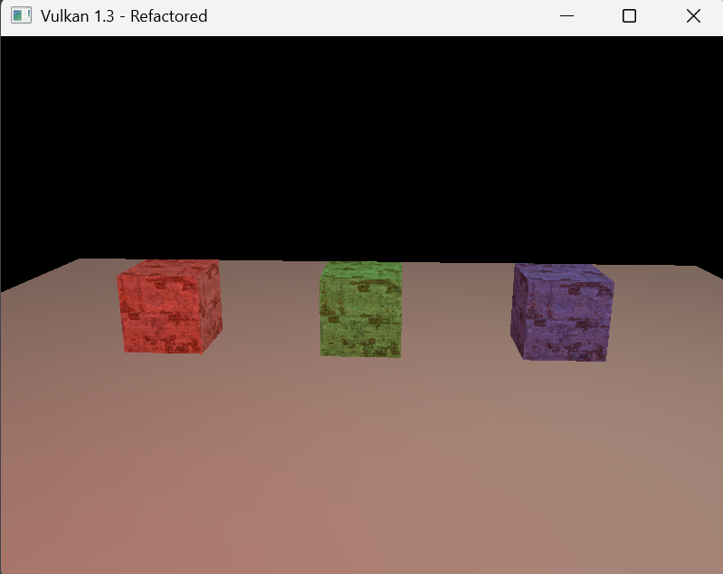
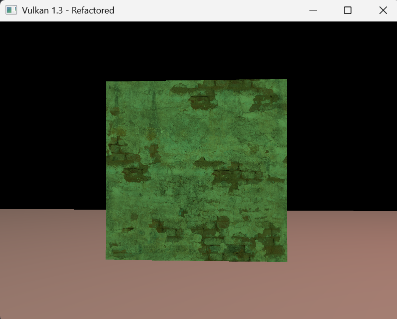
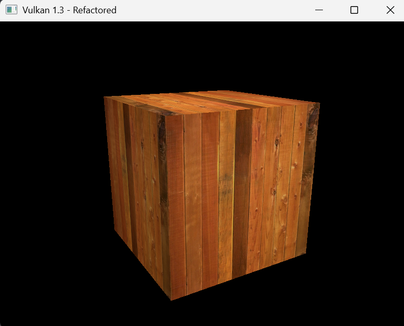
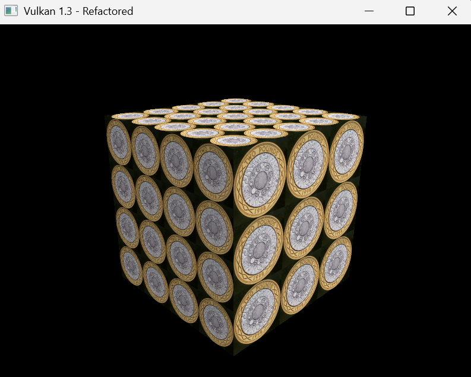
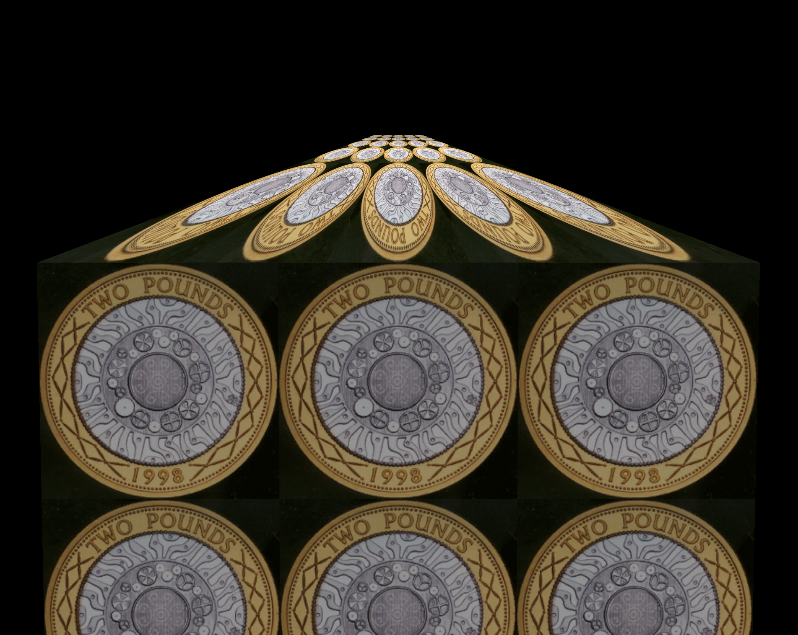
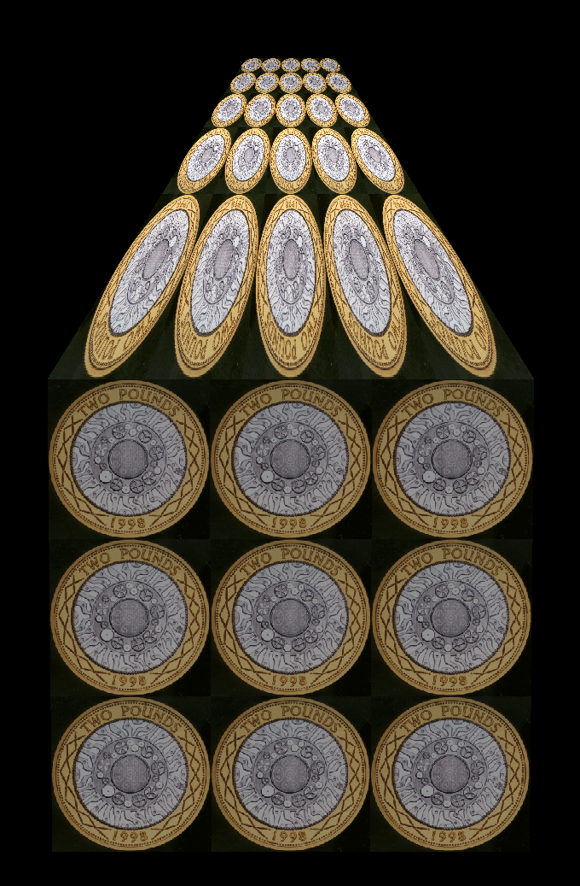
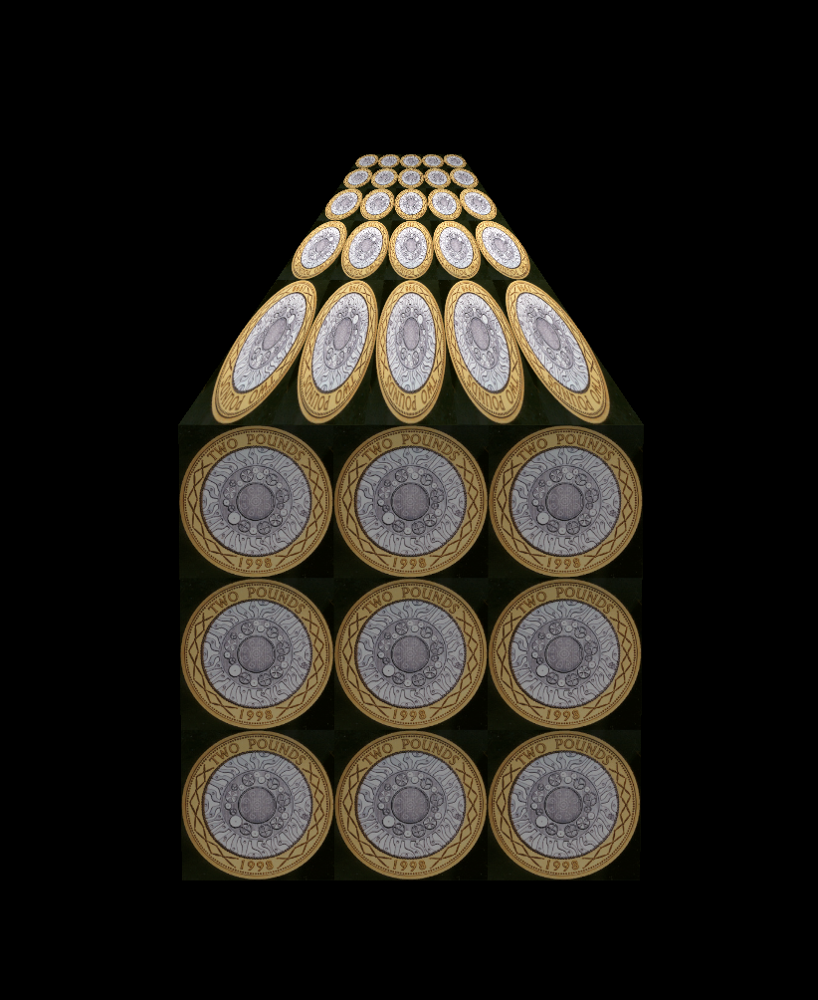
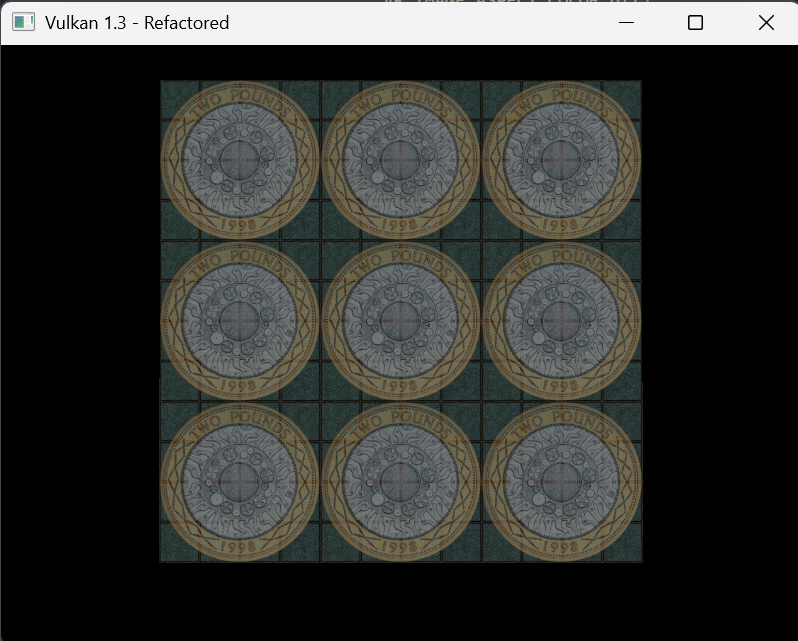
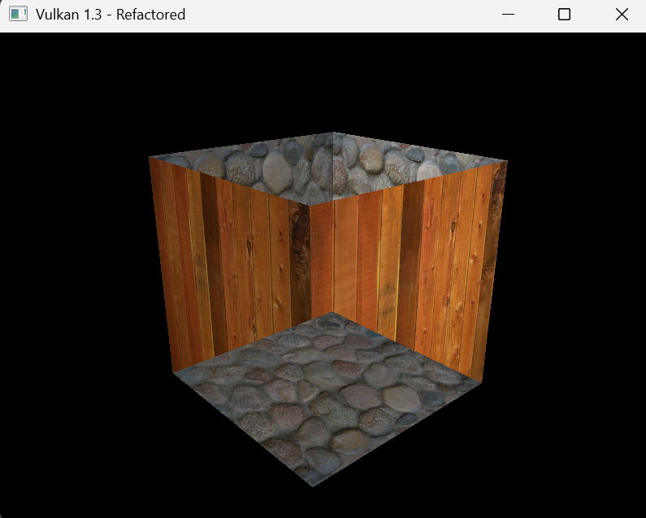
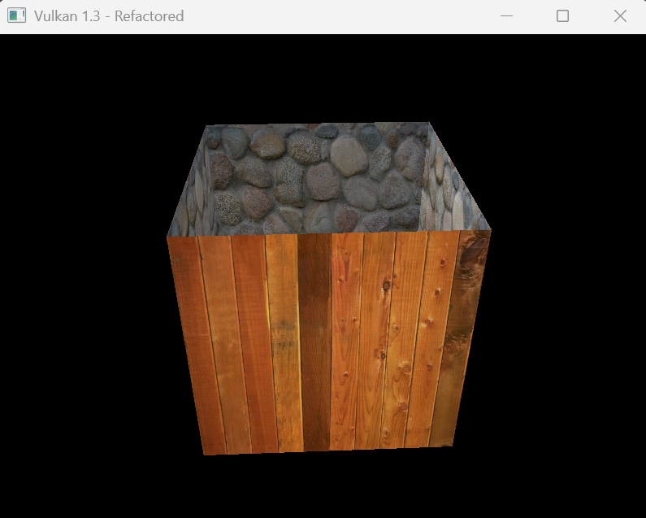

# Lab 5

## EXERCISE 1: PREPARING THE APPLICATION FOR TEXTURES

I updated the `Vertex` struct with the new parameter. and adding a new section in `getAttributeDescriptions()`:

```cpp
struct Vertex {
    glm::vec3 pos;
    glm::vec3 color;
    glm::vec3 normal;
    glm::vec2 texCoord;

    static VkVertexInputBindingDescription getBindingDescription() {
        VkVertexInputBindingDescription bindingDescription{};
        bindingDescription.binding = 0;
        bindingDescription.stride = sizeof(Vertex);
        bindingDescription.inputRate = VK_VERTEX_INPUT_RATE_VERTEX;
        return bindingDescription;
    }

static std::array<VkVertexInputAttributeDescription, 4>
    getAttributeDescriptions() {
      std::array<VkVertexInputAttributeDescription, 4> attributeDescriptions{};
      attributeDescriptions[0] = {0, 0, VK_FORMAT_R32G32B32_SFLOAT,offsetof(Vertex, pos)};
      attributeDescriptions[1] = {1, 0, VK_FORMAT_R32G32B32_SFLOAT,offsetof(Vertex, color)};
      attributeDescriptions[2] = {2, 0, VK_FORMAT_R32G32B32_SFLOAT,offsetof(Vertex, normal)};
      attributeDescriptions[3] = {3, 0, VK_FORMAT_R32G32_SFLOAT,offsetof(Vertex, texCoord)};

      return attributeDescriptions;
    }
};
```

I then changed my updated cube geometry to have UV coordinates in `GeometryGenerator`.

````cpp
MeshData createCube(float size, const glm::vec3& color) {
  MeshData meshData;
  float h = size * 0.5f;

  meshData.vertices = {
      {{-h, -h, -h},
       color,
       glm::vec3(0.0f, 0.0f, -1.0f),
       glm::vec2(0.0f, 1.0f)},
      {{h, -h, -h}, color, glm::vec3(0.0f, 0.0f, -1.0f), glm::vec2(1.0f, 1.0f)},
      {{h, h, -h}, color, glm::vec3(0.0f, 0.0f, -1.0f), glm::vec2(1.0f, 0.0f)},
      {{-h, h, -h}, color, glm::vec3(0.0f, 0.0f, -1.0f), glm::vec2(0.0f, 0.0f)},

      {{h, -h, -h}, color, glm::vec3(1.0f, 0.0f, 0.0f), glm::vec2(0.0f, 1.0f)},
      {{h, -h, h}, color, glm::vec3(1.0f, 0.0f, 0.0f), glm::vec2(1.0f, 1.0f)},
      {{h, h, h}, color, glm::vec3(1.0f, 0.0f, 0.0f), glm::vec2(1.0f, 0.0f)},
      {{h, h, -h}, color, glm::vec3(1.0f, 0.0f, 0.0f), glm::vec2(0.0f, 0.0f)},

      {{h, -h, h}, color, glm::vec3(0.0f, 0.0f, 1.0f), glm::vec2(0.0f, 1.0f)},
      {{-h, -h, h}, color, glm::vec3(0.0f, 0.0f, 1.0f), glm::vec2(1.0f, 1.0f)},
      {{-h, h, h}, color, glm::vec3(0.0f, 0.0f, 1.0f), glm::vec2(1.0f, 0.0f)},
      {{h, h, h}, color, glm::vec3(0.0f, 0.0f, 1.0f), glm::vec2(0.0f, 0.0f)},

      {{-h, -h, h}, color, glm::vec3(-1.0f, 0.0f, 0.0f), glm::vec2(0.0f, 1.0f)},
      {{-h, -h, -h},
       color,
       glm::vec3(-1.0f, 0.0f, 0.0f),
       glm::vec2(1.0f, 1.0f)},
      {{-h, h, -h}, color, glm::vec3(-1.0f, 0.0f, 0.0f), glm::vec2(1.0f, 0.0f)},
      {{-h, h, h}, color, glm::vec3(-1.0f, 0.0f, 0.0f), glm::vec2(0.0f, 0.0f)},

      {{-h, h, -h}, color, glm::vec3(0.0f, 1.0f, 0.0f), glm::vec2(0.0f, 1.0f)},
      {{h, h, -h}, color, glm::vec3(0.0f, 1.0f, 0.0f), glm::vec2(1.0f, 1.0f)},
      {{h, h, h}, color, glm::vec3(0.0f, 1.0f, 0.0f), glm::vec2(1.0f, 0.0f)},
      {{-h, h, h}, color, glm::vec3(0.0f, 1.0f, 0.0f), glm::vec2(0.0f, 0.0f)},

      {{-h, -h, h}, color, glm::vec3(0.0f, -1.0f, 0.0f), glm::vec2(0.0f, 1.0f)},
      {{h, -h, h}, color, glm::vec3(0.0f, -1.0f, 0.0f), glm::vec2(1.0f, 1.0f)},
      {{h, -h, -h}, color, glm::vec3(0.0f, -1.0f, 0.0f), glm::vec2(1.0f, 0.0f)},
      {{-h, -h, -h},
       color,
       glm::vec3(0.0f, -1.0f, 0.0f),
       glm::vec2(0.0f, 0.0f)}};

  meshData.indices = {0,  2,  1,  0,  3,  2,  4,  6,  5,  4,  7,  6,
                      8,  10, 9,  8,  11, 10, 12, 14, 13, 12, 15, 14,
                      16, 18, 17, 16, 19, 18, 20, 22, 21, 20, 23, 22};

  return meshData;
}
```

Then we can inlcude the provided library header file in our main file.

```cpp
#define STB_IMAGE_IMPLEMENTATION
#include "stb_image.h"
````

## EXERCISE 2: LOADING AND CREATING VULKAN IMAGE RESOURCES

Following the brief, we add the necessary member variables:

```cpp
// Image handler stuff
VkImage textureImage = VK_NULL_HANDLE;
VkDeviceMemory textureImageMemory = VK_NULL_HANDLE;
VkImageView textureImageView = VK_NULL_HANDLE;
VkSampler textureSampler = VK_NULL_HANDLE;

VkCommandBuffer beginSingleTimeCommands();
void endSingleTimeCommands(VkCommandBuffer commandBuffer);
void createImage(uint32_t width, uint32_t height, VkFormat format,
                 VkImageTiling tiling, VkImageUsageFlags usage,
                 VkMemoryPropertyFlags properties, VkImage& image,
                 VkDeviceMemory& imageMemory);
void transitionImageLayout(VkImage image, VkImageLayout oldLayout,
                           VkImageLayout newLayout,
                           VkImageAspectFlags aspectMask);
void copyBufferToImage(VkBuffer buffer, VkImage image, uint32_t width,
                       uint32_t height);
VkImageView createImageView(VkImage image, VkFormat format,
                            VkImageAspectFlags aspectFlags);
void createTextureImage();
void createTextureImageView();
void createTextureSampler();
```

Then we add the image helper methods:

```cpp
// IMAGE HELPER FUNCTIONS
VkCommandBuffer HelloTriangleApplication::beginSingleTimeCommands() {
  VkCommandBufferAllocateInfo allocInfo{};
  allocInfo.sType = VK_STRUCTURE_TYPE_COMMAND_BUFFER_ALLOCATE_INFO;
  allocInfo.level = VK_COMMAND_BUFFER_LEVEL_PRIMARY;
  allocInfo.commandPool = commandPool;
  allocInfo.commandBufferCount = 1;

  VkCommandBuffer commandBuffer;
  vkAllocateCommandBuffers(device, &allocInfo, &commandBuffer);

  VkCommandBufferBeginInfo beginInfo{};
  beginInfo.sType = VK_STRUCTURE_TYPE_COMMAND_BUFFER_BEGIN_INFO;
  beginInfo.flags = VK_COMMAND_BUFFER_USAGE_ONE_TIME_SUBMIT_BIT;

  vkBeginCommandBuffer(commandBuffer, &beginInfo);
  return commandBuffer;
}

void HelloTriangleApplication::endSingleTimeCommands(
    VkCommandBuffer commandBuffer) {
  vkEndCommandBuffer(commandBuffer);

  VkSubmitInfo submitInfo{};
  submitInfo.sType = VK_STRUCTURE_TYPE_SUBMIT_INFO;
  submitInfo.commandBufferCount = 1;
  submitInfo.pCommandBuffers = &commandBuffer;

  vkQueueSubmit(graphicsQueue, 1, &submitInfo, VK_NULL_HANDLE);
  vkQueueWaitIdle(graphicsQueue);

  vkFreeCommandBuffers(device, commandPool, 1, &commandBuffer);
}

void HelloTriangleApplication::createImage(
    uint32_t width, uint32_t height, VkFormat format, VkImageTiling tiling,
    VkImageUsageFlags usage, VkMemoryPropertyFlags properties, VkImage& image,
    VkDeviceMemory& imageMemory) {
  VkImageCreateInfo imageInfo{};
  imageInfo.sType = VK_STRUCTURE_TYPE_IMAGE_CREATE_INFO;
  imageInfo.imageType = VK_IMAGE_TYPE_2D;
  imageInfo.extent.width = width;
  imageInfo.extent.height = height;
  imageInfo.extent.depth = 1;
  imageInfo.mipLevels = 1;
  imageInfo.arrayLayers = 1;
  imageInfo.format = format;
  imageInfo.tiling = tiling;
  imageInfo.initialLayout = VK_IMAGE_LAYOUT_UNDEFINED;
  imageInfo.usage = usage;
  imageInfo.samples = VK_SAMPLE_COUNT_1_BIT;
  imageInfo.sharingMode = VK_SHARING_MODE_EXCLUSIVE;

  if (vkCreateImage(device, &imageInfo, nullptr, &image) != VK_SUCCESS) {
    throw std::runtime_error("failed to create image!");
  }

  VkMemoryRequirements memRequirements;
  vkGetImageMemoryRequirements(device, image, &memRequirements);

  VkMemoryAllocateInfo allocInfo{};
  allocInfo.sType = VK_STRUCTURE_TYPE_MEMORY_ALLOCATE_INFO;
  allocInfo.allocationSize = memRequirements.size;
  allocInfo.memoryTypeIndex =
      findMemoryType(memRequirements.memoryTypeBits, properties);

  if (vkAllocateMemory(device, &allocInfo, nullptr, &imageMemory) !=
      VK_SUCCESS) {
    throw std::runtime_error("failed to allocate image memory!");
  }

  vkBindImageMemory(device, image, imageMemory, 0);
}

void HelloTriangleApplication::transitionImageLayout(
    VkImage image, VkImageLayout oldLayout, VkImageLayout newLayout,
    VkImageAspectFlags aspectMask) {
  VkCommandBuffer commandBuffer = beginSingleTimeCommands();

  VkImageMemoryBarrier barrier{};
  barrier.sType = VK_STRUCTURE_TYPE_IMAGE_MEMORY_BARRIER;
  barrier.oldLayout = oldLayout;
  barrier.newLayout = newLayout;
  barrier.srcQueueFamilyIndex = VK_QUEUE_FAMILY_IGNORED;
  barrier.dstQueueFamilyIndex = VK_QUEUE_FAMILY_IGNORED;
  barrier.image = image;
  barrier.subresourceRange.aspectMask = aspectMask;
  barrier.subresourceRange.baseMipLevel = 0;
  barrier.subresourceRange.levelCount = 1;
  barrier.subresourceRange.baseArrayLayer = 0;
  barrier.subresourceRange.layerCount = 1;

  VkPipelineStageFlags sourceStage;
  VkPipelineStageFlags destinationStage;

  if (oldLayout == VK_IMAGE_LAYOUT_UNDEFINED &&
      newLayout == VK_IMAGE_LAYOUT_TRANSFER_DST_OPTIMAL) {
    barrier.srcAccessMask = 0;
    barrier.dstAccessMask = VK_ACCESS_TRANSFER_WRITE_BIT;
    sourceStage = VK_PIPELINE_STAGE_TOP_OF_PIPE_BIT;
    destinationStage = VK_PIPELINE_STAGE_TRANSFER_BIT;
  } else if (oldLayout == VK_IMAGE_LAYOUT_TRANSFER_DST_OPTIMAL &&
             newLayout == VK_IMAGE_LAYOUT_SHADER_READ_ONLY_OPTIMAL) {
    barrier.srcAccessMask = VK_ACCESS_TRANSFER_WRITE_BIT;
    barrier.dstAccessMask = VK_ACCESS_SHADER_READ_BIT;
    sourceStage = VK_PIPELINE_STAGE_TRANSFER_BIT;
    destinationStage = VK_PIPELINE_STAGE_FRAGMENT_SHADER_BIT;
  } else {
    throw std::invalid_argument("unsupported layout transition!");
  }

  vkCmdPipelineBarrier(commandBuffer, sourceStage, destinationStage, 0, 0,
                       nullptr, 0, nullptr, 1, &barrier);

  endSingleTimeCommands(commandBuffer);
}

void HelloTriangleApplication::copyBufferToImage(VkBuffer buffer, VkImage image,
                                                 uint32_t width,
                                                 uint32_t height) {
  VkCommandBuffer commandBuffer = beginSingleTimeCommands();

  VkBufferImageCopy region{};
  region.bufferOffset = 0;
  region.bufferRowLength = 0;
  region.bufferImageHeight = 0;
  region.imageSubresource.aspectMask = VK_IMAGE_ASPECT_COLOR_BIT;
  region.imageSubresource.mipLevel = 0;
  region.imageSubresource.baseArrayLayer = 0;
  region.imageSubresource.layerCount = 1;
  region.imageOffset = {0, 0, 0};
  region.imageExtent = {width, height, 1};

  vkCmdCopyBufferToImage(commandBuffer, buffer, image,
                         VK_IMAGE_LAYOUT_TRANSFER_DST_OPTIMAL, 1, &region);

  endSingleTimeCommands(commandBuffer);
}

VkImageView HelloTriangleApplication::createImageView(
    VkImage image, VkFormat format, VkImageAspectFlags aspectFlags) {
  VkImageViewCreateInfo viewInfo{};
  viewInfo.sType = VK_STRUCTURE_TYPE_IMAGE_VIEW_CREATE_INFO;
  viewInfo.image = image;
  viewInfo.viewType = VK_IMAGE_VIEW_TYPE_2D;
  viewInfo.format = format;
  viewInfo.subresourceRange.aspectMask = aspectFlags;
  viewInfo.subresourceRange.baseMipLevel = 0;
  viewInfo.subresourceRange.levelCount = 1;
  viewInfo.subresourceRange.baseArrayLayer = 0;
  viewInfo.subresourceRange.layerCount = 1;

  VkImageView imageView;
  if (vkCreateImageView(device, &viewInfo, nullptr, &imageView) != VK_SUCCESS) {
    throw std::runtime_error("failed to create image view!");
  }

  return imageView;
}

void HelloTriangleApplication::createTextureImage() {
  int texWidth, texHeight, texChannels;
  stbi_uc* pixels = stbi_load("damaged_plaster_diff_2k.jpg", &texWidth,
                              &texHeight, &texChannels, STBI_rgb_alpha);
  VkDeviceSize imageSize = texWidth * texHeight * 4;

  if (!pixels) {
    throw std::runtime_error("failed to load texture image!");
  }

  VkBuffer stagingBuffer;
  VkDeviceMemory stagingBufferMemory;
  createBuffer(imageSize, VK_BUFFER_USAGE_TRANSFER_SRC_BIT,
               VK_MEMORY_PROPERTY_HOST_VISIBLE_BIT |
                   VK_MEMORY_PROPERTY_HOST_COHERENT_BIT,
               stagingBuffer, stagingBufferMemory);

  void* data;
  vkMapMemory(device, stagingBufferMemory, 0, imageSize, 0, &data);
  memcpy(data, pixels, static_cast<size_t>(imageSize));
  vkUnmapMemory(device, stagingBufferMemory);

  stbi_image_free(pixels);

  createImage(
      texWidth, texHeight, VK_FORMAT_R8G8B8A8_SRGB, VK_IMAGE_TILING_OPTIMAL,
      VK_IMAGE_USAGE_TRANSFER_DST_BIT | VK_IMAGE_USAGE_SAMPLED_BIT,
      VK_MEMORY_PROPERTY_DEVICE_LOCAL_BIT, textureImage, textureImageMemory);

  transitionImageLayout(textureImage, VK_IMAGE_LAYOUT_UNDEFINED,
                        VK_IMAGE_LAYOUT_TRANSFER_DST_OPTIMAL,
                        VK_IMAGE_ASPECT_COLOR_BIT);
  copyBufferToImage(stagingBuffer, textureImage,
                    static_cast<uint32_t>(texWidth),
                    static_cast<uint32_t>(texHeight));
  transitionImageLayout(textureImage, VK_IMAGE_LAYOUT_TRANSFER_DST_OPTIMAL,
                        VK_IMAGE_LAYOUT_SHADER_READ_ONLY_OPTIMAL,
                        VK_IMAGE_ASPECT_COLOR_BIT);

  vkDestroyBuffer(device, stagingBuffer, nullptr);
  vkFreeMemory(device, stagingBufferMemory, nullptr);
}

void HelloTriangleApplication::createTextureImageView() {
  textureImageView = createImageView(textureImage, VK_FORMAT_R8G8B8A8_SRGB,
                                     VK_IMAGE_ASPECT_COLOR_BIT);
}

void HelloTriangleApplication::createTextureSampler() {
  VkPhysicalDeviceProperties properties{};
  vkGetPhysicalDeviceProperties(physicalDevice, &properties);

  VkSamplerCreateInfo samplerInfo{};
  samplerInfo.sType = VK_STRUCTURE_TYPE_SAMPLER_CREATE_INFO;
  samplerInfo.magFilter = VK_FILTER_LINEAR;
  samplerInfo.minFilter = VK_FILTER_LINEAR;
  samplerInfo.addressModeU = VK_SAMPLER_ADDRESS_MODE_REPEAT;
  samplerInfo.addressModeV = VK_SAMPLER_ADDRESS_MODE_REPEAT;
  samplerInfo.addressModeW = VK_SAMPLER_ADDRESS_MODE_REPEAT;
  samplerInfo.anisotropyEnable = VK_TRUE;
  samplerInfo.maxAnisotropy = properties.limits.maxSamplerAnisotropy;
  samplerInfo.borderColor = VK_BORDER_COLOR_INT_OPAQUE_BLACK;
  samplerInfo.unnormalizedCoordinates = VK_FALSE;
  samplerInfo.compareEnable = VK_FALSE;
  samplerInfo.compareOp = VK_COMPARE_OP_ALWAYS;
  samplerInfo.mipmapMode = VK_SAMPLER_MIPMAP_MODE_LINEAR;

  if (vkCreateSampler(device, &samplerInfo, nullptr, &textureSampler) !=
      VK_SUCCESS) {
    throw std::runtime_error("failed to create texture sampler!");
  }
}
```

Then we can update `initVulkan()` to include the new methods:

```cpp
void HelloTriangleApplication::initVulkan() {
  createInstance();
  setupDebugMessenger();
  createSurface();
  pickPhysicalDevice();
  createLogicalDevice();
  createSwapChain();
  createImageViews();
  createDescriptorSetLayout();
  createGraphicsPipeline();
  createCommandPool();
  createTextureImage();
  createTextureImageView();
  createTextureSampler();
  loadModel();
  createVertexBuffer();
  createIndexBuffer();
  createUniformBuffers();
  createDescriptorPool();
  createDescriptorSets();
  createCommandBuffers();
  createSyncObjects();
}
```

Then we update `cleanup()` to clean them up:

```cpp
void HelloTriangleApplication::cleanup() {
  cleanupSwapChain();

  vkDestroySampler(device, textureSampler, nullptr);
  vkDestroyImageView(device, textureImageView, nullptr);
  vkDestroyImage(device, textureImage, nullptr);
  vkFreeMemory(device, textureImageMemory, nullptr);

  vkDestroyPipeline(device, graphicsPipeline, nullptr);
  vkDestroyPipelineLayout(device, pipelineLayout, nullptr);
  vkDestroyDescriptorSetLayout(device, descriptorSetLayout, nullptr);

  vkDestroyBuffer(device, indexBuffer, nullptr);
  vkFreeMemory(device, indexBufferMemory, nullptr);

  vkDestroyBuffer(device, vertexBuffer, nullptr);
  vkFreeMemory(device, vertexBufferMemory, nullptr);

  for (size_t i = 0; i < MAX_FRAMES_IN_FLIGHT; i++) {
    vkDestroyBuffer(device, uniformBuffers[i], nullptr);
    vkFreeMemory(device, uniformBuffersMemory[i], nullptr);
  }
  vkDestroyDescriptorPool(device, descriptorPool, nullptr);

  for (size_t i = 0; i < MAX_FRAMES_IN_FLIGHT; i++) {
    vkDestroySemaphore(device, renderFinishedSemaphores[i], nullptr);
    vkDestroySemaphore(device, imageAvailableSemaphores[i], nullptr);
    vkDestroyFence(device, inFlightFences[i], nullptr);
  }

  vkDestroyCommandPool(device, commandPool, nullptr);
  vkDestroyDevice(device, nullptr);

  if (enableValidationLayers) {
    DestroyDebugUtilsMessengerEXT(instance, debugMessenger, nullptr);
  }

  vkDestroySurfaceKHR(instance, surface, nullptr);
  vkDestroyInstance(instance, nullptr);

  glfwDestroyWindow(window);
  glfwTerminate();
}
```

Nothing actually changes yet because we have not added the fun part (importing the texture!).

## EXERCISE 4: BINDING AND SHADER UPDATES

We start by updating `createDescriptorSetLayout()` to add a new binding for the texture sampler.

```cpp
void HelloTriangleApplication::createDescriptorSetLayout() {
    VkDescriptorSetLayoutBinding uboLayoutBinding{};
    uboLayoutBinding.binding = 0;
    uboLayoutBinding.descriptorCount = 1;
    uboLayoutBinding.descriptorType = VK_DESCRIPTOR_TYPE_UNIFORM_BUFFER;
    uboLayoutBinding.pImmutableSamplers = nullptr;
    uboLayoutBinding.stageFlags = VK_SHADER_STAGE_VERTEX_BIT | VK_SHADER_STAGE_FRAGMENT_BIT;

    VkDescriptorSetLayoutBinding samplerLayoutBinding{};
    samplerLayoutBinding.binding = 1;
    samplerLayoutBinding.descriptorCount = 1;
    samplerLayoutBinding.descriptorType = VK_DESCRIPTOR_TYPE_COMBINED_IMAGE_SAMPLER;
    samplerLayoutBinding.pImmutableSamplers = nullptr;
    samplerLayoutBinding.stageFlags = VK_SHADER_STAGE_FRAGMENT_BIT;

    std::array<VkDescriptorSetLayoutBinding, 2> bindings = {uboLayoutBinding, samplerLayoutBinding};

    VkDescriptorSetLayoutCreateInfo layoutInfo{};
    layoutInfo.sType = VK_STRUCTURE_TYPE_DESCRIPTOR_SET_LAYOUT_CREATE_INFO;
    layoutInfo.bindingCount = static_cast<uint32_t>(bindings.size());
    layoutInfo.pBindings = bindings.data();

    if (vkCreateDescriptorSetLayout(device, &layoutInfo, nullptr, &descriptorSetLayout) != VK_SUCCESS) {
        throw std::runtime_error("Failed to create descriptor set layout!");
    }
}
```

Then we update `createDescriptorPool()` to allocate space for it.

```cpp
void HelloTriangleApplication::createDescriptorPool() {
  std::array<VkDescriptorPoolSize, 2> poolSizes{};
  poolSizes[0].type = VK_DESCRIPTOR_TYPE_UNIFORM_BUFFER;
  poolSizes[0].descriptorCount = static_cast<uint32_t>(MAX_FRAMES_IN_FLIGHT);
  poolSizes[1].type = VK_DESCRIPTOR_TYPE_COMBINED_IMAGE_SAMPLER;
  poolSizes[1].descriptorCount = static_cast<uint32_t>(MAX_FRAMES_IN_FLIGHT);

  VkDescriptorPoolCreateInfo poolInfo{};
  poolInfo.sType = VK_STRUCTURE_TYPE_DESCRIPTOR_POOL_CREATE_INFO;
  poolInfo.poolSizeCount = static_cast<uint32_t>(poolSizes.size());
  poolInfo.pPoolSizes = poolSizes.data();
  poolInfo.maxSets = static_cast<uint32_t>(MAX_FRAMES_IN_FLIGHT);

  if (vkCreateDescriptorPool(device, &poolInfo, nullptr, &descriptorPool) !=
      VK_SUCCESS) {
    throw std::runtime_error("Failed to create descriptor pool!");
  }
}
```

Then we can update `createDescriptorSets()` to actuall bind our texture image view and sampler to binding 1.

```cpp
void HelloTriangleApplication::createDescriptorSets() {
  std::vector<VkDescriptorSetLayout> layouts(MAX_FRAMES_IN_FLIGHT,
                                             descriptorSetLayout);
  VkDescriptorSetAllocateInfo allocInfo{};
  allocInfo.sType = VK_STRUCTURE_TYPE_DESCRIPTOR_SET_ALLOCATE_INFO;
  allocInfo.descriptorPool = descriptorPool;
  allocInfo.descriptorSetCount = static_cast<uint32_t>(MAX_FRAMES_IN_FLIGHT);
  allocInfo.pSetLayouts = layouts.data();

  descriptorSets.resize(MAX_FRAMES_IN_FLIGHT);
  if (vkAllocateDescriptorSets(device, &allocInfo, descriptorSets.data()) !=
      VK_SUCCESS) {
    throw std::runtime_error("Failed to allocate descriptor sets!");
  }

  for (size_t i = 0; i < MAX_FRAMES_IN_FLIGHT; i++) {
    VkDescriptorBufferInfo bufferInfo{};
    bufferInfo.buffer = uniformBuffers[i];
    bufferInfo.offset = 0;
    bufferInfo.range = sizeof(UniformBufferObject);

    VkDescriptorImageInfo imageInfo{};
    imageInfo.imageLayout = VK_IMAGE_LAYOUT_SHADER_READ_ONLY_OPTIMAL;
    imageInfo.imageView = textureImageView;
    imageInfo.sampler = textureSampler;

    std::array<VkWriteDescriptorSet, 2> descriptorWrites{};

    descriptorWrites[0].sType = VK_STRUCTURE_TYPE_WRITE_DESCRIPTOR_SET;
    descriptorWrites[0].dstSet = descriptorSets[i];
    descriptorWrites[0].dstBinding = 0;
    descriptorWrites[0].dstArrayElement = 0;
    descriptorWrites[0].descriptorType = VK_DESCRIPTOR_TYPE_UNIFORM_BUFFER;
    descriptorWrites[0].descriptorCount = 1;
    descriptorWrites[0].pBufferInfo = &bufferInfo;

    descriptorWrites[1].sType = VK_STRUCTURE_TYPE_WRITE_DESCRIPTOR_SET;
    descriptorWrites[1].dstSet = descriptorSets[i];
    descriptorWrites[1].dstBinding = 1;
    descriptorWrites[1].dstArrayElement = 0;
    descriptorWrites[1].descriptorType =
        VK_DESCRIPTOR_TYPE_COMBINED_IMAGE_SAMPLER;
    descriptorWrites[1].descriptorCount = 1;
    descriptorWrites[1].pImageInfo = &imageInfo;

    vkUpdateDescriptorSets(device,
                           static_cast<uint32_t>(descriptorWrites.size()),
                           descriptorWrites.data(), 0, nullptr);
  }
}
```

We need to now update the `shader.vert` to recieve and pass UV coordinates from vertex data to `shader.frag`.

```cpp
#version 450

layout(binding = 0) uniform UniformBufferObject {
    mat4 view;
    mat4 proj;
    vec3 light1Pos;
    vec3 light1Color;
    vec3 light2Pos;
    vec3 light2Color;
    vec3 eyePos;
} ubo;

layout(push_constant) uniform PushConstants {
    mat4 model;
    vec3 ambient;
    float padding1;
    vec3 diffuse;
    float padding2;
    vec3 specular;
    float shininess;
} pushConstants;

layout(location = 0) in vec3 inPosition;
layout(location = 1) in vec3 inColor;
layout(location = 2) in vec3 inNormal;
layout(location = 3) in vec2 inTexCoord;

layout(location = 0) out vec3 fragColor;
layout(location = 1) out vec3 fragWorldPos;
layout(location = 2) out vec3 fragWorldNormal;
layout(location = 3) out vec3 fragAmbient;
layout(location = 4) out vec3 fragDiffuse;
layout(location = 5) out vec3 fragSpecular;
layout(location = 6) out float fragShininess;
layout(location = 7) out vec2 fragTexCoord;

void main() {
    fragWorldPos = (pushConstants.model * vec4(inPosition, 1.0)).xyz;
    fragWorldNormal = mat3(transpose(inverse(pushConstants.model))) * inNormal;
    fragColor = inColor;
    fragAmbient = pushConstants.ambient;
    fragDiffuse = pushConstants.diffuse;
    fragSpecular = pushConstants.specular;
    fragShininess = pushConstants.shininess;
    fragTexCoord = inTexCoord;

    gl_Position = ubo.proj * ubo.view * vec4(fragWorldPos, 1.0);
}
```

Then finally, updating the `shader.frag` to recieve interpolated UV's and process them to calculate our final pixel colour.

```cpp
#version 450

layout(binding = 0) uniform UniformBufferObject {
    mat4 view;
    mat4 proj;
    vec3 light1Pos;
    vec3 light1Color;
    vec3 light2Pos;
    vec3 light2Color;
    vec3 eyePos;
} ubo;

layout(binding = 1) uniform sampler2D texSampler;

layout(location = 0) in vec3 fragColor;
layout(location = 1) in vec3 fragWorldPos;
layout(location = 2) in vec3 fragWorldNormal;
layout(location = 3) in vec3 fragAmbient;
layout(location = 4) in vec3 fragDiffuse;
layout(location = 5) in vec3 fragSpecular;
layout(location = 6) in float fragShininess;
layout(location = 7) in vec2 fragTexCoord;

layout(location = 0) out vec4 outColor;

vec3 calculateLight(vec3 lightPos, vec3 lightColor, vec3 norm, vec3 viewDir) {
    vec3 lightDir = normalize(lightPos - fragWorldPos);
    float diff = max(dot(norm, lightDir), 0.0);
    vec3 diffuse = diff * fragDiffuse * lightColor;

    vec3 reflectDir = normalize(reflect(-lightDir, norm));
    float spec = pow(max(dot(reflectDir, viewDir), 0.0), fragShininess);
    vec3 specular = spec * fragSpecular * lightColor;

    return diffuse + specular;
}

void main() {
    vec4 texColor = texture(texSampler, fragTexCoord);

    vec3 ambient = fragAmbient;
    vec3 norm = normalize(fragWorldNormal);
    vec3 viewDir = normalize(ubo.eyePos - fragWorldPos);

    vec3 light1Contribution = calculateLight(ubo.light1Pos, ubo.light1Color, norm, viewDir);
    vec3 light2Contribution = calculateLight(ubo.light2Pos, ubo.light2Color, norm, viewDir);

    vec3 result = (ambient + light1Contribution + light2Contribution) * texColor.rgb;

    outColor = vec4(result, 1.0);
}
```

For my texture, I downloaded a damaged plaster wall. Using the same scene as we had last week, these are the results of that wall with the texture on it!



Zooming in, we can see the texture in all it's beauty.



## EXERCISE 5: A WOODEN CUBE

To change the texture to the wood texture, it is as simple as changing this line:

```cpp
 stbi_uc* pixels = stbi_load("Wood.jpg", &texWidth,
                              &texHeight, &texChannels, STBI_rgb_alpha);
```

I also took the liberty of de-cluttering the scene, showing only the cube.

```cpp
void loadModel() {
  RenderObject cube1;
  GeometryGenerator::MeshData cube1Mesh =
      GeometryGenerator::createCube(2.0f, glm::vec3(1.0f, 1.0f, 1.0f));
  cube1.vertices = cube1Mesh.vertices;
  cube1.indices = cube1Mesh.indices;
  cube1.transform = glm::mat4(1.0f);
  cube1.material.ambient = glm::vec3(0.3f, 0.3f, 0.3f);
  cube1.material.diffuse = glm::vec3(1.0f, 1.0f, 1.0f);
  cube1.material.specular = glm::vec3(1.0f, 1.0f, 1.0f);
  cube1.material.shininess = 128.0f;
  renderObjects.push_back(cube1);

  std::vector<Vertex> allVertices;
  std::vector<uint32_t> allIndices;
  for (auto& obj : renderObjects) {
    uint32_t vertexOffset = static_cast<uint32_t>(allVertices.size());
    allVertices.insert(allVertices.end(), obj.vertices.begin(),
                       obj.vertices.end());
    for (auto index : obj.indices) {
      allIndices.push_back(index + vertexOffset);
    }
  }
  vertices = allVertices;
  indices = allIndices;
}
```

```cpp
void HelloTriangleApplication::updateUniformBuffer(uint32_t currentImage) {
  static auto startTime = std::chrono::high_resolution_clock::now();
  auto currentTime = std::chrono::high_resolution_clock::now();
  float time = std::chrono::duration<float, std::chrono::seconds::period>(
                   currentTime - startTime)
                   .count();

  renderObjects[0].transform =
      glm::translate(glm::mat4(1.0f), glm::vec3(0.0f, 0.0f, 0.0f));

  float camX = cameraDistance * cos(cameraAngleV) * sin(cameraAngleH);
  float camY = cameraDistance * sin(cameraAngleV);
  float camZ = cameraDistance * cos(cameraAngleV) * cos(cameraAngleH);

  UniformBufferObject ubo{};
  ubo.view =
      glm::lookAt(glm::vec3(camX, camY, camZ), glm::vec3(0.0f, 0.0f, 0.0f),
                  glm::vec3(0.0f, 1.0f, 0.0f));
  ubo.proj = glm::perspective(
      glm::radians(45.0f),
      swapChainExtent.width / (float)swapChainExtent.height, 0.1f, 100.0f);
  ubo.proj[1][1] *= -1;

  ubo.light1Pos = glm::vec3(5.0f, 8.0f, 5.0f);
  ubo.light1Color = glm::vec3(1.0f, 1.0f, 1.0f);

  ubo.light2Pos = glm::vec3(0.0f, 0.0f, 0.0f);
  ubo.light2Color = glm::vec3(0.0f, 0.0f, 0.0f);

  ubo.eyePos = glm::vec3(camX, camY, camZ);

  memcpy(uniformBuffersMapped[currentImage], &ubo, sizeof(ubo));
}
```

This gives us this result:



## Exercise 6. TEXTURE WRAPPING MODE

To accomplish this, we need to change the texture again in `createTextureImage()`, then change the UVs in the `createCube()` method of `GeometryGenerator`:

```cpp
MeshData createCube(float size, const glm::vec3& color) {
  MeshData meshData;
  float h = size * 0.5f;

  meshData.vertices = {
      {{-h, -h, -h},
       color,
       glm::vec3(0.0f, 0.0f, -1.0f),
       glm::vec2(1.0f, 1.0f)},
      {{h, -h, -h}, color, glm::vec3(0.0f, 0.0f, -1.0f), glm::vec2(0.0f, 1.0f)},
      {{h, h, -h}, color, glm::vec3(0.0f, 0.0f, -1.0f), glm::vec2(0.0f, 0.0f)},
      {{-h, h, -h}, color, glm::vec3(0.0f, 0.0f, -1.0f), glm::vec2(1.0f, 0.0f)},

      {{h, -h, -h}, color, glm::vec3(1.0f, 0.0f, 0.0f), glm::vec2(2.0f, 2.0f)},
      {{h, -h, h}, color, glm::vec3(1.0f, 0.0f, 0.0f), glm::vec2(0.0f, 2.0f)},
      {{h, h, h}, color, glm::vec3(1.0f, 0.0f, 0.0f), glm::vec2(0.0f, 0.0f)},
      {{h, h, -h}, color, glm::vec3(1.0f, 0.0f, 0.0f), glm::vec2(2.0f, 0.0f)},

      {{h, -h, h}, color, glm::vec3(0.0f, 0.0f, 1.0f), glm::vec2(3.0f, 3.0f)},
      {{-h, -h, h}, color, glm::vec3(0.0f, 0.0f, 1.0f), glm::vec2(0.0f, 3.0f)},
      {{-h, h, h}, color, glm::vec3(0.0f, 0.0f, 1.0f), glm::vec2(0.0f, 0.0f)},
      {{h, h, h}, color, glm::vec3(0.0f, 0.0f, 1.0f), glm::vec2(3.0f, 0.0f)},

      {{-h, -h, h}, color, glm::vec3(-1.0f, 0.0f, 0.0f), glm::vec2(4.0f, 4.0f)},
      {{-h, -h, -h},
       color,
       glm::vec3(-1.0f, 0.0f, 0.0f),
       glm::vec2(0.0f, 4.0f)},
      {{-h, h, -h}, color, glm::vec3(-1.0f, 0.0f, 0.0f), glm::vec2(0.0f, 0.0f)},
      {{-h, h, h}, color, glm::vec3(-1.0f, 0.0f, 0.0f), glm::vec2(4.0f, 0.0f)},

      {{-h, h, -h}, color, glm::vec3(0.0f, 1.0f, 0.0f), glm::vec2(5.0f, 5.0f)},
      {{h, h, -h}, color, glm::vec3(0.0f, 1.0f, 0.0f), glm::vec2(0.0f, 5.0f)},
      {{h, h, h}, color, glm::vec3(0.0f, 1.0f, 0.0f), glm::vec2(0.0f, 0.0f)},
      {{-h, h, h}, color, glm::vec3(0.0f, 1.0f, 0.0f), glm::vec2(5.0f, 0.0f)},

      {{-h, -h, h}, color, glm::vec3(0.0f, -1.0f, 0.0f), glm::vec2(6.0f, 6.0f)},
      {{h, -h, h}, color, glm::vec3(0.0f, -1.0f, 0.0f), glm::vec2(0.0f, 6.0f)},
      {{h, -h, -h}, color, glm::vec3(0.0f, -1.0f, 0.0f), glm::vec2(0.0f, 0.0f)},
      {{-h, -h, -h},
       color,
       glm::vec3(0.0f, -1.0f, 0.0f),
       glm::vec2(6.0f, 0.0f)}};

  meshData.indices = {0,  2,  1,  0,  3,  2,  4,  6,  5,  4,  7,  6,
                      8,  10, 9,  8,  11, 10, 12, 14, 13, 12, 15, 14,
                      16, 18, 17, 16, 19, 18, 20, 22, 21, 20, 23, 22};

  return meshData;
}
```

This gives us this result!



## Exercise 7. TEXTURE FILTERING TECHNIQUES.

First, we have to scale the cube in `loadModel()`

```cpp
void loadModel() {
  RenderObject cube1;
  GeometryGenerator::MeshData cube1Mesh =
      GeometryGenerator::createCube(2.0f, glm::vec3(1.0f, 1.0f, 1.0f));
  cube1.vertices = cube1Mesh.vertices;
  cube1.indices = cube1Mesh.indices;

  cube1.transform = glm::scale(glm::mat4(1.0f), glm::vec3(1.0f, 1.0f, 20.0f));

  cube1.material.ambient = glm::vec3(0.3f, 0.3f, 0.3f);
  cube1.material.diffuse = glm::vec3(1.0f, 1.0f, 1.0f);
  cube1.material.specular = glm::vec3(1.0f, 1.0f, 1.0f);
  cube1.material.shininess = 128.0f;
  renderObjects.push_back(cube1);

  std::vector<Vertex> allVertices;
  std::vector<uint32_t> allIndices;
  for (auto& obj : renderObjects) {
    uint32_t vertexOffset = static_cast<uint32_t>(allVertices.size());
    allVertices.insert(allVertices.end(), obj.vertices.begin(),
                       obj.vertices.end());
    for (auto index : obj.indices) {
      allIndices.push_back(index + vertexOffset);
    }
  }
  vertices = allVertices;
  indices = allIndices;
}
```

Then, we can change the filtering in the `createTextureSampler()` function. Currently, it is linear.

```cpp
void HelloTriangleApplication::createTextureImage() {
  int texWidth, texHeight, texChannels;
  stbi_uc* pixels = stbi_load("Coin.jpg", &texWidth, &texHeight, &texChannels,
                              STBI_rgb_alpha);
  VkDeviceSize imageSize = texWidth * texHeight * 4;

  if (!pixels) {
    throw std::runtime_error("failed to load texture image!");
  }

  VkBuffer stagingBuffer;
  VkDeviceMemory stagingBufferMemory;
  createBuffer(imageSize, VK_BUFFER_USAGE_TRANSFER_SRC_BIT,
               VK_MEMORY_PROPERTY_HOST_VISIBLE_BIT |
                   VK_MEMORY_PROPERTY_HOST_COHERENT_BIT,
               stagingBuffer, stagingBufferMemory);

  void* data;
  vkMapMemory(device, stagingBufferMemory, 0, imageSize, 0, &data);
  memcpy(data, pixels, static_cast<size_t>(imageSize));
  vkUnmapMemory(device, stagingBufferMemory);

  stbi_image_free(pixels);

  createImage(
      texWidth, texHeight, VK_FORMAT_R8G8B8A8_SRGB, VK_IMAGE_TILING_OPTIMAL,
      VK_IMAGE_USAGE_TRANSFER_DST_BIT | VK_IMAGE_USAGE_SAMPLED_BIT,
      VK_MEMORY_PROPERTY_DEVICE_LOCAL_BIT, textureImage, textureImageMemory);

  transitionImageLayout(textureImage, VK_IMAGE_LAYOUT_UNDEFINED,
                        VK_IMAGE_LAYOUT_TRANSFER_DST_OPTIMAL,
                        VK_IMAGE_ASPECT_COLOR_BIT);
  copyBufferToImage(stagingBuffer, textureImage,
                    static_cast<uint32_t>(texWidth),
                    static_cast<uint32_t>(texHeight));
  transitionImageLayout(textureImage, VK_IMAGE_LAYOUT_TRANSFER_DST_OPTIMAL,
                        VK_IMAGE_LAYOUT_SHADER_READ_ONLY_OPTIMAL,
                        VK_IMAGE_ASPECT_COLOR_BIT);

  vkDestroyBuffer(device, stagingBuffer, nullptr);
  vkFreeMemory(device, stagingBufferMemory, nullptr);
}
```

This is the road coin cube with linear filtering:



Changing these couple of lines lets us change the filtering technique:

```cpp
  samplerInfo.magFilter = VK_FILTER_NEAREST;
  samplerInfo.minFilter = VK_FILTER_NEAREST;
  samplerInfo.anisotropyEnable = VK_FALSE;
```

This is the road coin cube with nearest filtering:



This one looks much worse and more pixelated. To change to anisotropic filtering, we can just switch it on with the bool.

```cpp
  samplerInfo.magFilter = VK_FILTER_LINEAR;
  samplerInfo.minFilter = VK_FILTER_LINEAR;
  samplerInfo.anisotropyEnable = VK_TRUE;
  samplerInfo.maxAnisotropy = properties.limits.maxSamplerAnisotropy;
```

This is the road coin cube with anisotropic filtering:



It is hard to tell, but if I had to rank the three it would be nearest < linear < anisotropic. Linear and anisotropic look very similar to my untrained eye, but nearest is notable more pixelated.

## EXERCISE 8. MULTIPLE TEXTURING

First we need to change `createDescriptorSetLayout()` to add a new layout binding.

```cpp
void HelloTriangleApplication::createDescriptorSetLayout() {
  VkDescriptorSetLayoutBinding uboLayoutBinding{};
  uboLayoutBinding.binding = 0;
  uboLayoutBinding.descriptorCount = 1;
  uboLayoutBinding.descriptorType = VK_DESCRIPTOR_TYPE_UNIFORM_BUFFER;
  uboLayoutBinding.pImmutableSamplers = nullptr;
  uboLayoutBinding.stageFlags =
      VK_SHADER_STAGE_VERTEX_BIT | VK_SHADER_STAGE_FRAGMENT_BIT;

  VkDescriptorSetLayoutBinding samplerLayoutBinding1{};
  samplerLayoutBinding1.binding = 1;
  samplerLayoutBinding1.descriptorCount = 1;
  samplerLayoutBinding1.descriptorType =
      VK_DESCRIPTOR_TYPE_COMBINED_IMAGE_SAMPLER;
  samplerLayoutBinding1.pImmutableSamplers = nullptr;
  samplerLayoutBinding1.stageFlags = VK_SHADER_STAGE_FRAGMENT_BIT;

  VkDescriptorSetLayoutBinding samplerLayoutBinding2{};
  samplerLayoutBinding2.binding = 2;
  samplerLayoutBinding2.descriptorCount = 1;
  samplerLayoutBinding2.descriptorType =
      VK_DESCRIPTOR_TYPE_COMBINED_IMAGE_SAMPLER;
  samplerLayoutBinding2.pImmutableSamplers = nullptr;
  samplerLayoutBinding2.stageFlags = VK_SHADER_STAGE_FRAGMENT_BIT;

  std::array<VkDescriptorSetLayoutBinding, 3> bindings = {
      uboLayoutBinding, samplerLayoutBinding1, samplerLayoutBinding2};

  VkDescriptorSetLayoutCreateInfo layoutInfo{};
  layoutInfo.sType = VK_STRUCTURE_TYPE_DESCRIPTOR_SET_LAYOUT_CREATE_INFO;
  layoutInfo.bindingCount = static_cast<uint32_t>(bindings.size());
  layoutInfo.pBindings = bindings.data();

  if (vkCreateDescriptorSetLayout(device, &layoutInfo, nullptr,
                                  &descriptorSetLayout) != VK_SUCCESS) {
    throw std::runtime_error("Failed to create descriptor set layout!");
  }
}
```

Then I updated `createDescriptorPool()` to allocate it.

```cpp
void HelloTriangleApplication::createDescriptorPool() {
  std::array<VkDescriptorPoolSize, 2> poolSizes{};
  poolSizes[0].type = VK_DESCRIPTOR_TYPE_UNIFORM_BUFFER;
  poolSizes[0].descriptorCount = static_cast<uint32_t>(MAX_FRAMES_IN_FLIGHT);
  poolSizes[1].type = VK_DESCRIPTOR_TYPE_COMBINED_IMAGE_SAMPLER;
  poolSizes[1].descriptorCount = static_cast<uint32_t>(MAX_FRAMES_IN_FLIGHT * 2);

  VkDescriptorPoolCreateInfo poolInfo{};
  poolInfo.sType = VK_STRUCTURE_TYPE_DESCRIPTOR_POOL_CREATE_INFO;
  poolInfo.poolSizeCount = static_cast<uint32_t>(poolSizes.size());
  poolInfo.pPoolSizes = poolSizes.data();
  poolInfo.maxSets = static_cast<uint32_t>(MAX_FRAMES_IN_FLIGHT);

  if (vkCreateDescriptorPool(device, &poolInfo, nullptr, &descriptorPool) !=
      VK_SUCCESS) {
    throw std::runtime_error("Failed to create descriptor pool!");
  }
}
```

Then I updated `createDescriptorSets()`.

```cpp
void HelloTriangleApplication::createDescriptorSets() {
  std::vector<VkDescriptorSetLayout> layouts(MAX_FRAMES_IN_FLIGHT,
                                             descriptorSetLayout);
  VkDescriptorSetAllocateInfo allocInfo{};
  allocInfo.sType = VK_STRUCTURE_TYPE_DESCRIPTOR_SET_ALLOCATE_INFO;
  allocInfo.descriptorPool = descriptorPool;
  allocInfo.descriptorSetCount = static_cast<uint32_t>(MAX_FRAMES_IN_FLIGHT);
  allocInfo.pSetLayouts = layouts.data();

  descriptorSets.resize(MAX_FRAMES_IN_FLIGHT);
  if (vkAllocateDescriptorSets(device, &allocInfo, descriptorSets.data()) !=
      VK_SUCCESS) {
    throw std::runtime_error("Failed to allocate descriptor sets!");
  }

  for (size_t i = 0; i < MAX_FRAMES_IN_FLIGHT; i++) {
    VkDescriptorBufferInfo bufferInfo{};
    bufferInfo.buffer = uniformBuffers[i];
    bufferInfo.offset = 0;
    bufferInfo.range = sizeof(UniformBufferObject);

    VkDescriptorImageInfo imageInfo1{};
    imageInfo1.imageLayout = VK_IMAGE_LAYOUT_SHADER_READ_ONLY_OPTIMAL;
    imageInfo1.imageView = textureImageView;
    imageInfo1.sampler = textureSampler;

    VkDescriptorImageInfo imageInfo2{};
    imageInfo2.imageLayout = VK_IMAGE_LAYOUT_SHADER_READ_ONLY_OPTIMAL;
    imageInfo2.imageView = textureImageView2;
    imageInfo2.sampler = textureSampler2;

    std::array<VkWriteDescriptorSet, 3> descriptorWrites{};

    descriptorWrites[0].sType = VK_STRUCTURE_TYPE_WRITE_DESCRIPTOR_SET;
    descriptorWrites[0].dstSet = descriptorSets[i];
    descriptorWrites[0].dstBinding = 0;
    descriptorWrites[0].dstArrayElement = 0;
    descriptorWrites[0].descriptorType = VK_DESCRIPTOR_TYPE_UNIFORM_BUFFER;
    descriptorWrites[0].descriptorCount = 1;
    descriptorWrites[0].pBufferInfo = &bufferInfo;

    descriptorWrites[1].sType = VK_STRUCTURE_TYPE_WRITE_DESCRIPTOR_SET;
    descriptorWrites[1].dstSet = descriptorSets[i];
    descriptorWrites[1].dstBinding = 1;
    descriptorWrites[1].dstArrayElement = 0;
    descriptorWrites[1].descriptorType =
        VK_DESCRIPTOR_TYPE_COMBINED_IMAGE_SAMPLER;
    descriptorWrites[1].descriptorCount = 1;
    descriptorWrites[1].pImageInfo = &imageInfo1;

    descriptorWrites[2].sType = VK_STRUCTURE_TYPE_WRITE_DESCRIPTOR_SET;
    descriptorWrites[2].dstSet = descriptorSets[i];
    descriptorWrites[2].dstBinding = 2;
    descriptorWrites[2].dstArrayElement = 0;
    descriptorWrites[2].descriptorType =
        VK_DESCRIPTOR_TYPE_COMBINED_IMAGE_SAMPLER;
    descriptorWrites[2].descriptorCount = 1;
    descriptorWrites[2].pImageInfo = &imageInfo2;

    vkUpdateDescriptorSets(device,
                           static_cast<uint32_t>(descriptorWrites.size()),
                           descriptorWrites.data(), 0, nullptr);
  }
}
```

But obviously these reference member variables that do not exist.

```cpp
  // Image handler stuff
  VkImage textureImage = VK_NULL_HANDLE;
  VkDeviceMemory textureImageMemory = VK_NULL_HANDLE;
  VkImageView textureImageView = VK_NULL_HANDLE;
  VkSampler textureSampler = VK_NULL_HANDLE;

  // DOUBLE IMAGE HANDLER STUFF
  VkImage textureImage2 = VK_NULL_HANDLE;
  VkDeviceMemory textureImageMemory2 = VK_NULL_HANDLE;
  VkImageView textureImageView2 = VK_NULL_HANDLE;
  VkSampler textureSampler2 = VK_NULL_HANDLE;
```

Then I just copied the helper functions again but for texture 2:

```cpp
void HelloTriangleApplication::createTextureImage2() {
  int texWidth, texHeight, texChannels;
  stbi_uc* pixels = stbi_load("tile.jpg", &texWidth, &texHeight, &texChannels,
                              STBI_rgb_alpha);
  VkDeviceSize imageSize = texWidth * texHeight * 4;

  if (!pixels) {
    throw std::runtime_error("failed to load texture image!");
  }

  VkBuffer stagingBuffer;
  VkDeviceMemory stagingBufferMemory;
  createBuffer(imageSize, VK_BUFFER_USAGE_TRANSFER_SRC_BIT,
               VK_MEMORY_PROPERTY_HOST_VISIBLE_BIT |
                   VK_MEMORY_PROPERTY_HOST_COHERENT_BIT,
               stagingBuffer, stagingBufferMemory);

  void* data;
  vkMapMemory(device, stagingBufferMemory, 0, imageSize, 0, &data);
  memcpy(data, pixels, static_cast<size_t>(imageSize));
  vkUnmapMemory(device, stagingBufferMemory);

  stbi_image_free(pixels);

  createImage(
      texWidth, texHeight, VK_FORMAT_R8G8B8A8_SRGB, VK_IMAGE_TILING_OPTIMAL,
      VK_IMAGE_USAGE_TRANSFER_DST_BIT | VK_IMAGE_USAGE_SAMPLED_BIT,
      VK_MEMORY_PROPERTY_DEVICE_LOCAL_BIT, textureImage2, textureImageMemory2);

  transitionImageLayout(textureImage2, VK_IMAGE_LAYOUT_UNDEFINED,
                        VK_IMAGE_LAYOUT_TRANSFER_DST_OPTIMAL,
                        VK_IMAGE_ASPECT_COLOR_BIT);
  copyBufferToImage(stagingBuffer, textureImage2,
                    static_cast<uint32_t>(texWidth),
                    static_cast<uint32_t>(texHeight));
  transitionImageLayout(textureImage2, VK_IMAGE_LAYOUT_TRANSFER_DST_OPTIMAL,
                        VK_IMAGE_LAYOUT_SHADER_READ_ONLY_OPTIMAL,
                        VK_IMAGE_ASPECT_COLOR_BIT);

  vkDestroyBuffer(device, stagingBuffer, nullptr);
  vkFreeMemory(device, stagingBufferMemory, nullptr);
}

void HelloTriangleApplication::createTextureImageView2() {
  textureImageView2 = createImageView(textureImage2, VK_FORMAT_R8G8B8A8_SRGB,
                                     VK_IMAGE_ASPECT_COLOR_BIT);
}

void HelloTriangleApplication::createTextureSampler2() {
  VkPhysicalDeviceProperties properties{};
  vkGetPhysicalDeviceProperties(physicalDevice, &properties);

  VkSamplerCreateInfo samplerInfo{};
  samplerInfo.sType = VK_STRUCTURE_TYPE_SAMPLER_CREATE_INFO;
  samplerInfo.magFilter = VK_FILTER_LINEAR;
  samplerInfo.minFilter = VK_FILTER_LINEAR;
  samplerInfo.anisotropyEnable = VK_TRUE;
  samplerInfo.maxAnisotropy = properties.limits.maxSamplerAnisotropy;
  samplerInfo.addressModeU = VK_SAMPLER_ADDRESS_MODE_REPEAT;
  samplerInfo.addressModeV = VK_SAMPLER_ADDRESS_MODE_REPEAT;
  samplerInfo.addressModeW = VK_SAMPLER_ADDRESS_MODE_REPEAT;
  samplerInfo.borderColor = VK_BORDER_COLOR_INT_OPAQUE_BLACK;
  samplerInfo.unnormalizedCoordinates = VK_FALSE;
  samplerInfo.compareEnable = VK_FALSE;
  samplerInfo.compareOp = VK_COMPARE_OP_ALWAYS;
  samplerInfo.mipmapMode = VK_SAMPLER_MIPMAP_MODE_LINEAR;

  if (vkCreateSampler(device, &samplerInfo, nullptr, &textureSampler2) !=
      VK_SUCCESS) {
    throw std::runtime_error("failed to create texture sampler!");
  }
}
```

This means that we also needed to change `initVulkan()` and `cleanup()` to include these new functions, then I changed `shader.frag` to calculate each pixel based off of the two textures.

```cpp
#version 450

layout(binding = 0) uniform UniformBufferObject {
    mat4 view;
    mat4 proj;
    vec3 light1Pos;
    vec3 light1Color;
    vec3 light2Pos;
    vec3 light2Color;
    vec3 eyePos;
} ubo;

layout(binding = 1) uniform sampler2D texSampler1;
layout(binding = 2) uniform sampler2D texSampler2;

layout(location = 0) in vec3 fragColor;
layout(location = 1) in vec3 fragWorldPos;
layout(location = 2) in vec3 fragWorldNormal;
layout(location = 3) in vec3 fragAmbient;
layout(location = 4) in vec3 fragDiffuse;
layout(location = 5) in vec3 fragSpecular;
layout(location = 6) in float fragShininess;
layout(location = 7) in vec2 fragTexCoord;

layout(location = 0) out vec4 outColor;

vec3 calculateLight(vec3 lightPos, vec3 lightColor, vec3 norm, vec3 viewDir, vec3 texColor) {
    vec3 lightDir = normalize(lightPos - fragWorldPos);
    float diff = max(dot(norm, lightDir), 0.0);
    vec3 diffuse = diff * texColor * lightColor;

    vec3 reflectDir = normalize(reflect(-lightDir, norm));
    float spec = pow(max(dot(reflectDir, viewDir), 0.0), fragShininess);
    vec3 specular = spec * fragSpecular * lightColor;

    return diffuse + specular;
}

void main() {
    vec4 texColor1 = texture(texSampler1, fragTexCoord);
    vec4 texColor2 = texture(texSampler2, fragTexCoord);

    vec4 blendedTexture = mix(texColor1, texColor2, 0.5);

    vec3 ambient = fragAmbient * blendedTexture.rgb;
    vec3 norm = normalize(fragWorldNormal);
    vec3 viewDir = normalize(ubo.eyePos - fragWorldPos);

    vec3 light1Contribution = calculateLight(ubo.light1Pos, ubo.light1Color, norm, viewDir, blendedTexture.rgb);
    vec3 light2Contribution = calculateLight(ubo.light2Pos, ubo.light2Color, norm, viewDir, blendedTexture.rgb);

    vec3 result = ambient + light1Contribution + light2Contribution;

    outColor = vec4(result, 1.0);
}
```

And these are the results I get!



## EXERCISE 9. AN OPEN BOX

To create an open box, we first need to add a new function for it in `GeometryGenerator`, `createOpenBox()`.

```cpp
MeshData createOpenBox(float size, const glm::vec3& color) {
  MeshData meshData;
  float h = size * 0.5f;

  meshData.vertices = {
      {{-h, -h, -h},
       color,
       glm::vec3(0.0f, 0.0f, -1.0f),
       glm::vec2(0.0f, 1.0f)},
      {{h, -h, -h}, color, glm::vec3(0.0f, 0.0f, -1.0f), glm::vec2(1.0f, 1.0f)},
      {{h, h, -h}, color, glm::vec3(0.0f, 0.0f, -1.0f), glm::vec2(1.0f, 0.0f)},
      {{-h, h, -h}, color, glm::vec3(0.0f, 0.0f, -1.0f), glm::vec2(0.0f, 0.0f)},

      {{h, -h, -h}, color, glm::vec3(1.0f, 0.0f, 0.0f), glm::vec2(0.0f, 1.0f)},
      {{h, -h, h}, color, glm::vec3(1.0f, 0.0f, 0.0f), glm::vec2(1.0f, 1.0f)},
      {{h, h, h}, color, glm::vec3(1.0f, 0.0f, 0.0f), glm::vec2(1.0f, 0.0f)},
      {{h, h, -h}, color, glm::vec3(1.0f, 0.0f, 0.0f), glm::vec2(0.0f, 0.0f)},

      {{h, -h, h}, color, glm::vec3(0.0f, 0.0f, 1.0f), glm::vec2(0.0f, 1.0f)},
      {{-h, -h, h}, color, glm::vec3(0.0f, 0.0f, 1.0f), glm::vec2(1.0f, 1.0f)},
      {{-h, h, h}, color, glm::vec3(0.0f, 0.0f, 1.0f), glm::vec2(1.0f, 0.0f)},
      {{h, h, h}, color, glm::vec3(0.0f, 0.0f, 1.0f), glm::vec2(0.0f, 0.0f)},

      {{-h, -h, h}, color, glm::vec3(-1.0f, 0.0f, 0.0f), glm::vec2(0.0f, 1.0f)},
      {{-h, -h, -h},
       color,
       glm::vec3(-1.0f, 0.0f, 0.0f),
       glm::vec2(1.0f, 1.0f)},
      {{-h, h, -h}, color, glm::vec3(-1.0f, 0.0f, 0.0f), glm::vec2(1.0f, 0.0f)},
      {{-h, h, h}, color, glm::vec3(-1.0f, 0.0f, 0.0f), glm::vec2(0.0f, 0.0f)},

      {{-h, -h, h}, color, glm::vec3(0.0f, -1.0f, 0.0f), glm::vec2(0.0f, 0.0f)},
      {{h, -h, h}, color, glm::vec3(0.0f, -1.0f, 0.0f), glm::vec2(1.0f, 0.0f)},
      {{h, -h, -h}, color, glm::vec3(0.0f, -1.0f, 0.0f), glm::vec2(1.0f, 1.0f)},
      {{-h, -h, -h},
       color,
       glm::vec3(0.0f, -1.0f, 0.0f),
       glm::vec2(0.0f, 1.0f)}};

  meshData.indices = {0,  2,  1,  0,  3,  2,  4,  6,  5,  4,
                      7,  6,  8,  10, 9,  8,  11, 10, 12, 14,
                      13, 12, 15, 14, 16, 18, 17, 16, 19, 18};

  return meshData;
}
```

Then I updated the `loadModel()` function to add this new mesh.

```cpp
void loadModel() {
  RenderObject box;
  GeometryGenerator::MeshData boxMesh =
      GeometryGenerator::createOpenBox(2.0f, glm::vec3(1.0f, 1.0f, 1.0f));
  box.vertices = boxMesh.vertices;
  box.indices = boxMesh.indices;

  box.transform = glm::mat4(1.0f);

  box.material.ambient = glm::vec3(0.3f, 0.3f, 0.3f);
  box.material.diffuse = glm::vec3(1.0f, 1.0f, 1.0f);
  box.material.specular = glm::vec3(1.0f, 1.0f, 1.0f);
  box.material.shininess = 128.0f;
  renderObjects.push_back(box);

  std::vector<Vertex> allVertices;
  std::vector<uint32_t> allIndices;
  for (auto& obj : renderObjects) {
    uint32_t vertexOffset = static_cast<uint32_t>(allVertices.size());
    allVertices.insert(allVertices.end(), obj.vertices.begin(),
                       obj.vertices.end());
    for (auto index : obj.indices) {
      allIndices.push_back(index + vertexOffset);
    }
  }
  vertices = allVertices;
  indices = allIndices;
}
```

Obviously we need to change the actual texture paths too.

```cpp
void HelloTriangleApplication::createTextureImage() {
  int texWidth, texHeight, texChannels;
  stbi_uc* pixels = stbi_load("Wood.jpg", &texWidth, &texHeight, &texChannels,
                              STBI_rgb_alpha);
  VkDeviceSize imageSize = texWidth * texHeight * 4;

...

void HelloTriangleApplication::createTextureImage2() {
  int texWidth, texHeight, texChannels;
  stbi_uc* pixels = stbi_load("rocks.jpg", &texWidth, &texHeight, &texChannels,
                              STBI_rgb_alpha);
  VkDeviceSize imageSize = texWidth * texHeight * 4;
```

And to assign texture based on face normal detection, I updated `shader.frag`.

```cpp
#version 450

layout(binding = 0) uniform UniformBufferObject {
    mat4 view;
    mat4 proj;
    vec3 light1Pos;
    vec3 light1Color;
    vec3 light2Pos;
    vec3 light2Color;
    vec3 eyePos;
} ubo;

layout(binding = 1) uniform sampler2D texSampler1;
layout(binding = 2) uniform sampler2D texSampler2;

layout(location = 0) in vec3 fragColor;
layout(location = 1) in vec3 fragWorldPos;
layout(location = 2) in vec3 fragWorldNormal;
layout(location = 3) in vec3 fragAmbient;
layout(location = 4) in vec3 fragDiffuse;
layout(location = 5) in vec3 fragSpecular;
layout(location = 6) in float fragShininess;
layout(location = 7) in vec2 fragTexCoord;

layout(location = 0) out vec4 outColor;

vec3 calculateLight(vec3 lightPos, vec3 lightColor, vec3 norm, vec3 viewDir, vec3 texColor) {
    vec3 lightDir = normalize(lightPos - fragWorldPos);
    float diff = max(dot(norm, lightDir), 0.0);
    vec3 diffuse = diff * texColor * lightColor;

    vec3 reflectDir = normalize(reflect(-lightDir, norm));
    float spec = pow(max(dot(reflectDir, viewDir), 0.0), fragShininess);
    vec3 specular = spec * fragSpecular * lightColor;

    return diffuse + specular;
}

void main() {
    vec3 norm = normalize(fragWorldNormal);
    vec3 viewDir = normalize(ubo.eyePos - fragWorldPos);

    float facingCamera = dot(norm, viewDir);

    vec4 texColor;
    if (facingCamera > 0.0) {
        texColor = texture(texSampler1, fragTexCoord);
    } else {
        texColor = texture(texSampler2, fragTexCoord);
    }

    vec3 ambient = fragAmbient * texColor.rgb;

    vec3 light1Contribution = calculateLight(ubo.light1Pos, ubo.light1Color, norm, viewDir, texColor.rgb);
    vec3 light2Contribution = calculateLight(ubo.light2Pos, ubo.light2Color, norm, viewDir, texColor.rgb);

    vec3 result = ambient + light1Contribution + light2Contribution;

    outColor = vec4(result, 1.0);
}
```

Then finally I had to turn off back face culling in `createGraphicsPipeline()`.

```cpp
rasterizer.cullMode = VK_CULL_MODE_NONE;
```

However, with all these changes, a few faces of my wooden box seem to render infront when they shouldnt. I assume there is something wrong with my `createOpenBox()` function that is causing this discrepency.



I assume solutions like this would be much easier to fix once a proper depth buffer is added to the program.

## FURTHER EXPLORATION

I am going a bit off topic here, but I wanted to add a depth buffer because I believe it may fix the previous problem despite it not being technically part of this lab. I am unsure on if we were even meant to create one by now but it was pretty straightforward. This required some new methods and whatnot and some updates to `createGraphicsPipeline()`, `cleanupSwapChain()`, `recreateSwapChain()`, etc. But... Success!



Furthermore, I also wanted to add keybinds to change the texture filtering modes. I did this, but because it was hard to see I wanted a system that could display on the screen in text in the top-left the last keypress ("Changed to Wireframe Mode"). I looked up how to do this and it seemed difficult without using external libraries so I just opted to lazily change the window title.

```cpp
void HelloTriangleApplication::keyCallback(GLFWwindow* window, int key,
                                           int scancode, int action, int mods) {
  auto app = reinterpret_cast<HelloTriangleApplication*>(
      glfwGetWindowUserPointer(window));

  if (action == GLFW_PRESS) {
    if (key == GLFW_KEY_1) {
      app->currentPolygonMode = VK_POLYGON_MODE_FILL;
      app->recreateGraphicsPipeline();
      glfwSetWindowTitle(window, "Vulkan 1.3 - FILL MODE");
    } else if (key == GLFW_KEY_2) {
      app->currentPolygonMode = VK_POLYGON_MODE_LINE;
      app->recreateGraphicsPipeline();
      glfwSetWindowTitle(window, "Vulkan 1.3 - WIREFRAME MODE");
    } else if (key == GLFW_KEY_3) {
      app->currentPolygonMode = VK_POLYGON_MODE_POINT;
      app->recreateGraphicsPipeline();
      glfwSetWindowTitle(window, "Vulkan 1.3 - POINT MODE");
    } else if (key == GLFW_KEY_4) {
      app->recreateTextureSamplers(VK_FILTER_NEAREST, VK_FILTER_NEAREST);
      glfwSetWindowTitle(window, "Vulkan 1.3 - NEAREST FILTERING");
    } else if (key == GLFW_KEY_5) {
      app->recreateTextureSamplers(VK_FILTER_LINEAR, VK_FILTER_LINEAR);
      glfwSetWindowTitle(window, "Vulkan 1.3 - LINEAR FILTERING");
    }
  }
}
```

```cpp
void HelloTriangleApplication::recreateTextureSamplers(VkFilter magFilter, VkFilter minFilter) {
  vkDeviceWaitIdle(device);

  vkDestroySampler(device, textureSampler, nullptr);
  vkDestroySampler(device, textureSampler2, nullptr);

  VkPhysicalDeviceProperties properties{};
  vkGetPhysicalDeviceProperties(physicalDevice, &properties);

  VkSamplerCreateInfo samplerInfo{};
  samplerInfo.sType = VK_STRUCTURE_TYPE_SAMPLER_CREATE_INFO;
  samplerInfo.magFilter = magFilter;
  samplerInfo.minFilter = minFilter;
  samplerInfo.anisotropyEnable = VK_TRUE;
  samplerInfo.maxAnisotropy = properties.limits.maxSamplerAnisotropy;
  samplerInfo.addressModeU = VK_SAMPLER_ADDRESS_MODE_REPEAT;
  samplerInfo.addressModeV = VK_SAMPLER_ADDRESS_MODE_REPEAT;
  samplerInfo.addressModeW = VK_SAMPLER_ADDRESS_MODE_REPEAT;
  samplerInfo.borderColor = VK_BORDER_COLOR_INT_OPAQUE_BLACK;
  samplerInfo.unnormalizedCoordinates = VK_FALSE;
  samplerInfo.compareEnable = VK_FALSE;
  samplerInfo.compareOp = VK_COMPARE_OP_ALWAYS;
  samplerInfo.mipmapMode = VK_SAMPLER_MIPMAP_MODE_LINEAR;

  if (vkCreateSampler(device, &samplerInfo, nullptr, &textureSampler) !=
      VK_SUCCESS) {
    throw std::runtime_error("failed to create texture sampler!");
  }

  if (vkCreateSampler(device, &samplerInfo, nullptr, &textureSampler2) !=
      VK_SUCCESS) {
    throw std::runtime_error("failed to create texture sampler 2!");
  }

  for (size_t i = 0; i < MAX_FRAMES_IN_FLIGHT; i++) {
    VkDescriptorImageInfo imageInfo1{};
    imageInfo1.imageLayout = VK_IMAGE_LAYOUT_SHADER_READ_ONLY_OPTIMAL;
    imageInfo1.imageView = textureImageView;
    imageInfo1.sampler = textureSampler;

    VkDescriptorImageInfo imageInfo2{};
    imageInfo2.imageLayout = VK_IMAGE_LAYOUT_SHADER_READ_ONLY_OPTIMAL;
    imageInfo2.imageView = textureImageView2;
    imageInfo2.sampler = textureSampler2;

    std::array<VkWriteDescriptorSet, 2> descriptorWrites{};

    descriptorWrites[0].sType = VK_STRUCTURE_TYPE_WRITE_DESCRIPTOR_SET;
    descriptorWrites[0].dstSet = descriptorSets[i];
    descriptorWrites[0].dstBinding = 1;
    descriptorWrites[0].dstArrayElement = 0;
    descriptorWrites[0].descriptorType =
        VK_DESCRIPTOR_TYPE_COMBINED_IMAGE_SAMPLER;
    descriptorWrites[0].descriptorCount = 1;
    descriptorWrites[0].pImageInfo = &imageInfo1;

    descriptorWrites[1].sType = VK_STRUCTURE_TYPE_WRITE_DESCRIPTOR_SET;
    descriptorWrites[1].dstSet = descriptorSets[i];
    descriptorWrites[1].dstBinding = 2;
    descriptorWrites[1].dstArrayElement = 0;
    descriptorWrites[1].descriptorType =
        VK_DESCRIPTOR_TYPE_COMBINED_IMAGE_SAMPLER;
    descriptorWrites[1].descriptorCount = 1;
    descriptorWrites[1].pImageInfo = &imageInfo2;

    vkUpdateDescriptorSets(device,
                           static_cast<uint32_t>(descriptorWrites.size()),
                           descriptorWrites.data(), 0, nullptr);
  }
}
```

## Lab 5 Reflection

Getting the project set up to actually allow for texture data to be calculated was quite the hassle, but makes sense because Vulkan is very explicit. You have to declare everything, allocate memory for everything, and bind everything manually. However, once I got going and set everything up, it was actually quite fun to see these textures on my meshes. I particularly enjoying playing around with the fragment shader to try and achieve the desired effect from my textures. I quite liked this lab more than the others because I feel it opens up a new pathway.

I am really excited for bump mapping, and while im unsure on if we will implement other maps like roughness and whatnot, I still want to personally add them regardless. I think I need to revisit exercise 9 at a later date because im still not very good at visualising lists of vertices as 3D objects in my head and a lot of the time I tend to rely on the internet to get the verticies I need for a particular shape which is a habit I might need to break out of.
