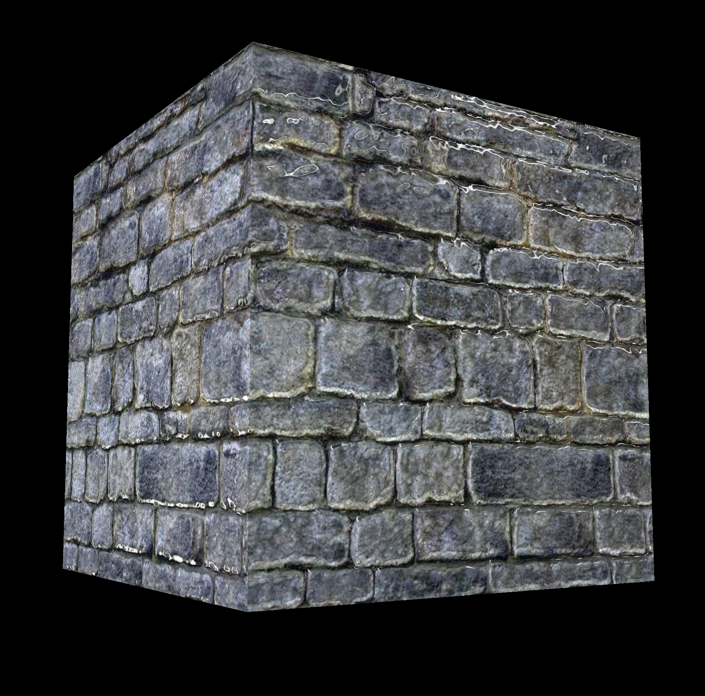
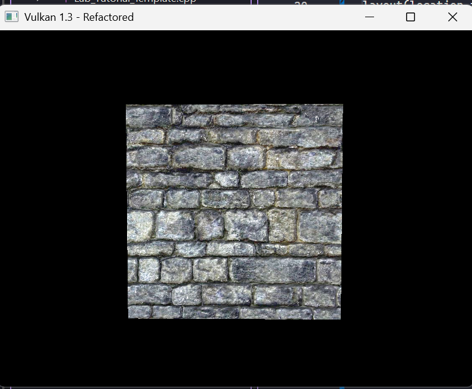

# Lab 6

## EXERCISE 1: PREPARING FOR TANGENT SPACE

I added the new parameters to the `vertex` struct.

```cpp
struct Vertex {
  glm::vec3 pos;
  glm::vec3 color;
  glm::vec3 normal;
  glm::vec2 texCoord;
  glm::vec3 tangent;
  glm::vec3 binormal;

  static VkVertexInputBindingDescription getBindingDescription() {
    VkVertexInputBindingDescription bindingDescription{};
    bindingDescription.binding = 0;
    bindingDescription.stride = sizeof(Vertex);
    bindingDescription.inputRate = VK_VERTEX_INPUT_RATE_VERTEX;
    return bindingDescription;
  }

  static std::array<VkVertexInputAttributeDescription, 6>
  getAttributeDescriptions() {
    std::array<VkVertexInputAttributeDescription, 6> attributeDescriptions{};
    attributeDescriptions[0] = {0, 0, VK_FORMAT_R32G32B32_SFLOAT,
                                offsetof(Vertex, pos)};
    attributeDescriptions[1] = {1, 0, VK_FORMAT_R32G32B32_SFLOAT,
                                offsetof(Vertex, color)};
    attributeDescriptions[2] = {2, 0, VK_FORMAT_R32G32B32_SFLOAT,
                                offsetof(Vertex, normal)};
    attributeDescriptions[3] = {3, 0, VK_FORMAT_R32G32_SFLOAT,
                                offsetof(Vertex, texCoord)};
    attributeDescriptions[4] = {4, 0, VK_FORMAT_R32G32B32_SFLOAT,
                                offsetof(Vertex, tangent)};
    attributeDescriptions[5] = {5, 0, VK_FORMAT_R32G32B32_SFLOAT,
                                offsetof(Vertex, binormal)};
    return attributeDescriptions;
  }
};
```

Then I modified my shapes for them, here is the `createCube()` method in my `GeometryGenerator` class (mind the formatting, it was visual studio).

```cpp
MeshData createCube(float size, const glm::vec3& color) {
  MeshData meshData;
  float h = size * 0.5f;

  meshData.vertices = {{{-h, -h, -h},
                        color,
                        glm::vec3(0.0f, 0.0f, -1.0f),
                        glm::vec2(0.0f, 1.0f),
                        glm::vec3(1.0f, 0.0f, 0.0f),
                        glm::vec3(0.0f, 1.0f, 0.0f)},
                       {{h, -h, -h},
                        color,
                        glm::vec3(0.0f, 0.0f, -1.0f),
                        glm::vec2(1.0f, 1.0f),
                        glm::vec3(1.0f, 0.0f, 0.0f),
                        glm::vec3(0.0f, 1.0f, 0.0f)},
                       {{h, h, -h},
                        color,
                        glm::vec3(0.0f, 0.0f, -1.0f),
                        glm::vec2(1.0f, 0.0f),
                        glm::vec3(1.0f, 0.0f, 0.0f),
                        glm::vec3(0.0f, 1.0f, 0.0f)},
                       {{-h, h, -h},
                        color,
                        glm::vec3(0.0f, 0.0f, -1.0f),
                        glm::vec2(0.0f, 0.0f),
                        glm::vec3(1.0f, 0.0f, 0.0f),
                        glm::vec3(0.0f, 1.0f, 0.0f)},

                       {{h, -h, -h},
                        color,
                        glm::vec3(1.0f, 0.0f, 0.0f),
                        glm::vec2(0.0f, 1.0f),
                        glm::vec3(0.0f, 0.0f, 1.0f),
                        glm::vec3(0.0f, 1.0f, 0.0f)},
                       {{h, -h, h},
                        color,
                        glm::vec3(1.0f, 0.0f, 0.0f),
                        glm::vec2(1.0f, 1.0f),
                        glm::vec3(0.0f, 0.0f, 1.0f),
                        glm::vec3(0.0f, 1.0f, 0.0f)},
                       {{h, h, h},
                        color,
                        glm::vec3(1.0f, 0.0f, 0.0f),
                        glm::vec2(1.0f, 0.0f),
                        glm::vec3(0.0f, 0.0f, 1.0f),
                        glm::vec3(0.0f, 1.0f, 0.0f)},
                       {{h, h, -h},
                        color,
                        glm::vec3(1.0f, 0.0f, 0.0f),
                        glm::vec2(0.0f, 0.0f),
                        glm::vec3(0.0f, 0.0f, 1.0f),
                        glm::vec3(0.0f, 1.0f, 0.0f)},

                       {{h, -h, h},
                        color,
                        glm::vec3(0.0f, 0.0f, 1.0f),
                        glm::vec2(0.0f, 1.0f),
                        glm::vec3(-1.0f, 0.0f, 0.0f),
                        glm::vec3(0.0f, 1.0f, 0.0f)},
                       {{-h, -h, h},
                        color,
                        glm::vec3(0.0f, 0.0f, 1.0f),
                        glm::vec2(1.0f, 1.0f),
                        glm::vec3(-1.0f, 0.0f, 0.0f),
                        glm::vec3(0.0f, 1.0f, 0.0f)},
                       {{-h, h, h},
                        color,
                        glm::vec3(0.0f, 0.0f, 1.0f),
                        glm::vec2(1.0f, 0.0f),
                        glm::vec3(-1.0f, 0.0f, 0.0f),
                        glm::vec3(0.0f, 1.0f, 0.0f)},
                       {{h, h, h},
                        color,
                        glm::vec3(0.0f, 0.0f, 1.0f),
                        glm::vec2(0.0f, 0.0f),
                        glm::vec3(-1.0f, 0.0f, 0.0f),
                        glm::vec3(0.0f, 1.0f, 0.0f)},

                       {{-h, -h, h},
                        color,
                        glm::vec3(-1.0f, 0.0f, 0.0f),
                        glm::vec2(0.0f, 1.0f),
                        glm::vec3(0.0f, 0.0f, -1.0f),
                        glm::vec3(0.0f, 1.0f, 0.0f)},
                       {{-h, -h, -h},
                        color,
                        glm::vec3(-1.0f, 0.0f, 0.0f),
                        glm::vec2(1.0f, 1.0f),
                        glm::vec3(0.0f, 0.0f, -1.0f),
                        glm::vec3(0.0f, 1.0f, 0.0f)},
                       {{-h, h, -h},
                        color,
                        glm::vec3(-1.0f, 0.0f, 0.0f),
                        glm::vec2(1.0f, 0.0f),
                        glm::vec3(0.0f, 0.0f, -1.0f),
                        glm::vec3(0.0f, 1.0f, 0.0f)},
                       {{-h, h, h},
                        color,
                        glm::vec3(-1.0f, 0.0f, 0.0f),
                        glm::vec2(0.0f, 0.0f),
                        glm::vec3(0.0f, 0.0f, -1.0f),
                        glm::vec3(0.0f, 1.0f, 0.0f)},

                       {{-h, h, -h},
                        color,
                        glm::vec3(0.0f, 1.0f, 0.0f),
                        glm::vec2(0.0f, 1.0f),
                        glm::vec3(1.0f, 0.0f, 0.0f),
                        glm::vec3(0.0f, 0.0f, 1.0f)},
                       {{h, h, -h},
                        color,
                        glm::vec3(0.0f, 1.0f, 0.0f),
                        glm::vec2(1.0f, 1.0f),
                        glm::vec3(1.0f, 0.0f, 0.0f),
                        glm::vec3(0.0f, 0.0f, 1.0f)},
                       {{h, h, h},
                        color,
                        glm::vec3(0.0f, 1.0f, 0.0f),
                        glm::vec2(1.0f, 0.0f),
                        glm::vec3(1.0f, 0.0f, 0.0f),
                        glm::vec3(0.0f, 0.0f, 1.0f)},
                       {{-h, h, h},
                        color,
                        glm::vec3(0.0f, 1.0f, 0.0f),
                        glm::vec2(0.0f, 0.0f),
                        glm::vec3(1.0f, 0.0f, 0.0f),
                        glm::vec3(0.0f, 0.0f, 1.0f)},

                       {{-h, -h, h},
                        color,
                        glm::vec3(0.0f, -1.0f, 0.0f),
                        glm::vec2(0.0f, 0.0f),
                        glm::vec3(1.0f, 0.0f, 0.0f),
                        glm::vec3(0.0f, 0.0f, 1.0f)},
                       {{h, -h, h},
                        color,
                        glm::vec3(0.0f, -1.0f, 0.0f),
                        glm::vec2(1.0f, 0.0f),
                        glm::vec3(1.0f, 0.0f, 0.0f),
                        glm::vec3(0.0f, 0.0f, 1.0f)},
                       {{h, -h, -h},
                        color,
                        glm::vec3(0.0f, -1.0f, 0.0f),
                        glm::vec2(1.0f, 1.0f),
                        glm::vec3(1.0f, 0.0f, 0.0f),
                        glm::vec3(0.0f, 0.0f, 1.0f)},
                       {{-h, -h, -h},
                        color,
                        glm::vec3(0.0f, -1.0f, 0.0f),
                        glm::vec2(0.0f, 1.0f),
                        glm::vec3(1.0f, 0.0f, 0.0f),
                        glm::vec3(0.0f, 0.0f, 1.0f)}};

  meshData.indices = {0,  2,  1,  0,  3,  2,  4,  6,  5,  4,  7,  6,
                      8,  10, 9,  8,  11, 10, 12, 14, 13, 12, 15, 14,
                      16, 18, 17, 16, 19, 18, 20, 22, 21, 20, 23, 22};

  return meshData;
}
```

### Reflection

This seems pretty straightforward just following what the brief expects, although with some changes because I made my `GeometryGenerator` class weeks ago. I also updated the other shapes but for brevity here left it out. This allows fancy spheres, terrains, grids, cylinders, and open boxes.

## EXERCISE 2: NORMAL MAPPING IMPLEMENTATION

We need to update the `shader.vert` and the `shader.frag` files.

```cpp
#version 450

layout(binding = 0) uniform UniformBufferObject {
    mat4 view;
    mat4 proj;
    vec3 light1Pos;
    vec3 light1Color;
    vec3 light2Pos;
    vec3 light2Color;
    vec3 eyePos;
} ubo;

layout(push_constant) uniform PushConstants {
    mat4 model;
    vec3 ambient;
    float padding1;
    vec3 diffuse;
    float padding2;
    vec3 specular;
    float shininess;
} pushConstants;

layout(location = 0) in vec3 inPosition;
layout(location = 1) in vec3 inColor;
layout(location = 2) in vec3 inNormal;
layout(location = 3) in vec2 inTexCoord;
layout(location = 4) in vec3 inTangent;
layout(location = 5) in vec3 inBinormal;

layout(location = 0) out vec3 fragColor;
layout(location = 1) out vec3 fragAmbient;
layout(location = 2) out vec3 fragSpecular;
layout(location = 3) out float fragShininess;
layout(location = 4) out vec2 fragTexCoord;
layout(location = 5) out vec3 fragLightPos_tangent;
layout(location = 6) out vec3 fragViewPos_tangent;
layout(location = 7) out vec3 fragPos_tangent;
layout(location = 8) out vec3 fragLight2Pos_tangent;
layout(location = 9) out vec3 fragLight1Color;
layout(location = 10) out vec3 fragLight2Color;

void main() {
    vec4 worldPos = pushConstants.model * vec4(inPosition, 1.0);
    gl_Position = ubo.proj * ubo.view * worldPos;

    mat4 ModelMatrix_TInv = transpose(inverse(pushConstants.model));
    vec3 T = normalize(mat3(ModelMatrix_TInv) * inTangent);
    vec3 B = normalize(mat3(ModelMatrix_TInv) * inBinormal);
    vec3 N = normalize(mat3(ModelMatrix_TInv) * inNormal);
    mat3 TBN = transpose(mat3(T, B, N));

    vec3 lightPos_world = ubo.light1Pos;
    vec3 light2Pos_world = ubo.light2Pos;
    vec3 viewPos_world = ubo.eyePos;
    vec3 fragPos_world = worldPos.xyz;

    fragLightPos_tangent = TBN * lightPos_world;
    fragLight2Pos_tangent = TBN * light2Pos_world;
    fragViewPos_tangent = TBN * viewPos_world;
    fragPos_tangent = TBN * fragPos_world;

    fragColor = inColor;
    fragAmbient = pushConstants.ambient;
    fragSpecular = pushConstants.specular;
    fragShininess = pushConstants.shininess;
    fragTexCoord = inTexCoord;
    fragLight1Color = ubo.light1Color;
    fragLight2Color = ubo.light2Color;
}
```

```cpp
#version 450

layout(binding = 1) uniform sampler2D colSampler;
layout(binding = 2) uniform sampler2D normalSampler;

layout(location = 0) in vec3 fragColor;
layout(location = 1) in vec3 fragAmbient;
layout(location = 2) in vec3 fragSpecular;
layout(location = 3) in float fragShininess;
layout(location = 4) in vec2 fragTexCoord;
layout(location = 5) in vec3 fragLightPos_tangent;
layout(location = 6) in vec3 fragViewPos_tangent;
layout(location = 7) in vec3 fragPos_tangent;
layout(location = 8) in vec3 fragLight2Pos_tangent;
layout(location = 9) in vec3 fragLight1Color;
layout(location = 10) in vec3 fragLight2Color;

layout(location = 0) out vec4 outColor;

vec3 calculateLight(vec3 lightPos_tangent, vec3 lightColor, vec3 N_tangent, vec3 viewDir, vec3 albedo) {
    vec3 lightDir = normalize(lightPos_tangent - fragPos_tangent);

    float diff = max(dot(N_tangent, lightDir), 0.0);
    vec3 diffuse = diff * albedo * lightColor;

    vec3 reflectDir = reflect(-lightDir, N_tangent);
    float spec = pow(max(dot(viewDir, reflectDir), 0.0), fragShininess);
    vec3 specular = spec * fragSpecular * lightColor;

    return diffuse + specular;
}

void main() {
    vec3 albedo = texture(colSampler, fragTexCoord).rgb;

    vec3 N_tangent = texture(normalSampler, fragTexCoord).rgb;
    N_tangent = normalize(N_tangent * 2.0 - 1.0);

    vec3 viewDir = normalize(fragViewPos_tangent - fragPos_tangent);

    vec3 ambient = fragAmbient * albedo;

    vec3 light1Contribution = calculateLight(fragLightPos_tangent, fragLight1Color, N_tangent, viewDir, albedo);
    vec3 light2Contribution = calculateLight(fragLight2Pos_tangent, fragLight2Color, N_tangent, viewDir, albedo);

    vec3 result = ambient + light1Contribution + light2Contribution;

    outColor = vec4(result, 1.0);
}
```

Then we can update `loadModel()` and `updateUniformBuffer()` to add the cube with some rotating lights.

```cpp
void loadModel() {
  RenderObject box;
  GeometryGenerator::MeshData boxMesh =
      GeometryGenerator::createCube(2.0f, glm::vec3(1.0f, 1.0f, 1.0f));
  box.vertices = boxMesh.vertices;
  box.indices = boxMesh.indices;

  box.transform = glm::mat4(1.0f);

  box.material.ambient = glm::vec3(0.3f, 0.3f, 0.3f);
  box.material.diffuse = glm::vec3(1.0f, 1.0f, 1.0f);
  box.material.specular = glm::vec3(1.0f, 1.0f, 1.0f);
  box.material.shininess = 128.0f;
  renderObjects.push_back(box);

  std::vector<Vertex> allVertices;
  std::vector<uint32_t> allIndices;
  for (auto& obj : renderObjects) {
    uint32_t vertexOffset = static_cast<uint32_t>(allVertices.size());
    allVertices.insert(allVertices.end(), obj.vertices.begin(),
                       obj.vertices.end());
    for (auto index : obj.indices) {
      allIndices.push_back(index + vertexOffset);
    }
  }
  vertices = allVertices;
  indices = allIndices;
}
```

```cpp
void HelloTriangleApplication::updateUniformBuffer(uint32_t currentImage) {
  static auto startTime = std::chrono::high_resolution_clock::now();
  auto currentTime = std::chrono::high_resolution_clock::now();
  float time = std::chrono::duration<float, std::chrono::seconds::period>(
                   currentTime - startTime)
                   .count();

  renderObjects[0].transform = glm::mat4(1.0f);

  float camX = cameraDistance * cos(cameraAngleV) * sin(cameraAngleH);
  float camY = cameraDistance * sin(cameraAngleV);
  float camZ = cameraDistance * cos(cameraAngleV) * cos(cameraAngleH);

  UniformBufferObject ubo{};
  ubo.view =
      glm::lookAt(glm::vec3(camX, camY, camZ), glm::vec3(0.0f, 0.0f, 0.0f),
                  glm::vec3(0.0f, 1.0f, 0.0f));
  ubo.proj = glm::perspective(
      glm::radians(45.0f),
      swapChainExtent.width / (float)swapChainExtent.height, 0.1f, 100.0f);
  ubo.proj[1][1] *= -1;

  float lightRadius = 8.0f;
  ubo.light1Pos = glm::vec3(lightRadius * sin(time * 0.5f), 5.0f,
                            lightRadius * cos(time * 0.5f));
  ubo.light1Color = glm::vec3(1.0f, 1.0f, 1.0f);

  ubo.light2Pos = glm::vec3(lightRadius * sin(time * 0.5f + 3.14159f), -3.0f,
                            lightRadius * cos(time * 0.5f + 3.14159f));
  ubo.light2Color = glm::vec3(0.6f, 0.6f, 0.8f);

  ubo.eyePos = glm::vec3(camX, camY, camZ);

  memcpy(uniformBuffersMapped[currentImage], &ubo, sizeof(ubo));
}
```

In this case, I am using my old `createTextureImage()` functions, one for the colour, the other one for the bump map.

```cpp
void HelloTriangleApplication::createTextureImage2() {
  int texWidth, texHeight, texChannels;
  stbi_uc* pixels = stbi_load("rockNormal.bmp", &texWidth, &texHeight, &texChannels,
                              STBI_rgb_alpha);
  VkDeviceSize imageSize = texWidth * texHeight * 4;

  if (!pixels) {
    throw std::runtime_error("failed to load texture image!");
  }

  VkBuffer stagingBuffer;
  VkDeviceMemory stagingBufferMemory;
  createBuffer(imageSize, VK_BUFFER_USAGE_TRANSFER_SRC_BIT,
               VK_MEMORY_PROPERTY_HOST_VISIBLE_BIT |
                   VK_MEMORY_PROPERTY_HOST_COHERENT_BIT,
               stagingBuffer, stagingBufferMemory);

  void* data;
  vkMapMemory(device, stagingBufferMemory, 0, imageSize, 0, &data);
  memcpy(data, pixels, static_cast<size_t>(imageSize));
  vkUnmapMemory(device, stagingBufferMemory);

  stbi_image_free(pixels);

  createImage(
      texWidth, texHeight, VK_FORMAT_R8G8B8A8_SRGB, VK_IMAGE_TILING_OPTIMAL,
      VK_IMAGE_USAGE_TRANSFER_DST_BIT | VK_IMAGE_USAGE_SAMPLED_BIT,
      VK_MEMORY_PROPERTY_DEVICE_LOCAL_BIT, textureImage2, textureImageMemory2);

  transitionImageLayout(textureImage2, VK_IMAGE_LAYOUT_UNDEFINED,
                        VK_IMAGE_LAYOUT_TRANSFER_DST_OPTIMAL,
                        VK_IMAGE_ASPECT_COLOR_BIT);
  copyBufferToImage(stagingBuffer, textureImage2,
                    static_cast<uint32_t>(texWidth),
                    static_cast<uint32_t>(texHeight));
  transitionImageLayout(textureImage2, VK_IMAGE_LAYOUT_TRANSFER_DST_OPTIMAL,
                        VK_IMAGE_LAYOUT_SHADER_READ_ONLY_OPTIMAL,
                        VK_IMAGE_ASPECT_COLOR_BIT);

  vkDestroyBuffer(device, stagingBuffer, nullptr);
  vkFreeMemory(device, stagingBufferMemory, nullptr);
}
```

This is the output I get:



### Reflection

I am quite happy with my results, however, the cube looks less 'bumpy' then I thought. To my untrained eye, it seems to be working all good, I think some parameters just might need adjusting. Also I think that while using my old functions were good just for the lab, ideally I would have a seperate function that handles normal maps specifically, ideally one that can be attached to an object or set of verticies with a file as its parameter or something like that. I suppose the real 'bumpiness' comes with height maps though.

## EXERCISE 3: HEIGHT MAP BUMPY EFFECT

I updated my fragment shader to interpret a height map instead of a normal map, exaggerated for effect.

```cpp
#version 450

layout(binding = 0) uniform UniformBufferObject {
    mat4 view;
    mat4 proj;
    vec3 light1Pos;
    vec3 light1Color;
    vec3 light2Pos;
    vec3 light2Color;
    vec3 eyePos;
} ubo;

layout(binding = 1) uniform sampler2D colSampler;
layout(binding = 2) uniform sampler2D heightSampler;

layout(location = 0) in vec3 fragColor;
layout(location = 1) in vec3 fragWorldPos;
layout(location = 2) in vec3 fragWorldNormal;
layout(location = 3) in vec3 fragAmbient;
layout(location = 4) in vec3 fragDiffuse;
layout(location = 5) in vec3 fragSpecular;
layout(location = 6) in float fragShininess;
layout(location = 7) in vec2 fragTexCoord;

layout(location = 0) out vec4 outColor;

vec3 calculateLight(vec3 lightPos, vec3 lightColor, vec3 Normal, vec3 viewDir, vec3 albedo) {
    vec3 lightDir = normalize(lightPos - fragWorldPos);

    float diff = max(dot(Normal, lightDir), 0.0);
    vec3 diffuse = diff * albedo * lightColor;

    vec3 reflectDir = reflect(-lightDir, Normal);
    float spec = pow(max(dot(viewDir, reflectDir), 0.0), fragShininess);
    vec3 specular = spec * fragSpecular * lightColor;

    return diffuse + specular;
}

void main() {
    vec3 albedo = texture(colSampler, fragTexCoord).rgb;

    float texelSize = 0.002;

    float h = texture(heightSampler, fragTexCoord).r;
    float hRight = texture(heightSampler, fragTexCoord + vec2(texelSize, 0.0)).r;
    float hUp = texture(heightSampler, fragTexCoord + vec2(0.0, texelSize)).r;

    float dFx = (hRight - h) * 10.0;
    float dFy = (hUp - h) * 10.0;

    float bumpHeight = 0.3;
    vec3 Normal = normalize(vec3(-dFx, -dFy, bumpHeight));

    vec3 viewDir = normalize(ubo.eyePos - fragWorldPos);

    vec3 ambient = fragAmbient * albedo * 0.2;

    vec3 light1Contribution = calculateLight(ubo.light1Pos, ubo.light1Color, Normal, viewDir, albedo);
    vec3 light2Contribution = calculateLight(ubo.light2Pos, ubo.light2Color, Normal, viewDir, albedo);

    vec3 result = ambient + light1Contribution + light2Contribution;

    outColor = vec4(result, 1.0);
}
```

And also the vertex shader needs simplifying:

```cpp
#version 450

layout(binding = 0) uniform UniformBufferObject {
    mat4 view;
    mat4 proj;
    vec3 light1Pos;
    vec3 light1Color;
    vec3 light2Pos;
    vec3 light2Color;
    vec3 eyePos;
} ubo;

layout(push_constant) uniform PushConstants {
    mat4 model;
    vec3 ambient;
    float padding1;
    vec3 diffuse;
    float padding2;
    vec3 specular;
    float shininess;
} pushConstants;

layout(location = 0) in vec3 inPosition;
layout(location = 1) in vec3 inColor;
layout(location = 2) in vec3 inNormal;
layout(location = 3) in vec2 inTexCoord;
layout(location = 4) in vec3 inTangent;
layout(location = 5) in vec3 inBinormal;

layout(location = 0) out vec3 fragColor;
layout(location = 1) out vec3 fragAmbient;
layout(location = 2) out vec3 fragSpecular;
layout(location = 3) out float fragShininess;
layout(location = 4) out vec2 fragTexCoord;
layout(location = 5) out vec3 fragLightPos_tangent;
layout(location = 6) out vec3 fragViewPos_tangent;
layout(location = 7) out vec3 fragPos_tangent;
layout(location = 8) out vec3 fragLight2Pos_tangent;
layout(location = 9) out vec3 fragLight1Color;
layout(location = 10) out
```

Then I can just change the file path from a normal map to a height map.

```cpp
void HelloTriangleApplication::createTextureImage2() {
  int texWidth, texHeight, texChannels;
  stbi_uc* pixels = stbi_load("rockheight.tga", &texWidth, &texHeight, &texChannels,
                              STBI_rgb_alpha);
  VkDeviceSize imageSize = texWidth * texHeight * 4;
  ...
```

This is the results:



### Reflection

I am still not overly thrilled with my implementation, and the architectural points still stand from the prior reflection, but again, to my untrained eye I can see the height map taking effect here. I think the reason I feel it to be disjointed is because my lighting may simply not be set up properly to showcase the heights of the objects.

## EXERCISE 4: PROCEDURAL NORMAL MAPPING

Using material from the lecture (and looking up some algorithms), I created this bumpy effect to add to my fragment shader:

```cpp
#version 450

layout(binding = 0) uniform UniformBufferObject {
    mat4 view;
    mat4 proj;
    vec3 light1Pos;
    vec3 light1Color;
    vec3 light2Pos;
    vec3 light2Color;
    vec3 eyePos;
} ubo;

layout(binding = 1) uniform sampler2D colSampler;
layout(binding = 2) uniform sampler2D heightSampler;

layout(location = 0) in vec3 fragColor;
layout(location = 1) in vec3 fragWorldPos;
layout(location = 2) in vec3 fragWorldNormal;
layout(location = 3) in vec3 fragAmbient;
layout(location = 4) in vec3 fragDiffuse;
layout(location = 5) in vec3 fragSpecular;
layout(location = 6) in float fragShininess;
layout(location = 7) in vec2 fragTexCoord;

layout(location = 0) out vec4 outColor;

vec3 calculateLight(vec3 lightPos, vec3 lightColor, vec3 Normal, vec3 viewDir, vec3 albedo) {
    vec3 lightDir = normalize(lightPos - fragWorldPos);

    float diff = max(dot(Normal, lightDir), 0.0);
    vec3 diffuse = diff * albedo * lightColor;

    vec3 reflectDir = reflect(-lightDir, Normal);
    float spec = pow(max(dot(viewDir, reflectDir), 0.0), fragShininess);
    vec3 specular = spec * fragSpecular * lightColor;

    return diffuse + specular;
}

void main() {
    vec3 albedo = texture(colSampler, fragTexCoord).rgb;

    float scale = 5.0;
    vec2 uv = fragTexCoord * scale;

    vec2 cellUV = fract(uv);
    vec2 cellCenter = vec2(0.5, 0.5);
    float dist = distance(cellUV, cellCenter);

    float height = smoothstep(0.5, 0.0, dist);

    float texelSize = 0.01;

    vec2 uvRight = (fragTexCoord + vec2(texelSize / scale, 0.0)) * scale;
    vec2 cellUVRight = fract(uvRight);
    float distRight = distance(cellUVRight, cellCenter);
    float heightRight = smoothstep(0.5, 0.0, distRight);

    vec2 uvUp = (fragTexCoord + vec2(0.0, texelSize / scale)) * scale;
    vec2 cellUVUp = fract(uvUp);
    float distUp = distance(cellUVUp, cellCenter);
    float heightUp = smoothstep(0.5, 0.0, distUp);

    float dFx = (heightRight - height) * 30.0;
    float dFy = (heightUp - height) * 30.0;

    float bumpHeight = 0.2;
    vec3 Normal = normalize(vec3(dFx, dFy, bumpHeight));

    vec3 viewDir = normalize(ubo.eyePos - fragWorldPos);

    vec3 ambient = fragAmbient * albedo * 0.2;

    vec3 light1Contribution = calculateLight(ubo.light1Pos, ubo.light1Color, Normal, viewDir, albedo);
    vec3 light2Contribution = calculateLight(ubo.light2Pos, ubo.light2Color, Normal, viewDir, albedo);

    vec3 result = ambient + light1Contribution + light2Contribution;

    outColor = vec4(result, 1.0);
}
```

This gives us this result.


## Lab 6 Reflection

Throughout this lab I have become a lot more familiar with normal and height maps, aswell as applying them to objects in 3D space. Furthermore, I really liked the procedural normal mapping and found that much more rewarding. I am very excited to use these methods when it comes to the final lab, as it allows for nice detailed lighting on objects without wasting precious polygons on them. For future reference, I will probably make a much nicer material system to use within the program that can do this a lot smoother than I can now. Furthermore, I think the reason behind my results being slightly underwhelming is due to my lighting setup rather than my implementation, though I could always be wrong.
