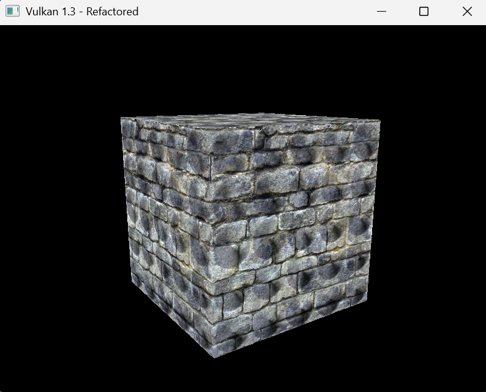
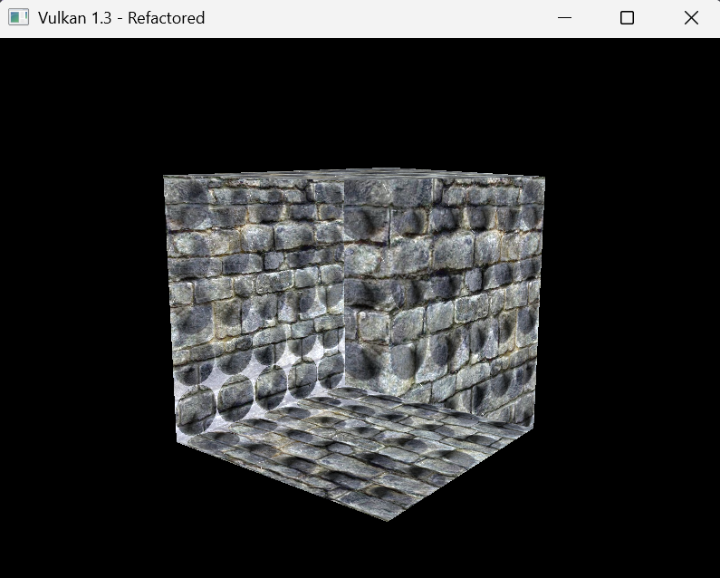
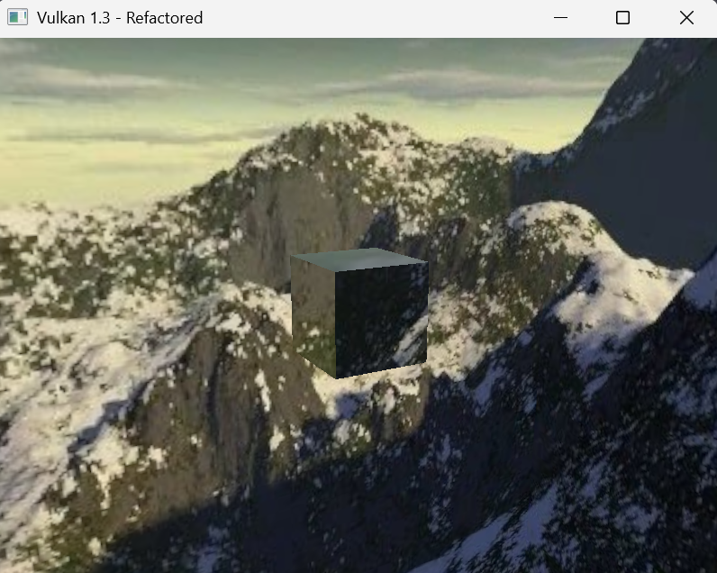
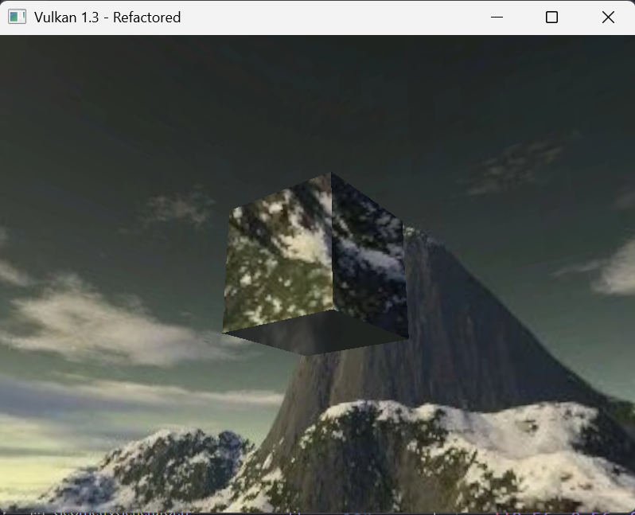
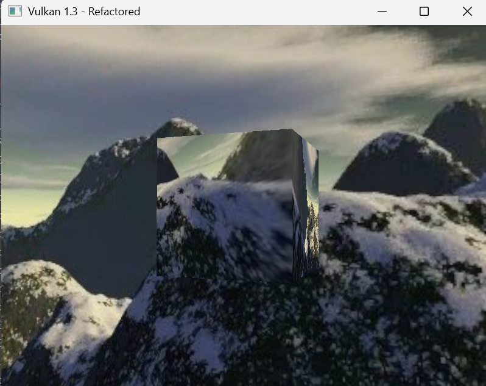
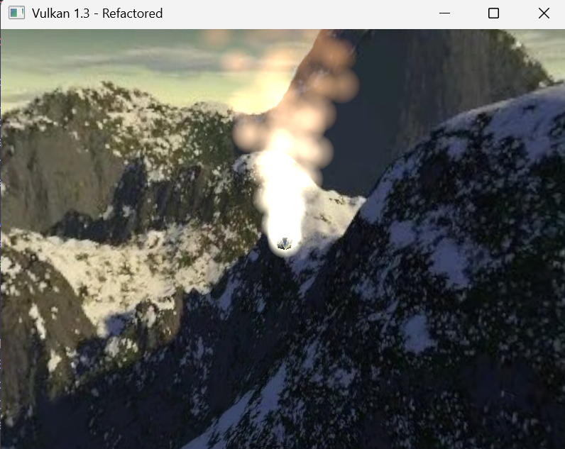

# Lab 7

## EXERCISE 1: IMPLEMENTING AND CONTROLLING THE DEPTH BUFFER

I had already set up a depth buffer a few weeks ago in my spare time because overtime I got annoyed by faces not occluding properly. Speaking to other students, I have heard this is quite common. For verification, here is my full `createGraphicsPipeline()` function:

```cpp
void HelloTriangleApplication::createGraphicsPipeline() {
  auto vertShaderCode = readFile("shaders/vert.spv");
  auto fragShaderCode = readFile("shaders/frag.spv");

  VkShaderModule vertShaderModule = createShaderModule(vertShaderCode);
  VkShaderModule fragShaderModule = createShaderModule(fragShaderCode);

  VkPipelineShaderStageCreateInfo vertShaderStageInfo{};
  vertShaderStageInfo.sType =
      VK_STRUCTURE_TYPE_PIPELINE_SHADER_STAGE_CREATE_INFO;
  vertShaderStageInfo.stage = VK_SHADER_STAGE_VERTEX_BIT;
  vertShaderStageInfo.module = vertShaderModule;
  vertShaderStageInfo.pName = "main";

  VkPipelineShaderStageCreateInfo fragShaderStageInfo{};
  fragShaderStageInfo.sType =
      VK_STRUCTURE_TYPE_PIPELINE_SHADER_STAGE_CREATE_INFO;
  fragShaderStageInfo.stage = VK_SHADER_STAGE_FRAGMENT_BIT;
  fragShaderStageInfo.module = fragShaderModule;
  fragShaderStageInfo.pName = "main";

  VkPipelineShaderStageCreateInfo shaderStages[] = {vertShaderStageInfo,
                                                    fragShaderStageInfo};

  VkPipelineVertexInputStateCreateInfo vertexInputInfo{};
  vertexInputInfo.sType =
      VK_STRUCTURE_TYPE_PIPELINE_VERTEX_INPUT_STATE_CREATE_INFO;

  auto bindingDescription = Vertex::getBindingDescription();
  auto attributeDescriptions = Vertex::getAttributeDescriptions();

  vertexInputInfo.vertexBindingDescriptionCount = 1;
  vertexInputInfo.vertexAttributeDescriptionCount =
      static_cast<uint32_t>(attributeDescriptions.size());
  vertexInputInfo.pVertexBindingDescriptions = &bindingDescription;
  vertexInputInfo.pVertexAttributeDescriptions = attributeDescriptions.data();

  VkPipelineInputAssemblyStateCreateInfo inputAssembly{};
  inputAssembly.sType =
      VK_STRUCTURE_TYPE_PIPELINE_INPUT_ASSEMBLY_STATE_CREATE_INFO;
  inputAssembly.topology = VK_PRIMITIVE_TOPOLOGY_TRIANGLE_LIST;
  inputAssembly.primitiveRestartEnable = VK_FALSE;

  VkPipelineViewportStateCreateInfo viewportState{};
  viewportState.sType = VK_STRUCTURE_TYPE_PIPELINE_VIEWPORT_STATE_CREATE_INFO;
  viewportState.viewportCount = 1;
  viewportState.scissorCount = 1;

  VkPipelineRasterizationStateCreateInfo rasterizer{};
  rasterizer.sType = VK_STRUCTURE_TYPE_PIPELINE_RASTERIZATION_STATE_CREATE_INFO;
  rasterizer.depthClampEnable = VK_FALSE;
  rasterizer.rasterizerDiscardEnable = VK_FALSE;
  rasterizer.polygonMode = currentPolygonMode;
  rasterizer.lineWidth = 1.0f;
  rasterizer.cullMode = VK_CULL_MODE_NONE;
  rasterizer.frontFace = VK_FRONT_FACE_COUNTER_CLOCKWISE;
  rasterizer.depthBiasEnable = VK_FALSE;

  VkPipelineMultisampleStateCreateInfo multisampling{};
  multisampling.sType =
      VK_STRUCTURE_TYPE_PIPELINE_MULTISAMPLE_STATE_CREATE_INFO;
  multisampling.sampleShadingEnable = VK_FALSE;
  multisampling.rasterizationSamples = VK_SAMPLE_COUNT_1_BIT;

  VkPipelineDepthStencilStateCreateInfo depthStencil{};
  depthStencil.sType =
      VK_STRUCTURE_TYPE_PIPELINE_DEPTH_STENCIL_STATE_CREATE_INFO;
  depthStencil.depthTestEnable = VK_TRUE;
  depthStencil.depthWriteEnable = VK_TRUE;
  depthStencil.depthCompareOp = VK_COMPARE_OP_LESS;
  depthStencil.depthBoundsTestEnable = VK_FALSE;
  depthStencil.stencilTestEnable = VK_FALSE;

  VkPipelineColorBlendAttachmentState colorBlendAttachment{};
  colorBlendAttachment.colorWriteMask =
      VK_COLOR_COMPONENT_R_BIT | VK_COLOR_COMPONENT_G_BIT |
      VK_COLOR_COMPONENT_B_BIT | VK_COLOR_COMPONENT_A_BIT;
  colorBlendAttachment.blendEnable = VK_FALSE;

  VkPipelineColorBlendStateCreateInfo colorBlending{};
  colorBlending.sType =
      VK_STRUCTURE_TYPE_PIPELINE_COLOR_BLEND_STATE_CREATE_INFO;
  colorBlending.logicOpEnable = VK_FALSE;
  colorBlending.logicOp = VK_LOGIC_OP_COPY;
  colorBlending.attachmentCount = 1;
  colorBlending.pAttachments = &colorBlendAttachment;
  colorBlending.blendConstants[0] = 0.0f;
  colorBlending.blendConstants[1] = 0.0f;
  colorBlending.blendConstants[2] = 0.0f;
  colorBlending.blendConstants[3] = 0.0f;

  std::vector<VkDynamicState> dynamicStates = {VK_DYNAMIC_STATE_VIEWPORT,
                                               VK_DYNAMIC_STATE_SCISSOR};
  VkPipelineDynamicStateCreateInfo dynamicState{};
  dynamicState.sType = VK_STRUCTURE_TYPE_PIPELINE_DYNAMIC_STATE_CREATE_INFO;
  dynamicState.dynamicStateCount = static_cast<uint32_t>(dynamicStates.size());
  dynamicState.pDynamicStates = dynamicStates.data();

  VkPushConstantRange pushConstantRange{};
  pushConstantRange.stageFlags = VK_SHADER_STAGE_VERTEX_BIT;
  pushConstantRange.offset = 0;
  pushConstantRange.size = sizeof(ModelPushConstant);

  VkPipelineLayoutCreateInfo pipelineLayoutInfo{};
  pipelineLayoutInfo.sType = VK_STRUCTURE_TYPE_PIPELINE_LAYOUT_CREATE_INFO;
  pipelineLayoutInfo.setLayoutCount = 1;
  pipelineLayoutInfo.pSetLayouts = &descriptorSetLayout;
  pipelineLayoutInfo.pushConstantRangeCount = 1;
  pipelineLayoutInfo.pPushConstantRanges = &pushConstantRange;

  if (vkCreatePipelineLayout(device, &pipelineLayoutInfo, nullptr,
                             &pipelineLayout) != VK_SUCCESS) {
    throw std::runtime_error("Failed to create pipeline layout!");
  }

  VkPipelineRenderingCreateInfo pipelineRenderingCreateInfo{};
  pipelineRenderingCreateInfo.sType =
      VK_STRUCTURE_TYPE_PIPELINE_RENDERING_CREATE_INFO;
  pipelineRenderingCreateInfo.colorAttachmentCount = 1;
  pipelineRenderingCreateInfo.pColorAttachmentFormats = &swapChainImageFormat;
  pipelineRenderingCreateInfo.depthAttachmentFormat = depthFormat;

  VkGraphicsPipelineCreateInfo pipelineInfo{};
  pipelineInfo.sType = VK_STRUCTURE_TYPE_GRAPHICS_PIPELINE_CREATE_INFO;
  pipelineInfo.pNext = &pipelineRenderingCreateInfo;
  pipelineInfo.stageCount = 2;
  pipelineInfo.pStages = shaderStages;
  pipelineInfo.pVertexInputState = &vertexInputInfo;
  pipelineInfo.pInputAssemblyState = &inputAssembly;
  pipelineInfo.pViewportState = &viewportState;
  pipelineInfo.pRasterizationState = &rasterizer;
  pipelineInfo.pMultisampleState = &multisampling;
  pipelineInfo.pDepthStencilState = &depthStencil;
  pipelineInfo.pColorBlendState = &colorBlending;
  pipelineInfo.pDynamicState = &dynamicState;
  pipelineInfo.layout = pipelineLayout;
  pipelineInfo.renderPass = VK_NULL_HANDLE;
  pipelineInfo.subpass = 0;
  pipelineInfo.basePipelineHandle = VK_NULL_HANDLE;

  if (vkCreateGraphicsPipelines(device, VK_NULL_HANDLE, 1, &pipelineInfo,
                                nullptr, &graphicsPipeline) != VK_SUCCESS) {
    throw std::runtime_error("Failed to create graphics pipeline!");
  }

  vkDestroyShaderModule(device, fragShaderModule, nullptr);
  vkDestroyShaderModule(device, vertShaderModule, nullptr);
}
```

I can see the depth buffer working by looking at this cube:



By changing this flag to false:

```cpp
depthStencil.depthTestEnable = VK_FALSE;
```

I can see the incorrect occlusion on the same cube:



## EXERCISE 2: IMPLEMENTING THE SKYBOX && EXERCISE 3: IMPLEMENTING REFLECTIONS

Instead of modifiying my `createImage()` function like the brief states, I would rather create a new pipeline that solely handles the skybox with things like `createSkyboxImage()`. Now that I have finished this, I think my methodology was very convoluted and confusing at times. I will admit AI helped me a lot with understanding this new pipeline I was creating and if I were to do it again, I would just modify my `createImage()` function. I just thought doing it this way would be more beneficial when I reach the final lab. Because I was having a lot of initial trouble with this section, I also ended up doing exercise 2 and 3 at once so I can better understand the method behind it.

I started by adding the necessary members to the class.

```cpp
 // Skybox Image stuff
 VkImage skyboxImage = VK_NULL_HANDLE;
 VkDeviceMemory skyboxImageMemory = VK_NULL_HANDLE;
 VkImageView skyboxImageView = VK_NULL_HANDLE;
 VkSampler skyboxSampler = VK_NULL_HANDLE;

 VkPipeline skyboxPipeline = VK_NULL_HANDLE;
 VkPipelineLayout skyboxPipelineLayout = VK_NULL_HANDLE;
 VkDescriptorSetLayout skyboxDescriptorSetLayout = VK_NULL_HANDLE;
 std::vector<VkDescriptorSet> skyboxDescriptorSets;

 VkBuffer skyboxVertexBuffer = VK_NULL_HANDLE;
 VkDeviceMemory skyboxVertexBufferMemory = VK_NULL_HANDLE;
 VkBuffer skyboxIndexBuffer = VK_NULL_HANDLE;
 VkDeviceMemory skyboxIndexBufferMemory = VK_NULL_HANDLE;

 void createSkyboxImage(const std::array<std::string, 6>& faceFiles);
 void createSkyboxImageView();
 void createSkyboxSampler();
 void createSkyboxDescriptorSetLayout();
 void createSkyboxPipeline();
 void createSkyboxGeometry();
 void createSkyboxDescriptorSets();
```

`createSkyboxImage` loads 6 separate images and combiles them into a single cubemap texture, each face is copied to a different array layer in the proper order.

```cpp
// Skybox image stuff
void HelloTriangleApplication::createSkyboxImage(
    const std::array<std::string, 6>& faceFiles) {
  int texWidth, texHeight, texChannels;
  stbi_uc* pixels = stbi_load(faceFiles[0].c_str(), &texWidth, &texHeight,
                              &texChannels, STBI_rgb_alpha);

  if (!pixels) {
    throw std::runtime_error("failed to load skybox face image!");
  }

  VkDeviceSize imageSize = texWidth * texHeight * 4;
  VkDeviceSize layerSize = imageSize;
  VkDeviceSize totalSize = layerSize * 6;

  stbi_image_free(pixels);

  VkBuffer stagingBuffer;
  VkDeviceMemory stagingBufferMemory;
  createBuffer(totalSize, VK_BUFFER_USAGE_TRANSFER_SRC_BIT,
               VK_MEMORY_PROPERTY_HOST_VISIBLE_BIT |
                   VK_MEMORY_PROPERTY_HOST_COHERENT_BIT,
               stagingBuffer, stagingBufferMemory);

  void* data;
  vkMapMemory(device, stagingBufferMemory, 0, totalSize, 0, &data);

  for (int i = 0; i < 6; i++) {
    pixels = stbi_load(faceFiles[i].c_str(), &texWidth, &texHeight,
                       &texChannels, STBI_rgb_alpha);
    if (!pixels) {
      throw std::runtime_error("failed to load skybox face image!");
    }
    memcpy(static_cast<char*>(data) + (layerSize * i), pixels,
           static_cast<size_t>(layerSize));
    stbi_image_free(pixels);
  }

  vkUnmapMemory(device, stagingBufferMemory);

  VkImageCreateInfo imageInfo{};
  imageInfo.sType = VK_STRUCTURE_TYPE_IMAGE_CREATE_INFO;
  imageInfo.imageType = VK_IMAGE_TYPE_2D;
  imageInfo.extent.width = texWidth;
  imageInfo.extent.height = texHeight;
  imageInfo.extent.depth = 1;
  imageInfo.mipLevels = 1;
  imageInfo.arrayLayers = 6;
  imageInfo.format = VK_FORMAT_R8G8B8A8_SRGB;
  imageInfo.tiling = VK_IMAGE_TILING_OPTIMAL;
  imageInfo.initialLayout = VK_IMAGE_LAYOUT_UNDEFINED;
  imageInfo.usage =
      VK_IMAGE_USAGE_TRANSFER_DST_BIT | VK_IMAGE_USAGE_SAMPLED_BIT;
  imageInfo.samples = VK_SAMPLE_COUNT_1_BIT;
  imageInfo.sharingMode = VK_SHARING_MODE_EXCLUSIVE;
  imageInfo.flags = VK_IMAGE_CREATE_CUBE_COMPATIBLE_BIT;

  if (vkCreateImage(device, &imageInfo, nullptr, &skyboxImage) != VK_SUCCESS) {
    throw std::runtime_error("failed to create skybox image!");
  }

  VkMemoryRequirements memRequirements;
  vkGetImageMemoryRequirements(device, skyboxImage, &memRequirements);

  VkMemoryAllocateInfo allocInfo{};
  allocInfo.sType = VK_STRUCTURE_TYPE_MEMORY_ALLOCATE_INFO;
  allocInfo.allocationSize = memRequirements.size;
  allocInfo.memoryTypeIndex = findMemoryType(
      memRequirements.memoryTypeBits, VK_MEMORY_PROPERTY_DEVICE_LOCAL_BIT);

  if (vkAllocateMemory(device, &allocInfo, nullptr, &skyboxImageMemory) !=
      VK_SUCCESS) {
    throw std::runtime_error("failed to allocate skybox image memory!");
  }

  vkBindImageMemory(device, skyboxImage, skyboxImageMemory, 0);

  VkCommandBuffer commandBuffer = beginSingleTimeCommands();

  VkImageMemoryBarrier barrier{};
  barrier.sType = VK_STRUCTURE_TYPE_IMAGE_MEMORY_BARRIER;
  barrier.oldLayout = VK_IMAGE_LAYOUT_UNDEFINED;
  barrier.newLayout = VK_IMAGE_LAYOUT_TRANSFER_DST_OPTIMAL;
  barrier.srcQueueFamilyIndex = VK_QUEUE_FAMILY_IGNORED;
  barrier.dstQueueFamilyIndex = VK_QUEUE_FAMILY_IGNORED;
  barrier.image = skyboxImage;
  barrier.subresourceRange.aspectMask = VK_IMAGE_ASPECT_COLOR_BIT;
  barrier.subresourceRange.baseMipLevel = 0;
  barrier.subresourceRange.levelCount = 1;
  barrier.subresourceRange.baseArrayLayer = 0;
  barrier.subresourceRange.layerCount = 6;
  barrier.srcAccessMask = 0;
  barrier.dstAccessMask = VK_ACCESS_TRANSFER_WRITE_BIT;

  vkCmdPipelineBarrier(commandBuffer, VK_PIPELINE_STAGE_TOP_OF_PIPE_BIT,
                       VK_PIPELINE_STAGE_TRANSFER_BIT, 0, 0, nullptr, 0,
                       nullptr, 1, &barrier);

  std::vector<VkBufferImageCopy> regions(6);
  for (int i = 0; i < 6; i++) {
    regions[i].bufferOffset = layerSize * i;
    regions[i].bufferRowLength = 0;
    regions[i].bufferImageHeight = 0;
    regions[i].imageSubresource.aspectMask = VK_IMAGE_ASPECT_COLOR_BIT;
    regions[i].imageSubresource.mipLevel = 0;
    regions[i].imageSubresource.baseArrayLayer = i;
    regions[i].imageSubresource.layerCount = 1;
    regions[i].imageOffset = {0, 0, 0};
    regions[i].imageExtent = {static_cast<uint32_t>(texWidth),
                              static_cast<uint32_t>(texHeight), 1};
  }

  vkCmdCopyBufferToImage(commandBuffer, stagingBuffer, skyboxImage,
                         VK_IMAGE_LAYOUT_TRANSFER_DST_OPTIMAL,
                         static_cast<uint32_t>(regions.size()), regions.data());

  barrier.oldLayout = VK_IMAGE_LAYOUT_TRANSFER_DST_OPTIMAL;
  barrier.newLayout = VK_IMAGE_LAYOUT_SHADER_READ_ONLY_OPTIMAL;
  barrier.srcAccessMask = VK_ACCESS_TRANSFER_WRITE_BIT;
  barrier.dstAccessMask = VK_ACCESS_SHADER_READ_BIT;

  vkCmdPipelineBarrier(commandBuffer, VK_PIPELINE_STAGE_TRANSFER_BIT,
                       VK_PIPELINE_STAGE_FRAGMENT_SHADER_BIT, 0, 0, nullptr, 0,
                       nullptr, 1, &barrier);

  endSingleTimeCommands(commandBuffer);

  vkDestroyBuffer(device, stagingBuffer, nullptr);
  vkFreeMemory(device, stagingBufferMemory, nullptr);
}
```

`createSkyboxImageView()` is used to create a view for accessing the cubemap texture in shaders.

```cpp
void HelloTriangleApplication::createSkyboxImageView() {
  VkImageViewCreateInfo viewInfo{};
  viewInfo.sType = VK_STRUCTURE_TYPE_IMAGE_VIEW_CREATE_INFO;
  viewInfo.image = skyboxImage;
  viewInfo.viewType = VK_IMAGE_VIEW_TYPE_CUBE;
  viewInfo.format = VK_FORMAT_R8G8B8A8_SRGB;
  viewInfo.subresourceRange.aspectMask = VK_IMAGE_ASPECT_COLOR_BIT;
  viewInfo.subresourceRange.baseMipLevel = 0;
  viewInfo.subresourceRange.levelCount = 1;
  viewInfo.subresourceRange.baseArrayLayer = 0;
  viewInfo.subresourceRange.layerCount = 6;

  if (vkCreateImageView(device, &viewInfo, nullptr, &skyboxImageView) !=
      VK_SUCCESS) {
    throw std::runtime_error("failed to create skybox image view!");
  }
}
```

`createSkyboxDescriptorSetLayout()` is similar to my other `createDescriptorSetLayout()`, it defines what resources the skybox shaders can access.

```cpp
void HelloTriangleApplication::createSkyboxDescriptorSetLayout() {
  VkDescriptorSetLayoutBinding uboLayoutBinding{};
  uboLayoutBinding.binding = 0;
  uboLayoutBinding.descriptorCount = 1;
  uboLayoutBinding.descriptorType = VK_DESCRIPTOR_TYPE_UNIFORM_BUFFER;
  uboLayoutBinding.pImmutableSamplers = nullptr;
  uboLayoutBinding.stageFlags =
      VK_SHADER_STAGE_VERTEX_BIT | VK_SHADER_STAGE_FRAGMENT_BIT;

  VkDescriptorSetLayoutBinding samplerLayoutBinding{};
  samplerLayoutBinding.binding = 1;
  samplerLayoutBinding.descriptorCount = 1;
  samplerLayoutBinding.descriptorType =
      VK_DESCRIPTOR_TYPE_COMBINED_IMAGE_SAMPLER;
  samplerLayoutBinding.pImmutableSamplers = nullptr;
  samplerLayoutBinding.stageFlags = VK_SHADER_STAGE_FRAGMENT_BIT;

  std::array<VkDescriptorSetLayoutBinding, 2> bindings = {uboLayoutBinding,
                                                          samplerLayoutBinding};

  VkDescriptorSetLayoutCreateInfo layoutInfo{};
  layoutInfo.sType = VK_STRUCTURE_TYPE_DESCRIPTOR_SET_LAYOUT_CREATE_INFO;
  layoutInfo.bindingCount = static_cast<uint32_t>(bindings.size());
  layoutInfo.pBindings = bindings.data();

  if (vkCreateDescriptorSetLayout(device, &layoutInfo, nullptr,
                                  &skyboxDescriptorSetLayout) != VK_SUCCESS) {
    throw std::runtime_error("failed to create skybox descriptor set layout!");
  }
}
```

`createSkyboxPipeline()` is basically just creating a specialised rendering pipeline for the skybox, much simpler because it only handles the skybox.

```cpp
void HelloTriangleApplication::createSkyboxPipeline() {
  auto vertShaderCode = readFile("shaders/skybox_vert.spv");
  auto fragShaderCode = readFile("shaders/skybox_frag.spv");

  VkShaderModule vertShaderModule = createShaderModule(vertShaderCode);
  VkShaderModule fragShaderModule = createShaderModule(fragShaderCode);

  VkPipelineShaderStageCreateInfo vertShaderStageInfo{};
  vertShaderStageInfo.sType =
      VK_STRUCTURE_TYPE_PIPELINE_SHADER_STAGE_CREATE_INFO;
  vertShaderStageInfo.stage = VK_SHADER_STAGE_VERTEX_BIT;
  vertShaderStageInfo.module = vertShaderModule;
  vertShaderStageInfo.pName = "main";

  VkPipelineShaderStageCreateInfo fragShaderStageInfo{};
  fragShaderStageInfo.sType =
      VK_STRUCTURE_TYPE_PIPELINE_SHADER_STAGE_CREATE_INFO;
  fragShaderStageInfo.stage = VK_SHADER_STAGE_FRAGMENT_BIT;
  fragShaderStageInfo.module = fragShaderModule;
  fragShaderStageInfo.pName = "main";

  VkPipelineShaderStageCreateInfo shaderStages[] = {vertShaderStageInfo,
                                                    fragShaderStageInfo};

  VkPipelineVertexInputStateCreateInfo vertexInputInfo{};
  vertexInputInfo.sType =
      VK_STRUCTURE_TYPE_PIPELINE_VERTEX_INPUT_STATE_CREATE_INFO;
  auto bindingDescription = Vertex::getBindingDescription();
  auto attributeDescriptions = Vertex::getAttributeDescriptions();
  vertexInputInfo.vertexBindingDescriptionCount = 1;
  vertexInputInfo.vertexAttributeDescriptionCount =
      static_cast<uint32_t>(attributeDescriptions.size());
  vertexInputInfo.pVertexBindingDescriptions = &bindingDescription;
  vertexInputInfo.pVertexAttributeDescriptions = attributeDescriptions.data();

  VkPipelineInputAssemblyStateCreateInfo inputAssembly{};
  inputAssembly.sType =
      VK_STRUCTURE_TYPE_PIPELINE_INPUT_ASSEMBLY_STATE_CREATE_INFO;
  inputAssembly.topology = VK_PRIMITIVE_TOPOLOGY_TRIANGLE_LIST;
  inputAssembly.primitiveRestartEnable = VK_FALSE;

  VkPipelineViewportStateCreateInfo viewportState{};
  viewportState.sType = VK_STRUCTURE_TYPE_PIPELINE_VIEWPORT_STATE_CREATE_INFO;
  viewportState.viewportCount = 1;
  viewportState.scissorCount = 1;

  VkPipelineRasterizationStateCreateInfo rasterizer{};
  rasterizer.sType = VK_STRUCTURE_TYPE_PIPELINE_RASTERIZATION_STATE_CREATE_INFO;
  rasterizer.depthClampEnable = VK_FALSE;
  rasterizer.rasterizerDiscardEnable = VK_FALSE;
  rasterizer.polygonMode = VK_POLYGON_MODE_FILL;
  rasterizer.lineWidth = 1.0f;
  rasterizer.cullMode = VK_CULL_MODE_NONE;
  rasterizer.frontFace = VK_FRONT_FACE_COUNTER_CLOCKWISE;
  rasterizer.depthBiasEnable = VK_FALSE;

  VkPipelineMultisampleStateCreateInfo multisampling{};
  multisampling.sType =
      VK_STRUCTURE_TYPE_PIPELINE_MULTISAMPLE_STATE_CREATE_INFO;
  multisampling.sampleShadingEnable = VK_FALSE;
  multisampling.rasterizationSamples = VK_SAMPLE_COUNT_1_BIT;

  VkPipelineDepthStencilStateCreateInfo depthStencil{};
  depthStencil.sType =
      VK_STRUCTURE_TYPE_PIPELINE_DEPTH_STENCIL_STATE_CREATE_INFO;
  depthStencil.depthTestEnable = VK_TRUE;
  depthStencil.depthWriteEnable = VK_FALSE;
  depthStencil.depthCompareOp = VK_COMPARE_OP_LESS_OR_EQUAL;
  depthStencil.depthBoundsTestEnable = VK_FALSE;
  depthStencil.stencilTestEnable = VK_FALSE;

  VkPipelineColorBlendAttachmentState colorBlendAttachment{};
  colorBlendAttachment.colorWriteMask =
      VK_COLOR_COMPONENT_R_BIT | VK_COLOR_COMPONENT_G_BIT |
      VK_COLOR_COMPONENT_B_BIT | VK_COLOR_COMPONENT_A_BIT;
  colorBlendAttachment.blendEnable = VK_FALSE;

  VkPipelineColorBlendStateCreateInfo colorBlending{};
  colorBlending.sType =
      VK_STRUCTURE_TYPE_PIPELINE_COLOR_BLEND_STATE_CREATE_INFO;
  colorBlending.logicOpEnable = VK_FALSE;
  colorBlending.logicOp = VK_LOGIC_OP_COPY;
  colorBlending.attachmentCount = 1;
  colorBlending.pAttachments = &colorBlendAttachment;

  std::vector<VkDynamicState> dynamicStates = {VK_DYNAMIC_STATE_VIEWPORT,
                                               VK_DYNAMIC_STATE_SCISSOR};

  VkPipelineDynamicStateCreateInfo dynamicState{};
  dynamicState.sType = VK_STRUCTURE_TYPE_PIPELINE_DYNAMIC_STATE_CREATE_INFO;
  dynamicState.dynamicStateCount = static_cast<uint32_t>(dynamicStates.size());
  dynamicState.pDynamicStates = dynamicStates.data();

  VkPipelineLayoutCreateInfo pipelineLayoutInfo{};
  pipelineLayoutInfo.sType = VK_STRUCTURE_TYPE_PIPELINE_LAYOUT_CREATE_INFO;
  pipelineLayoutInfo.setLayoutCount = 1;
  pipelineLayoutInfo.pSetLayouts = &skyboxDescriptorSetLayout;

  if (vkCreatePipelineLayout(device, &pipelineLayoutInfo, nullptr,
                             &skyboxPipelineLayout) != VK_SUCCESS) {
    throw std::runtime_error("failed to create skybox pipeline layout!");
  }

  VkPipelineRenderingCreateInfo pipelineRenderingCreateInfo{};
  pipelineRenderingCreateInfo.sType =
      VK_STRUCTURE_TYPE_PIPELINE_RENDERING_CREATE_INFO;
  pipelineRenderingCreateInfo.colorAttachmentCount = 1;
  pipelineRenderingCreateInfo.pColorAttachmentFormats = &swapChainImageFormat;
  pipelineRenderingCreateInfo.depthAttachmentFormat = depthFormat;

  VkGraphicsPipelineCreateInfo pipelineInfo{};
  pipelineInfo.sType = VK_STRUCTURE_TYPE_GRAPHICS_PIPELINE_CREATE_INFO;
  pipelineInfo.pNext = &pipelineRenderingCreateInfo;
  pipelineInfo.stageCount = 2;
  pipelineInfo.pStages = shaderStages;
  pipelineInfo.pVertexInputState = &vertexInputInfo;
  pipelineInfo.pInputAssemblyState = &inputAssembly;
  pipelineInfo.pViewportState = &viewportState;
  pipelineInfo.pRasterizationState = &rasterizer;
  pipelineInfo.pMultisampleState = &multisampling;
  pipelineInfo.pDepthStencilState = &depthStencil;
  pipelineInfo.pColorBlendState = &colorBlending;
  pipelineInfo.pDynamicState = &dynamicState;
  pipelineInfo.layout = skyboxPipelineLayout;
  pipelineInfo.renderPass = VK_NULL_HANDLE;
  pipelineInfo.subpass = 0;
  pipelineInfo.basePipelineHandle = VK_NULL_HANDLE;

  if (vkCreateGraphicsPipelines(device, VK_NULL_HANDLE, 1, &pipelineInfo,
                                nullptr, &skyboxPipeline) != VK_SUCCESS) {
    throw std::runtime_error("failed to create skybox graphics pipeline!");
  }

  vkDestroyShaderModule(device, fragShaderModule, nullptr);
  vkDestroyShaderModule(device, vertShaderModule, nullptr);
}
```

`createSkyboxGeometry()` creates a unit cube centered at origin for the skybox. I am unsure of if it would be better to add it as a function to my `GeometryGenerator` class, then use `loadModel()` and specially assign it as the skybox, but for now this works.

```cpp
void HelloTriangleApplication::createSkyboxGeometry() {
  std::vector<Vertex> skyboxVertices = {
      {{-1.0f, 1.0f, -1.0f}, {}, {}, {}, {}, {}},
      {{-1.0f, -1.0f, -1.0f}, {}, {}, {}, {}, {}},
      {{1.0f, -1.0f, -1.0f}, {}, {}, {}, {}, {}},
      {{1.0f, 1.0f, -1.0f}, {}, {}, {}, {}, {}},
      {{-1.0f, -1.0f, 1.0f}, {}, {}, {}, {}, {}},
      {{-1.0f, 1.0f, 1.0f}, {}, {}, {}, {}, {}},
      {{1.0f, -1.0f, 1.0f}, {}, {}, {}, {}, {}},
      {{1.0f, 1.0f, 1.0f}, {}, {}, {}, {}, {}}};

  std::vector<uint32_t> skyboxIndices = {0, 1, 2, 2, 3, 0, 4, 5, 6, 6, 5, 7,
                                         0, 5, 4, 4, 1, 0, 2, 6, 7, 7, 3, 2,
                                         0, 3, 7, 7, 5, 0, 1, 4, 6, 6, 2, 1};

  VkDeviceSize vertexBufferSize =
      sizeof(skyboxVertices[0]) * skyboxVertices.size();
  VkBuffer vertexStagingBuffer;
  VkDeviceMemory vertexStagingBufferMemory;

  createBuffer(vertexBufferSize, VK_BUFFER_USAGE_TRANSFER_SRC_BIT,
               VK_MEMORY_PROPERTY_HOST_VISIBLE_BIT |
                   VK_MEMORY_PROPERTY_HOST_COHERENT_BIT,
               vertexStagingBuffer, vertexStagingBufferMemory);

  void* data;
  vkMapMemory(device, vertexStagingBufferMemory, 0, vertexBufferSize, 0, &data);
  memcpy(data, skyboxVertices.data(), (size_t)vertexBufferSize);
  vkUnmapMemory(device, vertexStagingBufferMemory);

  createBuffer(
      vertexBufferSize,
      VK_BUFFER_USAGE_TRANSFER_DST_BIT | VK_BUFFER_USAGE_VERTEX_BUFFER_BIT,
      VK_MEMORY_PROPERTY_DEVICE_LOCAL_BIT, skyboxVertexBuffer,
      skyboxVertexBufferMemory);

  copyBuffer(vertexStagingBuffer, skyboxVertexBuffer, vertexBufferSize);

  vkDestroyBuffer(device, vertexStagingBuffer, nullptr);
  vkFreeMemory(device, vertexStagingBufferMemory, nullptr);

  VkDeviceSize indexBufferSize =
      sizeof(skyboxIndices[0]) * skyboxIndices.size();
  VkBuffer indexStagingBuffer;
  VkDeviceMemory indexStagingBufferMemory;

  createBuffer(indexBufferSize, VK_BUFFER_USAGE_TRANSFER_SRC_BIT,
               VK_MEMORY_PROPERTY_HOST_VISIBLE_BIT |
                   VK_MEMORY_PROPERTY_HOST_COHERENT_BIT,
               indexStagingBuffer, indexStagingBufferMemory);

  vkMapMemory(device, indexStagingBufferMemory, 0, indexBufferSize, 0, &data);
  memcpy(data, skyboxIndices.data(), (size_t)indexBufferSize);
  vkUnmapMemory(device, indexStagingBufferMemory);

  createBuffer(
      indexBufferSize,
      VK_BUFFER_USAGE_TRANSFER_DST_BIT | VK_BUFFER_USAGE_INDEX_BUFFER_BIT,
      VK_MEMORY_PROPERTY_DEVICE_LOCAL_BIT, skyboxIndexBuffer,
      skyboxIndexBufferMemory);

  copyBuffer(indexStagingBuffer, skyboxIndexBuffer, indexBufferSize);

  vkDestroyBuffer(device, indexStagingBuffer, nullptr);
  vkFreeMemory(device, indexStagingBufferMemory, nullptr);
}
```

`createSkyboxDescriptorSets()` binds the actual resources to the descriptor set layout. binding 0 links to the same UBO used by main object while binding 1 links the skybox image view to the sampler.

```cpp
void HelloTriangleApplication::createSkyboxDescriptorSets() {
  std::vector<VkDescriptorSetLayout> layouts(MAX_FRAMES_IN_FLIGHT,
                                             skyboxDescriptorSetLayout);

  VkDescriptorSetAllocateInfo allocInfo{};
  allocInfo.sType = VK_STRUCTURE_TYPE_DESCRIPTOR_SET_ALLOCATE_INFO;
  allocInfo.descriptorPool = descriptorPool;
  allocInfo.descriptorSetCount = static_cast<uint32_t>(MAX_FRAMES_IN_FLIGHT);
  allocInfo.pSetLayouts = layouts.data();

  skyboxDescriptorSets.resize(MAX_FRAMES_IN_FLIGHT);
  if (vkAllocateDescriptorSets(device, &allocInfo,
                               skyboxDescriptorSets.data()) != VK_SUCCESS) {
    throw std::runtime_error("failed to allocate skybox descriptor sets!");
  }

  for (size_t i = 0; i < MAX_FRAMES_IN_FLIGHT; i++) {
    VkDescriptorBufferInfo bufferInfo{};
    bufferInfo.buffer = uniformBuffers[i];
    bufferInfo.offset = 0;
    bufferInfo.range = sizeof(UniformBufferObject);

    VkDescriptorImageInfo imageInfo{};
    imageInfo.imageLayout = VK_IMAGE_LAYOUT_SHADER_READ_ONLY_OPTIMAL;
    imageInfo.imageView = skyboxImageView;
    imageInfo.sampler = skyboxSampler;

    std::array<VkWriteDescriptorSet, 2> descriptorWrites{};

    descriptorWrites[0].sType = VK_STRUCTURE_TYPE_WRITE_DESCRIPTOR_SET;
    descriptorWrites[0].dstSet = skyboxDescriptorSets[i];
    descriptorWrites[0].dstBinding = 0;
    descriptorWrites[0].dstArrayElement = 0;
    descriptorWrites[0].descriptorType = VK_DESCRIPTOR_TYPE_UNIFORM_BUFFER;
    descriptorWrites[0].descriptorCount = 1;
    descriptorWrites[0].pBufferInfo = &bufferInfo;

    descriptorWrites[1].sType = VK_STRUCTURE_TYPE_WRITE_DESCRIPTOR_SET;
    descriptorWrites[1].dstSet = skyboxDescriptorSets[i];
    descriptorWrites[1].dstBinding = 1;
    descriptorWrites[1].dstArrayElement = 0;
    descriptorWrites[1].descriptorType =
        VK_DESCRIPTOR_TYPE_COMBINED_IMAGE_SAMPLER;
    descriptorWrites[1].descriptorCount = 1;
    descriptorWrites[1].pImageInfo = &imageInfo;

    vkUpdateDescriptorSets(device,
                           static_cast<uint32_t>(descriptorWrites.size()),
                           descriptorWrites.data(), 0, nullptr);
  }
}
```

Then, I made two new shaders, `skybox.vert` and `skybox.frag`. I made them auto compile into .spv files when the code builds, similar to the existing shaders. `skybox.vert` positions the skybox so it appears infinitely far away, ensuring that the skybox moves with camera rotation but not translation.

```cpp
#version 450

layout(binding = 0) uniform UniformBufferObject {
    mat4 view;
    mat4 proj;
    vec3 light1Pos;
    vec3 light1Color;
    vec3 light2Pos;
    vec3 light2Color;
    vec3 eyePos;
} ubo;

layout(location = 0) in vec3 inPosition;

layout(location = 0) out vec3 fragTexCoord;

void main() {
    fragTexCoord = inPosition;

    mat3 viewRotation = mat3(ubo.view);
    vec4 pos = ubo.proj * vec4(viewRotation * inPosition, 1.0);

    gl_Position = pos;
}
```

`skybox.frag` samples the cubemap using the the vertex position as a direction vector.

```cpp
#version 450

layout(binding = 1) uniform samplerCube skySampler;

layout(location = 0) in vec3 fragTexCoord;

layout(location = 0) out vec4 outColor;

void main() {
    outColor = texture(skySampler, fragTexCoord);
}
```

The regular `shader.frag` needed updating to handle binding 3 for the cubemap so objects can access it for reflections.

```cpp
#version 450

layout(binding = 0) uniform UniformBufferObject {
    mat4 view;
    mat4 proj;
    vec3 light1Pos;
    vec3 light1Color;
    vec3 light2Pos;
    vec3 light2Color;
    vec3 eyePos;
} ubo;

layout(binding = 1) uniform sampler2D colSampler;
layout(binding = 2) uniform sampler2D heightSampler;
layout(binding = 3) uniform samplerCube skySampler;

layout(location = 0) in vec3 fragColor;
layout(location = 1) in vec3 fragWorldPos;
layout(location = 2) in vec3 fragWorldNormal;
layout(location = 3) in vec3 fragAmbient;
layout(location = 4) in vec3 fragDiffuse;
layout(location = 5) in vec3 fragSpecular;
layout(location = 6) in float fragShininess;
layout(location = 7) in vec2 fragTexCoord;

layout(location = 0) out vec4 outColor;

void main() {
    vec3 N = normalize(fragWorldNormal);
    vec3 V = normalize(ubo.eyePos - fragWorldPos);

    vec3 R = reflect(-V, N);

    vec3 reflectionColor = texture(skySampler, R).rgb;

    outColor = vec4(reflectionColor, 1.0);
}
```

Then, with more trivial updates to `initVulkan()` and `recordCommandBuffer()` we get this result:



Because of my methodology, I am sure that this approach is not the most efficient way to do things. However, I am still quite pleased by the end results of this exercise.

## EXERCISE 4: IMPLEMENTING REFRACTION

Refraction proved much more difficult than it needed to be. I initially had the cube refract on a per-face basis, meanign that each cube face is independentely refracting its view of the skybox. This is not desired, as the lab sheet explicitly says that it should act as a uniform block of glass.



So then I created a new mesh where it computed the refraction direction per-vertex with interpolated normals, so that the refraction on the cube has normals that blend across faces. Trying this, then flipping the skybox on the cube so it is not upside down brought these results:



This is slightly better but still not desirable, I think the issue is more fundamental but I may be wrong, I will have to return to this properly in my free time and re-do how I have set up my skybox.

## EXERCISE 5: SPRITE-BASED PARTICLE SYSTEM

```cpp
  // particle stuff
  VkPipeline particlePipeline = VK_NULL_HANDLE;
  VkPipelineLayout particlePipelineLayout = VK_NULL_HANDLE;

  VkBuffer particleVertexBuffer = VK_NULL_HANDLE;
  VkDeviceMemory particleVertexBufferMemory = VK_NULL_HANDLE;
  VkBuffer particleIndexBuffer = VK_NULL_HANDLE;
  VkDeviceMemory particleIndexBufferMemory = VK_NULL_HANDLE;

  struct ParticlePushConstant {
    float time;
  };
```

I then added them to `initVulkan()` and `cleanup()`. `createParticlePipeline()` is a specialised graphics pipeline for particles, with particles testing against solid objects but not blocking eachother.

```cpp
// particle functions
void HelloTriangleApplication::createParticlePipeline() {
  auto vertShaderCode = readFile("shaders/particle_vert.spv");
  auto fragShaderCode = readFile("shaders/particle_frag.spv");

  VkShaderModule vertShaderModule = createShaderModule(vertShaderCode);
  VkShaderModule fragShaderModule = createShaderModule(fragShaderCode);

  VkPipelineShaderStageCreateInfo vertShaderStageInfo{};
  vertShaderStageInfo.sType =
      VK_STRUCTURE_TYPE_PIPELINE_SHADER_STAGE_CREATE_INFO;
  vertShaderStageInfo.stage = VK_SHADER_STAGE_VERTEX_BIT;
  vertShaderStageInfo.module = vertShaderModule;
  vertShaderStageInfo.pName = "main";

  VkPipelineShaderStageCreateInfo fragShaderStageInfo{};
  fragShaderStageInfo.sType =
      VK_STRUCTURE_TYPE_PIPELINE_SHADER_STAGE_CREATE_INFO;
  fragShaderStageInfo.stage = VK_SHADER_STAGE_FRAGMENT_BIT;
  fragShaderStageInfo.module = fragShaderModule;
  fragShaderStageInfo.pName = "main";

  VkPipelineShaderStageCreateInfo shaderStages[] = {vertShaderStageInfo,
                                                    fragShaderStageInfo};

  VkPipelineVertexInputStateCreateInfo vertexInputInfo{};
  vertexInputInfo.sType =
      VK_STRUCTURE_TYPE_PIPELINE_VERTEX_INPUT_STATE_CREATE_INFO;
  auto bindingDescription = Vertex::getBindingDescription();
  auto attributeDescriptions = Vertex::getAttributeDescriptions();
  vertexInputInfo.vertexBindingDescriptionCount = 1;
  vertexInputInfo.vertexAttributeDescriptionCount =
      static_cast<uint32_t>(attributeDescriptions.size());
  vertexInputInfo.pVertexBindingDescriptions = &bindingDescription;
  vertexInputInfo.pVertexAttributeDescriptions = attributeDescriptions.data();

  VkPipelineInputAssemblyStateCreateInfo inputAssembly{};
  inputAssembly.sType =
      VK_STRUCTURE_TYPE_PIPELINE_INPUT_ASSEMBLY_STATE_CREATE_INFO;
  inputAssembly.topology = VK_PRIMITIVE_TOPOLOGY_TRIANGLE_LIST;
  inputAssembly.primitiveRestartEnable = VK_FALSE;

  VkPipelineViewportStateCreateInfo viewportState{};
  viewportState.sType = VK_STRUCTURE_TYPE_PIPELINE_VIEWPORT_STATE_CREATE_INFO;
  viewportState.viewportCount = 1;
  viewportState.scissorCount = 1;

  VkPipelineRasterizationStateCreateInfo rasterizer{};
  rasterizer.sType = VK_STRUCTURE_TYPE_PIPELINE_RASTERIZATION_STATE_CREATE_INFO;
  rasterizer.depthClampEnable = VK_FALSE;
  rasterizer.rasterizerDiscardEnable = VK_FALSE;
  rasterizer.polygonMode = VK_POLYGON_MODE_FILL;
  rasterizer.lineWidth = 1.0f;
  rasterizer.cullMode = VK_CULL_MODE_NONE;
  rasterizer.frontFace = VK_FRONT_FACE_COUNTER_CLOCKWISE;
  rasterizer.depthBiasEnable = VK_FALSE;

  VkPipelineMultisampleStateCreateInfo multisampling{};
  multisampling.sType =
      VK_STRUCTURE_TYPE_PIPELINE_MULTISAMPLE_STATE_CREATE_INFO;
  multisampling.sampleShadingEnable = VK_FALSE;
  multisampling.rasterizationSamples = VK_SAMPLE_COUNT_1_BIT;

  VkPipelineDepthStencilStateCreateInfo depthStencil{};
  depthStencil.sType =
      VK_STRUCTURE_TYPE_PIPELINE_DEPTH_STENCIL_STATE_CREATE_INFO;
  depthStencil.depthTestEnable = VK_TRUE;
  depthStencil.depthWriteEnable = VK_FALSE;
  depthStencil.depthCompareOp = VK_COMPARE_OP_LESS;
  depthStencil.depthBoundsTestEnable = VK_FALSE;
  depthStencil.stencilTestEnable = VK_FALSE;

  VkPipelineColorBlendAttachmentState colorBlendAttachment{};
  colorBlendAttachment.colorWriteMask =
      VK_COLOR_COMPONENT_R_BIT | VK_COLOR_COMPONENT_G_BIT |
      VK_COLOR_COMPONENT_B_BIT | VK_COLOR_COMPONENT_A_BIT;
  colorBlendAttachment.blendEnable = VK_TRUE;
  colorBlendAttachment.srcColorBlendFactor = VK_BLEND_FACTOR_SRC_ALPHA;
  colorBlendAttachment.dstColorBlendFactor = VK_BLEND_FACTOR_ONE;
  colorBlendAttachment.colorBlendOp = VK_BLEND_OP_ADD;
  colorBlendAttachment.srcAlphaBlendFactor = VK_BLEND_FACTOR_ONE;
  colorBlendAttachment.dstAlphaBlendFactor = VK_BLEND_FACTOR_ZERO;
  colorBlendAttachment.alphaBlendOp = VK_BLEND_OP_ADD;

  VkPipelineColorBlendStateCreateInfo colorBlending{};
  colorBlending.sType =
      VK_STRUCTURE_TYPE_PIPELINE_COLOR_BLEND_STATE_CREATE_INFO;
  colorBlending.logicOpEnable = VK_FALSE;
  colorBlending.logicOp = VK_LOGIC_OP_COPY;
  colorBlending.attachmentCount = 1;
  colorBlending.pAttachments = &colorBlendAttachment;

  std::vector<VkDynamicState> dynamicStates = {VK_DYNAMIC_STATE_VIEWPORT,
                                               VK_DYNAMIC_STATE_SCISSOR};

  VkPipelineDynamicStateCreateInfo dynamicState{};
  dynamicState.sType = VK_STRUCTURE_TYPE_PIPELINE_DYNAMIC_STATE_CREATE_INFO;
  dynamicState.dynamicStateCount = static_cast<uint32_t>(dynamicStates.size());
  dynamicState.pDynamicStates = dynamicStates.data();

  VkPushConstantRange pushConstantRange{};
  pushConstantRange.stageFlags = VK_SHADER_STAGE_VERTEX_BIT;
  pushConstantRange.offset = 0;
  pushConstantRange.size = sizeof(ParticlePushConstant);

  VkPipelineLayoutCreateInfo pipelineLayoutInfo{};
  pipelineLayoutInfo.sType = VK_STRUCTURE_TYPE_PIPELINE_LAYOUT_CREATE_INFO;
  pipelineLayoutInfo.setLayoutCount = 1;
  pipelineLayoutInfo.pSetLayouts = &descriptorSetLayout;
  pipelineLayoutInfo.pushConstantRangeCount = 1;
  pipelineLayoutInfo.pPushConstantRanges = &pushConstantRange;

  if (vkCreatePipelineLayout(device, &pipelineLayoutInfo, nullptr,
                             &particlePipelineLayout) != VK_SUCCESS) {
    throw std::runtime_error("failed to create particle pipeline layout!");
  }

  VkPipelineRenderingCreateInfo pipelineRenderingCreateInfo{};
  pipelineRenderingCreateInfo.sType =
      VK_STRUCTURE_TYPE_PIPELINE_RENDERING_CREATE_INFO;
  pipelineRenderingCreateInfo.colorAttachmentCount = 1;
  pipelineRenderingCreateInfo.pColorAttachmentFormats = &swapChainImageFormat;
  pipelineRenderingCreateInfo.depthAttachmentFormat = depthFormat;

  VkGraphicsPipelineCreateInfo pipelineInfo{};
  pipelineInfo.sType = VK_STRUCTURE_TYPE_GRAPHICS_PIPELINE_CREATE_INFO;
  pipelineInfo.pNext = &pipelineRenderingCreateInfo;
  pipelineInfo.stageCount = 2;
  pipelineInfo.pStages = shaderStages;
  pipelineInfo.pVertexInputState = &vertexInputInfo;
  pipelineInfo.pInputAssemblyState = &inputAssembly;
  pipelineInfo.pViewportState = &viewportState;
  pipelineInfo.pRasterizationState = &rasterizer;
  pipelineInfo.pMultisampleState = &multisampling;
  pipelineInfo.pDepthStencilState = &depthStencil;
  pipelineInfo.pColorBlendState = &colorBlending;
  pipelineInfo.pDynamicState = &dynamicState;
  pipelineInfo.layout = particlePipelineLayout;
  pipelineInfo.renderPass = VK_NULL_HANDLE;
  pipelineInfo.subpass = 0;
  pipelineInfo.basePipelineHandle = VK_NULL_HANDLE;

  if (vkCreateGraphicsPipelines(device, VK_NULL_HANDLE, 1, &pipelineInfo,
                                nullptr, &particlePipeline) != VK_SUCCESS) {
    throw std::runtime_error("failed to create particle graphics pipeline!");
  }

  vkDestroyShaderModule(device, fragShaderModule, nullptr);
  vkDestroyShaderModule(device, vertShaderModule, nullptr);
}
```

`createParticleGeometry()` is a function that creates 100 particles, with each particle being a quad. It sets them up to be bill-boarded and creates an index buffer for drawing as triangles.

```cpp
void HelloTriangleApplication::createParticleGeometry() {
  int numParticles = 100;
  std::vector<Vertex> particleVertices;
  std::vector<uint32_t> particleIndices;

  for (int i = 0; i < numParticles; i++) {
    float z = static_cast<float>(i) / numParticles;

    Vertex v0, v1, v2, v3;
    v0.pos = glm::vec3(z, 0.0f, 0.0f);
    v0.texCoord = glm::vec2(-1.0f, -1.0f);

    v1.pos = glm::vec3(z, 0.0f, 0.0f);
    v1.texCoord = glm::vec2(1.0f, -1.0f);

    v2.pos = glm::vec3(z, 0.0f, 0.0f);
    v2.texCoord = glm::vec2(1.0f, 1.0f);

    v3.pos = glm::vec3(z, 0.0f, 0.0f);
    v3.texCoord = glm::vec2(-1.0f, 1.0f);

    uint32_t baseIndex = i * 4;
    particleVertices.push_back(v0);
    particleVertices.push_back(v1);
    particleVertices.push_back(v2);
    particleVertices.push_back(v3);

    particleIndices.push_back(baseIndex + 0);
    particleIndices.push_back(baseIndex + 1);
    particleIndices.push_back(baseIndex + 2);
    particleIndices.push_back(baseIndex + 0);
    particleIndices.push_back(baseIndex + 2);
    particleIndices.push_back(baseIndex + 3);
  }

  VkDeviceSize vertexBufferSize =
      sizeof(particleVertices[0]) * particleVertices.size();
  VkBuffer vertexStagingBuffer;
  VkDeviceMemory vertexStagingBufferMemory;

  createBuffer(vertexBufferSize, VK_BUFFER_USAGE_TRANSFER_SRC_BIT,
               VK_MEMORY_PROPERTY_HOST_VISIBLE_BIT |
                   VK_MEMORY_PROPERTY_HOST_COHERENT_BIT,
               vertexStagingBuffer, vertexStagingBufferMemory);

  void* data;
  vkMapMemory(device, vertexStagingBufferMemory, 0, vertexBufferSize, 0, &data);
  memcpy(data, particleVertices.data(), (size_t)vertexBufferSize);
  vkUnmapMemory(device, vertexStagingBufferMemory);

  createBuffer(
      vertexBufferSize,
      VK_BUFFER_USAGE_TRANSFER_DST_BIT | VK_BUFFER_USAGE_VERTEX_BUFFER_BIT,
      VK_MEMORY_PROPERTY_DEVICE_LOCAL_BIT, particleVertexBuffer,
      particleVertexBufferMemory);

  copyBuffer(vertexStagingBuffer, particleVertexBuffer, vertexBufferSize);

  vkDestroyBuffer(device, vertexStagingBuffer, nullptr);
  vkFreeMemory(device, vertexStagingBufferMemory, nullptr);

  VkDeviceSize indexBufferSize =
      sizeof(particleIndices[0]) * particleIndices.size();
  VkBuffer indexStagingBuffer;
  VkDeviceMemory indexStagingBufferMemory;

  createBuffer(indexBufferSize, VK_BUFFER_USAGE_TRANSFER_SRC_BIT,
               VK_MEMORY_PROPERTY_HOST_VISIBLE_BIT |
                   VK_MEMORY_PROPERTY_HOST_COHERENT_BIT,
               indexStagingBuffer, indexStagingBufferMemory);

  vkMapMemory(device, indexStagingBufferMemory, 0, indexBufferSize, 0, &data);
  memcpy(data, particleIndices.data(), (size_t)indexBufferSize);
  vkUnmapMemory(device, indexStagingBufferMemory);

  createBuffer(
      indexBufferSize,
      VK_BUFFER_USAGE_TRANSFER_DST_BIT | VK_BUFFER_USAGE_INDEX_BUFFER_BIT,
      VK_MEMORY_PROPERTY_DEVICE_LOCAL_BIT, particleIndexBuffer,
      particleIndexBufferMemory);

  copyBuffer(indexStagingBuffer, particleIndexBuffer, indexBufferSize);

  vkDestroyBuffer(device, indexStagingBuffer, nullptr);
  vkFreeMemory(device, indexStagingBufferMemory, nullptr);
}
```

I also created two new shader files, `particle.frag` and `particle.vert`. I added these to auto compile when I build in Visual Studio. `particle.vert` takes each particle's Z position and animates it over time, spreading particles using sine/cosine based on their initial Z value, and moving them upwards to create a rising fire effect. I had to change some of the values here to look a bit better because my cube was smaller than the example cube.

```cpp
#version 450

layout(binding = 0) uniform UniformBufferObject {
    mat4 view;
    mat4 proj;
    vec3 light1Pos;
    vec3 light1Color;
    vec3 light2Pos;
    vec3 light2Color;
    vec3 eyePos;
} ubo;

layout(push_constant) uniform PushConstants {
    float time;
} pushConstants;

layout(location = 0) in vec3 inParticlePos;
layout(location = 1) in vec3 inColor;
layout(location = 2) in vec3 inNormal;
layout(location = 3) in vec2 inTexCoord;

layout(location = 0) out vec2 texCoord;
layout(location = 1) out float t;

#define particleSpeed 0.48
#define particleSpread 10.0
#define particleShape 0.37
#define particleSize 3.0
#define particleSystemHeight 40.0

void main() {
    float particleT = fract(inParticlePos.x + particleSpeed * pushConstants.time);

    vec3 pos = vec3(0.0);
    pos.x = particleSpread * particleT * cos(50.0 * inParticlePos.x);
    pos.y = particleSystemHeight * particleT;
    pos.z = particleSpread * particleT * sin(120.0 * inParticlePos.x);

    mat4 viewInv = inverse(ubo.view);

    vec3 BBPos = (inTexCoord.x * viewInv[0] + inTexCoord.y * viewInv[1]).xyz;

    vec3 worldPos = pos + particleSize * BBPos;

    gl_Position = ubo.proj * ubo.view * vec4(worldPos, 1.0);

    texCoord = inTexCoord;
    t = particleT;
}
```

`particle.frag` calculates the distance from the center of each quad, discarding pixels outside radius 1 (to create circular sprites) and blends the colours to look more 'fire-y' based on particle age.

```cpp
#version 450

layout(location = 0) in vec2 texCoord;
layout(location = 1) in float t;

layout(location = 0) out vec4 outColor;

void main() {
    float dist = length(texCoord);
    if (dist > 1.0) {
        discard;
    }

    vec3 fireColor = mix(vec3(1.0, 1.0, 0.8), vec3(1.0, 0.3, 0.0), t);

    float alpha = (1.0 - dist) * (1.0 - t);

    outColor = vec4(fireColor, alpha);
}
```

This is my result:



## Lab 7 Reflection

I am quite dissapointed in my struggle setting up the skybox and a refracted cube. I will definitely revisit the material for this section because I think it will prove invaluable in the last lab. I am sure that my issue lies in how I have set my skybox up, because I am pretty sure I did it in a very convoluted way compared to what is actually required from me. I am fairly proud of the little particle system, and am very excited to flesh it out more for the final lab, as this is the part that most interests me.

I still have a lot to learn but I think this lab really illuminated more perspective on Vulkan's architecture. Each pipeline having its own layout, descriptor sets, and vertex/index buffers makes sense now even if it was more confusing at first. I can see how this more modular approach would scale much better for more complex scenes.
