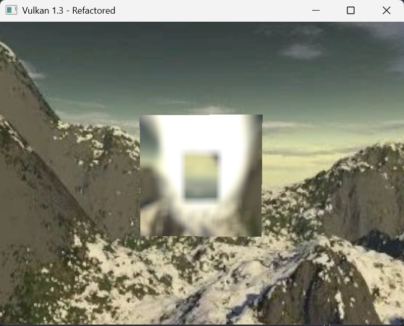
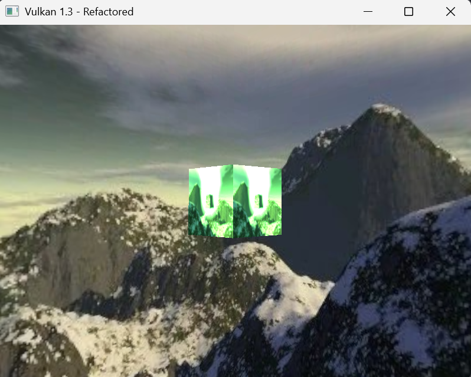
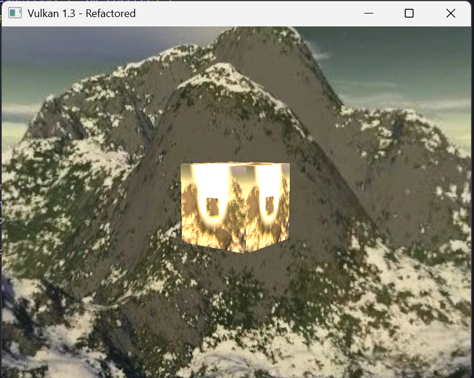

# Lab 8

## EXERCISE 1: RENDER-TO-TEXTURE ON A CUBE

To start, I needed to add a bunch of new data members to my main monolithic class.

```cpp
  // post processing stuf
  VkImage offscreenImage = VK_NULL_HANDLE;
  VkDeviceMemory offscreenImageMemory = VK_NULL_HANDLE;
  VkImageView offscreenImageView = VK_NULL_HANDLE;
  VkSampler offscreenSampler = VK_NULL_HANDLE;

  VkDescriptorSetLayout texturedCubeDescriptorSetLayout = VK_NULL_HANDLE;
  VkPipelineLayout texturedCubePipelineLayout = VK_NULL_HANDLE;
  VkPipeline texturedCubePipeline = VK_NULL_HANDLE;
  std::vector<VkDescriptorSet> texturedCubeDescriptorSets;

  void createOffscreenResources();
  void createTexturedCubeDescriptorSetLayout();
  void createTexturedCubePipeline();
  void createTexturedCubeDescriptorSets();
```

Then, I created `createOffscreenResources()` which create an offscreen VkImage that can render to it and read from it as texture. It creates a VkImageView to access the offscreen image and creates a VkSampler with linear filtering for sampling the offscreen texture.

```cpp
void HelloTriangleApplication::createOffscreenResources() {
  createImage(swapChainExtent.width, swapChainExtent.height,
              swapChainImageFormat, VK_IMAGE_TILING_OPTIMAL,
              VK_IMAGE_USAGE_COLOR_ATTACHMENT_BIT | VK_IMAGE_USAGE_SAMPLED_BIT,
              VK_MEMORY_PROPERTY_DEVICE_LOCAL_BIT, offscreenImage,
              offscreenImageMemory);

  offscreenImageView = createImageView(offscreenImage, swapChainImageFormat,
                                       VK_IMAGE_ASPECT_COLOR_BIT);

  VkPhysicalDeviceProperties properties{};
  vkGetPhysicalDeviceProperties(physicalDevice, &properties);

  VkSamplerCreateInfo samplerInfo{};
  samplerInfo.sType = VK_STRUCTURE_TYPE_SAMPLER_CREATE_INFO;
  samplerInfo.magFilter = VK_FILTER_LINEAR;
  samplerInfo.minFilter = VK_FILTER_LINEAR;
  samplerInfo.addressModeU = VK_SAMPLER_ADDRESS_MODE_CLAMP_TO_EDGE;
  samplerInfo.addressModeV = VK_SAMPLER_ADDRESS_MODE_CLAMP_TO_EDGE;
  samplerInfo.addressModeW = VK_SAMPLER_ADDRESS_MODE_CLAMP_TO_EDGE;
  samplerInfo.anisotropyEnable = VK_TRUE;
  samplerInfo.maxAnisotropy = properties.limits.maxSamplerAnisotropy;
  samplerInfo.borderColor = VK_BORDER_COLOR_INT_OPAQUE_BLACK;
  samplerInfo.unnormalizedCoordinates = VK_FALSE;
  samplerInfo.compareEnable = VK_FALSE;
  samplerInfo.compareOp = VK_COMPARE_OP_ALWAYS;
  samplerInfo.mipmapMode = VK_SAMPLER_MIPMAP_MODE_LINEAR;

  if (vkCreateSampler(device, &samplerInfo, nullptr, &offscreenSampler) !=
      VK_SUCCESS) {
    throw std::runtime_error("failed to create offscreen sampler!");
  }
}
```

We also need the `createTexturedCubeDescriptorSetLayout()` to define the shader resource bindings for the second pass. This function creates a descriptor layout with two bindings, binding 0 is uniform buffer and binding 1 is a combined image sampler.

```cpp
void HelloTriangleApplication::createTexturedCubeDescriptorSetLayout() {
  VkDescriptorSetLayoutBinding uboLayoutBinding{};
  uboLayoutBinding.binding = 0;
  uboLayoutBinding.descriptorCount = 1;
  uboLayoutBinding.descriptorType = VK_DESCRIPTOR_TYPE_UNIFORM_BUFFER;
  uboLayoutBinding.pImmutableSamplers = nullptr;
  uboLayoutBinding.stageFlags =
      VK_SHADER_STAGE_VERTEX_BIT | VK_SHADER_STAGE_FRAGMENT_BIT;

  VkDescriptorSetLayoutBinding samplerLayoutBinding{};
  samplerLayoutBinding.binding = 1;
  samplerLayoutBinding.descriptorCount = 1;
  samplerLayoutBinding.descriptorType =
      VK_DESCRIPTOR_TYPE_COMBINED_IMAGE_SAMPLER;
  samplerLayoutBinding.pImmutableSamplers = nullptr;
  samplerLayoutBinding.stageFlags = VK_SHADER_STAGE_FRAGMENT_BIT;

  std::array<VkDescriptorSetLayoutBinding, 2> bindings = {uboLayoutBinding,
                                                          samplerLayoutBinding};

  VkDescriptorSetLayoutCreateInfo layoutInfo{};
  layoutInfo.sType = VK_STRUCTURE_TYPE_DESCRIPTOR_SET_LAYOUT_CREATE_INFO;
  layoutInfo.bindingCount = static_cast<uint32_t>(bindings.size());
  layoutInfo.pBindings = bindings.data();

  if (vkCreateDescriptorSetLayout(device, &layoutInfo, nullptr,
                                  &texturedCubeDescriptorSetLayout) !=
      VK_SUCCESS) {
    throw std::runtime_error(
        "failed to create textured cube descriptor set layout!");
  }
}
```

`createTexturedCubePipeline()` is for creating the graphics pipeline for the second pass, rendering a textured cube to screen. It loads both the textured cube shaders, setting up depth testing, rasterisation, and blending states, and uses `texturedCubePipelineLayout` with push constants.

```cpp
void HelloTriangleApplication::createTexturedCubePipeline() {
  auto vertShaderCode = readFile("shaders/textured_cube_vert.spv");
  auto fragShaderCode = readFile("shaders/textured_cube_frag.spv");

  VkShaderModule vertShaderModule = createShaderModule(vertShaderCode);
  VkShaderModule fragShaderModule = createShaderModule(fragShaderCode);

  VkPipelineShaderStageCreateInfo vertShaderStageInfo{};
  vertShaderStageInfo.sType =
      VK_STRUCTURE_TYPE_PIPELINE_SHADER_STAGE_CREATE_INFO;
  vertShaderStageInfo.stage = VK_SHADER_STAGE_VERTEX_BIT;
  vertShaderStageInfo.module = vertShaderModule;
  vertShaderStageInfo.pName = "main";

  VkPipelineShaderStageCreateInfo fragShaderStageInfo{};
  fragShaderStageInfo.sType =
      VK_STRUCTURE_TYPE_PIPELINE_SHADER_STAGE_CREATE_INFO;
  fragShaderStageInfo.stage = VK_SHADER_STAGE_FRAGMENT_BIT;
  fragShaderStageInfo.module = fragShaderModule;
  fragShaderStageInfo.pName = "main";

  VkPipelineShaderStageCreateInfo shaderStages[] = {vertShaderStageInfo,
                                                    fragShaderStageInfo};

  VkPipelineVertexInputStateCreateInfo vertexInputInfo{};
  vertexInputInfo.sType =
      VK_STRUCTURE_TYPE_PIPELINE_VERTEX_INPUT_STATE_CREATE_INFO;

  auto bindingDescription = Vertex::getBindingDescription();
  auto attributeDescriptions = Vertex::getAttributeDescriptions();

  vertexInputInfo.vertexBindingDescriptionCount = 1;
  vertexInputInfo.vertexAttributeDescriptionCount =
      static_cast<uint32_t>(attributeDescriptions.size());
  vertexInputInfo.pVertexBindingDescriptions = &bindingDescription;
  vertexInputInfo.pVertexAttributeDescriptions = attributeDescriptions.data();

  VkPipelineInputAssemblyStateCreateInfo inputAssembly{};
  inputAssembly.sType =
      VK_STRUCTURE_TYPE_PIPELINE_INPUT_ASSEMBLY_STATE_CREATE_INFO;
  inputAssembly.topology = VK_PRIMITIVE_TOPOLOGY_TRIANGLE_LIST;
  inputAssembly.primitiveRestartEnable = VK_FALSE;

  VkPipelineViewportStateCreateInfo viewportState{};
  viewportState.sType = VK_STRUCTURE_TYPE_PIPELINE_VIEWPORT_STATE_CREATE_INFO;
  viewportState.viewportCount = 1;
  viewportState.scissorCount = 1;

  VkPipelineRasterizationStateCreateInfo rasterizer{};
  rasterizer.sType = VK_STRUCTURE_TYPE_PIPELINE_RASTERIZATION_STATE_CREATE_INFO;
  rasterizer.depthClampEnable = VK_FALSE;
  rasterizer.rasterizerDiscardEnable = VK_FALSE;
  rasterizer.polygonMode = VK_POLYGON_MODE_FILL;
  rasterizer.lineWidth = 1.0f;
  rasterizer.cullMode = VK_CULL_MODE_NONE;
  rasterizer.frontFace = VK_FRONT_FACE_COUNTER_CLOCKWISE;
  rasterizer.depthBiasEnable = VK_FALSE;

  VkPipelineMultisampleStateCreateInfo multisampling{};
  multisampling.sType =
      VK_STRUCTURE_TYPE_PIPELINE_MULTISAMPLE_STATE_CREATE_INFO;
  multisampling.sampleShadingEnable = VK_FALSE;
  multisampling.rasterizationSamples = VK_SAMPLE_COUNT_1_BIT;

  VkPipelineDepthStencilStateCreateInfo depthStencil{};
  depthStencil.sType =
      VK_STRUCTURE_TYPE_PIPELINE_DEPTH_STENCIL_STATE_CREATE_INFO;
  depthStencil.depthTestEnable = VK_TRUE;
  depthStencil.depthWriteEnable = VK_TRUE;
  depthStencil.depthCompareOp = VK_COMPARE_OP_LESS;
  depthStencil.depthBoundsTestEnable = VK_FALSE;
  depthStencil.stencilTestEnable = VK_FALSE;

  VkPipelineColorBlendAttachmentState colorBlendAttachment{};
  colorBlendAttachment.colorWriteMask =
      VK_COLOR_COMPONENT_R_BIT | VK_COLOR_COMPONENT_G_BIT |
      VK_COLOR_COMPONENT_B_BIT | VK_COLOR_COMPONENT_A_BIT;
  colorBlendAttachment.blendEnable = VK_FALSE;

  VkPipelineColorBlendStateCreateInfo colorBlending{};
  colorBlending.sType =
      VK_STRUCTURE_TYPE_PIPELINE_COLOR_BLEND_STATE_CREATE_INFO;
  colorBlending.logicOpEnable = VK_FALSE;
  colorBlending.logicOp = VK_LOGIC_OP_COPY;
  colorBlending.attachmentCount = 1;
  colorBlending.pAttachments = &colorBlendAttachment;

  std::vector<VkDynamicState> dynamicStates = {VK_DYNAMIC_STATE_VIEWPORT,
                                               VK_DYNAMIC_STATE_SCISSOR};
  VkPipelineDynamicStateCreateInfo dynamicState{};
  dynamicState.sType = VK_STRUCTURE_TYPE_PIPELINE_DYNAMIC_STATE_CREATE_INFO;
  dynamicState.dynamicStateCount = static_cast<uint32_t>(dynamicStates.size());
  dynamicState.pDynamicStates = dynamicStates.data();

  VkPushConstantRange pushConstantRange{};
  pushConstantRange.stageFlags = VK_SHADER_STAGE_VERTEX_BIT;
  pushConstantRange.offset = 0;
  pushConstantRange.size = sizeof(ModelPushConstant);

  VkPipelineLayoutCreateInfo pipelineLayoutInfo{};
  pipelineLayoutInfo.sType = VK_STRUCTURE_TYPE_PIPELINE_LAYOUT_CREATE_INFO;
  pipelineLayoutInfo.setLayoutCount = 1;
  pipelineLayoutInfo.pSetLayouts = &texturedCubeDescriptorSetLayout;
  pipelineLayoutInfo.pushConstantRangeCount = 1;
  pipelineLayoutInfo.pPushConstantRanges = &pushConstantRange;

  if (vkCreatePipelineLayout(device, &pipelineLayoutInfo, nullptr,
                             &texturedCubePipelineLayout) != VK_SUCCESS) {
    throw std::runtime_error("failed to create textured cube pipeline layout!");
  }

  VkPipelineRenderingCreateInfo pipelineRenderingCreateInfo{};
  pipelineRenderingCreateInfo.sType =
      VK_STRUCTURE_TYPE_PIPELINE_RENDERING_CREATE_INFO;
  pipelineRenderingCreateInfo.colorAttachmentCount = 1;
  pipelineRenderingCreateInfo.pColorAttachmentFormats = &swapChainImageFormat;
  pipelineRenderingCreateInfo.depthAttachmentFormat = depthFormat;

  VkGraphicsPipelineCreateInfo pipelineInfo{};
  pipelineInfo.sType = VK_STRUCTURE_TYPE_GRAPHICS_PIPELINE_CREATE_INFO;
  pipelineInfo.pNext = &pipelineRenderingCreateInfo;
  pipelineInfo.stageCount = 2;
  pipelineInfo.pStages = shaderStages;
  pipelineInfo.pVertexInputState = &vertexInputInfo;
  pipelineInfo.pInputAssemblyState = &inputAssembly;
  pipelineInfo.pViewportState = &viewportState;
  pipelineInfo.pRasterizationState = &rasterizer;
  pipelineInfo.pMultisampleState = &multisampling;
  pipelineInfo.pDepthStencilState = &depthStencil;
  pipelineInfo.pColorBlendState = &colorBlending;
  pipelineInfo.pDynamicState = &dynamicState;
  pipelineInfo.layout = texturedCubePipelineLayout;
  pipelineInfo.renderPass = VK_NULL_HANDLE;
  pipelineInfo.subpass = 0;
  pipelineInfo.basePipelineHandle = VK_NULL_HANDLE;

  if (vkCreateGraphicsPipelines(device, VK_NULL_HANDLE, 1, &pipelineInfo,
                                nullptr, &texturedCubePipeline) != VK_SUCCESS) {
    throw std::runtime_error(
        "failed to create textured cube graphics pipeline!");
  }

  vkDestroyShaderModule(device, fragShaderModule, nullptr);
  vkDestroyShaderModule(device, vertShaderModule, nullptr);
}
```

`recordCommandBuffer()` needed changes to record two sequential render passes. In pass 1 we render the scene to an offscreen texture, this part remains basically the same. Then, there is a barrier which transitions the offscreen image, ready to be used in pass 2. It needs to ensure that pass 1 writes are fully complete before pass 2 reads. Then, pass 2 can use this, clearing the depth buffer again and begins rendering the swpachain image as colour attachment. I also wanted it to render the skybox again, which is why you will see two skyboxes, one for pass 2, and one for pass 1 (inside of the cube).

```cpp
void HelloTriangleApplication::recordCommandBuffer(
    VkCommandBuffer commandBuffer, uint32_t imageIndex) {
  VkCommandBufferBeginInfo beginInfo{};
  beginInfo.sType = VK_STRUCTURE_TYPE_COMMAND_BUFFER_BEGIN_INFO;

  if (vkBeginCommandBuffer(commandBuffer, &beginInfo) != VK_SUCCESS) {
    throw std::runtime_error("Failed to begin recording command buffer!");
  }

  VkClearValue clearValues[2];
  clearValues[0].color = {{0.0f, 0.0f, 0.0f, 1.0f}};
  clearValues[1].depthStencil = {1.0f, 0};

  VkImageMemoryBarrier2 offscreenBarrier{};
  offscreenBarrier.sType = VK_STRUCTURE_TYPE_IMAGE_MEMORY_BARRIER_2;
  offscreenBarrier.srcStageMask = VK_PIPELINE_STAGE_2_TOP_OF_PIPE_BIT;
  offscreenBarrier.srcAccessMask = 0;
  offscreenBarrier.dstStageMask =
      VK_PIPELINE_STAGE_2_COLOR_ATTACHMENT_OUTPUT_BIT;
  offscreenBarrier.dstAccessMask = VK_ACCESS_2_COLOR_ATTACHMENT_WRITE_BIT;
  offscreenBarrier.oldLayout = VK_IMAGE_LAYOUT_UNDEFINED;
  offscreenBarrier.newLayout = VK_IMAGE_LAYOUT_COLOR_ATTACHMENT_OPTIMAL;
  offscreenBarrier.image = offscreenImage;
  offscreenBarrier.subresourceRange.aspectMask = VK_IMAGE_ASPECT_COLOR_BIT;
  offscreenBarrier.subresourceRange.baseMipLevel = 0;
  offscreenBarrier.subresourceRange.levelCount = 1;
  offscreenBarrier.subresourceRange.baseArrayLayer = 0;
  offscreenBarrier.subresourceRange.layerCount = 1;

  VkImageMemoryBarrier2 depthBarrier{};
  depthBarrier.sType = VK_STRUCTURE_TYPE_IMAGE_MEMORY_BARRIER_2;
  depthBarrier.srcStageMask = VK_PIPELINE_STAGE_2_TOP_OF_PIPE_BIT;
  depthBarrier.srcAccessMask = 0;
  depthBarrier.dstStageMask = VK_PIPELINE_STAGE_2_EARLY_FRAGMENT_TESTS_BIT;
  depthBarrier.dstAccessMask = VK_ACCESS_2_DEPTH_STENCIL_ATTACHMENT_WRITE_BIT;
  depthBarrier.oldLayout = VK_IMAGE_LAYOUT_UNDEFINED;
  depthBarrier.newLayout = VK_IMAGE_LAYOUT_DEPTH_STENCIL_ATTACHMENT_OPTIMAL;
  depthBarrier.image = depthImage;
  depthBarrier.subresourceRange.aspectMask = VK_IMAGE_ASPECT_DEPTH_BIT;
  depthBarrier.subresourceRange.baseMipLevel = 0;
  depthBarrier.subresourceRange.levelCount = 1;
  depthBarrier.subresourceRange.baseArrayLayer = 0;
  depthBarrier.subresourceRange.layerCount = 1;

  VkImageMemoryBarrier2 pass1Barriers[] = {offscreenBarrier, depthBarrier};

  VkDependencyInfo pass1DependencyInfo{};
  pass1DependencyInfo.sType = VK_STRUCTURE_TYPE_DEPENDENCY_INFO;
  pass1DependencyInfo.imageMemoryBarrierCount = 2;
  pass1DependencyInfo.pImageMemoryBarriers = pass1Barriers;

  vkCmdPipelineBarrier2(commandBuffer, &pass1DependencyInfo);

  VkRenderingAttachmentInfo offscreenColorAttachment{};
  offscreenColorAttachment.sType = VK_STRUCTURE_TYPE_RENDERING_ATTACHMENT_INFO;
  offscreenColorAttachment.imageView = offscreenImageView;
  offscreenColorAttachment.imageLayout =
      VK_IMAGE_LAYOUT_COLOR_ATTACHMENT_OPTIMAL;
  offscreenColorAttachment.loadOp = VK_ATTACHMENT_LOAD_OP_CLEAR;
  offscreenColorAttachment.storeOp = VK_ATTACHMENT_STORE_OP_STORE;
  offscreenColorAttachment.clearValue = clearValues[0];

  VkRenderingAttachmentInfo depthAttachment{};
  depthAttachment.sType = VK_STRUCTURE_TYPE_RENDERING_ATTACHMENT_INFO;
  depthAttachment.imageView = depthImageView;
  depthAttachment.imageLayout =
      VK_IMAGE_LAYOUT_DEPTH_STENCIL_ATTACHMENT_OPTIMAL;
  depthAttachment.loadOp = VK_ATTACHMENT_LOAD_OP_CLEAR;
  depthAttachment.storeOp = VK_ATTACHMENT_STORE_OP_STORE;
  depthAttachment.clearValue.depthStencil = {1.0f, 0};

  VkRenderingInfo sceneRenderingInfo{};
  sceneRenderingInfo.sType = VK_STRUCTURE_TYPE_RENDERING_INFO;
  sceneRenderingInfo.renderArea.offset = {0, 0};
  sceneRenderingInfo.renderArea.extent = swapChainExtent;
  sceneRenderingInfo.layerCount = 1;
  sceneRenderingInfo.colorAttachmentCount = 1;
  sceneRenderingInfo.pColorAttachments = &offscreenColorAttachment;
  sceneRenderingInfo.pDepthAttachment = &depthAttachment;

  vkCmdBeginRendering(commandBuffer, &sceneRenderingInfo);

  VkViewport viewport{};
  viewport.x = 0.0f;
  viewport.y = 0.0f;
  viewport.width = (float)swapChainExtent.width;
  viewport.height = (float)swapChainExtent.height;
  viewport.minDepth = 0.0f;
  viewport.maxDepth = 1.0f;
  vkCmdSetViewport(commandBuffer, 0, 1, &viewport);

  VkRect2D scissor{};
  scissor.offset = {0, 0};
  scissor.extent = swapChainExtent;
  vkCmdSetScissor(commandBuffer, 0, 1, &scissor);

  vkCmdBindPipeline(commandBuffer, VK_PIPELINE_BIND_POINT_GRAPHICS,
                    skyboxPipeline);

  VkBuffer skyboxVertexBuffers[] = {skyboxVertexBuffer};
  VkDeviceSize skyboxOffsets[] = {0};
  vkCmdBindVertexBuffers(commandBuffer, 0, 1, skyboxVertexBuffers,
                         skyboxOffsets);
  vkCmdBindIndexBuffer(commandBuffer, skyboxIndexBuffer, 0,
                       VK_INDEX_TYPE_UINT32);
  vkCmdBindDescriptorSets(commandBuffer, VK_PIPELINE_BIND_POINT_GRAPHICS,
                          skyboxPipelineLayout, 0, 1,
                          &skyboxDescriptorSets[currentFrame], 0, nullptr);
  vkCmdDrawIndexed(commandBuffer, 36, 1, 0, 0, 0);

  vkCmdBindPipeline(commandBuffer, VK_PIPELINE_BIND_POINT_GRAPHICS,
                    graphicsPipeline);

  VkBuffer vertexBuffers[] = {vertexBuffer};
  VkDeviceSize offsets[] = {0};
  vkCmdBindVertexBuffers(commandBuffer, 0, 1, vertexBuffers, offsets);
  vkCmdBindIndexBuffer(commandBuffer, indexBuffer, 0, VK_INDEX_TYPE_UINT32);

  vkCmdBindDescriptorSets(commandBuffer, VK_PIPELINE_BIND_POINT_GRAPHICS,
                          pipelineLayout, 0, 1, &descriptorSets[currentFrame],
                          0, nullptr);

  uint32_t indexOffset = 0;
  for (const auto& obj : renderObjects) {
    ModelPushConstant pushConstant;
    pushConstant.model = obj.transform;
    pushConstant.ambient = obj.material.ambient;
    pushConstant.diffuse = obj.material.diffuse;
    pushConstant.specular = obj.material.specular;
    pushConstant.shininess = obj.material.shininess;

    vkCmdPushConstants(
        commandBuffer, pipelineLayout,
        VK_SHADER_STAGE_VERTEX_BIT | VK_SHADER_STAGE_FRAGMENT_BIT, 0,
        sizeof(ModelPushConstant), &pushConstant);
    vkCmdDrawIndexed(commandBuffer, static_cast<uint32_t>(obj.indices.size()),
                     1, indexOffset, 0, 0);
    indexOffset += static_cast<uint32_t>(obj.indices.size());
  }

  vkCmdBindPipeline(commandBuffer, VK_PIPELINE_BIND_POINT_GRAPHICS,
                    particlePipeline);

  VkBuffer particleVertexBuffers[] = {particleVertexBuffer};
  VkDeviceSize particleOffsets[] = {0};
  vkCmdBindVertexBuffers(commandBuffer, 0, 1, particleVertexBuffers,
                         particleOffsets);
  vkCmdBindIndexBuffer(commandBuffer, particleIndexBuffer, 0,
                       VK_INDEX_TYPE_UINT32);

  vkCmdBindDescriptorSets(commandBuffer, VK_PIPELINE_BIND_POINT_GRAPHICS,
                          particlePipelineLayout, 0, 1,
                          &descriptorSets[currentFrame], 0, nullptr);

  static auto startTime = std::chrono::high_resolution_clock::now();
  auto currentTime = std::chrono::high_resolution_clock::now();
  float time = std::chrono::duration<float, std::chrono::seconds::period>(
                   currentTime - startTime)
                   .count();

  ParticlePushConstant particlePush;
  particlePush.time = time;

  vkCmdPushConstants(commandBuffer, particlePipelineLayout,
                     VK_SHADER_STAGE_VERTEX_BIT, 0,
                     sizeof(ParticlePushConstant), &particlePush);

  vkCmdDrawIndexed(commandBuffer, 600, 1, 0, 0, 0);

  vkCmdEndRendering(commandBuffer);

  offscreenBarrier.srcStageMask =
      VK_PIPELINE_STAGE_2_COLOR_ATTACHMENT_OUTPUT_BIT;
  offscreenBarrier.srcAccessMask = VK_ACCESS_2_COLOR_ATTACHMENT_WRITE_BIT;
  offscreenBarrier.dstStageMask = VK_PIPELINE_STAGE_2_FRAGMENT_SHADER_BIT;
  offscreenBarrier.dstAccessMask = VK_ACCESS_2_SHADER_READ_BIT;
  offscreenBarrier.oldLayout = VK_IMAGE_LAYOUT_COLOR_ATTACHMENT_OPTIMAL;
  offscreenBarrier.newLayout = VK_IMAGE_LAYOUT_SHADER_READ_ONLY_OPTIMAL;

  VkDependencyInfo transitionDependencyInfo{};
  transitionDependencyInfo.sType = VK_STRUCTURE_TYPE_DEPENDENCY_INFO;
  transitionDependencyInfo.imageMemoryBarrierCount = 1;
  transitionDependencyInfo.pImageMemoryBarriers = &offscreenBarrier;

  vkCmdPipelineBarrier2(commandBuffer, &transitionDependencyInfo);

  VkImageMemoryBarrier2 swapchainBarrier{};
  swapchainBarrier.sType = VK_STRUCTURE_TYPE_IMAGE_MEMORY_BARRIER_2;
  swapchainBarrier.srcStageMask = VK_PIPELINE_STAGE_2_TOP_OF_PIPE_BIT;
  swapchainBarrier.srcAccessMask = 0;
  swapchainBarrier.dstStageMask =
      VK_PIPELINE_STAGE_2_COLOR_ATTACHMENT_OUTPUT_BIT;
  swapchainBarrier.dstAccessMask = VK_ACCESS_2_COLOR_ATTACHMENT_WRITE_BIT;
  swapchainBarrier.oldLayout = VK_IMAGE_LAYOUT_UNDEFINED;
  swapchainBarrier.newLayout = VK_IMAGE_LAYOUT_COLOR_ATTACHMENT_OPTIMAL;
  swapchainBarrier.image = swapChainImages[imageIndex];
  swapchainBarrier.subresourceRange.aspectMask = VK_IMAGE_ASPECT_COLOR_BIT;
  swapchainBarrier.subresourceRange.baseMipLevel = 0;
  swapchainBarrier.subresourceRange.levelCount = 1;
  swapchainBarrier.subresourceRange.baseArrayLayer = 0;
  swapchainBarrier.subresourceRange.layerCount = 1;

  depthBarrier.srcStageMask = VK_PIPELINE_STAGE_2_LATE_FRAGMENT_TESTS_BIT;
  depthBarrier.srcAccessMask = VK_ACCESS_2_DEPTH_STENCIL_ATTACHMENT_WRITE_BIT;
  depthBarrier.dstStageMask = VK_PIPELINE_STAGE_2_EARLY_FRAGMENT_TESTS_BIT;
  depthBarrier.dstAccessMask = VK_ACCESS_2_DEPTH_STENCIL_ATTACHMENT_WRITE_BIT;
  depthBarrier.oldLayout = VK_IMAGE_LAYOUT_DEPTH_STENCIL_ATTACHMENT_OPTIMAL;
  depthBarrier.newLayout = VK_IMAGE_LAYOUT_DEPTH_STENCIL_ATTACHMENT_OPTIMAL;

  VkImageMemoryBarrier2 pass2Barriers[] = {swapchainBarrier, depthBarrier};

  VkDependencyInfo pass2DependencyInfo{};
  pass2DependencyInfo.sType = VK_STRUCTURE_TYPE_DEPENDENCY_INFO;
  pass2DependencyInfo.imageMemoryBarrierCount = 2;
  pass2DependencyInfo.pImageMemoryBarriers = pass2Barriers;

  vkCmdPipelineBarrier2(commandBuffer, &pass2DependencyInfo);

  VkRenderingAttachmentInfo swapchainColorAttachment{};
  swapchainColorAttachment.sType = VK_STRUCTURE_TYPE_RENDERING_ATTACHMENT_INFO;
  swapchainColorAttachment.imageView = swapChainImageViews[imageIndex];
  swapchainColorAttachment.imageLayout =
      VK_IMAGE_LAYOUT_COLOR_ATTACHMENT_OPTIMAL;
  swapchainColorAttachment.loadOp = VK_ATTACHMENT_LOAD_OP_CLEAR;
  swapchainColorAttachment.storeOp = VK_ATTACHMENT_STORE_OP_STORE;
  swapchainColorAttachment.clearValue = clearValues[0];

  depthAttachment.loadOp = VK_ATTACHMENT_LOAD_OP_CLEAR;

  VkRenderingInfo finalRenderingInfo{};
  finalRenderingInfo.sType = VK_STRUCTURE_TYPE_RENDERING_INFO;
  finalRenderingInfo.renderArea.offset = {0, 0};
  finalRenderingInfo.renderArea.extent = swapChainExtent;
  finalRenderingInfo.layerCount = 1;
  finalRenderingInfo.colorAttachmentCount = 1;
  finalRenderingInfo.pColorAttachments = &swapchainColorAttachment;
  finalRenderingInfo.pDepthAttachment = &depthAttachment;

  vkCmdBeginRendering(commandBuffer, &finalRenderingInfo);

  vkCmdSetViewport(commandBuffer, 0, 1, &viewport);
  vkCmdSetScissor(commandBuffer, 0, 1, &scissor);

  vkCmdBindPipeline(commandBuffer, VK_PIPELINE_BIND_POINT_GRAPHICS,
                    skyboxPipeline);

  vkCmdBindVertexBuffers(commandBuffer, 0, 1, skyboxVertexBuffers,
                         skyboxOffsets);
  vkCmdBindIndexBuffer(commandBuffer, skyboxIndexBuffer, 0,
                       VK_INDEX_TYPE_UINT32);
  vkCmdBindDescriptorSets(commandBuffer, VK_PIPELINE_BIND_POINT_GRAPHICS,
                          skyboxPipelineLayout, 0, 1,
                          &skyboxDescriptorSets[currentFrame], 0, nullptr);
  vkCmdDrawIndexed(commandBuffer, 36, 1, 0, 0, 0);

  vkCmdBindPipeline(commandBuffer, VK_PIPELINE_BIND_POINT_GRAPHICS,
                    texturedCubePipeline);

  vkCmdBindVertexBuffers(commandBuffer, 0, 1, vertexBuffers, offsets);
  vkCmdBindIndexBuffer(commandBuffer, indexBuffer, 0, VK_INDEX_TYPE_UINT32);

  vkCmdBindDescriptorSets(commandBuffer, VK_PIPELINE_BIND_POINT_GRAPHICS,
                          texturedCubePipelineLayout, 0, 1,
                          &texturedCubeDescriptorSets[currentFrame], 0,
                          nullptr);

  indexOffset = 0;
  for (const auto& obj : renderObjects) {
    ModelPushConstant pushConstant;
    pushConstant.model = obj.transform;
    pushConstant.ambient = obj.material.ambient;
    pushConstant.diffuse = obj.material.diffuse;
    pushConstant.specular = obj.material.specular;
    pushConstant.shininess = obj.material.shininess;

    vkCmdPushConstants(
        commandBuffer, texturedCubePipelineLayout,
        VK_SHADER_STAGE_VERTEX_BIT | VK_SHADER_STAGE_FRAGMENT_BIT, 0,
        sizeof(ModelPushConstant), &pushConstant);
    vkCmdDrawIndexed(commandBuffer, static_cast<uint32_t>(obj.indices.size()),
                     1, indexOffset, 0, 0);
    indexOffset += static_cast<uint32_t>(obj.indices.size());
  }

  vkCmdEndRendering(commandBuffer);

  swapchainBarrier.srcStageMask =
      VK_PIPELINE_STAGE_2_COLOR_ATTACHMENT_OUTPUT_BIT;
  swapchainBarrier.srcAccessMask = VK_ACCESS_2_COLOR_ATTACHMENT_WRITE_BIT;
  swapchainBarrier.dstStageMask = VK_PIPELINE_STAGE_2_BOTTOM_OF_PIPE_BIT;
  swapchainBarrier.dstAccessMask = 0;
  swapchainBarrier.oldLayout = VK_IMAGE_LAYOUT_COLOR_ATTACHMENT_OPTIMAL;
  swapchainBarrier.newLayout = VK_IMAGE_LAYOUT_PRESENT_SRC_KHR;

  VkDependencyInfo presentDependencyInfo{};
  presentDependencyInfo.sType = VK_STRUCTURE_TYPE_DEPENDENCY_INFO;
  presentDependencyInfo.imageMemoryBarrierCount = 1;
  presentDependencyInfo.pImageMemoryBarriers = &swapchainBarrier;

  vkCmdPipelineBarrier2(commandBuffer, &presentDependencyInfo);

  if (vkEndCommandBuffer(commandBuffer) != VK_SUCCESS) {
    throw std::runtime_error("Failed to record command buffer!");
  }
}
```

`cleanupSwapChain()` needed modifying to destroy the offscreen image, image view, and memory, and is now also called when window is resized so it does not crash when that happens.

```cpp
void HelloTriangleApplication::cleanupSwapChain() {
  vkDestroyImageView(device, depthImageView, nullptr);
  vkDestroyImage(device, depthImage, nullptr);
  vkFreeMemory(device, depthImageMemory, nullptr);

  vkDestroyImageView(device, offscreenImageView, nullptr);
  vkDestroyImage(device, offscreenImage, nullptr);
  vkFreeMemory(device, offscreenImageMemory, nullptr);

  for (auto imageView : swapChainImageViews) {
    vkDestroyImageView(device, imageView, nullptr);
  }
  vkDestroySwapchainKHR(device, swapChain, nullptr);
}
```

Similarly, `recreateSwapChain()` needed modfying to properly recreate all swapchain resources like offscreen texture, also needed for nice window resizing.

```cpp
void HelloTriangleApplication::recreateSwapChain() {
  int width = 0, height = 0;
  glfwGetFramebufferSize(window, &width, &height);
  while (width == 0 || height == 0) {
    glfwGetFramebufferSize(window, &width, &height);
    glfwWaitEvents();
  }

  vkDeviceWaitIdle(device);

  cleanupSwapChain();

  createSwapChain();
  createImageViews();
  createDepthResources();
  createOffscreenResources();

  for (size_t i = 0; i < MAX_FRAMES_IN_FLIGHT; i++) {
    VkDescriptorImageInfo imageInfo{};
    imageInfo.imageLayout = VK_IMAGE_LAYOUT_SHADER_READ_ONLY_OPTIMAL;
    imageInfo.imageView = offscreenImageView;
    imageInfo.sampler = offscreenSampler;

    VkWriteDescriptorSet descriptorWrite{};
    descriptorWrite.sType = VK_STRUCTURE_TYPE_WRITE_DESCRIPTOR_SET;
    descriptorWrite.dstSet = texturedCubeDescriptorSets[i];
    descriptorWrite.dstBinding = 1;
    descriptorWrite.dstArrayElement = 0;
    descriptorWrite.descriptorType = VK_DESCRIPTOR_TYPE_COMBINED_IMAGE_SAMPLER;
    descriptorWrite.descriptorCount = 1;
    descriptorWrite.pImageInfo = &imageInfo;

    vkUpdateDescriptorSets(device, 1, &descriptorWrite, 0, nullptr);
  }
}
```

Other functions like `initVulkan()` and `cleanup()` also needed changing but those are boring so I am not including them here. For the shader files, I created two new files, `textured_cube.vert` and `textured_cube.frag` and configured them to compile into .spv when the project builds.

```cpp
#version 450

layout(binding = 0) uniform UniformBufferObject {
    mat4 view;
    mat4 proj;
    vec3 light1Pos;
    vec3 light1Color;
    vec3 light2Pos;
    vec3 light2Color;
    vec3 eyePos;
} ubo;

layout(push_constant) uniform PushConstants {
    mat4 model;
    vec3 ambient;
    float padding1;
    vec3 diffuse;
    float padding2;
    vec3 specular;
    float shininess;
} pushConstants;

layout(location = 0) in vec3 inPosition;
layout(location = 1) in vec3 inColor;
layout(location = 2) in vec3 inNormal;
layout(location = 3) in vec2 inTexCoord;

layout(location = 0) out vec3 fragColor;
layout(location = 1) out vec2 fragTexCoord;

void main() {
    vec4 worldPos = pushConstants.model * vec4(inPosition, 1.0);
    gl_Position = ubo.proj * ubo.view * worldPos;
    fragColor = inColor;
    fragTexCoord = inTexCoord;
}
```

```cpp
#version 450

layout(location = 0) in vec3 fragColor;
layout(location = 1) in vec2 fragTexCoord;

layout(binding = 1) uniform sampler2D sceneTexture;

layout(location = 0) out vec4 outColor;

void main() {
    outColor = texture(sceneTexture, fragTexCoord);
}
```

This gives us this result:


I am very pleased with this result. Because I am doing this straight after the last lab on particle simulations, you can still see my fiery cube on the texture of the pass 2 cube.

## EXERCISE 2: TEXTURE SMOOTHING (BOX BLUR)

For this, I created a new shader file `blur.frag` and set it up to auto-compile on build. I modified the blur to be stronger so its more visible.

```cpp
#version 450

layout(location = 0) in vec3 fragColor;
layout(location = 1) in vec2 fragTexCoord;

layout(binding = 1) uniform sampler2D sceneTexture;

layout(location = 0) out vec4 outColor;

void main() {
    float stepSize = 5.0;
    vec2 texelSize = stepSize / textureSize(sceneTexture, 0);

    vec4 result = vec4(0.0);
    int boxSize = 4;

    for (int x = -boxSize; x <= boxSize; x++) {
        for (int y = -boxSize; y <= boxSize; y++) {
            result += texture(sceneTexture, fragTexCoord + vec2(x, y) * texelSize);
        }
    }

    int totalSamples = (boxSize * 2 + 1) * (boxSize * 2 + 1);
    outColor = result / float(totalSamples);
}
```

Then I just changed what file read into `fragShaderCode` in `createTexturedCubePipeline()`.

```cpp
void HelloTriangleApplication::createTexturedCubePipeline() {
  auto vertShaderCode = readFile("shaders/textured_cube_vert.spv");
  auto fragShaderCode = readFile("shaders/blur.spv");
  ...
```

This gives us this result which I am pleased with.



## EXERCISE 3: SIMPLE GLOW EFFECT

Because my particle simulation is still present, I altered the shader so the glow is much more obvious and very green.

```cpp
#version 450

layout(location = 1) in vec2 fragTexCoord;
layout(binding = 1) uniform sampler2D sceneTexture;
layout(location = 0) out vec4 outColor;

void main() {
    vec4 originalColor = texture(sceneTexture, fragTexCoord);

    float stepSize = 3.0;
    vec2 texelSize = stepSize / textureSize(sceneTexture, 0);
    vec4 blurredColor = vec4(0.0);
    int boxSize = 3;

    for (int x = -boxSize; x <= boxSize; x++) {
        for (int y = -boxSize; y <= boxSize; y++) {
            blurredColor += texture(sceneTexture, fragTexCoord + vec2(x, y) * texelSize);
        }
    }
    blurredColor = blurredColor / float((2 * boxSize + 1) * (2 * boxSize + 1));

    vec3 greenGlow = blurredColor.rgb * vec3(0.2, 2.0, 0.3);

    outColor = originalColor + vec4(greenGlow, 0.0) * 2.5;
}
```

To use it, once again it is as simple as changing the file path.

```cpp
void HelloTriangleApplication::createTexturedCubePipeline() {
  auto vertShaderCode = readFile("shaders/textured_cube_vert.spv");
  auto fragShaderCode = readFile("shaders/glow.spv");
  ...
```



## EXERCISE 4: OBJECT ON FIRE ANIMATION

For the fire effect, this is a bit more involved. I added time to my `ModelPushConstant`.

```cpp
struct ModelPushConstant {
  glm::mat4 model;
  glm::vec3 ambient;
  float padding1;
  glm::vec3 diffuse;
  float padding2;
  glm::vec3 specular;
  float shininess;
  float time;
};
```

Now with time added, I can update `recordCommandBuffer()` to use it to animate it with time.

```cpp
void HelloTriangleApplication::recordCommandBuffer(
    VkCommandBuffer commandBuffer, uint32_t imageIndex) {
  VkCommandBufferBeginInfo beginInfo{};
  beginInfo.sType = VK_STRUCTURE_TYPE_COMMAND_BUFFER_BEGIN_INFO;

  if (vkBeginCommandBuffer(commandBuffer, &beginInfo) != VK_SUCCESS) {
    throw std::runtime_error("Failed to begin recording command buffer!");
  }

  VkClearValue clearValues[2];
  clearValues[0].color = {{0.0f, 0.0f, 0.0f, 1.0f}};
  clearValues[1].depthStencil = {1.0f, 0};

  VkImageMemoryBarrier2 offscreenBarrier{};
  offscreenBarrier.sType = VK_STRUCTURE_TYPE_IMAGE_MEMORY_BARRIER_2;
  offscreenBarrier.srcStageMask = VK_PIPELINE_STAGE_2_TOP_OF_PIPE_BIT;
  offscreenBarrier.srcAccessMask = 0;
  offscreenBarrier.dstStageMask =
      VK_PIPELINE_STAGE_2_COLOR_ATTACHMENT_OUTPUT_BIT;
  offscreenBarrier.dstAccessMask = VK_ACCESS_2_COLOR_ATTACHMENT_WRITE_BIT;
  offscreenBarrier.oldLayout = VK_IMAGE_LAYOUT_UNDEFINED;
  offscreenBarrier.newLayout = VK_IMAGE_LAYOUT_COLOR_ATTACHMENT_OPTIMAL;
  offscreenBarrier.image = offscreenImage;
  offscreenBarrier.subresourceRange.aspectMask = VK_IMAGE_ASPECT_COLOR_BIT;
  offscreenBarrier.subresourceRange.baseMipLevel = 0;
  offscreenBarrier.subresourceRange.levelCount = 1;
  offscreenBarrier.subresourceRange.baseArrayLayer = 0;
  offscreenBarrier.subresourceRange.layerCount = 1;

  VkImageMemoryBarrier2 depthBarrier{};
  depthBarrier.sType = VK_STRUCTURE_TYPE_IMAGE_MEMORY_BARRIER_2;
  depthBarrier.srcStageMask = VK_PIPELINE_STAGE_2_TOP_OF_PIPE_BIT;
  depthBarrier.srcAccessMask = 0;
  depthBarrier.dstStageMask = VK_PIPELINE_STAGE_2_EARLY_FRAGMENT_TESTS_BIT;
  depthBarrier.dstAccessMask = VK_ACCESS_2_DEPTH_STENCIL_ATTACHMENT_WRITE_BIT;
  depthBarrier.oldLayout = VK_IMAGE_LAYOUT_UNDEFINED;
  depthBarrier.newLayout = VK_IMAGE_LAYOUT_DEPTH_STENCIL_ATTACHMENT_OPTIMAL;
  depthBarrier.image = depthImage;
  depthBarrier.subresourceRange.aspectMask = VK_IMAGE_ASPECT_DEPTH_BIT;
  depthBarrier.subresourceRange.baseMipLevel = 0;
  depthBarrier.subresourceRange.levelCount = 1;
  depthBarrier.subresourceRange.baseArrayLayer = 0;
  depthBarrier.subresourceRange.layerCount = 1;

  VkImageMemoryBarrier2 pass1Barriers[] = {offscreenBarrier, depthBarrier};

  VkDependencyInfo pass1DependencyInfo{};
  pass1DependencyInfo.sType = VK_STRUCTURE_TYPE_DEPENDENCY_INFO;
  pass1DependencyInfo.imageMemoryBarrierCount = 2;
  pass1DependencyInfo.pImageMemoryBarriers = pass1Barriers;

  vkCmdPipelineBarrier2(commandBuffer, &pass1DependencyInfo);

  VkRenderingAttachmentInfo offscreenColorAttachment{};
  offscreenColorAttachment.sType = VK_STRUCTURE_TYPE_RENDERING_ATTACHMENT_INFO;
  offscreenColorAttachment.imageView = offscreenImageView;
  offscreenColorAttachment.imageLayout =
      VK_IMAGE_LAYOUT_COLOR_ATTACHMENT_OPTIMAL;
  offscreenColorAttachment.loadOp = VK_ATTACHMENT_LOAD_OP_CLEAR;
  offscreenColorAttachment.storeOp = VK_ATTACHMENT_STORE_OP_STORE;
  offscreenColorAttachment.clearValue = clearValues[0];

  VkRenderingAttachmentInfo depthAttachment{};
  depthAttachment.sType = VK_STRUCTURE_TYPE_RENDERING_ATTACHMENT_INFO;
  depthAttachment.imageView = depthImageView;
  depthAttachment.imageLayout =
      VK_IMAGE_LAYOUT_DEPTH_STENCIL_ATTACHMENT_OPTIMAL;
  depthAttachment.loadOp = VK_ATTACHMENT_LOAD_OP_CLEAR;
  depthAttachment.storeOp = VK_ATTACHMENT_STORE_OP_STORE;
  depthAttachment.clearValue.depthStencil = {1.0f, 0};

  VkRenderingInfo sceneRenderingInfo{};
  sceneRenderingInfo.sType = VK_STRUCTURE_TYPE_RENDERING_INFO;
  sceneRenderingInfo.renderArea.offset = {0, 0};
  sceneRenderingInfo.renderArea.extent = swapChainExtent;
  sceneRenderingInfo.layerCount = 1;
  sceneRenderingInfo.colorAttachmentCount = 1;
  sceneRenderingInfo.pColorAttachments = &offscreenColorAttachment;
  sceneRenderingInfo.pDepthAttachment = &depthAttachment;

  vkCmdBeginRendering(commandBuffer, &sceneRenderingInfo);

  VkViewport viewport{};
  viewport.x = 0.0f;
  viewport.y = 0.0f;
  viewport.width = (float)swapChainExtent.width;
  viewport.height = (float)swapChainExtent.height;
  viewport.minDepth = 0.0f;
  viewport.maxDepth = 1.0f;
  vkCmdSetViewport(commandBuffer, 0, 1, &viewport);

  VkRect2D scissor{};
  scissor.offset = {0, 0};
  scissor.extent = swapChainExtent;
  vkCmdSetScissor(commandBuffer, 0, 1, &scissor);

  vkCmdBindPipeline(commandBuffer, VK_PIPELINE_BIND_POINT_GRAPHICS,
                    skyboxPipeline);

  VkBuffer skyboxVertexBuffers[] = {skyboxVertexBuffer};
  VkDeviceSize skyboxOffsets[] = {0};
  vkCmdBindVertexBuffers(commandBuffer, 0, 1, skyboxVertexBuffers,
                         skyboxOffsets);
  vkCmdBindIndexBuffer(commandBuffer, skyboxIndexBuffer, 0,
                       VK_INDEX_TYPE_UINT32);
  vkCmdBindDescriptorSets(commandBuffer, VK_PIPELINE_BIND_POINT_GRAPHICS,
                          skyboxPipelineLayout, 0, 1,
                          &skyboxDescriptorSets[currentFrame], 0, nullptr);
  vkCmdDrawIndexed(commandBuffer, 36, 1, 0, 0, 0);

  vkCmdBindPipeline(commandBuffer, VK_PIPELINE_BIND_POINT_GRAPHICS,
                    graphicsPipeline);

  VkBuffer vertexBuffers[] = {vertexBuffer};
  VkDeviceSize offsets[] = {0};
  vkCmdBindVertexBuffers(commandBuffer, 0, 1, vertexBuffers, offsets);
  vkCmdBindIndexBuffer(commandBuffer, indexBuffer, 0, VK_INDEX_TYPE_UINT32);

  vkCmdBindDescriptorSets(commandBuffer, VK_PIPELINE_BIND_POINT_GRAPHICS,
                          pipelineLayout, 0, 1, &descriptorSets[currentFrame],
                          0, nullptr);

  uint32_t indexOffset = 0;
  for (const auto& obj : renderObjects) {
    ModelPushConstant pushConstant;
    pushConstant.model = obj.transform;
    pushConstant.ambient = obj.material.ambient;
    pushConstant.diffuse = obj.material.diffuse;
    pushConstant.specular = obj.material.specular;
    pushConstant.time = 0.0f;

    vkCmdPushConstants(
        commandBuffer, pipelineLayout,
        VK_SHADER_STAGE_VERTEX_BIT | VK_SHADER_STAGE_FRAGMENT_BIT, 0,
        sizeof(ModelPushConstant), &pushConstant);
    vkCmdDrawIndexed(commandBuffer, static_cast<uint32_t>(obj.indices.size()),
                     1, indexOffset, 0, 0);
    indexOffset += static_cast<uint32_t>(obj.indices.size());
  }

  vkCmdBindPipeline(commandBuffer, VK_PIPELINE_BIND_POINT_GRAPHICS,
                    particlePipeline);

  VkBuffer particleVertexBuffers[] = {particleVertexBuffer};
  VkDeviceSize particleOffsets[] = {0};
  vkCmdBindVertexBuffers(commandBuffer, 0, 1, particleVertexBuffers,
                         particleOffsets);
  vkCmdBindIndexBuffer(commandBuffer, particleIndexBuffer, 0,
                       VK_INDEX_TYPE_UINT32);

  vkCmdBindDescriptorSets(commandBuffer, VK_PIPELINE_BIND_POINT_GRAPHICS,
                          particlePipelineLayout, 0, 1,
                          &descriptorSets[currentFrame], 0, nullptr);

  static auto startTime = std::chrono::high_resolution_clock::now();
  auto currentTime = std::chrono::high_resolution_clock::now();
  float time = std::chrono::duration<float, std::chrono::seconds::period>(
                   currentTime - startTime)
                   .count();

  ParticlePushConstant particlePush;
  particlePush.time = time;

  vkCmdPushConstants(commandBuffer, particlePipelineLayout,
                     VK_SHADER_STAGE_VERTEX_BIT, 0,
                     sizeof(ParticlePushConstant), &particlePush);

  vkCmdDrawIndexed(commandBuffer, 600, 1, 0, 0, 0);

  vkCmdEndRendering(commandBuffer);

  offscreenBarrier.srcStageMask =
      VK_PIPELINE_STAGE_2_COLOR_ATTACHMENT_OUTPUT_BIT;
  offscreenBarrier.srcAccessMask = VK_ACCESS_2_COLOR_ATTACHMENT_WRITE_BIT;
  offscreenBarrier.dstStageMask = VK_PIPELINE_STAGE_2_FRAGMENT_SHADER_BIT;
  offscreenBarrier.dstAccessMask = VK_ACCESS_2_SHADER_READ_BIT;
  offscreenBarrier.oldLayout = VK_IMAGE_LAYOUT_COLOR_ATTACHMENT_OPTIMAL;
  offscreenBarrier.newLayout = VK_IMAGE_LAYOUT_SHADER_READ_ONLY_OPTIMAL;

  VkDependencyInfo transitionDependencyInfo{};
  transitionDependencyInfo.sType = VK_STRUCTURE_TYPE_DEPENDENCY_INFO;
  transitionDependencyInfo.imageMemoryBarrierCount = 1;
  transitionDependencyInfo.pImageMemoryBarriers = &offscreenBarrier;

  vkCmdPipelineBarrier2(commandBuffer, &transitionDependencyInfo);

  VkImageMemoryBarrier2 swapchainBarrier{};
  swapchainBarrier.sType = VK_STRUCTURE_TYPE_IMAGE_MEMORY_BARRIER_2;
  swapchainBarrier.srcStageMask = VK_PIPELINE_STAGE_2_TOP_OF_PIPE_BIT;
  swapchainBarrier.srcAccessMask = 0;
  swapchainBarrier.dstStageMask =
      VK_PIPELINE_STAGE_2_COLOR_ATTACHMENT_OUTPUT_BIT;
  swapchainBarrier.dstAccessMask = VK_ACCESS_2_COLOR_ATTACHMENT_WRITE_BIT;
  swapchainBarrier.oldLayout = VK_IMAGE_LAYOUT_UNDEFINED;
  swapchainBarrier.newLayout = VK_IMAGE_LAYOUT_COLOR_ATTACHMENT_OPTIMAL;
  swapchainBarrier.image = swapChainImages[imageIndex];
  swapchainBarrier.subresourceRange.aspectMask = VK_IMAGE_ASPECT_COLOR_BIT;
  swapchainBarrier.subresourceRange.baseMipLevel = 0;
  swapchainBarrier.subresourceRange.levelCount = 1;
  swapchainBarrier.subresourceRange.baseArrayLayer = 0;
  swapchainBarrier.subresourceRange.layerCount = 1;

  depthBarrier.srcStageMask = VK_PIPELINE_STAGE_2_LATE_FRAGMENT_TESTS_BIT;
  depthBarrier.srcAccessMask = VK_ACCESS_2_DEPTH_STENCIL_ATTACHMENT_WRITE_BIT;
  depthBarrier.dstStageMask = VK_PIPELINE_STAGE_2_EARLY_FRAGMENT_TESTS_BIT;
  depthBarrier.dstAccessMask = VK_ACCESS_2_DEPTH_STENCIL_ATTACHMENT_WRITE_BIT;
  depthBarrier.oldLayout = VK_IMAGE_LAYOUT_DEPTH_STENCIL_ATTACHMENT_OPTIMAL;
  depthBarrier.newLayout = VK_IMAGE_LAYOUT_DEPTH_STENCIL_ATTACHMENT_OPTIMAL;

  VkImageMemoryBarrier2 pass2Barriers[] = {swapchainBarrier, depthBarrier};

  VkDependencyInfo pass2DependencyInfo{};
  pass2DependencyInfo.sType = VK_STRUCTURE_TYPE_DEPENDENCY_INFO;
  pass2DependencyInfo.imageMemoryBarrierCount = 2;
  pass2DependencyInfo.pImageMemoryBarriers = pass2Barriers;

  vkCmdPipelineBarrier2(commandBuffer, &pass2DependencyInfo);

  VkRenderingAttachmentInfo swapchainColorAttachment{};
  swapchainColorAttachment.sType = VK_STRUCTURE_TYPE_RENDERING_ATTACHMENT_INFO;
  swapchainColorAttachment.imageView = swapChainImageViews[imageIndex];
  swapchainColorAttachment.imageLayout =
      VK_IMAGE_LAYOUT_COLOR_ATTACHMENT_OPTIMAL;
  swapchainColorAttachment.loadOp = VK_ATTACHMENT_LOAD_OP_CLEAR;
  swapchainColorAttachment.storeOp = VK_ATTACHMENT_STORE_OP_STORE;
  swapchainColorAttachment.clearValue = clearValues[0];

  depthAttachment.loadOp = VK_ATTACHMENT_LOAD_OP_CLEAR;

  VkRenderingInfo finalRenderingInfo{};
  finalRenderingInfo.sType = VK_STRUCTURE_TYPE_RENDERING_INFO;
  finalRenderingInfo.renderArea.offset = {0, 0};
  finalRenderingInfo.renderArea.extent = swapChainExtent;
  finalRenderingInfo.layerCount = 1;
  finalRenderingInfo.colorAttachmentCount = 1;
  finalRenderingInfo.pColorAttachments = &swapchainColorAttachment;
  finalRenderingInfo.pDepthAttachment = &depthAttachment;

  vkCmdBeginRendering(commandBuffer, &finalRenderingInfo);

  vkCmdSetViewport(commandBuffer, 0, 1, &viewport);
  vkCmdSetScissor(commandBuffer, 0, 1, &scissor);

  vkCmdBindPipeline(commandBuffer, VK_PIPELINE_BIND_POINT_GRAPHICS,
                    skyboxPipeline);

  vkCmdBindVertexBuffers(commandBuffer, 0, 1, skyboxVertexBuffers,
                         skyboxOffsets);
  vkCmdBindIndexBuffer(commandBuffer, skyboxIndexBuffer, 0,
                       VK_INDEX_TYPE_UINT32);
  vkCmdBindDescriptorSets(commandBuffer, VK_PIPELINE_BIND_POINT_GRAPHICS,
                          skyboxPipelineLayout, 0, 1,
                          &skyboxDescriptorSets[currentFrame], 0, nullptr);
  vkCmdDrawIndexed(commandBuffer, 36, 1, 0, 0, 0);

  vkCmdBindPipeline(commandBuffer, VK_PIPELINE_BIND_POINT_GRAPHICS,
                    texturedCubePipeline);

  vkCmdBindVertexBuffers(commandBuffer, 0, 1, vertexBuffers, offsets);
  vkCmdBindIndexBuffer(commandBuffer, indexBuffer, 0, VK_INDEX_TYPE_UINT32);

  vkCmdBindDescriptorSets(commandBuffer, VK_PIPELINE_BIND_POINT_GRAPHICS,
                          texturedCubePipelineLayout, 0, 1,
                          &texturedCubeDescriptorSets[currentFrame], 0,
                          nullptr);

  indexOffset = 0;
  for (const auto& obj : renderObjects) {
    ModelPushConstant pushConstant;
    pushConstant.model = obj.transform;
    pushConstant.ambient = obj.material.ambient;
    pushConstant.diffuse = obj.material.diffuse;
    pushConstant.specular = obj.material.specular;
    pushConstant.time = time;

    vkCmdPushConstants(
        commandBuffer, texturedCubePipelineLayout,
        VK_SHADER_STAGE_VERTEX_BIT | VK_SHADER_STAGE_FRAGMENT_BIT, 0,
        sizeof(ModelPushConstant), &pushConstant);
    vkCmdDrawIndexed(commandBuffer, static_cast<uint32_t>(obj.indices.size()),
                     1, indexOffset, 0, 0);
    indexOffset += static_cast<uint32_t>(obj.indices.size());
  }

  vkCmdEndRendering(commandBuffer);

  swapchainBarrier.srcStageMask =
      VK_PIPELINE_STAGE_2_COLOR_ATTACHMENT_OUTPUT_BIT;
  swapchainBarrier.srcAccessMask = VK_ACCESS_2_COLOR_ATTACHMENT_WRITE_BIT;
  swapchainBarrier.dstStageMask = VK_PIPELINE_STAGE_2_BOTTOM_OF_PIPE_BIT;
  swapchainBarrier.dstAccessMask = 0;
  swapchainBarrier.oldLayout = VK_IMAGE_LAYOUT_COLOR_ATTACHMENT_OPTIMAL;
  swapchainBarrier.newLayout = VK_IMAGE_LAYOUT_PRESENT_SRC_KHR;

  VkDependencyInfo presentDependencyInfo{};
  presentDependencyInfo.sType = VK_STRUCTURE_TYPE_DEPENDENCY_INFO;
  presentDependencyInfo.imageMemoryBarrierCount = 1;
  presentDependencyInfo.pImageMemoryBarriers = &swapchainBarrier;

  vkCmdPipelineBarrier2(commandBuffer, &presentDependencyInfo);

  if (vkEndCommandBuffer(commandBuffer) != VK_SUCCESS) {
    throw std::runtime_error("Failed to record command buffer!");
  }
}
```

Here is my `fire.frag` shader.

```cpp
#version 450

layout(location = 1) in vec2 fragTexCoord;
layout(binding = 1) uniform sampler2D sceneTexture;
layout(location = 0) out vec4 outColor;

layout(push_constant) uniform PushConstants {
    mat4 model;
    vec3 ambient;
    float padding1;
    vec3 diffuse;
    float padding2;
    vec3 specular;
    float time;
} pc;

void main() {
    vec4 originalColor = texture(sceneTexture, fragTexCoord);

    float stepSize = 3.0;
    vec2 texelSize = stepSize / textureSize(sceneTexture, 0);
    vec4 blurredColor = vec4(0.0);
    int boxSize = 3;

    vec2 animatedOffset = vec2(
        sin(pc.time * 3.0 + fragTexCoord.y * 10.0) * 0.02,
        cos(pc.time * 4.0 + fragTexCoord.x * 8.0) * 0.02
    );

    for (int x = -boxSize; x <= boxSize; x++) {
        for (int y = -boxSize; y <= boxSize; y++) {
            vec2 offset = vec2(x, y) * texelSize + animatedOffset;
            blurredColor += texture(sceneTexture, fragTexCoord + offset);
        }
    }
    blurredColor = blurredColor / float((2 * boxSize + 1) * (2 * boxSize + 1));

    float flicker = 0.8 + 0.2 * sin(pc.time * 15.0);
    vec3 fireColor = vec3(1.0, 0.5, 0.1) * flicker;

    vec3 fireGlow = blurredColor.rgb * fireColor * 3.0;

    outColor = originalColor + vec4(fireGlow, 0.0);
}
```

Then to use the shader we just change the path again.

```cpp
void HelloTriangleApplication::createTexturedCubePipeline() {
  auto vertShaderCode = readFile("shaders/textured_cube_vert.spv");
  auto fragShaderCode = readFile("shaders/fire.spv");
  ...
```

This is the results:


## Lab 8 Reflection

This lab was very fun and interesting to work through. Post-processing effects is something I really enjoy learning about so this was a favourite of mine. I feel a lot more confident in managing multiple render passes, implementing RTT, and using image barriers for transitioning. I think the discrepency between my results and the expected results from the lab largely come from the very different setups. Mine still renders the skybox in both paths, and because I did this lab directly continuing from last week, the particle system I implemented is still present on the texture of the cube. I do think however that this was valuable in some way because it shows the texture of the cube actually animating which was fun to see.

This lab especially gives me a lot of good ideas for the final lab. I still think I need to brush up on some more of the complicated concepts but I would love to do some more advanced post-processing effects for my snowglobe scene.
